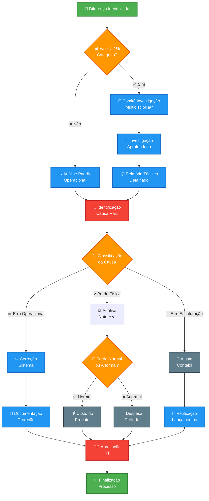
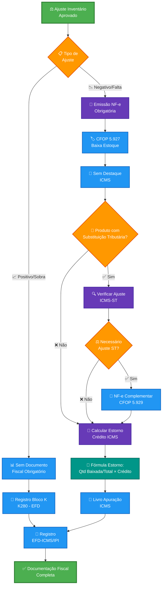
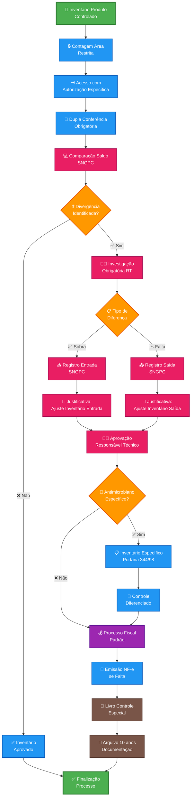
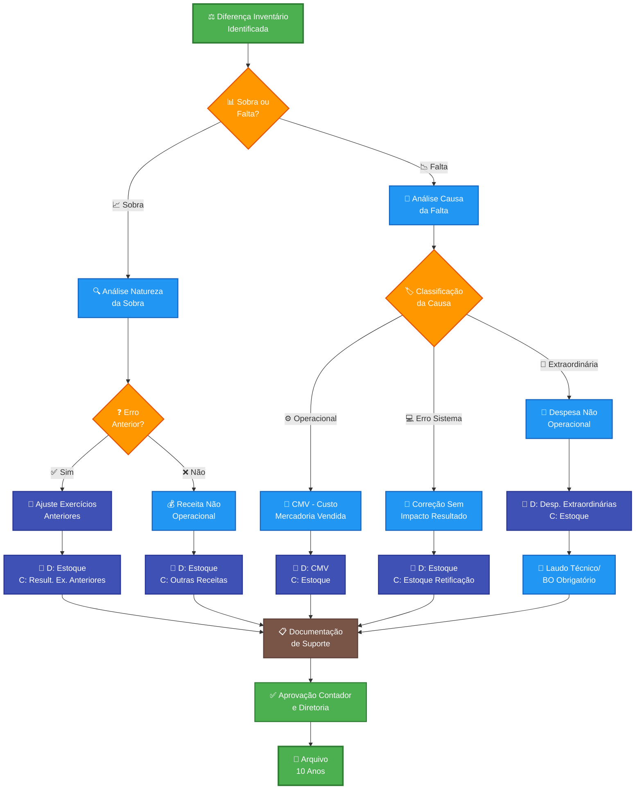

# PROCEDIMENTO OPERACIONAL PADRÃO

## AJUSTES DE INVENTÁRIO NA INDÚSTRIA FARMACÊUTICA - VERSÃO 1.0

### SUMÁRIO

1. **OBJETIVO** ........................................................................... 3
2. **ALCANCE** ........................................................................... 3
3. **DEFINIÇÕES E CONCEITOS** ........................................................ 3
4. **BASE LEGAL** ........................................................................ 5
5. **ESTRUTURA DE CONTROLE DE INVENTÁRIO** ........................................ 6
6. **METODOLOGIA E PROCEDIMENTOS** ................................................... 8
7. **CONTROLES E VALIDAÇÕES** ....................................................... 11
8. **ASPECTOS OPERACIONAIS** ......................................................... 13
9. **FLUXOS E PROCESSOS** ............................................................. 15
10. **ASPECTOS CONTÁBEIS E FISCAIS** ................................................ 18
11. **DOCUMENTAÇÃO E ANEXOS** ........................................................ 21
12. **PERGUNTAS FREQUENTES E TROUBLESHOOTING** .................................... 23

---

# 1. OBJETIVO

Este Procedimento Operacional Padrão estabelece diretrizes sistemáticas e padronizadas para execução de ajustes de inventário em indústrias farmacêuticas, assegurando conformidade integral com as normas contábeis brasileiras NBC TG 16 (Estoques), legislação fiscal aplicável e regulamentações sanitárias específicas do setor. O procedimento visa minimizar discrepâncias entre estoque físico e contábil, garantir tratamento adequado das diferenças identificadas, estabelecer controles internos robustos para produtos farmacêuticos e medicamentos controlados, além de assegurar compliance com o Sistema Nacional de Gerenciamento de Produtos Controlados (SNGPC) da ANVISA.

# 2. ALCANCE

Este POP aplica-se integralmente a todos os processos de inventário realizados pela indústria farmacêutica, abrangendo produtos acabados, matérias-primas farmacológicas, excipientes, materiais de embalagem primária e secundária, insumos farmacêuticos ativos e produtos intermediários. O escopo contempla tratamento específico para diferenças positivas (sobras) e negativas (faltas) identificadas durante contagens físicas sistemáticas, incluindo procedimentos diferenciados para medicamentos controlados das listas A1, A2, A3, B1, B2, C1, C2, C4, C5 da Portaria 344/98, antimicrobianos e produtos sujeitos ao regime de substituição tributária do ICMS. O documento estabelece diretrizes desde a preparação do inventário até a finalização completa dos ajustes contábeis, fiscais e regulatórios necessários.

# 3. DEFINIÇÕES E CONCEITOS

## 3.1 Definições Operacionais

**Inventário Físico:** Procedimento sistemático de contagem física de todos os itens em estoque realizado em data específica, com comparação obrigatória aos registros contábeis para identificação precisa de divergências e posterior tratamento conforme legislação aplicável.

**Diferenças de Inventário:** Divergências numéricas ou valorativas identificadas entre o estoque físico efetivamente apurado através de contagem e o saldo contábil registrado nos sistemas de controle da empresa, classificadas como positivas ou negativas.

**Ajuste a Maior (Sobras):** Situação em que o estoque físico apurado supera quantitativamente o saldo contábil registrado, resultando em diferença positiva que requer análise de causas e tratamento contábil específico sem impacto fiscal direto.

**Ajuste a Menor (Faltas):** Situação em que o estoque físico apurado é quantitativamente inferior ao saldo contábil registrado, resultando em diferença negativa que exige emissão de documento fiscal, estorno de créditos e lançamento contábil como despesa.

**Sistema Nacional de Gerenciamento de Produtos Controlados (SNGPC):** Sistema informatizado da ANVISA para controle obrigatório da movimentação de medicamentos e substâncias sujeitas a controle especial conforme Portaria SVS/MS nº 344/98.

## 3.2 Conceitos Técnicos

### 3.2.1 Classificação de Discrepâncias por Origem

**Erros Operacionais Sistêmicos:** Divergências decorrentes de falhas nos processos de movimentação física, digitação inadequada de dados, problemas de comunicação entre sistemas integrados ou inconsistências nos controles automatizados de estoque.

**Perdas Físicas Identificáveis:** Reduções efetivas de estoque decorrentes de deterioração natural, vencimento de prazo de validade, quebras durante manuseio, contaminação cruzada, furtos comprovados ou outras causas que resultem em perda material dos produtos.

**Correções de Sistema e Processo:** Ajustes necessários para correção de inconsistências históricas identificadas nos sistemas de gestão de estoque, incluindo reclassificações, correções de unidades de medida e adequações de estrutura de dados.

### 3.2.2 Categorização por Impacto Regulatório

**Perdas Técnicas Inerentes:** Perdas consideradas normais ao processo produtivo farmacêutico ou armazenamento especializado, incluindo evaporação de solventes, absorção de umidade ambiental, degradação natural de princípios ativos ou sublimação de substâncias voláteis.

**Perdas Administrativas Controláveis:** Perdas decorrentes de falhas identificáveis nos controles internos, procedimentos operacionais inadequados, treinamento insuficiente de colaboradores ou deficiências nos sistemas de segurança patrimonial.

**Perdas Extraordinárias Não Recorrentes:** Perdas decorrentes de eventos de baixa probabilidade e alto impacto, incluindo sinistros, contaminação microbiológica, recall regulatório, decisões judiciais ou alterações súbitas na regulamentação sanitária.

# 4. BASE LEGAL

## 4.1 Legislação Federal

- **NBC TG 16 (R2) - Estoques:** Norma brasileira de contabilidade que estabelece critérios obrigatórios para mensuração, reconhecimento inicial e subsequente, divulgação em demonstrações financeiras e tratamento de perdas por redução ao valor recuperável de estoques.
- **Lei nº 6.404/76 - Lei das Sociedades Anônimas:** Define princípios e critérios contábeis fundamentais para avaliação de ativos circulantes, incluindo estoques, e estabelece responsabilidades da administração na manutenção de controles internos adequados.
- **Decreto-Lei nº 1.598/77:** Regulamenta especificamente o tratamento tributário dos estoques para fins de apuração do imposto de renda e contribuição social, definindo critérios de dedutibilidade de perdas e métodos de avaliação aceitos.
- **Instrução Normativa RFB nº 1.700/17:** Disciplina obrigatoriamente a escrituração do Livro Registro de Inventário e estabelece procedimentos específicos para documentação de diferenças identificadas em inventários físicos.

## 4.2 Legislação Estadual

- **RICMS - Regulamento do ICMS:** Artigo 67 e dispositivos correlatos estabelecem regras mandatórias sobre estorno de créditos de ICMS em casos documentados de perda, deterioração ou consumo de mercadorias em estoque.
- **Convênio ICMS 100/97:** Disciplina integralmente o regime de substituição tributária para produtos farmacêuticos, definindo responsabilidades, procedimentos de cálculo e documentação fiscal obrigatória.
- **CFOP 5.927:** Código Fiscal de Operações e Prestações específico e obrigatório para "lançamento efetuado a título de baixa de estoque decorrente de perda, roubo ou deterioração" com procedimentos detalhados de preenchimento.

## 4.3 Normas e Regulamentações Específicas

- **RDC ANVISA nº 67/2007 e atualizações:** Estabelece Boas Práticas de Fabricação de Medicamentos, incluindo controles obrigatórios de estoque, rastreabilidade e documentação de movimentações para produtos farmacêuticos.
- **Portaria SVS/MS nº 344/98 e suas atualizações:** Regulamenta integralmente o controle de medicamentos controlados, define listas de substâncias sujeitas a controle especial e estabelece obrigatoriedades específicas do SNGPC.
- **Lei nº 13.021/14:** Define atividades privativas do farmacêutico e estabelece responsabilidades técnicas específicas para controle de estoque em estabelecimentos farmacêuticos, incluindo indústrias.

# 5. ESTRUTURA DE CONTROLE DE INVENTÁRIO

## 5.1 Organização Física Especializada

### 5.1.1 Segregação por Classificação Regulatória

**Área de Produtos Controlados:** Ambiente físico segregado com controles rigorosos de acesso mediante autorização específica, sistema de monitoramento eletrônico 24 horas, registro obrigatório de entrada e saída de pessoas, cofres ou armários blindados para substâncias das listas A e B, e documentação detalhada de todas as movimentações conforme exigências da ANVISA.

**Câmaras de Temperatura Controlada:** Ambientes climatizados especializados com sistemas redundantes de refrigeração, registros contínuos e ininterruptos de temperatura e umidade relativa, alarmes automáticos para desvios de parâmetros, backup de energia elétrica e protocolos específicos para produtos termolábeis conforme especificações técnicas de cada medicamento.

**Zona de Quarentena e Produtos Vencimento Próximo:** Área física delimitada e identificada para isolamento de produtos com prazo de validade inferior a seis meses, materiais em quarentena aguardando liberação pelo controle de qualidade, produtos reprovados e itens segregados para investigação, com controles diferenciados e restrições específicas de acesso.

**Setor de Matérias-Primas Especiais:** Segregação rigorosa por classe terapêutica, compatibilidade química, grau de toxicidade e requisitos específicos de armazenamento, com identificação clara e inequívoca de lotes, fornecedores qualificados, certificados de análise e condições ambientais específicas para cada categoria de insumo farmacêutico.

#### 5.1.1.1 Sistemas de Segurança e Monitoramento

**Controle de Acesso Eletrônico:** Sistema integrado com cartões de proximidade, biometria digital, registro automático de horários de entrada e saída, relatórios de auditoria e restrições específicas por nível de autorização e categoria de produto controlado.

**Videomonitoramento Integrado:** Câmeras de alta definição com gravação contínua por período mínimo de 60 dias, cobertura integral das áreas críticas, sistema de detecção de movimento, alertas automáticos para situações anômalas e integração com central de monitoramento 24 horas.

#### 5.1.1.2 Identificação e Rastreabilidade Completa

**Sistema de Códigos Únicos:** Implementação obrigatória de código de barras bidimensional (QR Code) em todas as unidades de estoque, contendo informações completas de produto, lote de fabricação, data de validade, localização física específica, histórico de movimentações e status regulatório.

**Controle FIFO/FEFO Rigoroso:** Aplicação sistemática dos princípios First In First Out e First Expired First Out, com controles automatizados para prevenção de uso de produtos vencidos, alertas antecipados para produtos próximos ao vencimento e procedimentos específicos para rotação adequada de estoque.

### 5.1.2 Sistemas Tecnológicos Integrados

**Plataforma ERP Farmacêutica:** Sistema de gestão empresarial especializado com módulos específicos para controle de estoque farmacêutico, integração obrigatória com sistemas regulatórios (SNGPC, SNVS), controles de rastreabilidade, gestão de lotes e validades, e relatórios gerenciais especializados.

**Interface Automatizada SNGPC:** Integração em tempo real com o sistema da ANVISA para transmissão automática de movimentações de produtos controlados, validação de receituários, controle de estoque mínimo e máximo, e geração de relatórios regulatórios obrigatórios.

## 5.2 Periodicidade e Cronograma de Inventários

### 5.2.1 Inventário Geral Anual

**Período Obrigatório:** Realização anual no encerramento do exercício fiscal (31 de dezembro) ou data próxima, com escopo integral abrangendo a totalidade do estoque incluindo produtos acabados, matérias-primas, materiais de embalagem, produtos intermediários e todos os insumos farmacêuticos.

**Preparação Antecipada:** Planejamento iniciado 60 dias antes da data prevista, com definição de equipes especializadas, cronograma detalhado de atividades, treinamento específico de colaboradores e preparação de todos os recursos materiais e tecnológicos necessários.

### 5.2.2 Inventários Parciais Especializados

**Produtos Controlados:** Inventário mensal obrigatório para todos os medicamentos das listas A, B e C da Portaria 344/98, com procedimentos específicos de dupla contagem, validação pelo responsável técnico e transmissão obrigatória de dados para o SNGPC dentro dos prazos regulamentares.

**Produtos Críticos:** Inventário trimestral para medicamentos de alto valor agregado, produtos com histórico de discrepâncias, itens com baixa rotatividade, produtos próximos ao vencimento e materiais sujeitos a controles especiais de qualidade ou regulamentação específica.

# 6. METODOLOGIA E PROCEDIMENTOS

## 6.1 Procedimentos Preparatórios Sistemáticos

### 6.1.1 Etapa de Planejamento Estratégico

**Passo 1:** Definição precisa da data de inventário priorizando períodos de menor movimentação operacional (finais de semana, feriados prolongados ou períodos de parada programada da produção) para minimização de interferências e maximização da precisão dos resultados.

**Passo 2:** Comunicação formal e documentada a todos os departamentos envolvidos (produção, logística, qualidade, comercial, fiscal, contábil) com antecedência mínima obrigatória de 15 dias úteis, incluindo cronograma detalhado e responsabilidades específicas de cada área.

**Passo 3:** Constituição e treinamento especializado de equipes de contagem com conhecimento técnico específico sobre produtos farmacêuticos, procedimentos regulatórios, sistemas de gestão utilizados e protocolos de segurança para manuseio de medicamentos controlados.

**Passo 4:** Organização completa de materiais e recursos necessários incluindo pranchetas padronizadas, canetas específicas, etiquetas de identificação à prova d'água, leitores portáteis de código de barras, equipamentos de proteção individual e formulários pré-impressos de contagem.

### 6.1.2 Preparação do Ambiente Operacional

**Passo 1:** Interrupção programada e documentada de todas as movimentações de estoque (recebimentos, expedições, transferências internas, coletas para análise) com período mínimo de 2 horas antes do início efetivo da contagem física.

**Passo 2:** Finalização obrigatória de todos os lançamentos pendentes nos sistemas de gestão de estoque, processamento de notas fiscais de entrada e saída, atualização de transferências entre depósitos e consolidação de dados para geração do relatório de posição contábil.

**Passo 3:** Emissão do relatório oficial de posição de estoque (saldo contábil detalhado por produto, lote, localização e validade) imediatamente antes do início da contagem física, com timestamp específico e validação pelo responsável técnico.

**Passo 4:** Organização física sistemática do estoque com agrupamento de produtos por código de identificação, segregação por lote de fabricação, verificação de condições de armazenamento e identificação clara de produtos com restrições específicas ou status especial.

### 6.1.3 Estruturação de Equipes Especializadas

**Equipe de Contagem Primária:** Composição mínima de 2 colaboradores treinados por área específica, sendo um responsável pela contagem efetiva e outro pela conferência independente, ambos com conhecimento técnico sobre os produtos e procedimentos regulatórios aplicáveis.

**Equipe de Supervisão Técnica:** Responsável técnico legalmente habilitado, gerente de estoque com experiência comprovada e supervisor de qualidade para validação dos procedimentos, aprovação de situações excepcionais e garantia de conformidade regulatória.

**Equipe de Apoio Operacional:** Pessoal especializado de tecnologia da informação para suporte aos sistemas, colaboradores administrativos para documentação e registro, e equipe de segurança para controle de acesso às áreas críticas durante o inventário.

## 6.2 Procedimentos de Execução Operacional

### 6.2.1 Metodologia de Contagem Física Sistemática

**Passo 1:** Execução da primeira contagem por equipe específica e treinada, com registro detalhado de quantidade física exata, identificação completa do lote, verificação da data de validade, confirmação da localização física e avaliação das condições gerais de conservação do produto.

**Passo 2:** Realização de segunda contagem completamente independente por equipe distinta, sem acesso aos resultados da primeira contagem, utilizando os mesmos critérios de verificação e documentação para garantia da confiabilidade e precisão dos dados apurados.

**Passo 3:** Processo de reconciliação sistemática entre os resultados das duas contagens independentes, identificação precisa de divergências encontradas, análise imediata das possíveis causas e decisão sobre necessidade de terceira contagem para casos específicos.

**Passo 4:** Registro obrigatório de observações detalhadas sobre condições especiais identificadas durante a contagem (produtos vencidos, embalagens danificadas, itens segregados para análise, materiais em quarentena, produtos com restrições específicas).

### 6.2.2 Controles de Qualidade e Validação

**Verificação Cruzada Independente:** Implementação obrigatória de comparação entre resultados das equipes de contagem completamente independentes, com análise estatística de divergências e estabelecimento de critérios objetivos para aceitação ou rejeição dos resultados obtidos.

**Amostragem Estatística de Validação:** Execução de recontagem de amostra estatisticamente significativa (mínimo 5% do total de itens ou conforme critério de materialidade estabelecido) para validação da precisão geral do inventário e identificação de possíveis tendências ou padrões de erro.

**Documentação Fotográfica Comprobatória:** Registro visual obrigatório de situações excepcionais, produtos com problemas identificados, áreas com discrepâncias significativas, condições inadequadas de armazenamento e qualquer situação que possa impactar a confiabilidade dos resultados.

### 6.2.3 Tratamento Sistematizado de Divergências

**Protocolo de Primeira Divergência:** Procedimento automático de recontagem imediata pela equipe de supervisão técnica, com análise detalhada das possíveis causas, verificação de documentação de movimentações recentes e validação dos procedimentos utilizados pelas equipes de contagem.

**Investigação de Divergências Persistentes:** Para casos em que a divergência permanece após recontagem supervisória, implementação de investigação aprofundada incluindo análise documental histórica, entrevistas com colaboradores envolvidos e revisão de controles internos aplicáveis.

**Processo de Aprovação Final:** Validação obrigatória pelo responsável técnico legalmente habilitado de todas as divergências identificadas, com documentação formal das causas identificadas, medidas corretivas implementadas e aprovação específica antes da finalização do inventário.

## 6.3 Análise Especializada das Diferenças

### 6.3.1 Investigação Técnica de Causas Raiz

**Análise Documental Abrangente:** Revisão sistemática e detalhada de notas fiscais de entrada e saída, requisições internas de material, ordens de produção, relatórios de análises laboratoriais, registros de transferências entre depósitos e toda a documentação de movimentação dos últimos seis meses.

**Verificação Sistêmica Integrada:** Análise técnica aprofundada de lançamentos no sistema ERP, verificação de interfaces com sistemas complementares, identificação de possíveis falhas de integração, análise de logs de sistema e verificação de procedimentos de backup e recuperação de dados.

**Entrevistas Estruturadas:** Realização de entrevistas formais e documentadas com operadores responsáveis pelas movimentações de estoque, supervisores de área, analistas de sistemas e demais colaboradores envolvidos nos processos para esclarecimento detalhado de discrepâncias e identificação de oportunidades de melhoria.

### 6.3.2 Classificação Técnica das Divergências

**Erros de Lançamento e Processamento:** Divergências decorrentes especificamente de falhas na digitação de dados, processamento inadequado de movimentações, problemas de comunicação entre sistemas integrados ou inconsistências nos procedimentos de lançamento de informações.

**Perdas Operacionais Identificáveis:** Quebras físicas durante manuseio e transporte, deterioração natural de produtos, contaminação por condições inadequadas de armazenamento, evaporação de solventes, sublimação de princípios ativos ou degradação química comprovada.

**Perdas Administrativas Controláveis:** Furtos comprovados através de investigação, extravios por falhas nos controles de segurança, perdas por procedimentos inadequados de armazenamento, falhas na manutenção de equipamentos ou deficiências no treinamento de colaboradores.

### 6.3.3 Documentação Formal da Análise

**Relatório Técnico de Investigação:** Documento formal e detalhado descrevendo metodologia de investigação utilizada, causas específicas identificadas para cada divergência, análise de impacto regulatório e fiscal, medidas corretivas propostas e cronograma de implementação.

**Anexação de Evidências Comprobatórias:** Inclusão obrigatória de documentos originais comprobatórios, fotografias técnicas, registros sistêmicos relevantes, laudos laboratoriais quando aplicável, boletins de ocorrência para casos de furto e qualquer evidência que suporte as conclusões apresentadas.

**Validação Técnica e Aprovação:** Processo formal de validação pelo responsável técnico legalmente habilitado, aprovação pelo departamento de qualidade, revisão pela auditoria interna quando aplicável e aprovação final pela diretoria antes da implementação dos ajustes identificados como necessários.

# 7. CONTROLES E VALIDAÇÕES

## 7.1 Controles Documentais Obrigatórios

### 7.1.1 Documentos de Suporte Mandatórios

**Planilhas de Contagem Oficial:** Registros físicos padronizados assinados obrigatoriamente pelas equipes responsáveis pela contagem, contendo identificação completa dos contadores, horário específico de execução, quantidade física apurada, identificação do lote, data de validade e observações técnicas relevantes.

**Relatório Consolidado Executivo:** Documento síntese contendo resumo executivo das principais diferenças identificadas, análise estatística de divergências por categoria de produto, causas identificadas através de investigação técnica, impacto financeiro total e recomendações para melhoria dos controles internos.

**Documentação Fotográfica Técnica:** Registro visual sistemático de situações excepcionais identificadas durante o inventário, produtos com problemas de conservação, áreas com discrepâncias significativas, condições inadequadas de armazenamento e evidências que suportem as conclusões da investigação técnica.

### 7.1.2 Validações Documentais Sistemáticas

**Conferência Integral de Dados:** Validação obrigatória de 100% dos dados de contagem através de verificação cruzada entre equipes independentes, confirmação de informações críticas (lote, validade, quantidade), comparação com registros contábeis e verificação de consistência matemática dos cálculos realizados.

**Verificação de Autenticidade:** Confirmação da autenticidade de todos os documentos utilizados como suporte para justificativa de diferenças, validação de assinaturas dos responsáveis, verificação de carimbos e identificações profissionais, e confirmação da veracidade das informações prestadas.

**Checklist de Completude:** Verificação sistemática da completude de toda a documentação obrigatória conforme checklist pré-definido, confirmação do preenchimento adequado de todos os campos obrigatórios, validação da consistência entre documentos e verificação do cumprimento de todos os requisitos regulatórios aplicáveis.

**Controle de Prazos e Vencimentos:** Monitoramento rigoroso de todos os prazos regulamentares aplicáveis (transmissão SNGPC, emissão de documentos fiscais, registro em livros obrigatórios), controle de validades de produtos identificados no inventário e verificação de cumprimento de cronogramas estabelecidos.

## 7.2 Controles Operacionais Especializados

### 7.2.1 Checklist de Validação Técnica

- ✅ **Segregação adequada de produtos controlados:** Verificação da manutenção de produtos das listas A, B e C em áreas específicas com controles de acesso apropriados
- ✅ **Integridade das condições de armazenamento:** Confirmação de que produtos termolábeis mantiveram temperatura adequada e produtos sensíveis à umidade foram preservados adequadamente
- ✅ **Rastreabilidade completa de lotes:** Verificação de que todos os produtos possuem identificação clara de lote de fabricação e origem comprovada
- ✅ **Conformidade com prazos de validade:** Confirmação de que não há produtos vencidos em estoque regular e produtos próximos ao vencimento estão adequadamente segregados
- ✅ **Documentação regulatória atualizada:** Verificação de que todos os medicamentos controlados possuem documentação adequada e registros atualizados no SNGPC
- ✅ **Controles de segurança operacionais:** Confirmação de que sistemas de segurança, videomonitoramento e controles de acesso funcionaram adequadamente durante todo o inventário

### 7.2.2 Controles de Qualidade Especializados

**Revisão por Segunda Pessoa Qualificada:** Implementação obrigatória de procedimento de revisão dupla por profissional qualificado e independente da execução inicial, com verificação detalhada de todos os cálculos realizados, confirmação da adequação dos procedimentos utilizados e validação da consistência dos resultados obtidos.

**Documentação Técnica de Evidências:** Manutenção de arquivo técnico contendo todas as evidências que suportam os ajustes realizados, incluindo laudos laboratoriais, relatórios de análise, registros fotográficos, boletins de ocorrência e qualquer documentação técnica relevante para justificativa das diferenças identificadas.

**Arquivo Organizado por Categorias:** Implementação de sistema de arquivo físico e eletrônico organizado por categorias específicas (produtos controlados, produtos termolábeis, matérias-primas, produtos acabados), com indexação adequada e facilidade de localização para auditorias internas e externas.

**Backup de Dados Críticos:** Manutenção obrigatória de cópias de segurança de todos os dados críticos do inventário, incluindo planilhas de contagem, relatórios sistêmicos, registros fotográficos e documentação de suporte, armazenadas em local seguro e distinto do arquivo principal.

# 8. ASPECTOS OPERACIONAIS

## 8.1 Matriz de Responsabilidades Detalhada

### 8.1.1 Responsabilidades por Função Específica

**Responsável Técnico (Farmacêutico):**

- Validação técnica de todos os procedimentos relacionados a medicamentos controlados e produtos farmacêuticos especiais
- Aprovação final de ajustes que impactem produtos sujeitos à vigilância sanitária e controle especial da ANVISA
- Assinatura obrigatória de relatórios técnicos e documentação regulatória específica do setor farmacêutico
- Responsabilidade legal pela transmissão adequada de dados ao SNGPC e cumprimento de exigências da Portaria 344/98

**Gerente de Estoque e Logística:**

- Coordenação geral do processo de inventário incluindo planejamento, execução, controle de qualidade e finalização
- Supervisão direta das equipes de contagem e garantia da adequação dos procedimentos operacionais implementados
- Análise técnica das causas de diferenças identificadas e proposição de medidas corretivas para melhoria contínua
- Interface com departamentos correlatos (produção, qualidade, comercial) para garantia de informações precisas e atualizadas

**Controller/Gerente Contábil:**

- Execução de todos os lançamentos contábeis decorrentes dos ajustes de inventário conforme normas contábeis brasileiras
- Análise de impacto nas demonstrações financeiras e adequação aos princípios contábeis aplicáveis ao setor farmacêutico
- Coordenação com auditoria externa para validação dos procedimentos contábeis e tratamento adequado dos ajustes realizados
- Manutenção de controles internos contábeis adequados e documentação de suporte para justificativa dos lançamentos efetuados

**Coordenador Fiscal e Tributário:**

- Emissão de todos os documentos fiscais obrigatórios (NF-e, livros fiscais, declarações) conforme legislação aplicável
- Cálculo preciso de estornos de créditos de ICMS e demais obrigações tributárias decorrentes de ajustes de inventário
- Registro adequado na Escrituração Fiscal Digital (EFD-ICMS/IPI) e demais obrigações acessórias federais e estaduais
- Interface com consultoria tributária especializada para casos complexos e acompanhamento de alterações legislativas

### 8.1.2 Matriz RACI de Responsabilidades

| Atividade                          | RT  | Ger. Estoque | Controller | Fiscal |
| ---------------------------------- | --- | ------------ | ---------- | ------ |
| Planejamento Inventário            | C   | R            | I          | I      |
| Contagem Física Produtos           | A   | R            | I          | I      |
| Validação Medicamentos Controlados | R   | C            | I          | I      |
| Análise Causas Diferenças          | C   | R            | A          | C      |
| Lançamentos Contábeis              | I   | C            | R          | A      |
| Emissão Documentos Fiscais         | I   | I            | C          | R      |
| Transmissão SNGPC                  | R   | C            | I          | I      |
| Aprovação Final Ajustes            | R   | A            | C          | C      |

*R=Responsável pela execução, A=Aprovador final, C=Consultado, I=Informado*

## 8.2 Prazos Regulamentares e Cronograma

### 8.2.1 Prazos Regulamentares Obrigatórios

**Transmissão SNGPC:** Prazo máximo de 7 dias úteis após identificação de diferenças em medicamentos controlados para transmissão obrigatória dos dados ao Sistema Nacional de Gerenciamento de Produtos Controlados da ANVISA, sob pena de sanções regulatórias específicas.

**Emissão de Documentos Fiscais:** Prazo máximo de 5 dias úteis após aprovação final dos ajustes para emissão de notas fiscais eletrônicas (CFOP 5.927) e demais documentos fiscais obrigatórios, conforme determinações da legislação estadual do ICMS.

**Registro em EFD-ICMS/IPI:** Prazo alinhado com cronograma de transmissão da Escrituração Fiscal Digital, respeitando especificamente os prazos do Bloco K para movimentações de estoque e ajustes de inventário conforme Manual de Orientação vigente.

**Lançamentos Contábeis:** Prazo máximo de 3 dias úteis após aprovação final dos ajustes para execução de todos os lançamentos contábeis necessários, garantindo reflexo adequado nas demonstrações financeiras do período correspondente ao inventário realizado.

### 8.2.2 Cronograma Detalhado de Atividades

**Fase Preparatória (30 dias):** Planejamento estratégico incluindo definição de cronograma detalhado, constituição de equipes especializadas, preparação de materiais e recursos, treinamento de colaboradores e comunicação formal a todos os departamentos envolvidos no processo.

**Fase de Execução (3 dias):** Bloqueio de movimentações, contagem física sistemática, reconciliação de divergências, investigação técnica de causas, validação por equipe de supervisão e consolidação final de todos os resultados obtidos durante o inventário.

**Fase de Finalização (15 dias):** Análise aprofundada de causas, elaboração de relatórios técnicos, aprovação pela diretoria, execução de lançamentos contábeis e fiscais, transmissão de dados regulatórios e implementação de medidas corretivas identificadas como necessárias.

# 9. FLUXOS E PROCESSOS

## 9.1 Fluxo Geral de Inventário

```mermaid
flowchart TD
    A["🎯 Planejamento Estratégico\n30 dias antes"]
    B["👥 Formação Equipes\nEspecializada"]
    C["🚫 Bloqueio Movimentações\n2h antes"]
    D["📊 Relatório Posição\nEstoque Contábil"]
    E["🔍 Primeira Contagem\nEquipe A"]
    F["🔍 Segunda Contagem\nEquipe B Independente"]
    G{"❓ Divergência\nentre Contagens?"}
    H["📈 Comparação com\nSaldo Contábil"]
    I["👨‍💼 Terceira Contagem\nSupervisão"]
    J{"📋 Diferenças\nIdentificadas?"}
    K["✅ Inventário\nFinalizado"]
    L["🔬 Investigação\nCausas Técnicas"]
    M["📝 Classificação\nTipo Diferença"]
    N{"⚖️ Natureza da\nDiferença"}
    O["💰 Processo Ajuste\nPositivo"]
    P["❌ Processo Ajuste\nNegativo"]
    Q["📖 Lançamento\nContábil"]
    R["📄 NF-e CFOP\n5.927"]
    S["💳 Estorno Crédito\nICMS"]
    T["📖 Lançamento\nContábil"]
    U["💊 Atualização\nSNGPC"]
    V["📁 Documentação\nFinal Completa"]

    A --> B
    B --> C
    C --> D
    D --> E
    E --> F
    F --> G
    G -->|"✅ Não"| H
    G -->|"❌ Sim"| I
    I --> H
    H --> J
    J -->|"✅ Não"| K
    J -->|"❌ Sim"| L
    L --> M
    M --> N
    N -->|"📈 Sobra"| O
    N -->|"📉 Falta"| P
    O --> Q
    P --> R
    R --> S
    S --> T
    Q --> U
    T --> U
    U --> V
    V --> K

    classDef startEnd fill:#4CAF50,stroke:#2E7D32,stroke-width:3px,color:white
    classDef process fill:#2196F3,stroke:#1565C0,stroke-width:2px,color:white
    classDef decision fill:#FF9800,stroke:#E65100,stroke-width:2px,color:white
    classDef critical fill:#F44336,stroke:#C62828,stroke-width:2px,color:white
    classDef regulatory fill:#9C27B0,stroke:#6A1B9A,stroke-width:2px,color:white

    class A,K startEnd
    class B,C,D,E,F,I,L,M,O,P,Q,R,S,T,V process
    class G,J,N decision
    class H critical
    class U regulatory
```

## 9.2 Fluxo de Tratamento de Diferenças Críticas

## 9.3 Fluxo de Aspectos Fiscais e Tributários

## 9.4 Fluxo Especializado para Medicamentos Controlados

## 9.5 Fluxo Decisório para Tratamento Contábil

# 10. ASPECTOS CONTÁBEIS E FISCAIS

## 10.1 Tratamento Contábil Especializado

### 10.1.1 Fundamentos Normativos NBC TG 16

**Mensuração de Estoques Farmacêuticos:** Os estoques de produtos farmacêuticos devem ser mensurados rigorosamente pelo valor de custo histórico ou valor realizável líquido, prevalecendo sempre o menor dos dois valores, considerando especificidades como prazo de validade reduzido, obsolescência tecnológica e alterações regulatórias que possam impactar a comercialização.

**Reconhecimento de Perdas Específicas:** Perdas identificadas em inventários farmacêuticos devem ser reconhecidas obrigatoriamente no resultado do período em que foram identificadas, classificando adequadamente entre perdas operacionais normais (incluídas no custo dos produtos) e perdas anormais (reconhecidas como despesa do período).

**Métodos de Avaliação Aplicáveis:** Utilização obrigatória do método FIFO (First In, First Out) ou custo médio ponderado móvel conforme política contábil estabelecida pela empresa, considerando características específicas de produtos farmacêuticos como lotes, validades e rastreabilidade regulatória exigida pela ANVISA.

### 10.1.2 Tratamento de Ajustes Positivos (Sobras)

**Lançamento Contábil Padrão:**

- **Débito:** Estoques de Produtos Acabados/Matérias-Primas (Ativo Circulante) pelo valor de custo unitário
- **Crédito:** Reversão do Custo das Mercadorias Vendidas ou conta específica "Ajustes Positivos de Inventário"

**Análise de Natureza Específica:** Se a sobra decorrer de erro de lançamento em períodos anteriores, o tratamento deve ser como ajuste de exercícios anteriores conforme CPC 23. Se representar descoberta efetiva de estoque não registrado, deve ser reconhecido como receita não operacional com análise de impacto tributário.

### 10.1.3 Tratamento de Ajustes Negativos (Faltas)

**Perdas Operacionais Normais:**

- **Débito:** Custo das Mercadorias Vendidas (conta de resultado)
- **Crédito:** Estoques de Produtos/Matérias-Primas (ativo circulante)

**Perdas Extraordinárias ou Anormais:**

- **Débito:** Despesas Não Operacionais - Perdas Extraordinárias
- **Crédito:** Estoques de Produtos/Matérias-Primas (ativo circulante)

## 10.2 Aspectos Fiscais Diferenciados

### 10.2.1 Tratamento de Diferenças Positivas

**Ausência de Obrigações Fiscais:** Diferenças positivas (sobras) não geram obrigatoriedade de emissão de documento fiscal específico, sendo tratadas exclusivamente através de lançamentos nos livros contábeis obrigatórios e registro no Livro de Inventário conforme Instrução Normativa RFB nº 1.700/17.

**Registro na EFD-ICMS/IPI:** Utilização obrigatória do registro K280 no Bloco K da Escrituração Fiscal Digital para correção de saldo de estoque, informando adequadamente a natureza do ajuste e mantendo rastreabilidade para futuras auditorias fiscais.

**Impacto Tributário Nulo:** Ajustes positivos de inventário não geram incidência de ICMS, IPI, PIS/COFINS ou qualquer outro tributo, sendo considerados como correções de registros contábeis sem caracterização de operação tributável.

### 10.2.2 Tratamento de Diferenças Negativas

**Emissão Obrigatória de NF-e:** Todas as diferenças negativas (faltas) exigem emissão de Nota Fiscal Eletrônica utilizando obrigatoriamente CFOP 5.927 "Lançamento efetuado a título de baixa de estoque decorrente de perda, roubo ou deterioração", com natureza da operação detalhando especificamente a causa identificada.

**Estorno de Créditos de ICMS:** Aplicação obrigatória do artigo 67 do RICMS com estorno proporcional do crédito de ICMS correspondente à quantidade baixada, utilizando a fórmula: (Quantidade baixada ÷ Quantidade total do lote original) × Crédito de ICMS original do lote.

**Documentação Fiscal Específica:** Registro obrigatório no Livro de Apuração do ICMS, informação adequada na EFD-ICMS/IPI utilizando registros K270/K275 para movimentações de estoque, e manutenção de documentação de suporte para justificativa das perdas em eventual fiscalização.

### 10.2.3 Produtos sob Substituição Tributária

**ICMS-ST Diferenciado:** Para produtos farmacêuticos enquadrados no Convênio ICMS 100/97, verificar necessidade de ajuste no recolhimento de ICMS-ST quando houver alteração na base de cálculo ou quantidade de produtos sujeitos ao regime.

**Emissão de NF-e Complementar:** Quando necessário ajuste de ICMS-ST, emitir nota fiscal complementar utilizando CFOP 5.929 "Lançamento efetuado em decorrência de emissão de documento fiscal relativo a operação ou prestação também registrada em equipamento Emissor de Cupom Fiscal - ECF".

**Cálculo Específico de ST:** Aplicar alíquota de ICMS-ST vigente sobre a base de cálculo ajustada, considerando margem de valor agregado (MVA) específica para produtos farmacêuticos conforme regulamentação estadual aplicável.

## 10.3 Aspectos Regulatórios Específicos

### 10.3.1 Medicamentos Controlados no SNGPC

**Registro de Entrada para Sobras:** Produtos controlados identificados em sobra devem ser registrados no SNGPC como "Ajuste de Inventário - Entrada" com justificativa detalhada da causa identificada, data específica do inventário e aprovação obrigatória do responsável técnico.

**Registro de Saída para Faltas:** Faltas de medicamentos controlados exigem registro no SNGPC como "Ajuste de Inventário - Saída" com justificativa técnica detalhada, análise de causas, medidas corretivas implementadas e documentação de suporte conforme exigências regulatórias.

**Prazo Regulamentar Obrigatório:** Transmissão dos dados ao SNGPC deve ocorrer em prazo máximo de 7 dias úteis após identificação das diferenças, sob pena de aplicação de sanções administrativas pela ANVISA conforme Auto de Infração específico.

### 10.3.2 Diferenciação por Categoria Regulatória

**Inventário Físico Geral:** Contagem física sistemática de todos os produtos para fins exclusivamente contábeis e fiscais, independente da classificação regulatória específica dos medicamentos envolvidos.

**Inventário SNGPC Específico:** Controle regulatório obrigatório e diferenciado para medicamentos controlados das listas A, B e C conforme Portaria 344/98, com procedimentos específicos de validação e transmissão obrigatória para sistema da ANVISA.

**Inventário de Antimicrobianos:** Procedimento específico e diferenciado do inventário geral da empresa, exigido pela regulamentação sanitária para controle específico de medicamentos antimicrobianos conforme determinações da ANVISA.

# 11. DOCUMENTAÇÃO E ANEXOS

## 11.1 Modelos e Formulários Padronizados

### 11.1.1 Planilha de Contagem Física

**Cabeçalho Obrigatório:**

- Data e horário específico da contagem
- Identificação completa da equipe responsável
- Área ou setor específico do inventário
- Assinatura do supervisor responsável

**Campos de Preenchimento:**

- Código do produto e descrição completa
- Lote de fabricação e data de validade
- Localização física específica (endereço)
- Quantidade física apurada
- Condições observadas do produto
- Observações técnicas relevantes

### 11.1.2 Relatório de Análise de Diferenças

**Estrutura Padronizada:**

- Identificação da diferença (produto, quantidade, valor)
- Investigação de causas realizada
- Evidências coletadas e documentação de suporte
- Conclusões técnicas e recomendações
- Aprovação do responsável técnico
- Medidas corretivas propostas

## 11.2 Tabelas de Referência Regulatória

### 11.2.1 Códigos CFOP Aplicáveis

| CFOP  | Descrição                          | Aplicação Específica             | Destaque ICMS |
| ----- | ---------------------------------- | -------------------------------- | ------------- |
| 5.927 | Baixa estoque - perda/deterioração | Diferenças negativas obrigatório | Não           |
| 5.929 | Complementar ICMS-ST               | Ajuste substituição tributária   | Sim           |

### 11.2.2 Prazos Regulamentares por Categoria

| Obrigação         | Prazo               | Base Legal      | Penalidade       |
| ----------------- | ------------------- | --------------- | ---------------- |
| Transmissão SNGPC | 7 dias úteis        | Portaria 344/98 | Auto de Infração |
| Emissão NF-e      | 5 dias úteis        | RICMS Estadual  | Multa fiscal     |
| EFD-ICMS/IPI      | Conforme cronograma | IN RFB 1.774/17 | Multa federal    |
| Registro Livros   | 3 dias úteis        | CTN Art. 195    | Multa estadual   |

# 12. PERGUNTAS FREQUENTES E TROUBLESHOOTING

## 12.1 Questões Técnicas Especializadas

**Q: Como proceder com diferenças de inventário em produtos farmacêuticos com prazo de validade vencido identificados durante a contagem?**

R: Produtos vencidos identificados durante inventário devem ser obrigatoriamente baixados integralmente do estoque com débito em conta específica de perdas por vencimento, emissão de NF-e utilizando CFOP 5.927 com natureza "Baixa por Vencimento", estorno total dos créditos de ICMS correspondentes e, para medicamentos controlados, registro no SNGPC como "saída por vencimento" com justificativa detalhada e aprovação do responsável técnico conforme exigências da Portaria 344/98.

**Q: É obrigatório emitir nota fiscal para todas as diferenças negativas identificadas em inventário farmacêutico?**

R: Sim, conforme legislação estadual do ICMS e princípios de escrituração fiscal, todas as diferenças negativas (faltas) identificadas em inventário exigem obrigatoriamente emissão de NF-e com CFOP 5.927, exceto exclusivamente para ajustes decorrentes de erro de escrituração devidamente comprovado através de documentação técnica específica, situação em que o tratamento pode ser realizado através de lançamento de correção sem emissão de documento fiscal.

## 12.2 Questões Operacionais Práticas

**Q: Qual a frequência mínima recomendada para inventários em indústrias farmacêuticas considerando exigências regulatórias específicas?**

R: Inventário geral anual obrigatório conforme legislação fiscal brasileira, inventários parciais mensais obrigatórios para medicamentos controlados das listas A, B e C conforme Portaria 344/98, inventários trimestrais recomendados para produtos de alto valor agregado e inventários específicos para antimicrobianos conforme determinação da ANVISA. Produtos críticos ou com histórico de discrepâncias podem exigir frequência superior conforme análise de risco específica.

**Q: Como proceder quando persistem divergências após múltiplas contagens e investigação técnica das causas?**

R: Formar comitê multidisciplinar incluindo responsável técnico, gerente de estoque, controller e auditoria interna para análise aprofundada, realizar investigação técnica com metodologia estruturada incluindo análise documental dos últimos 12 meses, implementar contagem por amostragem estatística para validação, documentar formalmente todas as evidências coletadas e submeter à aprovação da diretoria com parecer técnico conclusivo sobre as causas identificadas e medidas corretivas implementadas.

## 12.3 Questões Regulamentares Complexas

**Q: Quais são as obrigações específicas para medicamentos controlados durante processo de inventário considerando interface com SNGPC?**

R: Medicamentos controlados exigem procedimentos específicos incluindo contagem em área restrita com acesso autorizado, dupla conferência obrigatória por profissionais habilitados, comparação imediata com saldo do SNGPC, investigação obrigatória pelo responsável técnico para qualquer divergência identificada, registro no SNGPC com justificativa técnica detalhada em prazo máximo de 7 dias úteis, aprovação específica do farmacêutico responsável, controle diferenciado para antimicrobianos conforme Portaria 344/98 e manutenção de arquivo específico por período mínimo de 10 anos.

**Q: Como calcular corretamente o estorno de crédito de ICMS em ajustes de inventário considerando produtos sob substituição tributária?**

R: Para produtos sob regime normal, aplicar fórmula específica: (Quantidade baixada ÷ Quantidade total do lote original que gerou o crédito) × Valor do crédito de ICMS original do lote, registrando o estorno no Livro de Apuração do ICMS. Para produtos sob substituição tributária, verificar se o ajuste impacta a base de cálculo do ICMS-ST, calculando eventual complemento devido utilizando MVA específica do produto farmacêutico, emitindo NF-e complementar com CFOP 5.929 quando necessário e mantendo documentação técnica de suporte para justificativa dos cálculos realizados.

---

**EXEMPLO PRÁTICO DETALHADO:**

**Situação-Exemplo Complexa:**
Durante inventário mensal obrigatório, identificada falta de 150 unidades de medicamento controlado (Lista B1) com valor unitário de custo de R$ 22,50, originário de lote com 2.000 unidades que geraram crédito de ICMS de R\$ 4.050,00, sujeito à substituição tributária com MVA de 65%.

**Dados da Operação Específica:**

- **Produto:** Medicamento controlado Lista B1
- **Quantidade baixada:** 150 unidades
- **Valor unitário de custo:** R$ 22,50
- **Valor total da baixa:** R$ 3.375,00
- **Lote original:** 2.000 unidades
- **Crédito ICMS original:** R$ 4.050,00
- **Regime:** Substituição tributária (MVA 65%)

**Aplicação Detalhada do Procedimento:**

1. **Investigação obrigatória RT:** Análise técnica das causas com relatório formal
2. **Registro SNGPC:** Saída por "Ajuste de Inventário" com justificativa específica
3. **Lançamento contábil:** Débito "Perdas de Estoque Controlado" R$ 3.375,00 / Crédito "Estoque Produtos Controlados" R\$ 3.375,00
4. **Emissão NF-e:** CFOP 5.927, valor R$ 3.375,00, sem destaque ICMS
5. **Cálculo estorno:** (150 ÷ 2.000) × R$ 4.050,00 = R\$ 303,75
6. **Verificação ICMS-ST:** Não há ajuste adicional pois não afeta base ST

**Resultado Final Consolidado:**

- **Redução Estoque:** R$ 3.375,00 (100% do valor)
- **Estorno Crédito ICMS:** R$ 303,75 (7,5% proporcional)
- **Registro SNGPC:** Obrigatório em 7 dias úteis
- **Impacto Resultado:** Despesa operacional R$ 3.375,00

---

**HISTÓRICO DE REVISÕES:**

| Versão | Data        | Responsável      | Alterações                                  |
| ------ | ----------- | ---------------- | ------------------------------------------- |
| 1.0    | Agosto/2025 | Depto. Fiscal/RT | Criação do documento conforme modelo padrão |

---

**Data de Emissão:** Agosto/2025
**Versão:** 1.0
**Aprovação:** Diretoria Técnica e Fiscal

---

*Este documento deve ser revisado anualmente ou sempre que houver alteração na legislação tributária, contábil, regulamentação sanitária da ANVISA ou modificações nos sistemas SNGPC aplicáveis.*