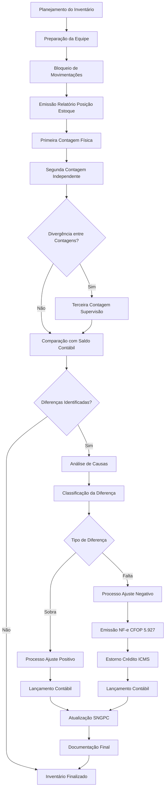
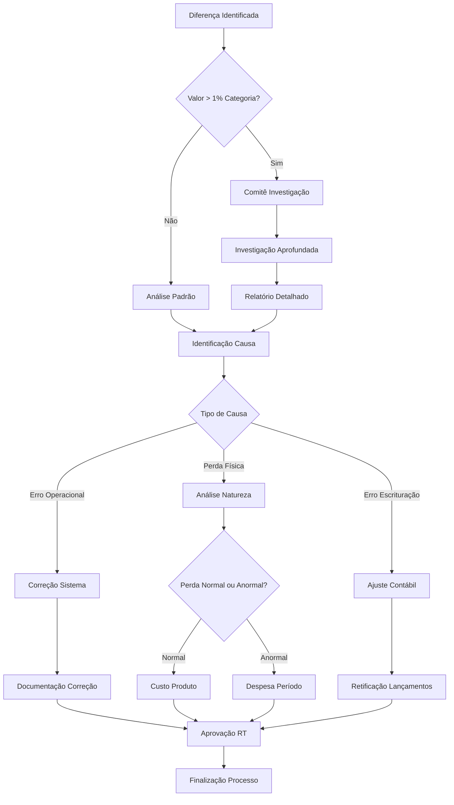
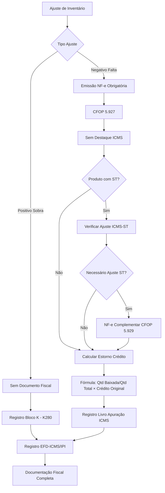
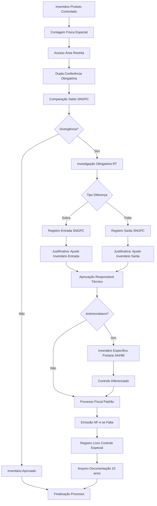
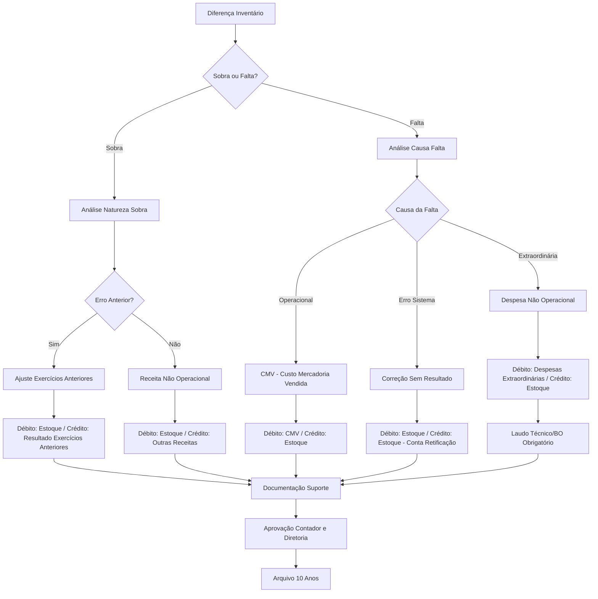

# PROCEDIMENTO OPERACIONAL PADRÃO

## AJUSTES DE INVENTÁRIO NA INDÚSTRIA FARMACÊUTICA - VERSÃO 1.0

# SUMÁRIO

1. **OBJETIVO** ........................................................................... 3
2. **ALCANCE** ........................................................................... 3
3. **DEFINIÇÕES E CONCEITOS** ........................................................ 3
4. **BASE LEGAL** ........................................................................ 5
5. **ESTRUTURA DE CONTROLE DE ESTOQUE** ........................................... 6
6. **PROCEDIMENTOS DE INVENTÁRIO** .................................................. 8
7. **TRATAMENTO CONTÁBIL DOS AJUSTES** ........................................... 11
8. **ASPECTOS FISCAIS E TRIBUTÁRIOS** ............................................... 13
9. **FLUXOS OPERACIONAIS** ........................................................... 16
10. **ASPECTOS CONTÁBEIS DETALHADOS** ............................................. 18
11. **DOCUMENTAÇÃO E CONTROLES** ................................................... 20
12. **PERGUNTAS FREQUENTES** ........................................................ 22

---

# 1. OBJETIVO

Este Procedimento Operacional Padrão estabelece diretrizes padronizadas para execução de ajustes de inventário em indústrias farmacêuticas, assegurando conformidade com as normas contábeis brasileiras (NBC TG 16 - Estoques) e legislação fiscal aplicável (ICMS, regulamentações sanitárias). O documento visa minimizar discrepâncias entre estoque físico e contábil, garantir adequado tratamento fiscal das diferenças identificadas e estabelecer controles internos robustos para produtos farmacêuticos, incluindo medicamentos controlados sujeitos ao Sistema Nacional de Gerenciamento de Produtos Controlados (SNGPC).

# 2. ALCANCE

Este POP aplica-se a todos os processos de inventário realizados pela indústria farmacêutica, abrangendo produtos acabados, matérias-primas, materiais de embalagem e insumos farmacêuticos. O escopo contempla diferenças positivas (sobras) e negativas (faltas) identificadas durante contagens físicas, incluindo procedimentos específicos para medicamentos controlados, antimicrobianos e produtos sujeitos à substituição tributária do ICMS. O documento cobre desde a preparação do inventário até a finalização dos ajustes contábeis e fiscais necessários.

# 3. DEFINIÇÕES E CONCEITOS

## 3.1 Definições Operacionais

**Inventário Físico:** Contagem física sistemática de todos os itens em estoque em data específica, comparada com os registros contábeis para identificação de divergências.

**Diferenças de Inventário:** Divergências identificadas entre o estoque físico apurado e o saldo contábil registrado nos sistemas de controle.

**Ajuste a Maior (Sobras):** Situação em que o estoque físico supera o saldo contábil registrado, resultando em diferença positiva.

**Ajuste a Menor (Faltas):** Situação em que o estoque físico é inferior ao saldo contábil registrado, resultando em diferença negativa.

**SNGPC:** Sistema Nacional de Gerenciamento de Produtos Controlados, sistema informatizado da ANVISA para controle da movimentação de medicamentos sujeitos à vigilância sanitária.

## 3.2 Conceitos Técnicos

### 3.2.1 Classificação de Discrepâncias

**Erros Operacionais:** Divergências decorrentes de falhas nos processos de movimentação, digitação inadequada ou problemas sistêmicos nos controles de estoque.

**Perdas Físicas:** Reduções de estoque decorrentes de deterioração, vencimento, quebras, furtos ou outras causas que resultem em perda efetiva de produtos.

**Correções de Sistema:** Ajustes necessários para correção de inconsistências identificadas nos sistemas de gestão de estoque.

### 3.2.2 Categorização por Causa

**Perdas Técnicas:** Perdas inerentes ao processo produtivo ou armazenamento, incluindo evaporação, absorção de umidade ou degradação natural.

**Perdas Administrativas:** Perdas decorrentes de falhas nos controles internos, procedimentos inadequados ou erro humano.

**Perdas Extraordinárias:** Perdas decorrentes de eventos não recorrentes como sinistros, furtos, contaminação ou recall de produtos.

# 4. BASE LEGAL

## 4.1 Legislação Federal

- **NBC TG 16 (R2) - Estoques:** Norma brasileira de contabilidade que estabelece critérios para mensuração, reconhecimento e divulgação de estoques.
- **Lei nº 6.404/76 - Lei das Sociedades Anônimas:** Define critérios contábeis para avaliação de ativos, incluindo estoques.
- **Decreto-Lei nº 1.598/77:** Regulamenta tratamento tributário dos estoques para fins de imposto de renda.

## 4.2 Legislação Estadual

- **RCTE (Regulamento do ICMS):** Artigo 58 e dispositivos correlatos sobre estorno de créditos em casos de perda de estoque.
- **Convênio ICMS 100/97:** Disciplina substituição tributária para produtos farmacêuticos.
- **CFOP 5.927:** Código Fiscal de Operações e Prestações específico para baixa de estoque por perda, roubo ou deterioração.

## 4.3 Normas e Regulamentações Específicas

- **RDC ANVISA nº 67/2007:** Estabelece boas práticas de manipulação de preparações magistrais e oficinais.
- **Portaria SVS/MS nº 344/98:** Regulamenta controle de medicamentos controlados e define obrigatoriedades do SNGPC.
- **IN RFB nº 1.700/17:** Disciplina escrituração do Livro Registro de Inventário.

# 5. ESTRUTURA DE CONTROLE DE ESTOQUE

## 5.1 Organização Física do Estoque

### 5.1.1 Segregação por Categoria

**Produtos Controlados:** Armazenamento em área específica com controles de acesso diferenciados e monitoramento contínuo das movimentações.

**Produtos Temperatura Controlada:** Câmaras frias e ambientes climatizados com registros contínuos de temperatura e umidade.

**Produtos Vencimento Próximo:** Área específica para produtos com prazo de validade inferior a seis meses, com controles diferenciados.

**Matérias-Primas:** Segregação por classe terapêutica e compatibilidade química, com identificação clara de lotes e fornecedores.

#### 5.1.1.1 Controles de Acesso

**Área de Produtos Controlados:** Acesso restrito mediante autorização específica, com registro de entrada e saída de pessoas.

**Sistema de Monitoramento:** Câmeras de segurança, sensores de movimento e alarmes para todas as áreas críticas.

#### 5.1.1.2 Identificação e Rastreabilidade

**Etiquetagem Padronizada:** Código de barras ou QR Code em todas as unidades de estoque, incluindo informações de lote, validade e localização.

**Sistema FIFO/FEFO:** Controle rigoroso de First Expired, First Out para produtos com prazo de validade.

### 5.1.2 Sistemas de Controle

**ERP Integrado:** Sistema de gestão empresarial com módulos específicos para controle de estoque farmacêutico.

**Interface SNGPC:** Integração automática com sistema da ANVISA para movimentação de produtos controlados.

## 5.2 Periodicidade dos Inventários

### 5.2.1 Inventário Geral

**Frequência:** Anual, preferencialmente no encerramento do exercício fiscal (31 de dezembro).

**Escopo:** Totalidade do estoque, incluindo todos os produtos, matérias-primas e materiais de embalagem.

### 5.2.2 Inventários Parciais

**Frequência:** Mensal para produtos controlados, trimestral para demais categorias.

**Critérios de Seleção:** Rotatividade, valor, criticidade regulatória e histórico de divergências.

# 6. PROCEDIMENTOS DE INVENTÁRIO

## 6.1 Fase Preparatória

### 6.1.1 Planejamento do Inventário

**Passo 1:** Definir data do inventário, preferencialmente em período de menor movimentação (final de semana ou feriado).

**Passo 2:** Comunicar formalmente todos os departamentos envolvidos com antecedência mínima de 15 dias.

**Passo 3:** Preparar equipes de contagem com treinamento específico sobre procedimentos e sistemas.

**Passo 4:** Organizar materiais necessários: pranchetas, canetas, etiquetas de identificação, leitores de código de barras.

### 6.1.2 Preparação do Ambiente

**Passo 1:** Interromper movimentações de estoque 2 horas antes do início da contagem.

**Passo 2:** Finalizar todos os lançamentos pendentes no sistema de gestão de estoque.

**Passo 3:** Emitir relatório de posição de estoque (saldo contábil) imediatamente antes da contagem.

**Passo 4:** Organizar fisicamente o estoque, agrupando produtos por código e lote.

### 6.1.3 Formação das Equipes

**Equipe de Contagem:** Mínimo 2 pessoas por área, sendo uma responsável pela contagem e outra pela conferência.

**Equipe de Supervisão:** Responsável técnico e gerente de estoque para validação dos procedimentos.

**Equipe de Apoio:** Pessoal de TI para suporte aos sistemas e pessoal administrativo para documentação.

## 6.2 Execução da Contagem

### 6.2.1 Procedimento de Contagem Física

**Passo 1:** Realizar primeira contagem por equipe específica, registrando quantidade, lote, validade e localização.

**Passo 2:** Executar segunda contagem independente por equipe distinta para validação.

**Passo 3:** Identificar divergências entre primeira e segunda contagem e proceder reconciliação.

**Passo 4:** Registrar observações sobre condições dos produtos (vencidos, avariados, segregados).

### 6.2.2 Controle de Qualidade da Contagem

**Verificação Cruzada:** Comparação entre resultados das equipes de contagem independentes.

**Amostragem:** Recontagem de amostra estatisticamente significativa para validação da precisão.

**Documentação:** Registro fotográfico de situações excepcionais ou produtos com problemas identificados.

### 6.2.3 Tratamento de Divergências

**Primeira Divergência:** Recontagem imediata pela equipe de supervisão.

**Persistência da Divergência:** Investigação detalhada das causas e documentação formal.

**Aprovação:** Validação final pelo responsável técnico antes da finalização.

## 6.3 Análise das Diferenças

### 6.3.1 Investigação de Causas

**Análise Documental:** Revisão de notas fiscais, requisições de material e registros de movimentação.

**Verificação Sistêmica:** Análise de lançamentos no ERP e identificação de possíveis falhas.

**Entrevistas:** Conversa com operadores responsáveis pelas movimentações para esclarecimento de discrepâncias.

### 6.3.2 Classificação das Divergências

**Erros de Lançamento:** Divergências decorrentes de falhas na digitação ou processamento de movimentações.

**Perdas Operacionais:** Quebras, deterioração ou contaminação durante processos produtivos ou armazenamento.

**Perdas Administrativas:** Furtos, extravios ou falhas nos controles de segurança.

### 6.3.3 Documentação da Análise

**Relatório de Investigação:** Documento formal descrevendo causas identificadas e medidas corretivas propostas.

**Evidências:** Anexação de documentos comprobatórios, fotografias e registros sistêmicos relevantes.

**Aprovação:** Validação pelo responsável técnico e departamento de qualidade antes da finalização.

# 7. TRATAMENTO CONTÁBIL DOS AJUSTES

## 7.1 Fundamentos Normativos

### 7.1.1 Aplicação da NBC TG 16

**Mensuração de Estoques:** Os estoques devem ser mensurados pelo valor de custo ou valor realizável líquido, dos dois o menor.

**Reconhecimento de Perdas:** Perdas identificadas devem ser reconhecidas no resultado do período em que ocorreram.

**Critério de Avaliação:** Utilização do método FIFO (First In, First Out) ou custo médio ponderado conforme política contábil da empresa.

### 7.1.2 Princípios de Reconhecimento

**Competência:** Ajustes devem ser reconhecidos no período em que as diferenças foram identificadas.

**Materialidade:** Diferenças imateriais podem ser tratadas diretamente no resultado sem investigação detalhada.

**Conservadorismo:** Em caso de dúvida, adotar tratamento mais conservador para proteção dos stakeholders.

## 7.2 Ajustes a Maior (Sobras)

### 7.2.1 Tratamento Contábil Padrão

**Lançamento Contábil:**

- **Débito:** Estoques de Produtos Acabados/Matérias-Primas (Ativo Circulante)
- **Crédito:** Reversão de Custo das Mercadorias Vendidas ou conta específica "Ajustes Positivos de Inventário"

### 7.2.2 Análise de Natureza

**Correção de Erro:** Se a sobra decorrer de erro de lançamento anterior, tratar como ajuste de exercícios anteriores.

**Ganho Efetivo:** Se representa descoberta de estoque não registrado, reconhecer como receita não operacional.

## 7.3 Ajustes a Menor (Faltas)

### 7.3.1 Tratamento Contábil por Causa

**Perdas Operacionais:**

- **Débito:** Custo das Mercadorias Vendidas
- **Crédito:** Estoques de Produtos/Matérias-Primas

**Perdas Extraordinárias:**

- **Débito:** Despesas Não Operacionais - Perdas Extraordinárias
- **Crédito:** Estoques de Produtos/Matérias-Primas

### 7.3.2 Documentação de Suporte

**Laudo Técnico:** Para perdas por deterioração ou contaminação, laudo do responsável técnico.

**Boletim de Ocorrência:** Para casos de furto ou roubo, registro policial formal.

**Relatório de Investigação:** Documento interno detalhando causas e responsabilidades.

# 8. ASPECTOS FISCAIS E TRIBUTÁRIOS

## 8.1 Diferenças Positivas (Sobras)

### 8.1.1 Tratamento Fiscal

**Obrigações Documentais:** Não há exigência de emissão de documento fiscal específico.

**Registro Contábil:** Lançamento apenas nos livros contábeis e registro de inventário.

**EFD-ICMS/IPI:** Registro no Bloco K, utilizando K280 para correção de saldo de estoque.

### 8.1.2 Aspectos Tributários

**ICMS:** Não há incidência de ICMS sobre ajustes positivos de inventário.

**IPI:** Para indústrias, não há incidência de IPI sobre correções de estoque.

**PIS/COFINS:** Não há impacto nas contribuições sociais para ajustes de inventário.

## 8.2 Diferenças Negativas (Faltas)

### 8.2.1 Emissão de Documento Fiscal

**CFOP 5.927:** "Lançamento efetuado a título de baixa de estoque decorrente de perda, roubo ou deterioração"

**Natureza da Operação:** "Baixa de Estoque por Perda/Deterioração/Ajuste de Inventário"

**Campos Específicos:** Não destacar ICMS na nota fiscal, informar causa da baixa no campo observações.

### 8.2.2 Estorno de Créditos

**Base Legal:** Artigo 58 do RCTE-GO - estorno de crédito proporcional à quantidade baixada.

**Cálculo:** (Quantidade baixada ÷ Quantidade total do lote) × Crédito original

**Registro:** Lançamento no Livro de Apuração do ICMS e sistema de escrituração fiscal.

### 8.2.3 Produtos sob Substituição Tributária

**ICMS-ST:** Para produtos farmacêuticos sob ST, verificar necessidade de ajuste no recolhimento.

**Documentação:** Emissão de nota fiscal complementar quando necessário ajuste de ICMS-ST.

**CFOP Complementar:** Utilizar 5.929 para ajustes de ICMS-ST quando aplicável.

## 8.3 Medicamentos Controlados

### 8.3.1 Procedimentos no SNGPC

**Registro de Entrada:** Para sobras identificadas, registrar como "Ajuste de Inventário - Entrada"

**Registro de Saída:** Para faltas identificadas, registrar como "Ajuste de Inventário - Saída"

**Justificativa:** Campo obrigatório detalhando a natureza e causa do ajuste realizado.

### 8.3.2 Diferenciação Regulatória

**Inventário Físico:** Contagem física de todos os produtos para fins contábeis e fiscais.

**Inventário SNGPC:** Controle específico para medicamentos controlados conforme Portaria 344/98.

**Antimicrobianos:** Inventário específico diferenciado do inventário geral da empresa.

# 9. FLUXOS OPERACIONAIS

## 9.1 Fluxo de Inventário Padrão

### 9.1.1 Fase Preparatória

**Etapa 1:** Planejamento e cronograma (15 dias antes)
**Etapa 2:** Treinamento das equipes (7 dias antes)
**Etapa 3:** Preparação do ambiente físico (1 dia antes)
**Etapa 4:** Bloqueio de movimentações (2 horas antes)

### 9.1.2 Fase de Execução

**Etapa 1:** Primeira contagem por equipe designada
**Etapa 2:** Segunda contagem independente para validação
**Etapa 3:** Reconciliação de divergências identificadas
**Etapa 4:** Contagem de supervisão para casos críticos

### 9.1.3 Fase de Finalização

**Etapa 1:** Consolidação dos resultados de contagem
**Etapa 2:** Análise de causas das diferenças identificadas
**Etapa 3:** Aprovação dos ajustes pela diretoria técnica
**Etapa 4:** Processamento dos lançamentos contábeis e fiscais

## 9.2 Fluxo de Tratamento de Exceções

### 9.2.1 Identificação de Divergências Significativas

**Trigger 1:** Diferenças superiores a 1% do valor do estoque por categoria
**Trigger 2:** Faltas de medicamentos controlados em qualquer quantidade
**Trigger 3:** Produtos vencidos não identificados anteriormente

### 9.2.2 Processo de Investigação Aprofundada

**Passo 1:** Formação de comitê de investigação com participação multidisciplinar
**Passo 2:** Análise documental detalhada dos últimos 6 meses
**Passo 3:** Entrevista com colaboradores envolvidos nas movimentações
**Passo 4:** Revisão de controles internos e identificação de falhas sistêmicas
**Passo 5:** Elaboração de relatório conclusivo com medidas corretivas

# 10. ASPECTOS CONTÁBEIS DETALHADOS

## 10.1 Tratamento Contábil por Categoria

### 10.1.1 Produtos Acabados

**Ajustes Positivos:** Reconhecimento no ativo circulante com contrapartida em conta de resultado específica

**Ajustes Negativos:** Baixa do ativo com débito em conta de despesa operacional ou não operacional conforme causa

**Critério de Avaliação:** Utilizar custo de produção completo incluindo materiais, mão de obra e custos indiretos

### 10.1.2 Matérias-Primas e Insumos

**Avaliação:** Custo de aquisição incluindo impostos não recuperáveis e gastos de transporte

**Tratamento de Perdas:** Classificação entre perdas normais (custo do produto) e anormais (despesa do período)

**Controle Analítico:** Manutenção de controle por lote para rastreabilidade e gestão de qualidade

## 10.2 Aspectos Fiscais Específicos

### 10.2.1 Impacto no Lucro Real

**Base de Cálculo:** Ajustes de inventário afetam base de cálculo do IRPJ e CSLL

**Limitações de Dedutibilidade:** Perdas extraordinárias dependem de comprovação adequada

**Controle de Temporalidade:** Diferimento de efeitos tributários quando aplicável

### 10.2.2 Escrituração Fiscal

**EFD-ICMS/IPI:** Registros no Bloco K conforme Manual de Orientação

**ECF:** Impacto na escrituração contábil fiscal para apuração do lucro real

**DCTF:** Reflexos na Declaração de Débitos e Créditos Tributários Federais

# 11. FLUXOGRAMAS DE PROCESSO

## 11.1 Fluxograma Geral de Inventário

## 11.2 Fluxograma de Tratamento de Diferenças

## 11.3 Fluxograma Aspectos Fiscais

## 11.4 Fluxograma Medicamentos Controlados

## 11.5 Fluxograma Decisório Tratamento Contábil

# 12. DOCUMENTAÇÃO E CONTROLES

## 12.1 Documentos Obrigatórios

### 11.1.1 Documentação de Inventário

**Planilhas de Contagem:** Registros físicos assinados pelas equipes responsáveis

**Relatório Consolidado:** Resumo executivo com principais diferenças e causas identificadas

**Fotografias:** Registro visual de situações excepcionais ou produtos com problemas

### 11.1.2 Documentação Contábil-Fiscal

**Lançamentos Contábeis:** Registro detalhado de todos os ajustes efetuados

**Notas Fiscais:** Emissão de NF-e para baixas de estoque quando obrigatória

**Comprovantes de Estorno:** Documentação de estornos de créditos de ICMS realizados

## 11.2 Controles Internos

### 11.2.1 Segregação de Funções

**Contagem:** Executada por equipes distintas da custodia do estoque

**Supervisão:** Validação por profissionais não envolvidos na gestão operacional

**Aprovação:** Autorização final pela diretoria técnica ou conselho administrativo

### 11.2.2 Arquivo e Retenção

**Prazo de Guarda:** Mínimo 5 anos para documentação fiscal, 10 anos para documentação contábil

**Organização:** Arquivo físico e digital com indexação por período e categoria

**Backup:** Cópias de segurança em locais distintos para preservação

# 12. PERGUNTAS FREQUENTES

## 12.1 Questões Técnicas

**Q: Como tratar diferenças de inventário em produtos com prazo de validade vencido?**

R: Produtos vencidos devem ser baixados integralmente do estoque com débito em conta de perdas, emitindo NF-e com CFOP 5.927 e estornando créditos de ICMS correspondentes. Para medicamentos controlados, registrar no SNGPC como "saída por vencimento".

**Q: É obrigatório emitir nota fiscal para todas as diferenças negativas de inventário?**

R: Sim, conforme legislação estadual do ICMS, diferenças negativas (faltas) exigem emissão de NF-e com CFOP 5.927, exceto para ajustes decorrentes de erro de escrituração devidamente comprovado.

## 12.2 Questões Operacionais

**Q: Qual a frequência mínima recomendada para inventários em indústrias farmacêuticas?**

R: Inventário geral anual obrigatório, inventários parciais mensais para medicamentos controlados e trimestrais para demais produtos. Produtos críticos ou alto valor podem exigir frequência maior.

**Q: Como proceder quando há divergência entre primeira e segunda contagem?**

R: Realizar terceira contagem pela equipe de supervisão, investigar causas da divergência e documentar adequadamente. Persistindo divergência, escalar para comitê de inventário para análise final.

## 12.3 Questões Regulamentares

**Q: Quais as obrigações específicas para medicamentos controlados no inventário?**

R: Além dos procedimentos padrão, medicamentos controlados exigem registro no SNGPC com justificativa detalhada, aprovação do responsável técnico e controle diferenciado para antimicrobianos conforme Portaria 344/98.

**Q: Como calcular o estorno de crédito de ICMS em ajustes de inventário?**

R: Aplicar fórmula: (Quantidade baixada ÷ Quantidade total do lote original) × Crédito de ICMS original. Registrar no Livro de Apuração do ICMS e sistema de escrituração fiscal digital.

---

**EXEMPLO PRÁTICO:**

**Situação-Exemplo:**
Durante inventário mensal, identificada falta de 100 unidades de determinado medicamento com valor unitário de R$ 15,00, original de lote com 1.000 unidades que geraram crédito de ICMS de R\$ 2.700,00.

**Dados da Operação:**

- **Quantidade baixada:** 100 unidades
- **Valor unitário:** R$ 15,00
- **Valor total da baixa:** R$ 1.500,00
- **Crédito ICMS original do lote:** R$ 2.700,00

**Aplicação do Procedimento:**

1. **Lançamento contábil:** Débito "Perdas de Estoque" R$ 1.500,00 / Crédito "Estoque Produtos Acabados" R\$ 1.500,00
2. **Emissão NF-e:** CFOP 5.927, valor R$ 1.500,00, sem destaque de ICMS
3. **Cálculo estorno:** (100 ÷ 1.000) × R$ 2.700,00 = R\$ 270,00
4. **Registro SNGPC:** Saída por "Ajuste de Inventário" com justificativa detalhada

**Resultado Final:**

- **Redução do Estoque:** R$ 1.500,00 (100%)
- **Estorno de Crédito ICMS:** R$ 270,00 (10%)
- **Impacto no Resultado:** Despesa de R$ 1.500,00

---

**HISTÓRICO DE REVISÕES:**

| Versão | Data        | Responsável   | Alterações           |
| ------ | ----------- | ------------- | -------------------- |
| 1.0    | Agosto/2025 | Depto. Fiscal | Criação do documento |

---

**Data de Emissão:** Agosto/2025
**Versão:** 1.0
**Aprovação:** Diretoria Técnica e Fiscal

---

*Este documento deve ser revisado anualmente ou sempre que houver alteração na legislação tributária, contábil ou regulamentação sanitária aplicável.*