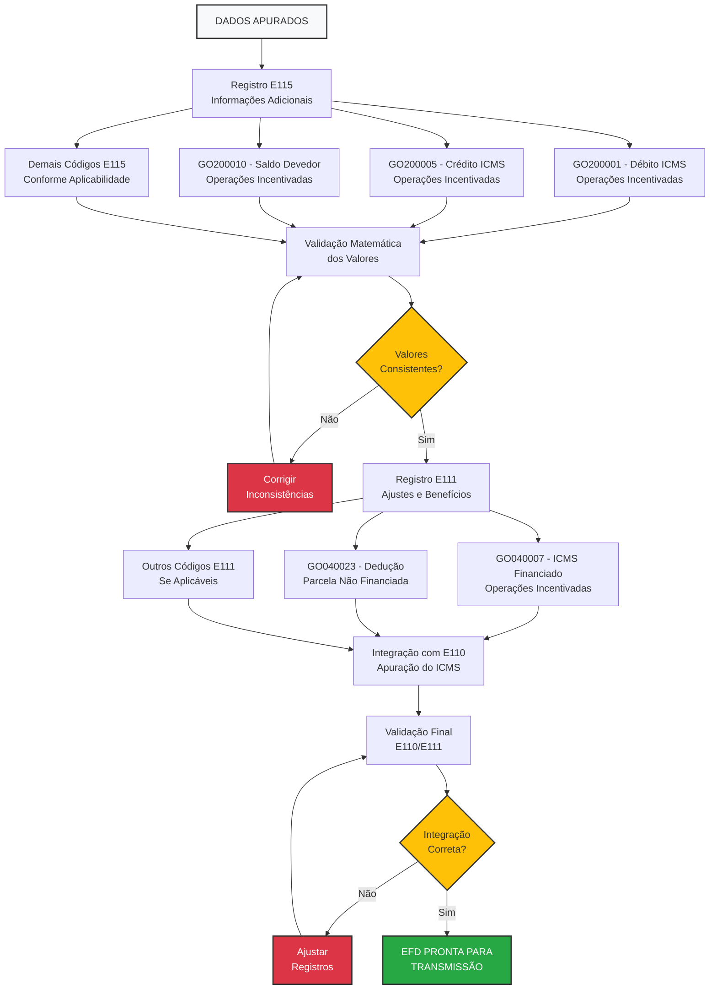
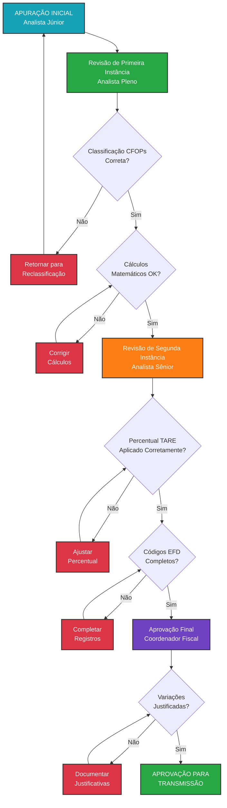

# PROCEDIMENTO OPERACIONAL PADRÃO

## APURAÇÃO DO ICMS - PROGRAMA FOMENTAR - VERSÃO 1.0

### SUMÁRIO

1. **OBJETIVO** ........................................................................... 3
2. **ALCANCE** ........................................................................... 3
3. **DEFINIÇÕES E CONCEITOS FISCAIS** ................................................. 4
4. **BASE LEGAL** ........................................................................ 6
5. **ESTRUTURA TRIBUTÁRIA DO PROGRAMA FOMENTAR** .................................. 7
6. **METODOLOGIA DE APURAÇÃO MENSAL** ................................................ 10
7. **CONTROLES E VALIDAÇÕES** ......................................................... 15
8. **ASPECTOS OPERACIONAIS** .......................................................... 17
9. **FLUXOS DE APURAÇÃO** ............................................................. 19
10. **ASPECTOS CONTÁBEIS E FISCAIS** ................................................. 22
11. **DOCUMENTAÇÃO E ANEXOS** ........................................................ 24
12. **PERGUNTAS FREQUENTES** ......................................................... 28

---

## 1. OBJETIVO

Este Procedimento Operacional Padrão estabelece diretrizes detalhadas e obrigatórias para apuração mensal do ICMS por estabelecimentos industriais beneficiários do Programa de Desenvolvimento Industrial de Goiás - FOMENTAR. O documento visa assegurar conformidade fiscal, padronizar procedimentos de apuração, garantir o correto cumprimento das obrigações tributárias e manter os benefícios concedidos pelo programa através da aplicação adequada da legislação vigente e controles internos eficazes.

## 2. ALCANCE

Este POP aplica-se obrigatoriamente a todos os estabelecimentos industriais beneficiários dos programas FOMENTAR, PRODUZIR e MICROPRODUZIR que possuam Termo de Acordo de Regime Especial (TARE) ativo no Estado de Goiás. O escopo abrange desde a classificação de operações por CFOP até a entrega da Escrituração Fiscal Digital (EFD ICMS/IPI), contemplando apuração mensal, preenchimento de registros específicos, validações obrigatórias e controles documentais. O documento deve ser aplicado por contribuintes obrigatórios à EFD ICMS/IPI com periodicidade mensal rigorosamente observada.

## 3. DEFINIÇÕES E CONCEITOS FISCAIS

### 3.1 Definições Operacionais

**Programa FOMENTAR:** Programa de Desenvolvimento Industrial de Goiás que concede financiamento de até 73% do ICMS devido sobre operações industriais, mediante cumprimento de critérios específicos e celebração de TARE com o Estado de Goiás.

**TARE (Termo de Acordo de Regime Especial):** Instrumento jurídico que formaliza a concessão dos benefícios fiscais, estabelecendo percentuais de financiamento, obrigações acessórias específicas e critérios de manutenção dos incentivos.

**Operações Incentivadas:** Operações industriais abrangidas pelos benefícios do FOMENTAR, identificadas através de CFOPs específicos listados nos Anexos I e II da IN 1.501/21-GSE, incluindo compras para industrialização, vendas de produção própria e serviços industriais.

**Operações Não Incentivadas:** Todas as operações não industriais ou não listadas nos anexos normativos, incluindo vendas de mercadorias para revenda, operações com sucatas, subprodutos e prestações de serviços não relacionadas à industrialização.

### 3.2 Conceitos Técnicos Fundamentais

#### 3.2.1 Terminologia Atualizada (IN 1.501/21-GSE)

| Termo Atual                    | Termo EFD        | Definição Técnica                                                                     |
| ------------------------------ | ---------------- | ------------------------------------------------------------------------------------- |
| **Operações Incentivadas**     | Beneficiadas     | Operações industriais com CFOPs dos Anexos I e II, sujeitas ao financiamento FOMENTAR |
| **Operações Não Incentivadas** | Não Beneficiadas | Operações fora do escopo do programa, tributadas integralmente                        |
| **Parcela Financiada**         | ICMS Financiado  | Percentual do ICMS sujeito ao financiamento conforme TARE (até 73%)                   |
| **Parcela Não Financiada**     | Não Incentivada  | Percentual do ICMS não sujeito ao financiamento, recolhido normalmente                |

#### 3.2.2 Percentuais de Financiamento por Programa

**FOMENTAR:** Financiamento de até 73% do ICMS devido sobre operações incentivadas, aplicável a estabelecimentos industriais que atendam aos requisitos de investimento, empregos e faturamento estabelecidos na legislação específica.

**PRODUZIR:** Financiamento de até 73% do ICMS devido, programa predecessor ao FOMENTAR com regras similares para estabelecimentos já contemplados.

**MICROPRODUZIR:** Financiamento de até 90% do ICMS devido, destinado especificamente a microempresas industriais com critérios diferenciados de enquadramento.

#### 3.2.3 Evolução dos Critérios de Apuração

**Período Anterior (até 31/12/2022):** Critério de proporcionalidade baseado no valor das saídas totais, calculando-se a proporção entre saídas incentivadas e saídas totais para distribuição dos créditos.

**Período Atual (desde 01/01/2023):** Critério baseado exclusivamente em CFOPs específicos conforme Anexos I, II e III da IN 1.501/21-GSE, eliminando cálculos proporcionais e estabelecendo segregação direta por natureza da operação.

## 4. BASE LEGAL

### 4.1 Legislação Estadual Principal

**IN 885/07-GSF:** Instrução Normativa que estabeleceu os procedimentos iniciais de apuração para programas FOMENTAR/PRODUZIR, definindo metodologias básicas de segregação de operações e cálculo do ICMS financiado. Vigência: 01/01/2008.

**IN 1.501/21-GSE:** Instrução Normativa que alterou fundamentalmente os critérios de apuração, introduzindo o sistema de classificação por CFOPs específicos e eliminando o critério de proporcionalidade. Vigência: 01/01/2023, representando marco regulatório atual.

**IN 1.516/22-GSE:** Instrução Normativa que promoveu ajustes nos anexos de CFOPs aplicáveis, incluindo correções e atualizações de códigos fiscais para maior precisão na classificação das operações. Vigência: 01/07/2022.

**IN 1.524/22-GSE:** Instrução Normativa com correções e atualizações complementares, harmonizando dispositivos e esclarecendo aspectos práticos de aplicação. Vigência: 01/01/2023.

### 4.2 Legislação Federal Aplicável

**Lei Complementar 87/96:** Lei Kandir que estabelece normas gerais sobre ICMS, aplicável subsidiariamente aos procedimentos de apuração e aos regimes especiais estaduais.

**Convênio ICMS 57/95:** Convênio que disciplina a Escrituração Fiscal Digital e estabelece códigos e registros obrigatórios para contribuintes beneficiários de incentivos fiscais.

### 4.3 Normas e Regulamentações Complementares

**Guia Prático da EFD ICMS/IPI de Goiás:** Documento técnico oficial que detalha preenchimento de registros específicos, códigos aplicáveis e validações exigidas para contribuintes goianos.

**Tabelas de Códigos do SPED Fiscal - GO:** Tabelas oficiais atualizadas com códigos específicos do Estado de Goiás para registros E115 e E111, essenciais para correta escrituração fiscal digital.

## 5. ESTRUTURA TRIBUTÁRIA DO PROGRAMA FOMENTAR

### 5.1 Arquitetura do Sistema de Incentivos

#### 5.1.1 Modelo de Financiamento

O sistema FOMENTAR opera através de **financiamento fiscal** onde parcela do ICMS devido é postergada mediante cumprimento de contrapartidas socioeconômicas. O modelo não configura isenção ou redução de base de cálculo, mas sim diferimento de pagamento com possibilidade de perdão mediante cumprimento das metas estabelecidas no TARE.

#### 5.1.2 Segregação Operacional Obrigatória

**Operações Incentivadas (Anexo I - Entradas):**

- Compras para industrialização (CFOP 1101/2101)
- Industrialização por terceiros (CFOP 1124/2124)  
- Transferências para industrialização (CFOP 1151/2151)
- Energia elétrica industrial (CFOP 1252/2252)
- Transporte industrial (CFOP 1352/2352)
- Imobilizado produtivo (CFOP 1551/2551)

**Operações Incentivadas (Anexo II - Saídas):**

- Vendas de produção própria (CFOP 5101/6101)
- Prestação de industrialização (CFOP 5124/6124)
- Transferências de produtos (CFOP 5151/6151)
- Outras operações industriais listadas

#### 5.1.3 Regra Especial para Produtos Próprios

**Princípio da Prevalência Industrial:** Mesmo que o CFOP da operação não conste nos Anexos normativos, operações envolvendo produtos de industrialização própria incentivados pelo FOMENTAR devem ser obrigatoriamente classificadas como operações incentivadas, prevalecendo a natureza industrial sobre a classificação fiscal.

### 5.2 Mecânica de Apuração por Quadros

#### 5.2.1 Quadro A - Operações Incentivadas

**Estrutura de Débitos:**

1. ICMS das operações incentivadas (vendas, prestações de serviços industriais)
2. ICMS das saídas a título de bonificação incentivadas  
3. Outros débitos específicos das operações incentivadas
4. Estornos de créditos relacionados a operações incentivadas

**Estrutura de Créditos:**
5. ICMS creditado para operações incentivadas (compras, industrialização)
6. Outros créditos específicos para operações incentivadas
7. Estornos de débitos relacionados a operações incentivadas
8. Saldo credor do período anterior (operações incentivadas)
9. Transferências de crédito de operações não incentivadas

#### 5.2.2 Quadro B - Operações Não Incentivadas

Estrutura similar ao Quadro A, contemplando operações de revenda, prestações de serviços não industriais, vendas de sucatas e subprodutos, e demais atividades não abrangidas pelos anexos normativos.

## 6. METODOLOGIA DE APURAÇÃO MENSAL

### 6.1 Procedimentos Preparatórios

#### 6.1.1 Etapa de Segregação de Operações

**Passo 1 - Identificação de Entradas Incentivadas:**

- Consultar rigorosamente o Anexo I da IN 1.501/21-GSE
- Verificar se o CFOP de cada entrada está expressamente listado
- Separar valores de ICMS creditado por categoria de operação
- Documentar exceções e casos especiais para auditoria

**Passo 2 - Identificação de Saídas Incentivadas:**

- Consultar rigorosamente o Anexo II da IN 1.501/21-GSE
- Verificar se o CFOP de cada saída está expressamente listado
- Aplicar obrigatoriamente a regra especial para produtos próprios
- Separar valores de ICMS debitado por categoria de operação

**Passo 3 - Validação de Classificação:**

- Conferir natureza industrial versus comercial de cada operação
- Validar enquadramento de produtos próprios incentivados
- Documentar critérios utilizados para classificação
- Registrar inconsistências para correção

#### 6.1.2 Etapa de Compilação de Dados

**Extração de Informações do Sistema Fiscal:**

- Relatórios detalhados por CFOP e natureza de operação
- Valores discriminados de ICMS próprio e ICMS-ST
- Dados de entrada e saída segregados por período competente
- Informações de ajustes e correções do período

### 6.2 Procedimentos de Cálculo

#### 6.2.1 Apuração do Quadro A (Operações Incentivadas)

**Fórmula de Cálculo do Saldo Devedor:**

```
Saldo Devedor = (Débitos 1+2+3+4) - (Créditos 5+6+7+8+9)
```

**Detalhamento dos Componentes:**

**Débitos Operacionais:**

- Item 1: Somatório do ICMS debitado em todas as saídas com CFOPs do Anexo II
- Item 2: ICMS sobre bonificações e doações com produtos incentivados
- Item 3: Ajustes de débito específicos (autuações, correções)
- Item 4: Estornos de créditos indevidos ou utilizados incorretamente

**Créditos Operacionais:**

- Item 5: Somatório do ICMS creditado em todas as entradas com CFOPs do Anexo I
- Item 6: Ajustes de crédito específicos (restituições, correções)
- Item 7: Estornos de débitos lançados indevidamente
- Item 8: Saldo credor transportado do período anterior
- Item 9: Créditos transferidos de operações não incentivadas (situações específicas)

#### 6.2.2 Cálculo do ICMS Financiado

**Fórmula Principal:**

```
ICMS Financiado = Saldo Devedor Incentivado × Percentual TARE
```

**Exemplo Prático:**

- Saldo Devedor das Operações Incentivadas: R$ 25.000,00
- Percentual FOMENTAR conforme TARE: 70%
- ICMS Financiado: R$ 25.000,00 × 70% = R$ 17.500,00
- ICMS a Recolher (parcela não financiada): R$ 7.500,00

### 6.3 Procedimentos de Validação

#### 6.3.1 Controles Matemáticos Obrigatórios

**Validação de Consistência:**

- Soma aritmética de todos os débitos por quadro
- Soma aritmética de todos os créditos por quadro  
- Conferência do saldo apurado com fórmula de cálculo
- Verificação do percentual de financiamento aplicado

**Validação de Integridade:**

- Comparação com períodos anteriores (variações significativas)
- Conferência com demonstrativos contábeis
- Validação de transferências entre quadros
- Verificação de limites e restrições por categoria

## 7. CONTROLES E VALIDAÇÕES

### 7.1 Controles Documentais Obrigatórios

#### 7.1.1 Documentos de Apuração

**Demonstrativo Mensal de Apuração:** Documento interno que consolida todos os cálculos, segregações e validações realizadas, servindo como memória de cálculo e evidência de conformidade para fiscalizações.

**Planilhas de Segregação:** Detalhamento por CFOP de todas as operações do período, com classificação individual entre incentivadas e não incentivadas, valores de ICMS e justificativas técnicas.

**Memória de Cálculo:** Documentação passo a passo dos procedimentos adotados, fórmulas utilizadas, ajustes realizados e validações aplicadas durante o processo de apuração.

#### 7.1.2 Validações Documentais

**Conferência de Dados Fiscais:** Comparação entre livros fiscais digitais, relatórios do sistema ERP e informações declaradas na EFD ICMS/IPI, identificando e corrigindo divergências antes da transmissão.

**Verificação de Autenticidade:** Validação da origem das informações fiscais, conferência de assinaturas digitais, integridade dos arquivos e rastreabilidade dos dados utilizados na apuração.

**Completude das Informações:** Checklist verificando se todas as operações do período foram classificadas, se todos os códigos obrigatórios foram informados e se não existem omissões.

### 7.2 Controles Operacionais

#### 7.2.1 Checklist Mensal de Validação

**Classificação de CFOPs:**

- ✅ Todas as entradas conferidas com Anexo I da IN 1.501/21-GSE
- ✅ Todas as saídas conferidas com Anexo II da IN 1.501/21-GSE  
- ✅ Regra especial para produtos próprios aplicada corretamente
- ✅ Operações duvidosas analisadas e documentadas

**Cálculos Matemáticos:**

- ✅ Saldos devedores por quadro matematicamente corretos
- ✅ Percentual de financiamento conforme TARE aplicado
- ✅ Transferências entre quadros validadas e justificadas
- ✅ Total de deduções consistente com benefícios utilizados

**Registros EFD:**

- ✅ Todos os códigos E115 aplicáveis informados (incluindo zeros)
- ✅ Registros E111 consistentes com deduções calculadas
- ✅ Integração E110/E111 matematicamente correta
- ✅ Descrições complementares adequadamente preenchidas

#### 7.2.2 Controles de Qualidade

**Revisão por Segunda Pessoa:** Todo processo de apuração deve ser revisado por profissional diferente daquele que elaborou os cálculos, com documentação formal da revisão e eventuais correções implementadas.

**Documentação de Evidências:** Manter arquivo organizado com demonstrativos, planilhas, memórias de cálculo e evidências que suportem as informações prestadas na EFD ICMS/IPI.

**Arquivo Sistematizado:** Organização cronológica e sistemática de toda documentação fiscal, facilitando consultas posteriores e atendimento a fiscalizações.

## 8. ASPECTOS OPERACIONAIS

### 8.1 Responsabilidades Funcionais

#### 8.1.1 Responsabilidades por Cargo

**Analista Fiscal Júnior:**

- Segregação inicial de operações por CFOP conforme anexos normativos
- Elaboração de planilhas detalhadas com classificação operação por operação
- Compilação de dados dos sistemas fiscais e contábeis para apuração
- Preparação de documentação básica para revisão superior

**Analista Fiscal Pleno:**

- Revisão e validação das segregações realizadas pelo nível júnior
- Execução dos cálculos de apuração com aplicação das fórmulas adequadas
- Preenchimento dos registros E115 e E111 na EFD ICMS/IPI
- Análise de inconsistências e implementação de correções necessárias

**Analista Fiscal Sênior:**

- Revisão final de toda apuração antes da transmissão da EFD
- Análise crítica de variações significativas em relação a períodos anteriores
- Validação de aspectos complexos e situações excepcionais
- Interface com consultoria externa em casos de dúvidas técnicas

**Coordenador Fiscal:**

- Aprovação final da apuração mensal e autorização para transmissão
- Supervisão do cumprimento de prazos regulamentares
- Acompanhamento de indicadores fiscais e tributários
- Resposta a questionamentos de auditorias internas e externas

#### 8.1.2 Matriz de Responsabilidades RACI

| Atividade               | Júnior | Pleno | Sênior | Coordenador |
| ----------------------- | ------ | ----- | ------ | ----------- |
| Segregação de operações | R      | A     | C      | I           |
| Cálculo de apuração     | I      | R     | A      | C           |
| Preenchimento EFD       | I      | R     | A      | C           |
| Revisão final           | I      | C     | R      | A           |
| Aprovação para envio    | I      | I     | C      | R           |

*R=Responsável, A=Aprovador, C=Consultado, I=Informado*

### 8.2 Prazos e Cronograma Operacional

#### 8.2.1 Prazos Regulamentares

**Prazo para Entrega da EFD ICMS/IPI:** Até o dia 25 do mês subsequente ao período de apuração, conforme estabelecido na legislação estadual de Goiás.

**Prazo para Pagamento do ICMS:** Até o dia 10 do mês subsequente, considerando apenas a parcela não financiada após aplicação dos benefícios FOMENTAR.

**Prazo para Correções:** Até 5 dias úteis após identificação de inconsistências, através de EFD retificadora quando necessário.

#### 8.2.2 Cronograma Interno de Atividades

**Dias 1-15 do Mês Seguinte:**

- Fechamento contábil e fiscal do período anterior
- Extração de relatórios e compilação de dados operacionais
- Segregação preliminar de operações por classificação fiscal

**Dias 16-20 do Mês Seguinte:**

- Execução da apuração com aplicação de metodologias e cálculos
- Preenchimento da EFD ICMS/IPI com registros obrigatórios
- Revisão técnica e validações de consistência

**Dias 21-23 do Mês Seguinte:**

- Revisão final por supervisor e aprovação para transmissão
- Transmissão oficial da EFD ICMS/IPI para SEFAZ-GO
- Geração e arquivo de relatórios de protocolo e confirmação

## 9. FLUXOS DE APURAÇÃO

### 9.1 Fluxo Principal de Apuração Mensal

#### 9.1.1 Fase Inicial - Preparação

**Etapa 1 - Fechamento Contábil:** Conclusão de todos os lançamentos contábeis do período, incluindo provisões, ajustes e reclassificações necessárias para alinhamento fiscal.

**Etapa 2 - Extração de Dados:** Geração de relatórios fiscais detalhados por CFOP, natureza de operação, base de cálculo e valores de ICMS próprio e substituição tributária.

**Etapa 3 - Organização Documental:** Compilação de documentos fiscais, notas fiscais, conhecimentos de transporte e demais evidências necessárias para suporte da apuração.

**Etapa 4 - Análise Preliminar:** Revisão inicial dos dados para identificação de inconsistências, operações atípicas ou valores que requeiram análise especial.

#### 9.1.2 Fase Intermediária - Execução

**Etapa 1 - Classificação de Operações:** Segregação rigorosa entre operações incentivadas e não incentivadas conforme CFOPs dos anexos normativos, com aplicação da regra especial para produtos próprios.

**Etapa 2 - Apuração por Quadros:** Cálculo separado dos saldos devedores para operações incentivadas e não incentivadas, aplicando metodologia específica para cada categoria.

**Etapa 3 - Cálculo do ICMS Financiado:** Aplicação do percentual FOMENTAR conforme TARE sobre o saldo devedor de operações incentivadas, determinando parcelas financiada e não financiada.

**Etapa 4 - Preenchimento da EFD:** Informação de todos os códigos E115 obrigatórios e registros E111 com deduções aplicáveis, incluindo validações automáticas de consistência.

#### 9.1.3 Fase Final - Validação

**Etapa 1 - Conferências Matemáticas:** Validação de todos os cálculos, somas, aplicações de percentuais e consistência entre quadros de apuração.

**Etapa 2 - Revisão Técnica:** Análise por segunda pessoa de toda apuração, com foco em classificações fiscais, aplicação de benefícios e correção de eventuais inconsistências.

**Etapa 3 - Aprovação Gerencial:** Revisão final por supervisor com autoridade para aprovação, incluindo análise de variações e aprovação para transmissão oficial.

### 9.2 Fluxo de Tratamento de Exceções

#### 9.2.1 Identificação de Inconsistências

**Trigger 1 - Divergência de CFOPs:** Operações com CFOPs não listados nos anexos normativos, mas com características industriais que possam requerer classificação como incentivadas.

**Trigger 2 - Variações Significativas:** Alterações superiores a 20% nos saldos apurados em relação à média dos três períodos anteriores, exigindo análise de causas.

**Trigger 3 - Produtos Próprios Atípicos:** Operações com produtos de fabricação própria utilizando CFOPs comerciais ou não usuais que requeiram aplicação da regra especial.

#### 9.2.2 Processo de Correção e Tratamento

**Passo 1 - Análise Técnica:** Investigação detalhada da situação, consulta à legislação aplicável e eventual contato com consultoria especializada para esclarecimento.

**Passo 2 - Documentação de Critério:** Formalização por escrito do critério adotado para tratamento da situação, com fundamentação legal e técnica adequada.

**Passo 3 - Implementação de Correção:** Ajuste nos sistemas, reclassificação de operações ou correção de cálculos conforme análise técnica realizada.

**Passo 4 - Validação de Impacto:** Recálculo da apuração considerando correções implementadas e validação de impactos nos valores finais de ICMS.

**Passo 5 - Documentação de Evidência:** Arquivo organizado de toda documentação relacionada ao tratamento da exceção para futuras consultas e auditorias.

## 10. ASPECTOS CONTÁBEIS E FISCAIS

### 10.1 Tratamento Contábil do ICMS Financiado

#### 10.1.1 Reconhecimento Contábil da Parcela Financiada

**Débito - ICMS a Recolher (Ativo Circulante):** Reconhecimento do valor integral do ICMS devido, independentemente do financiamento concedido, mantendo transparência da obrigação tributária total.

**Crédito - ICMS a Pagar (Passivo Circulante):** Registro apenas da parcela não financiada que será efetivamente recolhida no período, representando a saída efetiva de caixa.

**Crédito - Incentivos Fiscais a Realizar (Passivo Não Circulante):** Registro da parcela financiada como passivo de longo prazo, sujeita a perdão mediante cumprimento das contrapartidas estabelecidas no TARE.

#### 10.1.2 Tratamento da Realização dos Incentivos

**Critério de Realização Anual:** Os incentivos fiscais são considerados realizados (perdoados) anualmente mediante comprovação do cumprimento das metas de investimento, emprego e faturamento estabelecidas no TARE.

**Baixa do Passivo:** Após confirmação oficial do cumprimento das metas, a parcela correspondente ao incentivo é baixada do passivo não circulante contra conta de resultado (receita de incentivos fiscais).

### 10.2 Aspectos Fiscais e Obrigações Acessórias

#### 10.2.1 Obrigações Principais

**EFD ICMS/IPI:** Entrega mensal até dia 25 do mês subsequente, com preenchimento obrigatório de registros E115 (informações adicionais) e E111 (ajustes/benefícios/incentivos) específicos do FOMENTAR.

**DCTF:** Declaração de débitos e créditos tributários federais, informando mensalmente o ICMS apurado e recolhido, segregando parcelas próprias e substituição tributária.

**PGDAS-D:** Para optantes do Simples Nacional (situação excepcional), informação do ICMS próprio devido e benefícios utilizados, observando compatibilidade entre regimes tributários.

#### 10.2.2 Obrigações Acessórias Específicas

**Relatório Anual de Atividades:** Demonstrativo detalhado das atividades desenvolvidas, investimentos realizados, empregos gerados e demais indicadores de contrapartida do programa.

**Demonstrativo de Cumprimento de Metas:** Comprovação formal do atendimento aos requisitos estabelecidos no TARE para manutenção dos benefícios e perdão das parcelas financiadas.

**Livros Fiscais Especiais:** Manutenção de controles específicos quando exigidos pelo TARE, incluindo livros auxiliares para apuração de indicadores socioeconômicos.

## 11. DOCUMENTAÇÃO E ANEXOS

### 11.1 Modelos e Formulários

#### 11.1.1 Demonstrativo de Apuração Mensal FOMENTAR

```
EMPRESA: ______________________________ CNPJ: _______________
PERÍODO: ___/____  TARE Nº: ____________ PERCENTUAL: ____%

QUADRO A - OPERAÇÕES INCENTIVADAS
1. Débito ICMS Operações Incentivadas (GO200001)........: R$ _______
2. Débito Saídas Bonificação Incentivadas (GO200002)....: R$ _______
3. Outros Débitos Operações Incentivadas (GO200003).....: R$ _______
4. Estorno Créditos Operações Incentivadas (GO200004)...: R$ _______
5. Crédito ICMS Operações Incentivadas (GO200005).......: R$ _______
6. Outros Créditos Operações Incentivadas (GO200006)....: R$ _______
7. Estorno Débitos Operações Incentivadas (GO200007)....: R$ _______
8. Saldo Credor Anterior Operações Incentivadas (GO200008): R$ _____
9. Crédito Operações Não Incentivadas (GO200009)........: R$ _______
10. SALDO DEVEDOR OPERAÇÕES INCENTIVADAS (GO200010).....: R$ _______

QUADRO B - OPERAÇÕES NÃO INCENTIVADAS
[Estrutura similar com códigos GO200027 a GO200042]
11. SALDO DEVEDOR OPERAÇÕES NÃO INCENTIVADAS............: R$ _______

QUADRO C - CÁLCULO DO ICMS FINANCIADO
12. Saldo Devedor Operações Incentivadas (item 10).....: R$ _______
13. Percentual FOMENTAR conforme TARE...................: _____%
14. ICMS FINANCIADO (GO040007).........................: R$ _______
15. PARCELA NÃO FINANCIADA.............................: R$ _______

QUADRO D - ICMS A RECOLHER
16. Parcela Não Financiada Operações Incentivadas......: R$ _______
17. Saldo Devedor Operações Não Incentivadas...........: R$ _______
18. (-) Deduções Diversas (GO040023)....................: R$ _______
19. ICMS A RECOLHER....................................: R$ _______

Responsável Técnico: _________________ Data: ___/___/____
Revisor: ____________________________ Data: ___/___/____
```

#### 11.1.2 Checklist de Validação Mensal

```
CHECKLIST DE APURAÇÃO FOMENTAR - PERÍODO: ___/____

VALIDAÇÕES DE CFOP:
☐ Entradas conferidas com Anexo I da IN 1.501/21-GSE
☐ Saídas conferidas com Anexo II da IN 1.501/21-GSE
☐ Regra especial produtos próprios aplicada
☐ Operações duvidosas documentadas

VALIDAÇÕES MATEMÁTICAS:
☐ Soma débitos Quadro A conferida
☐ Soma créditos Quadro A conferida
☐ Saldo devedor Quadro A correto
☐ Cálculo ICMS financiado conferido

VALIDAÇÕES EFD:
☐ Registros E115 completos
☐ Registros E111 consistentes
☐ Integração E110 correta
☐ Descrições adequadas

DOCUMENTAÇÃO:
☐ Demonstrativo preenchido
☐ Planilhas de apoio arquivadas
☐ Memória de cálculo elaborada
☐ Evidências organizadas

Executado por: _________________ Data: ___/___/____
Revisado por: __________________ Data: ___/___/____
```

### 9.7 Fluxo de Preenchimento da EFD ICMS/IPI

#### 9.7.1 Diagrama de Registros Obrigatórios



### 9.8 Fluxo de Controle de Qualidade e Revisão

#### 9.8.1 Processo de Revisão Técnica por Níveis



### 11.2 Tabelas de Referência

#### 11.2.1 Códigos E115 - Informações Adicionais FOMENTAR

| Código   | Descrição                                    | Obrigatório  | Observações                 |
| -------- | -------------------------------------------- | ------------ | --------------------------- |
| GO200001 | Débito ICMS Operações Incentivadas           | Sempre       | Valor pode ser zero         |
| GO200002 | Débito Saídas Bonificação Incentivadas       | Sempre       | Informar zero se não houver |
| GO200003 | Outros Débitos Operações Incentivadas        | Sempre       | Ajustes diversos            |
| GO200004 | Estorno Créditos Operações Incentivadas      | Sempre       | Correções                   |
| GO200005 | Crédito ICMS Operações Incentivadas          | Sempre       | Valor pode ser zero         |
| GO200006 | Outros Créditos Operações Incentivadas       | Sempre       | Ajustes diversos            |
| GO200007 | Estorno Débitos Operações Incentivadas       | Sempre       | Correções                   |
| GO200008 | Saldo Credor Anterior Operações Incentivadas | Sempre       | Do período anterior         |
| GO200009 | Crédito Operações Não Incentivadas           | Se aplicável | Transferências              |
| GO200010 | Saldo Devedor Operações Incentivadas         | Calculado    | Resultado apuração          |

#### 11.2.2 Códigos E111 - Deduções FOMENTAR

| Código   | Descrição                              | Aplicação         | Base Cálculo             |
| -------- | -------------------------------------- | ----------------- | ------------------------ |
| GO040007 | ICMS Financiado Operações Incentivadas | FOMENTAR/PRODUZIR | Até 73% saldo devedor    |
| GO040008 | ICMS Financiado - Contribuinte         | CENTROPRODUZIR    | Conforme TARE            |
| GO040009 | ICMS Financiado - Não Contribuinte     | CENTROPRODUZIR    | Conforme TARE            |
| GO040023 | Dedução Parcela Não Financiada         | Créditos diversos | Conforme disponibilidade |

#### 11.2.3 CFOPs Principais - Operações Incentivadas

**ENTRADAS (Anexo I):**

| CFOP      | Descrição                           | Aplicação                 |
| --------- | ----------------------------------- | ------------------------- |
| 1101/2101 | Compra para industrialização        | Principal CFOP industrial |
| 1124/2124 | Industrialização por terceiros      | Terceirização produtiva   |
| 1151/2151 | Transferência para industrialização | Entre filiais             |
| 1252/2252 | Energia elétrica industrial         | Consumo produtivo         |
| 1352/2352 | Transporte industrial               | Logística produtiva       |
| 1551/2551 | Imobilizado produtivo               | Investimentos             |


**SAÍDAS (Anexo II):**


| CFOP      | Descrição                      | Aplicação            |
| --------- | ------------------------------ | -------------------- |
| 5101/6101 | Venda produção estabelecimento | Principal CFOP venda |
| 5124/6124 | Prestação industrialização     | Serviço industrial   |
| 5151/6151 | Transferência produtos         | Entre filiais        |

## 12. PERGUNTAS FREQUENTES

### 12.1 Questões Técnicas sobre Classificação

**Q: Como classificar operação com CFOP comercial mas envolvendo produto de fabricação própria incentivado pelo FOMENTAR?**

R: Deve-se aplicar obrigatoriamente a regra especial estabelecida na legislação, classificando a operação como incentivada independentemente do CFOP utilizado, pois prevalece a natureza industrial do produto sobre a classificação fiscal da operação. Recomenda-se documentar o critério adotado para eventual fiscalização.

**Q: Operações de venda de sucatas e subprodutos industriais são consideradas incentivadas?**

R: Não. Operações com sucatas e subprodutos não estão listadas nos Anexos I e II da IN 1.501/21-GSE, devendo ser classificadas como operações não incentivadas mesmo quando originadas de processo industrial incentivado. O critério atual é baseado exclusivamente na lista de CFOPs dos anexos normativos.

**Q: Como tratar transferências entre estabelecimentos com produtos incentivados?**

R: Transferências de produtos de fabricação própria incentivados devem utilizar CFOPs 5151/6151 e 1151/2151, sendo classificadas como operações incentivadas quando os produtos transferidos forem contemplados pelo FOMENTAR. A operação deve ser documentada adequadamente para evidenciar a natureza industrial dos produtos.

### 12.2 Questões sobre Cálculos e Apuração

**Q: É possível utilizar créditos de operações não incentivadas para abater ICMS de operações incentivadas?**

R: Sim, em situações específicas previstas na legislação, é possível transferir créditos excedentes de operações não incentivadas para compensação com débitos de operações incentivadas, devendo ser informado no código GO200009 (item 9 do Quadro A). Esta operação deve ser cuidadosamente documentada e justificada.

**Q: Como proceder quando o saldo de operações incentivadas for credor?**

R: Saldo credor em operações incentivadas deve ser transportado para o período seguinte através do código GO200008, não sendo passível de compensação com débitos de operações não incentivadas no mesmo período. O saldo permanece segregado mantendo a natureza de operação incentivada para futuras utilizações.

**Q: O que acontece se o percentual aplicado for superior ao estabelecido no TARE?**

R: A aplicação de percentual superior ao autorizado no TARE caracteriza irregularidade fiscal passível de autuação. O contribuinte deve utilizar exclusivamente o percentual expressamente autorizado no termo, sendo recomendável revisão periódica dos percentuais vigentes e eventual atualização do TARE se necessário.

### 12.3 Questões sobre EFD e Obrigações Acessórias

**Q: É obrigatório informar códigos E115 com valor zero?**

R: Sim. Todos os códigos E115 relacionados ao FOMENTAR devem ser obrigatoriamente informados na EFD ICMS/IPI, mesmo quando o valor for zero. A omissão de códigos aplicáveis pode gerar inconsistências na validação da escrituração e eventual questionamento fiscal.

**Q: Qual a diferença entre os códigos GO040007 e GO040023 no registro E111?**

R: GO040007 refere-se especificamente ao ICMS financiado pelo programa FOMENTAR sobre operações incentivadas, calculado pela aplicação do percentual do TARE. GO040023 destina-se à dedução de créditos diversos (como Vale-Moradia, Vale-Alimentação) que podem ser utilizados para abatimento da parcela não financiada, sendo códigos complementares na composição das deduções totais.

**Q: Como corrigir erro identificado após transmissão da EFD?**

R: Erros identificados após transmissão devem ser corrigidos através de EFD retificadora, observando prazo de até 5 dias úteis para situações simples. Para correções mais complexas ou que impactem significativamente valores, recomenda-se consulta à SEFAZ-GO ou consultoria especializada antes da retificação para avaliar necessidade de procedimentos adicionais.

---

**EXEMPLO PRÁTICO DETALHADO:**

**Situação-Exemplo:**
Empresa industrial beneficiária FOMENTAR com TARE autorizando 70% de financiamento

**Dados da Operação Mensal:**

- Débito ICMS operações incentivadas: R$ 50.000,00
- Crédito ICMS operações incentivadas: R$ 20.000,00  
- Saldo credor anterior (incentivadas): R$ 5.000,00
- Crédito Vale-Moradia acumulado: R$ 8.000,00
- **Saldo Devedor Operações Incentivadas:** R$ 25.000,00

**Aplicação do Procedimento:**

1. Segregação por CFOPs conforme Anexos I e II
2. Apuração Quadro A: (50.000) - (20.000 + 5.000) = 25.000
3. Cálculo ICMS Financiado: 25.000 × 70% = 17.500
4. Parcela Não Financiada: 25.000 - 17.500 = 7.500
5. Dedução Créditos Diversos: 7.500 - 8.000 = 0 (utiliza 7.500)

**Resultado Final:**

- **ICMS Financiado (GO040007):** R$ 17.500,00 (70%)
- **Dedução Crédito Diversos (GO040023):** R$ 7.500,00  
- **ICMS a Recolher:** R$ 0,00
- **Saldo Crédito Vale-Moradia:** R$ 500,00 (para período seguinte)

---

**HISTÓRICO DE REVISÕES:**

| Versão | Data         | Responsável   | Alterações                                         |
| ------ | ------------ | ------------- | -------------------------------------------------- |
| 1.0    | Janeiro/2025 | Equipe Fiscal | Criação do documento baseado na legislação vigente |

---

**Data de Emissão:** Janeiro/2025
**Versão:** 1.0  
**Aprovação:** Coordenação Tributária

---

*Este documento deve ser revisado anualmente ou sempre que houver alteração na legislação do Programa FOMENTAR aplicável. Para dúvidas técnicas específicas, consulte a legislação vigente da Secretaria da Economia de Goiás ou procure orientação técnica especializada.*