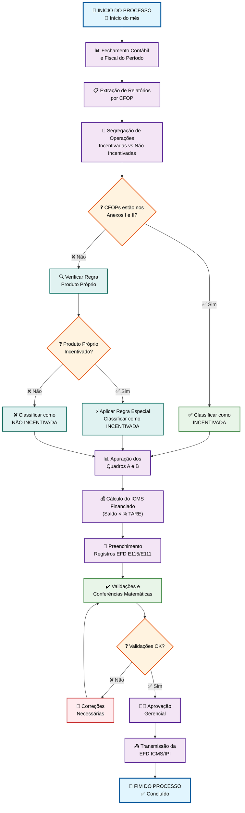
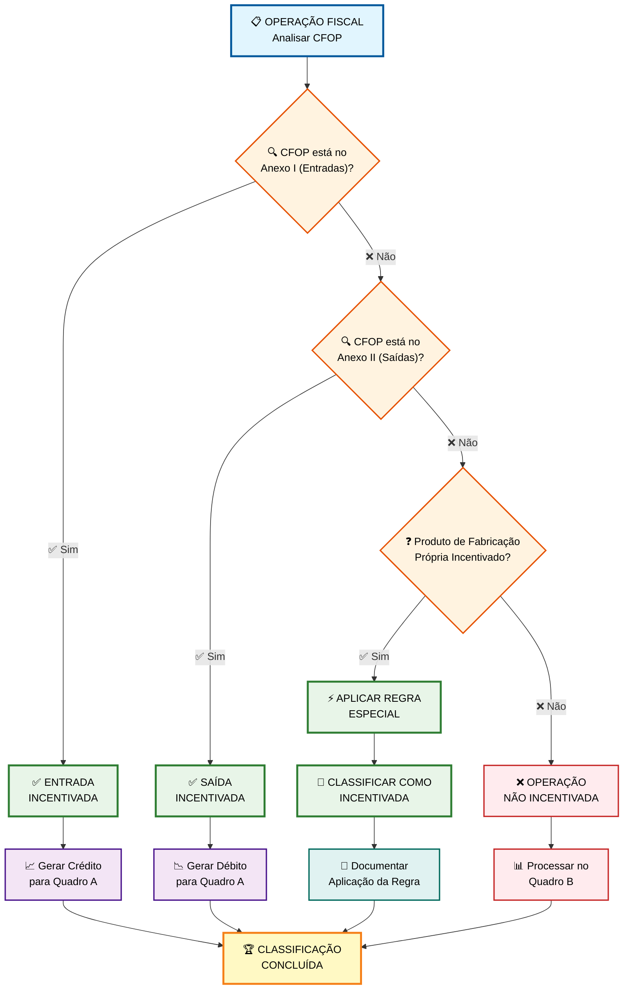
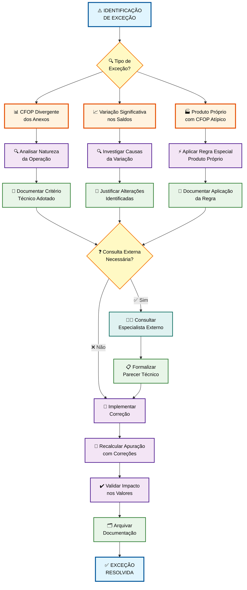
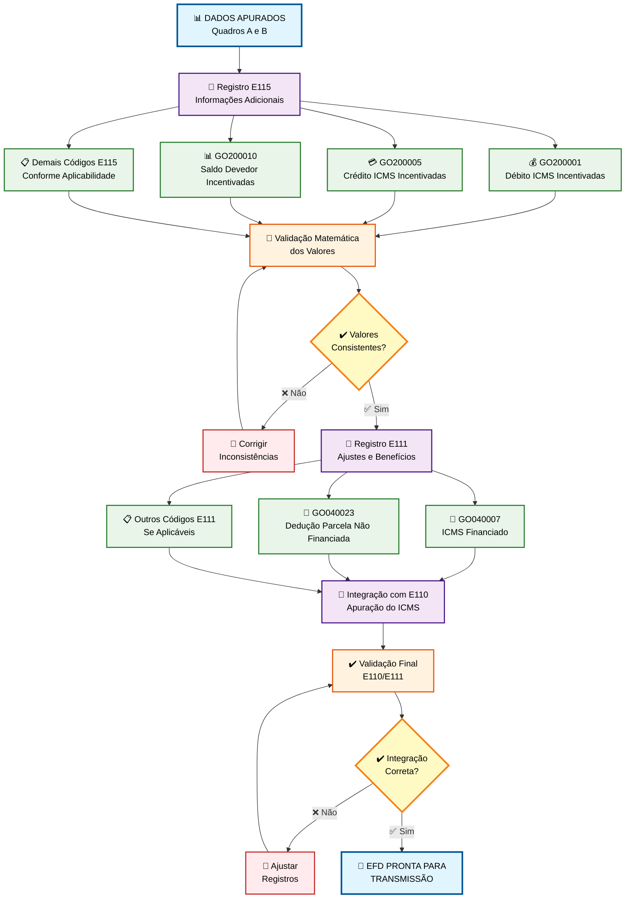
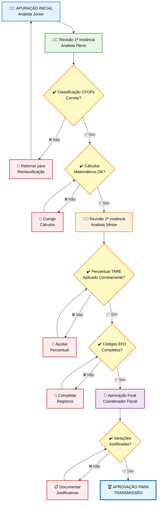

# PROCEDIMENTO OPERACIONAL PADRÃO

## APURAÇÃO DO ICMS - PROGRAMA FOMENTAR - VERSÃO 1.0

### SUMÁRIO

1. **OBJETIVO** ........................................................................... 3
2. **ALCANCE** ........................................................................... 3
3. **DEFINIÇÕES E CONCEITOS** .......................................................... 4
4. **BASE LEGAL** ........................................................................ 6
5. **ESTRUTURA TRIBUTÁRIA DO PROGRAMA FOMENTAR** .................................. 7
6. **METODOLOGIA DE APURAÇÃO MENSAL** ................................................ 10
7. **CONTROLES E VALIDAÇÕES** ......................................................... 15
8. **ASPECTOS OPERACIONAIS** .......................................................... 17
9. **FLUXOS DE APURAÇÃO** ............................................................. 19
10. **ASPECTOS CONTÁBEIS E FISCAIS** ................................................. 26
11. **DOCUMENTAÇÃO E ANEXOS** ........................................................ 28
12. **PERGUNTAS FREQUENTES** ......................................................... 32

---

## 1. OBJETIVO

Este Procedimento Operacional Padrão estabelece diretrizes técnicas detalhadas e obrigatórias para apuração mensal do ICMS por estabelecimentos industriais beneficiários do Programa de Desenvolvimento Industrial de Goiás - FOMENTAR. O documento visa assegurar conformidade fiscal integral, padronizar metodologias de apuração, garantir cumprimento rigoroso das obrigações tributárias estaduais e federais, e manter a elegibilidade aos benefícios fiscais concedidos através da aplicação sistemática da legislação vigente, controles internos robustos e validações técnicas especializadas.

## 2. ALCANCE

Este POP aplica-se obrigatoriamente a todos os estabelecimentos industriais beneficiários dos programas FOMENTAR, PRODUZIR e MICROPRODUZIR que possuam Termo de Acordo de Regime Especial (TARE) ativo e vigente no Estado de Goiás. O escopo operacional abrange integralmente desde a fase preparatória de classificação de operações por códigos fiscais (CFOPs) até a transmissão oficial da Escrituração Fiscal Digital (EFD ICMS/IPI), contemplando apuração mensal sistematizada, preenchimento de registros específicos obrigatórios, execução de validações técnicas especializadas, implementação de controles documentais rigorosos e manutenção de arquivos organizados para auditorias fiscais. O documento deve ser aplicado mensalmente por contribuintes obrigatórios à EFD ICMS/IPI, observando periodicidade regulamentar até o dia 25 de cada mês.

## 3. DEFINIÇÕES E CONCEITOS

### 3.1 Definições Operacionais

**Programa FOMENTAR:** Programa estratégico de Desenvolvimento Industrial de Goiás que concede financiamento fiscal de até 73% do ICMS devido sobre operações industriais qualificadas, mediante cumprimento sistemático de critérios socioeconômicos específicos, celebração formal de TARE com o Estado de Goiás e manutenção continuada de contrapartidas estabelecidas em indicadores de investimento, emprego e faturamento industrial.

**TARE (Termo de Acordo de Regime Especial):** Instrumento jurídico-fiscal que formaliza oficialmente a concessão dos benefícios tributários, estabelecendo percentuais específicos de financiamento autorizado, definindo obrigações acessórias diferenciadas, especificando critérios técnicos de manutenção dos incentivos e determinando metodologias de acompanhamento e controle das contrapartidas socioeconômicas exigidas.

**Operações Incentivadas:** Operações industriais especificamente abrangidas pelos benefícios fiscais do FOMENTAR, tecnicamente identificadas através de CFOPs específicos relacionados nos Anexos I e II da IN 1.501/21-GSE, incluindo sistematicamente compras destinadas à industrialização, vendas de produtos de fabricação própria, prestações de serviços industriais e transferências entre estabelecimentos para fins produtivos.

**Operações Não Incentivadas:** Totalidade das operações comerciais, prestações de serviços ou atividades econômicas não industriais que não se enquadram nos anexos normativos específicos, abrangendo vendas de mercadorias destinadas à revenda, operações com materiais residuais (sucatas), subprodutos industriais e prestações de serviços não diretamente relacionadas aos processos de industrialização incentivados.

### 3.2 Conceitos Técnicos

#### 3.2.1 Evolução Metodológica dos Critérios de Apuração

**Metodologia Anterior (vigente até 31/12/2022):** Sistema baseado em critério de proporcionalidade matemática fundamentado no valor total das saídas, onde se calculava proporcionalmente a relação percentual entre saídas incentivadas e saídas totais do estabelecimento para distribuição matemática dos créditos de ICMS entre operações incentivadas e não incentivadas.

**Metodologia Atual (vigente desde 01/01/2023):** Sistema técnico baseado exclusivamente na classificação direta por CFOPs específicos relacionados nos Anexos I, II e III da IN 1.501/21-GSE, eliminando completamente cálculos proporcionais e estabelecendo segregação operacional direta por natureza técnica da operação fiscal, conforme sua classificação nos anexos normativos oficiais.

#### 3.2.2 Terminologia Técnica Atualizada

| Termo Técnico Atual            | Termo Utilizado na EFD | Definição Operacional Específica                                                                                                                                      |
| ------------------------------ | ---------------------- | --------------------------------------------------------------------------------------------------------------------------------------------------------------------- |
| **Operações Incentivadas**     | Beneficiadas           | Operações industriais com CFOPs expressamente listados nos Anexos I e II, automaticamente sujeitas ao financiamento FOMENTAR conforme percentual estabelecido no TARE |
| **Operações Não Incentivadas** | Não Beneficiadas       | Operações comerciais ou de prestação de serviços fora do escopo industrial, tributadas integralmente sem aplicação de benefícios fiscais                              |
| **Parcela Financiada**         | ICMS Financiado        | Percentual específico do ICMS total devido sujeito ao financiamento fiscal conforme autorização expressa no TARE (limitado a 73% para FOMENTAR)                       |
| **Parcela Não Financiada**     | Não Incentivada        | Percentual complementar do ICMS devido que deve ser recolhido normalmente no prazo regulamentar, não sujeito ao diferimento fiscal                                    |

#### 3.2.3 Percentuais Máximos Autorizados por Programa

**FOMENTAR:** Financiamento fiscal de até 73% do ICMS devido sobre operações industriais incentivadas, aplicável especificamente a estabelecimentos industriais que demonstrem cumprimento sistemático dos requisitos técnicos de investimento produtivo, geração de empregos diretos e faturamento mínimo estabelecidos na legislação regulamentadora específica.

**PRODUZIR:** Financiamento fiscal de até 73% do ICMS devido, programa antecessor ao FOMENTAR com regras técnicas similares, mantendo aplicabilidade para estabelecimentos industriais já contemplados e que optaram pela manutenção do regime anterior conforme dispositivos de transição estabelecidos.

**MICROPRODUZIR:** Financiamento fiscal diferenciado de até 90% do ICMS devido, destinado especificamente a microempresas industriais que atendam a critérios específicos de enquadramento por porte, faturamento e número de empregados, com exigências de contrapartidas proporcionalmente ajustadas ao porte empresarial.

## 4. BASE LEGAL

### 4.1 Legislação Estadual Principal

**IN 885/07-GSF:** Instrução Normativa fundacional que estabeleceu os procedimentos técnicos iniciais de apuração para programas FOMENTAR/PRODUZIR, definindo metodologias básicas de segregação operacional e estabelecendo fórmulas de cálculo do ICMS financiado. Vigência iniciada em 01/01/2008, com aplicação continuada para aspectos não alterados por normas posteriores.

**IN 1.501/21-GSE:** Instrução Normativa que promoveu alteração estrutural fundamental nos critérios técnicos de apuração, introduzindo o sistema inovador de classificação por CFOPs específicos mediante anexos normativos e eliminando definitivamente o critério de proporcionalidade anteriormente utilizado. Vigência: 01/01/2023, representando o atual marco regulatório técnico para todos os beneficiários.

**IN 1.516/22-GSE:** Instrução Normativa complementar que implementou ajustes técnicos nos anexos de CFOPs aplicáveis, incluindo correções de códigos fiscais, atualizações de classificações operacionais e refinamentos para maior precisão técnica na segregação de operações incentivadas versus não incentivadas. Vigência: 01/07/2022.

**IN 1.524/22-GSE:** Instrução Normativa de consolidação que promoveu correções técnicas finais e atualizações complementares, harmonizando dispositivos normativos e esclarecendo aspectos práticos de aplicação através de exemplos técnicos e situações operacionais específicas. Vigência: 01/01/2023.

### 4.2 Legislação Federal Subsidiária

**Lei Complementar 87/96 (Lei Kandir):** Norma federal que estabelece princípios gerais sobre ICMS, aplicável subsidiariamente aos procedimentos estaduais de apuração e aos regimes especiais de incentivos fiscais, fornecendo fundamentos jurídicos para validação dos procedimentos estaduais específicos.

**Convênio ICMS 57/95:** Convênio nacional que disciplina tecnicamente a Escrituração Fiscal Digital e estabelece códigos padronizados, registros obrigatórios e metodologias de informação para contribuintes beneficiários de incentivos fiscais estaduais, garantindo uniformidade nacional na prestação de informações fiscais.

### 4.3 Normas Técnicas Complementares

**Guia Prático da EFD ICMS/IPI de Goiás:** Documento técnico oficial elaborado pela SEFAZ-GO que detalha especificamente preenchimento de registros, códigos aplicáveis ao Estado de Goiás, validações técnicas exigidas e exemplos práticos para contribuintes goianos beneficiários de programas de incentivos fiscais.

**Tabelas Oficiais de Códigos do SPED Fiscal - GO:** Compilação técnica atualizada periodicamente contendo códigos específicos do Estado de Goiás para registros E115 e E111, essenciais para escrituração fiscal digital correta e cumprimento integral das obrigações acessórias estaduais específicas.

## 5. ESTRUTURA TRIBUTÁRIA DO PROGRAMA FOMENTAR

### 5.1 Arquitetura Sistêmica do Modelo de Incentivos

#### 5.1.1 Fundamentos do Modelo de Financiamento

O sistema FOMENTAR opera tecnicamente através de **financiamento fiscal direto** onde parcela específica do ICMS devido é postergada temporariamente mediante cumprimento rigoroso de contrapartidas socioeconômicas quantificáveis. O modelo técnico não configura juridicamente isenção tributária ou redução de base de cálculo, mas sim diferimento controlado de pagamento com possibilidade de perdão definitivo condicionado ao cumprimento sistemático das metas estabelecidas formalmente no TARE celebrado.

#### 5.1.2 Metodologia de Segregação Operacional

**Operações Incentivadas - Entradas (Anexo I da IN 1.501/21-GSE):**

- Compras destinadas à industrialização ou produção rural (CFOP 1101/2101)
- Serviços de industrialização executados por terceiros (CFOP 1124/2124)
- Transferências internas para fins de industrialização (CFOP 1151/2151)
- Aquisição de energia elétrica para estabelecimento industrial (CFOP 1252/2252)
- Contratação de serviços de transporte para estabelecimento industrial (CFOP 1352/2352)
- Aquisições de bens destinados ao ativo imobilizado produtivo (CFOP 1551/2551)

**Operações Incentivadas - Saídas (Anexo II da IN 1.501/21-GSE):**

- Vendas de produtos de fabricação do próprio estabelecimento (CFOP 5101/6101)
- Prestação de serviços de industrialização para terceiros (CFOP 5124/6124)
- Transferências de produtos fabricados no estabelecimento (CFOP 5151/6151)
- Outras operações industriais expressamente relacionadas nos anexos normativos

#### 5.1.3 Regra Especial para Produtos de Fabricação Própria

**Princípio da Prevalência da Natureza Industrial:** Estabelece que operações envolvendo produtos de industrialização própria que sejam especificamente contemplados pelos benefícios do programa FOMENTAR devem ser obrigatoriamente classificadas como operações incentivadas, independentemente do CFOP utilizado na operação fiscal, prevalecendo a natureza industrial do produto sobre a classificação fiscal formal da transação comercial.

### 5.2 Mecânica Técnica de Apuração por Quadros

#### 5.2.1 Estrutura do Quadro A - Operações Incentivadas

**Componentes de Débito Fiscal:**

1. ICMS debitado em operações de saída incentivadas (vendas industriais, prestações de serviços produtivos)
2. ICMS incidente sobre saídas a título de bonificação de produtos incentivados
3. Outros débitos específicos relacionados exclusivamente a operações incentivadas
4. Valores de estorno de créditos relacionados a operações incentivadas (correções técnicas)

**Componentes de Crédito Fiscal:**
5. ICMS creditado em operações de entrada incentivadas (compras industriais, serviços de industrialização)
6. Outros créditos específicos aplicáveis exclusivamente a operações incentivadas
7. Valores de estorno de débitos relacionados a operações incentivadas (correções técnicas)
8. Saldo credor transportado do período anterior específico de operações incentivadas
9. Transferências excepcionais de crédito de operações não incentivadas (situações regulamentares específicas)

#### 5.2.2 Estrutura do Quadro B - Operações Não Incentivadas

Apresenta estrutura técnica similar ao Quadro A, contemplando sistematicamente operações de revenda comercial, prestações de serviços não industriais, vendas de materiais residuais (sucatas e subprodutos) e demais atividades econômicas não especificamente abrangidas pelos anexos normativos do programa de incentivos fiscais.

## 6. METODOLOGIA DE APURAÇÃO MENSAL

### 6.1 Procedimentos Preparatórios Obrigatórios

#### 6.1.1 Etapa de Fechamento e Organização

**Passo 1 - Fechamento Contábil Integral:** Conclusão rigorosa de todos os lançamentos contábeis do período, incluindo provisões técnicas necessárias, ajustes de competência, reclassificações contábeis obrigatórias e conciliações fiscais para perfeito alinhamento entre registros contábeis e informações fiscais que serão utilizadas na apuração.

**Passo 2 - Extração Sistemática de Dados:** Geração de relatórios fiscais analíticos detalhados organizados por CFOP específico, natureza operacional, base de cálculo discriminada e valores segregados de ICMS próprio e ICMS substituição tributária, extraídos diretamente dos sistemas integrados de gestão fiscal mediante procedimentos validados tecnicamente.

**Passo 3 - Compilação Documental:** Organização sistemática e integral de documentos fiscais (notas fiscais eletrônicas, conhecimentos de transporte, documentos de arrecadação) e demais evidências comprobatórias necessárias para fundamentação técnica robusta da apuração e eventual atendimento a procedimentos fiscalizatórios.

**Passo 4 - Análise Prévia Qualificada:** Revisão técnica preliminar dos dados compilados para identificação proativa de inconsistências operacionais, operações atípicas que demandem análise especial, variações significativas em relação a períodos anteriores ou valores que requeiram investigação técnica especializada antes do processamento final.

#### 6.1.2 Etapa de Classificação Técnica Especializada

**Passo 1 - Segregação de Entradas Incentivadas:** Consulta rigorosa e sistemática ao Anexo I da IN 1.501/21-GSE para verificação expressa se cada CFOP de entrada está formalmente listado, com separação técnica dos valores de ICMS creditado por categoria operacional específica e documentação detalhada de exceções identificadas para análise técnica posterior.

**Passo 2 - Segregação de Saídas Incentivadas:** Consulta rigorosa e sistemática ao Anexo II da IN 1.501/21-GSE para verificação expressa se cada CFOP de saída está formalmente listado, com aplicação obrigatória da regra especial para produtos de fabricação própria incentivados e separação técnica dos valores de ICMS debitado por categoria operacional específica.

**Passo 3 - Validação de Classificações:** Conferência técnica especializada da natureza industrial versus comercial de cada operação processada, validação rigorosa do enquadramento de produtos de fabricação própria nos benefícios concedidos, documentação formal dos critérios técnicos utilizados para classificação e registro sistemático de inconsistências identificadas para correção imediata.

### 6.2 Procedimentos de Cálculo Especializados

#### 6.2.1 Apuração Técnica do Quadro A - Operações Incentivadas

**Fórmula Matemática de Cálculo:**

```
Saldo Devedor Incentivado = Σ(Débitos: 1+2+3+4) - Σ(Créditos: 5+6+7+8+9)
```

**Detalhamento Técnico dos Componentes:**

**Débitos Fiscais Operacionais:**

- **Item 1:** Somatório integral do ICMS debitado em todas as operações de saída com CFOPs expressamente listados no Anexo II
- **Item 2:** ICMS incidente sobre bonificações, doações e operações similares envolvendo produtos incentivados
- **Item 3:** Ajustes específicos de débito (autuações fiscais, correções de períodos anteriores, ajustes técnicos)
- **Item 4:** Estornos de créditos utilizados indevidamente ou que necessitaram correção técnica posterior

**Créditos Fiscais Operacionais:**

- **Item 5:** Somatório integral do ICMS creditado em todas as operações de entrada com CFOPs expressamente listados no Anexo I
- **Item 6:** Ajustes específicos de crédito (restituições fiscais, correções de períodos anteriores, créditos especiais)
- **Item 7:** Estornos de débitos lançados incorretamente que necessitaram correção técnica
- **Item 8:** Saldo credor específico transportado do período anterior relacionado a operações incentivadas
- **Item 9:** Transferências excepcionais de créditos de operações não incentivadas (conforme situações regulamentares específicas)

#### 6.2.2 Cálculo do ICMS Sujeito a Financiamento

**Fórmula Técnica Principal:**

```
ICMS Financiado = Saldo Devedor Operações Incentivadas × Percentual Autorizado no TARE
```

**Exemplo Técnico Detalhado:**

- Saldo Devedor das Operações Incentivadas: R$ 35.000,00
- Percentual FOMENTAR conforme TARE vigente: 70%
- ICMS Financiado Calculado: R$ 35.000,00 × 70% = R$ 24.500,00
- ICMS a Recolher (parcela não financiada): R$ 35.000,00 - R$ 24.500,00 = R$ 10.500,00

### 6.3 Procedimentos de Validação Técnica

#### 6.3.1 Controles Matemáticos Rigorosos

**Validação Aritmética Integral:** Verificação sistemática da correção de todas as somas aritméticas por quadro de apuração, conferência matemática de todos os cálculos intermediários, validação da aplicação correta de percentuais e verificação da consistência matemática entre todos os quadros utilizados no processo de apuração mensal.

**Validação de Integridade Sistêmica:** Comparação analítica com períodos anteriores para identificação de variações significativas que demandem justificativa técnica, conferência sistemática com demonstrativos contábeis para verificação de alinhamento, validação de transferências excepcionais entre quadros e verificação rigorosa de limites e restrições estabelecidos por categoria operacional.

## 7. CONTROLES E VALIDAÇÕES

### 7.1 Controles Documentais

#### 7.1.1 Documentos Obrigatórios

**Demonstrativo Mensal de Apuração FOMENTAR:** Documento interno consolidado que registra sistematicamente todos os cálculos executados, segregações operacionais realizadas, validações técnicas aplicadas e serve como memória de cálculo integral e evidência documental de conformidade para procedimentos fiscalizatórios posteriores.

**Planilhas Analíticas de Segregação:** Detalhamento técnico operação por operação de todas as transações do período, com classificação individual fundamentada entre incentivadas e não incentivadas, valores discriminados de ICMS por categoria, CFOPs utilizados e justificativas técnicas para casos excepcionais ou duvidosos.

**Memória de Cálculo Detalhada:** Documentação técnica passo a passo de todos os procedimentos metodológicos adotados, fórmulas matemáticas utilizadas com demonstração, ajustes técnicos realizados com justificativas e validações aplicadas durante todo o processo de apuração mensal.

#### 7.1.2 Validações Documentais

**Conferência de Integridade de Dados:** Comparação sistemática entre livros fiscais digitais oficiais, relatórios extraídos do sistema ERP, informações declaradas na EFD ICMS/IPI, identificação proativa de divergências e implementação de correções técnicas antes da transmissão oficial.

**Verificação de Autenticidade Documental:** Validação rigorosa da origem técnica das informações fiscais utilizadas, conferência de assinaturas digitais válidas, verificação de integridade de arquivos digitais e estabelecimento de rastreabilidade completa dos dados utilizados na apuração.

**Completude e Consistência:** Implementação de checklist técnico verificando se todas as operações do período foram adequadamente classificadas, se todos os códigos obrigatórios foram informados corretamente e se não existem omissões ou inconsistências técnicas na apuração.

### 7.2 Controles Operacionais

#### 7.2.1 Checklist de Validação Mensal

**Validação de Classificação de CFOPs:**

- ✅ Todas as operações de entrada conferidas rigorosamente com Anexo I da IN 1.501/21-GSE
- ✅ Todas as operações de saída conferidas rigorosamente com Anexo II da IN 1.501/21-GSE
- ✅ Regra especial para produtos de fabricação própria aplicada corretamente em todos os casos
- ✅ Operações duvidosas ou atípicas analisadas tecnicamente e documentadas adequadamente

**Validação de Cálculos Matemáticos:**

- ✅ Saldos devedores por quadro de apuração matematicamente corretos e conferidos
- ✅ Percentual de financiamento conforme TARE aplicado rigorosamente sem exceções
- ✅ Transferências excepcionais entre quadros validadas tecnicamente e justificadas formalmente
- ✅ Total de deduções consistente matematicamente com benefícios efetivamente utilizados

**Validação de Registros EFD:**

- ✅ Todos os códigos E115 aplicáveis informados obrigatoriamente (incluindo valores zerados)
- ✅ Registros E111 matematicamente consistentes com deduções calculadas e aplicadas
- ✅ Integração E110/E111 matematicamente correta e validada sistemicamente
- ✅ Descrições complementares preenchidas adequadamente conforme orientações técnicas

#### 7.2.2 Controles de Qualidade

**Revisão por Segunda Pessoa Qualificada:** Todo processo de apuração deve ser obrigatoriamente revisado por profissional tecnicamente qualificado diferente daquele que elaborou os cálculos iniciais, com documentação formal da revisão executada e eventuais correções técnicas implementadas.

**Documentação Integral de Evidências:** Manutenção sistemática de arquivo organizado cronologicamente contendo demonstrativos elaborados, planilhas de apoio, memórias de cálculo e evidências documentais que fundamentem tecnicamente as informações prestadas na EFD ICMS/IPI.

**Organização Sistematizada de Arquivos:** Implementação de sistema de organização cronológica e temática de toda documentação fiscal, facilitando consultas técnicas posteriores, atendimento eficiente a fiscalizações e manutenção de rastreabilidade integral dos procedimentos adotados.

## 8. ASPECTOS OPERACIONAIS

### 8.1 Responsabilidades

#### 8.1.1 Responsabilidades por Função

**Analista Fiscal Júnior:**

- Execução da segregação inicial de operações por CFOP conforme anexos normativos oficiais
- Elaboração de planilhas analíticas detalhadas com classificação técnica operação por operação
- Compilação sistemática de dados dos sistemas fiscais e contábeis para processamento na apuração
- Preparação da documentação técnica básica para revisão por níveis hierárquicos superiores

**Analista Fiscal Pleno:**

- Revisão técnica e validação das segregações realizadas pelo nível júnior com correções necessárias
- Execução dos cálculos de apuração com aplicação rigorosa das fórmulas técnicas adequadas
- Preenchimento técnico dos registros E115 e E111 na EFD ICMS/IPI conforme orientações normativas
- Análise técnica de inconsistências identificadas e implementação de correções necessárias

**Analista Fiscal Sênior:**

- Revisão técnica final de toda apuração antes da transmissão oficial da EFD
- Análise crítica especializada de variações significativas em relação a períodos anteriores
- Validação técnica de aspectos complexos e tratamento de situações excepcionais identificadas
- Interface técnica com consultoria tributária externa em casos de dúvidas especializadas

**Coordenador Fiscal:**

- Aprovação executiva final da apuração mensal e autorização formal para transmissão
- Supervisão do cumprimento rigoroso de prazos regulamentares estabelecidos
- Acompanhamento sistemático de indicadores fiscais e tributários relevantes
- Condução de respostas a questionamentos de auditorias internas e externas

#### 8.1.2 Matriz de Responsabilidades

| Atividade                  | Júnior | Pleno | Sênior | Coordenador |
| -------------------------- | ------ | ----- | ------ | ----------- |
| Segregação de operações    | R      | A     | C      | I           |
| Cálculo de apuração        | I      | R     | A      | C           |
| Preenchimento EFD          | I      | R     | A      | C           |
| Revisão técnica final      | I      | C     | R      | A           |
| Aprovação para transmissão | I      | I     | C      | R           |

*R=Responsável, A=Aprovador, C=Consultado, I=Informado*

### 8.2 Prazos e Cronograma

#### 8.2.1 Prazos Regulamentares

**Prazo Legal para Entrega da EFD ICMS/IPI:** Até o dia 25 do mês subsequente ao período de apuração, conforme estabelecido expressamente na legislação estadual de Goiás, sem possibilidade de prorrogação automática.

**Prazo para Recolhimento do ICMS:** Até o dia 10 do mês subsequente, considerando exclusivamente a parcela não financiada após aplicação integral dos benefícios FOMENTAR autorizados no TARE.

**Prazo para Correções Técnicas:** Até 5 dias úteis após identificação de inconsistências técnicas, através de EFD retificadora quando tecnicamente necessário conforme orientações da SEFAZ-GO.

#### 8.2.2 Cronograma de Atividades

**Dias 1-15 do Mês Seguinte:**

- Fechamento contábil e fiscal integral do período anterior
- Extração de relatórios analíticos e compilação de dados operacionais
- Segregação técnica preliminar de operações por classificação fiscal

**Dias 16-20 do Mês Seguinte:**

- Execução da apuração com aplicação de metodologias e cálculos especializados
- Preenchimento técnico da EFD ICMS/IPI com registros obrigatórios
- Revisão técnica especializada e validações de consistência sistêmica

**Dias 21-23 do Mês Seguinte:**

- Revisão executiva final por supervisor e aprovação formal para transmissão
- Transmissão oficial da EFD ICMS/IPI para SEFAZ-GO
- Geração e arquivo de relatórios de protocolo e confirmação de recebimento

## 9. FLUXOS DE APURAÇÃO

### 9.1 Fluxo Principal de Apuração Mensal



### 9.2 Fluxo de Classificação de Operações



### 9.3 Fluxo de Validações e Controles

```mermaid
flowchart TD
    A["🚀 INÍCIO\nVALIDAÇÕES"] --> B["🔍 Conferir Segregação\npor CFOPs (Anexos I/II)"]
    B --> C{"✔️ CFOPs classificados\ncorretamente?"}
    C -->|"❌ Não"| D["🔧 Reclassificar\nOperações"]
    C -->|"✅ Sim"| E["🧮 Conferir Cálculos\nMatemáticos"]
    D --> E
    E --> F{"✔️ Somatórias e\ncálculos corretos?"}
    F -->|"❌ Não"| G["🔧 Recalcular Valores\ne Corrigir Erros"]
    F -->|"✅ Sim"| H["📋 Conferir Percentual\nTARE Aplicado"]
    G --> H
    H --> I{"✔️ Percentual TARE\nconforme autorizado?"}
    I -->|"❌ Não"| J["🔧 Ajustar Percentual\nConforme TARE"]
    I -->|"✅ Sim"| K["📝 Validar Códigos\nE115 e E111"]
    J --> K
    K --> L{"✔️ Códigos EFD\ncompletos?"}
    L -->|"❌ Não"| M["🔧 Completar\nRegistros"]
    L -->|"✅ Sim"| N["📄 Revisar\nDocumentação"]
    M --> N
    N --> O{"✔️ Documentação\ncompleta?"}
    O -->|"❌ Não"| P["📋 Complementar\nEvidências"]
    O -->|"✅ Sim"| Q["🏆 VALIDAÇÕES\nAPROVADAS"]
    P --> Q

    classDef startEnd fill:#e1f5fe,stroke:#01579b,stroke-width:3px,color:#000
    classDef process fill:#f3e5f5,stroke:#4a148c,stroke-width:2px,color:#000
    classDef decision fill:#fff3e0,stroke:#e65100,stroke-width:2px,color:#000
    classDef correction fill:#ffebee,stroke:#c62828,stroke-width:2px,color:#000
    classDef validation fill:#e8f5e8,stroke:#2e7d32,stroke-width:2px,color:#000
    classDef success fill:#fff9c4,stroke:#f57f17,stroke-width:3px,color:#000

    class A,Q startEnd
    class B,E,H,K,N process
    class C,F,I,L,O decision
    class D,G,J,M,P correction
    class Q success

```



### 9.4 Fluxo de Tratamento de Exceções



### 9.5 Cronograma Operacional Mensal

```mermaid
gantt
    title 📅 Cronograma Mensal - Apuração FOMENTAR
    dateFormat X
    axisFormat %d

    section 🏗️ Preparação
    Fechamento Contábil        :active, prep1, 0, 15
    Extração Relatórios        :prep2, 10, 15
    Segregação Preliminar      :prep3, 12, 15

    section 📊 Apuração
    Classificação CFOPs        :apur1, 16, 18
    Cálculo Quadros A/B        :apur2, 17, 19
    Preenchimento EFD          :apur3, 18, 20

    section ✅ Validação
    Conferências Matemáticas   :valid1, 19, 21
    Revisão Técnica           :valid2, 20, 22
    Aprovação Gerencial       :valid3, 21, 23

    section 📤 Transmissão
    Transmissão EFD           :trans1, 22, 25
    Protocolo SEFAZ           :milestone, 25, 25
```



### 9.6 Fluxo de Preenchimento EFD



### 9.7 Fluxo de Controle de Qualidade



## 10. ASPECTOS CONTÁBEIS E FISCAIS

### 10.1 Tratamento Contábil

#### 10.1.1 Reconhecimento do ICMS Financiado

**Lançamento do ICMS Total Devido:** Reconhecimento contábil integral do valor total do ICMS apurado como devido, independentemente do percentual sujeito a financiamento, mantendo transparência absoluta da obrigação tributária total e permitindo rastreabilidade completa dos valores para fins de auditoria e controle gerencial.

**Contabilização da Parcela Financiada:** Registro da parcela sujeita a financiamento como passivo de longo prazo específico, segregado contabilmente da parcela de recolhimento imediato, permitindo controle diferenciado e acompanhamento das condições de perdão estabelecidas no TARE celebrado com o Estado de Goiás.

**Tratamento da Parcela Não Financiada:** Reconhecimento da parcela não sujeita ao financiamento como passivo circulante de recolhimento obrigatório no prazo regulamentar, representando efetivamente a saída de caixa que ocorrerá no período e impactando diretamente o fluxo de caixa operacional da empresa.

#### 10.1.2 Realização dos Incentivos Fiscais

**Critério de Perdão Anual:** Os incentivos fiscais concedidos são considerados definitivamente realizados (perdoados) anualmente mediante comprovação formal e documentada do cumprimento integral das metas de investimento produtivo, geração de empregos diretos e manutenção de faturamento mínimo estabelecidas expressamente no TARE vigente.

**Baixa Contábil do Passivo:** Após confirmação oficial pela SEFAZ-GO do cumprimento das metas estabelecidas, a parcela correspondente ao incentivo fiscal é baixada definitivamente do passivo não circulante contra conta específica de resultado (receita de incentivos fiscais realizados), impactando positivamente o resultado do exercício.

### 10.2 Obrigações Fiscais

#### 10.2.1 Obrigações Principais

**EFD ICMS/IPI - Escrituração Fiscal Digital:** Entrega mensal obrigatória até o dia 25 do mês subsequente, com preenchimento rigoroso de registros E115 (informações adicionais específicas) e E111 (ajustes, benefícios e incentivos aplicados) relacionados especificamente ao programa FOMENTAR, conforme códigos e orientações técnicas estabelecidas pela SEFAZ-GO.

**DCTF - Declaração de Débitos e Créditos Tributários Federais:** Declaração mensal obrigatória informando detalhadamente o ICMS apurado e efetivamente recolhido, com segregação técnica entre parcelas próprias e substituição tributária, permitindo controle federal dos tributos estaduais arrecadados e financiados através de programas de incentivos fiscais.

#### 10.2.2 Obrigações Acessórias Específicas

**Relatório Anual de Atividades Desenvolvidas:** Demonstrativo detalhado e fundamentado das atividades industriais efetivamente desenvolvidas, investimentos produtivos realizados, empregos diretos gerados e demais indicadores quantitativos de contrapartida socioeconômica estabelecidos como condição para manutenção dos benefícios fiscais concedidos.

**Demonstrativo de Cumprimento de Metas:** Comprovação formal, documentada e auditável do atendimento integral aos requisitos e metas estabelecidas no TARE para garantia da manutenção dos benefícios fiscais e obtenção do perdão definitivo das parcelas financiadas em cada exercício fiscal.

## 11. DOCUMENTAÇÃO E ANEXOS

### 11.1 Modelos e Formulários

#### 11.1.1 Demonstrativo de Apuração Mensal

```
═══════════════════════════════════════════════════════════════════════════════
                     DEMONSTRATIVO DE APURAÇÃO MENSAL 
                         PROGRAMA FOMENTAR - GOIÁS
═══════════════════════════════════════════════════════════════════════════════

EMPRESA: _________________________________ CNPJ: _____________________
PERÍODO: ___/____    TARE Nº: ____________    PERCENTUAL: _____%

┌─────────────────────────────────────────────────────────────────────────────┐
│                    QUADRO A - OPERAÇÕES INCENTIVADAS                       │
├─────────────────────────────────────────────────────────────────────────────┤
│ 1. (+) Débito ICMS Operações Incentivadas (GO200001)......: R$ ____________│
│ 2. (+) Débito Saídas Bonificação Incentivadas (GO200002)..: R$ ____________│
│ 3. (+) Outros Débitos Operações Incentivadas (GO200003)...: R$ ____________│
│ 4. (+) Estorno Créditos Operações Incentivadas (GO200004).: R$ ____________│
│ 5. (-) Crédito ICMS Operações Incentivadas (GO200005).....: R$ ____________│
│ 6. (-) Outros Créditos Operações Incentivadas (GO200006)..: R$ ____________│
│ 7. (-) Estorno Débitos Operações Incentivadas (GO200007)..: R$ ____________│
│ 8. (-) Saldo Credor Anterior Operações Incentivadas (GO200008): R$ ________│
│ 9. (-) Crédito Operações Não Incentivadas (GO200009)......: R$ ____________│
│10. SALDO DEVEDOR OPERAÇÕES INCENTIVADAS (GO200010)........: R$ ____________│
└─────────────────────────────────────────────────────────────────────────────┘

┌─────────────────────────────────────────────────────────────────────────────┐
│                  QUADRO B - OPERAÇÕES NÃO INCENTIVADAS                     │
├─────────────────────────────────────────────────────────────────────────────┤
│11. SALDO DEVEDOR OPERAÇÕES NÃO INCENTIVADAS...............: R$ ____________│
└─────────────────────────────────────────────────────────────────────────────┘

┌─────────────────────────────────────────────────────────────────────────────┐
│                    QUADRO C - CÁLCULO DO ICMS FINANCIADO                   │
├─────────────────────────────────────────────────────────────────────────────┤
│12. Saldo Devedor Operações Incentivadas (item 10).........: R$ ____________│
│13. Percentual FOMENTAR conforme TARE.......................: ______%      │
│14. ICMS FINANCIADO (GO040007) [12 × 13]...................: R$ ____________│
│15. PARCELA NÃO FINANCIADA [12 - 14].......................: R$ ____________│
└─────────────────────────────────────────────────────────────────────────────┘

┌─────────────────────────────────────────────────────────────────────────────┐
│                        QUADRO D - ICMS A RECOLHER                          │
├─────────────────────────────────────────────────────────────────────────────┤
│16. Parcela Não Financiada Operações Incentivadas..........: R$ ____________│
│17. Saldo Devedor Operações Não Incentivadas...............: R$ ____________│
│18. (-) Deduções Diversas (GO040023).......................: R$ ____________│
│19. ICMS A RECOLHER [16 + 17 - 18].........................: R$ ____________│
└─────────────────────────────────────────────────────────────────────────────┘

Responsável Técnico: _________________________ Data: ___/___/____
Revisor Técnico: _____________________________ Data: ___/___/____
Aprovação Final: _____________________________ Data: ___/___/____
```

#### 11.1.2 Checklist de Validação Mensal

```
═══════════════════════════════════════════════════════════════════════════════
                        CHECKLIST DE APURAÇÃO FOMENTAR
                              PERÍODO: ___/____
═══════════════════════════════════════════════════════════════════════════════

┌─────────────────────────────────────────────────────────────────────────────┐
│                           VALIDAÇÕES DE CFOP                               │
├─────────────────────────────────────────────────────────────────────────────┤
│ ☐ Entradas conferidas com Anexo I da IN 1.501/21-GSE                      │
│ ☐ Saídas conferidas com Anexo II da IN 1.501/21-GSE                       │
│ ☐ Regra especial produtos próprios aplicada                               │
│ ☐ Operações duvidosas analisadas e documentadas                           │
└─────────────────────────────────────────────────────────────────────────────┘

┌─────────────────────────────────────────────────────────────────────────────┐
│                        VALIDAÇÕES MATEMÁTICAS                              │
├─────────────────────────────────────────────────────────────────────────────┤
│ ☐ Soma débitos Quadro A conferida                                         │
│ ☐ Soma créditos Quadro A conferida                                        │
│ ☐ Saldo devedor Quadro A correto                                          │
│ ☐ Cálculo ICMS financiado conferido                                       │
│ ☐ Percentual TARE aplicado corretamente                                   │
└─────────────────────────────────────────────────────────────────────────────┘

┌─────────────────────────────────────────────────────────────────────────────┐
│                           VALIDAÇÕES EFD                                   │
├─────────────────────────────────────────────────────────────────────────────┤
│ ☐ Registros E115 completos (incluindo zeros)                              │
│ ☐ Registros E111 consistentes                                             │
│ ☐ Integração E110 correta                                                 │
│ ☐ Descrições complementares adequadas                                     │
└─────────────────────────────────────────────────────────────────────────────┘

┌─────────────────────────────────────────────────────────────────────────────┐
│                           DOCUMENTAÇÃO                                     │
├─────────────────────────────────────────────────────────────────────────────┤
│ ☐ Demonstrativo preenchido e assinado                                     │
│ ☐ Planilhas de apoio arquivadas                                           │
│ ☐ Memória de cálculo elaborada                                            │
│ ☐ Evidências organizadas sistematicamente                                 │
└─────────────────────────────────────────────────────────────────────────────┘

Executado por: _________________________ Data: ___/___/____
Revisado por: __________________________ Data: ___/___/____
Aprovado por: __________________________ Data: ___/___/____
```

### 11.2 Tabelas de Referência

#### 11.2.1 Códigos E115 - Informações Adicionais

| Código   | Descrição Técnica                            | Obrigatório  | Observações Específicas                     |
| -------- | -------------------------------------------- | ------------ | ------------------------------------------- |
| GO200001 | Débito ICMS Operações Incentivadas           | Sempre       | Valor pode ser zero, mas código obrigatório |
| GO200002 | Débito Saídas Bonificação Incentivadas       | Sempre       | Informar zero se não houver movimento       |
| GO200003 | Outros Débitos Operações Incentivadas        | Sempre       | Ajustes e correções diversas                |
| GO200004 | Estorno Créditos Operações Incentivadas      | Sempre       | Correções técnicas de períodos anteriores   |
| GO200005 | Crédito ICMS Operações Incentivadas          | Sempre       | Valor pode ser zero, mas código obrigatório |
| GO200006 | Outros Créditos Operações Incentivadas       | Sempre       | Ajustes e créditos especiais                |
| GO200007 | Estorno Débitos Operações Incentivadas       | Sempre       | Correções técnicas de débitos               |
| GO200008 | Saldo Credor Anterior Operações Incentivadas | Sempre       | Transportado do período anterior            |
| GO200009 | Crédito Operações Não Incentivadas           | Se aplicável | Transferências excepcionais                 |
| GO200010 | Saldo Devedor Operações Incentivadas         | Calculado    | Resultado final da apuração                 |

#### 11.2.2 Códigos E111 - Deduções FOMENTAR

| Código   | Descrição Técnica                      | Aplicação Específica         | Base de Cálculo             |
| -------- | -------------------------------------- | ---------------------------- | --------------------------- |
| GO040007 | ICMS Financiado Operações Incentivadas | FOMENTAR/PRODUZIR            | Até 73% do saldo devedor    |
| GO040008 | ICMS Financiado - Contribuinte         | CENTROPRODUZIR               | Conforme percentual no TARE |
| GO040009 | ICMS Financiado - Não Contribuinte     | CENTROPRODUZIR               | Conforme percentual no TARE |
| GO040023 | Dedução Parcela Não Financiada         | Créditos diversos acumulados | Conforme disponibilidade    |

#### 11.2.3 CFOPs Principais - Operações Incentivadas

**ENTRADAS INCENTIVADAS (Anexo I):**

| CFOP      | Descrição Operacional               | Aplicação Técnica                            |
| --------- | ----------------------------------- | -------------------------------------------- |
| 1101/2101 | Compra para industrialização        | Principal CFOP para matérias-primas          |
| 1124/2124 | Industrialização por terceiros      | Terceirização de processos produtivos        |
| 1151/2151 | Transferência para industrialização | Movimentação entre filiais para produção     |
| 1252/2252 | Energia elétrica industrial         | Consumo energético do processo produtivo     |
| 1352/2352 | Transporte industrial               | Logística específica da atividade industrial |
| 1551/2551 | Imobilizado produtivo               | Investimentos em equipamentos industriais    |

**SAÍDAS INCENTIVADAS (Anexo II):**

| CFOP      | Descrição Operacional                | Aplicação Técnica                          |
| --------- | ------------------------------------ | ------------------------------------------ |
| 5101/6101 | Venda de produção do estabelecimento | Principal CFOP para vendas industriais     |
| 5124/6124 | Prestação de industrialização        | Serviços industriais prestados a terceiros |
| 5151/6151 | Transferência de produtos            | Movimentação de produtos entre filiais     |

## 12. PERGUNTAS FREQUENTES

### 12.1 Questões Técnicas

**Q: Como classificar operação com CFOP comercial mas envolvendo produto de fabricação própria incentivado pelo FOMENTAR?**

R: Deve-se aplicar obrigatoriamente a regra especial estabelecida na legislação estadual, classificando a operação como incentivada independentemente do CFOP utilizado, pois prevalece tecnicamente a natureza industrial do produto sobre a classificação fiscal formal da operação. É fundamental documentar formalmente o critério técnico adotado para eventual questionamento fiscalizatório, mantendo arquivo organizado com evidências da natureza industrial do produto e sua inclusão no programa de benefícios.

**Q: Operações de venda de sucatas e subprodutos industriais são consideradas incentivadas para fins do FOMENTAR?**

R: Não. Operações com sucatas e subprodutos não estão expressamente listadas nos Anexos I e II da IN 1.501/21-GSE, devendo ser obrigatoriamente classificadas como operações não incentivadas mesmo quando originadas de processo industrial contemplado pelo programa. O critério técnico atual é baseado exclusivamente na lista taxativa de CFOPs dos anexos normativos, não sendo aplicável interpretação extensiva ou analógica para inclusão de operações não expressamente previstas.

**Q: Como tratar transferências entre estabelecimentos com produtos incentivados pelo programa?**

R: Transferências de produtos de fabricação própria especificamente incentivados devem utilizar obrigatoriamente CFOPs 5151/6151 (saídas) e 1151/2151 (entradas), sendo classificadas como operações incentivadas quando os produtos transferidos forem efetivamente contemplados pelos benefícios do FOMENTAR. A operação deve ser documentada tecnicamente de forma adequada para evidenciar a natureza industrial dos produtos e sua elegibilidade aos incentivos fiscais concedidos.

### 12.2 Questões Operacionais

**Q: É possível utilizar créditos de operações não incentivadas para compensar ICMS de operações incentivadas?**

R: Sim, em situações técnicas específicas e expressamente previstas na legislação aplicável, é possível transferir créditos excedentes de operações não incentivadas para compensação com débitos de operações incentivadas, devendo ser informado obrigatoriamente no código GO200009 (item 9 do Quadro A). Esta operação excepcional deve ser cuidadosamente documentada com fundamentação técnica e justificativa legal adequada, mantendo rastreabilidade completa para auditorias posteriores.

**Q: Como proceder quando o saldo de operações incentivadas for credor ao final do período de apuração?**

R: Saldo credor em operações incentivadas deve ser obrigatoriamente transportado para o período seguinte através do código GO200008, não sendo tecnicamente passível de compensação com débitos de operações não incentivadas no mesmo período de apuração. O saldo permanece segregado mantendo sua natureza específica de operação incentivada para futuras utilizações, preservando a integridade do sistema de controle e a conformidade com as exigências normativas.

**Q: O que acontece se o percentual aplicado for superior ao estabelecido formalmente no TARE?**

R: A aplicação de percentual superior ao expressamente autorizado no TARE caracteriza irregularidade fiscal grave passível de autuação pela fiscalização estadual, com possível perda dos benefícios concedidos. O contribuinte deve utilizar exclusivamente o percentual formalmente autorizado no termo, sendo altamente recomendável revisão periódica dos percentuais vigentes e eventual solicitação de atualização do TARE junto à SEFAZ-GO se necessário para adequação às necessidades operacionais.

### 12.3 Questões Regulamentares

**Q: É obrigatório informar códigos E115 com valor zero na EFD ICMS/IPI?**

R: Sim, absolutamente obrigatório. Todos os códigos E115 relacionados tecnicamente ao programa FOMENTAR devem ser informados na EFD ICMS/IPI, mesmo quando o valor for zero, conforme orientações técnicas específicas da SEFAZ-GO. A omissão de códigos aplicáveis pode gerar inconsistências graves na validação sistêmica da escrituração e eventual questionamento fiscalizatório com aplicação de penalidades por informação incompleta ou incorreta.

**Q: Qual a diferença técnica entre os códigos GO040007 e GO040023 no registro E111?**

R: GO040007 refere-se especificamente ao ICMS financiado pelo programa FOMENTAR sobre operações incentivadas, calculado tecnicamente pela aplicação do percentual autorizado no TARE sobre o saldo devedor apurado. GO040023 destina-se exclusivamente à dedução de créditos diversos acumulados (como Vale-Moradia, Vale-Alimentação, créditos de programas sociais) que podem ser utilizados para abatimento da parcela não financiada, sendo códigos tecnicamente complementares na composição integral das deduções aplicáveis ao ICMS devido.

**Q: Como corrigir erro identificado após transmissão oficial da EFD ICMS/IPI?**

R: Erros identificados após transmissão devem ser corrigidos obrigatoriamente através de EFD retificadora, observando prazo técnico de até 5 dias úteis para situações simples e correções menores. Para correções complexas ou que impactem significativamente os valores apurados, é altamente recomendável consulta prévia à SEFAZ-GO ou consultoria tributária especializada antes da retificação para avaliação técnica da necessidade de procedimentos adicionais e eventual impacto em obrigações correlatas.

---

**EXEMPLO PRÁTICO DETALHADO:**

**Situação-Exemplo:**
Empresa industrial beneficiária FOMENTAR com TARE vigente autorizando 70% de financiamento fiscal

**Dados da Operação Mensal:**

- Débito ICMS operações incentivadas: R$ 50.000,00
- Crédito ICMS operações incentivadas: R$ 20.000,00  
- Saldo credor anterior (incentivadas): R$ 5.000,00
- Crédito Vale-Moradia acumulado: R$ 8.000,00
- **Saldo Devedor Operações Incentivadas:** R$ 25.000,00

**Aplicação do Procedimento:**

1. Segregação técnica por CFOPs conforme Anexos I e II
2. Apuração Quadro A: (50.000) - (20.000 + 5.000) = 25.000
3. Cálculo ICMS Financiado: 25.000 × 70% = 17.500
4. Parcela Não Financiada: 25.000 - 17.500 = 7.500
5. Dedução Créditos Diversos: 7.500 - 8.000 = 0 (utiliza apenas 7.500)

**Resultado Final:**

- **ICMS Financiado (GO040007):** R$ 17.500,00 (70% conforme TARE)
- **Dedução Crédito Diversos (GO040023):** R$ 7.500,00  
- **ICMS a Recolher Final:** R$ 0,00
- **Saldo Crédito Vale-Moradia Remanescente:** R$ 500,00 (para utilização no período seguinte)

---

## ANEXO A - DOCUMENTAÇÃO DO PROCESSO BPMN

### A.1 ESPECIFICAÇÃO PARA INTEGRAÇÃO COM ERPs

Este anexo estabelece os requisitos técnicos para documentação e modelagem BPMN do processo de apuração ICMS FOMENTAR, viabilizando integração com sistemas de gestão empresarial (ERPs) através de padrões compatíveis com Camunda Modeler e Bizagi Modeler.

### A.2 TEMPLATE DE DOCUMENTAÇÃO DO PROCESSO

#### A.2.1 Informações do Processo

**Nome:** APUR_ICMS_FOMENTAR  
**Título:** Apuração Mensal do ICMS - Programa FOMENTAR  
**Descrição:** Processo sistemático de apuração mensal do ICMS para estabelecimentos beneficiários do Programa FOMENTAR de Goiás, contemplando segregação de operações, cálculos de financiamento fiscal e preenchimento de obrigações acessórias  
**Categoria:** Fiscal/Tributário  
**Tipo de Processo:** Híbrido (Manual + Automático)  
**Formulário:** Demonstrativo de Apuração Mensal FOMENTAR  
**Versão BPMN:** 1.0  

#### A.2.2 Gestores do Processo

| Tipo             | Nome                      | Cargo                  | Responsabilidade                               |
| ---------------- | ------------------------- | ---------------------- | ---------------------------------------------- |
| Gestor Principal | [Nome do Coordenador]     | Coordenador Fiscal     | Supervisão geral e aprovação final da apuração |
| Gestor Técnico   | [Nome do Analista Sênior] | Analista Fiscal Sênior | Validação técnica e conformidade regulatória   |
| Aprovador        | [Nome do Gerente]         | Gerente Tributário     | Aprovação executiva e interface com auditoria  |

#### A.2.3 Papéis e Responsabilidades (Lanes/Pools)

**Analista Fiscal Júnior**  

- **Tipo:** Usuário
- **Responsável:** Equipe Fiscal Operacional
- **Atividades:** Fechamento contábil, extração de relatórios, segregação preliminar de operações

**Analista Fiscal Pleno**  

- **Tipo:** Usuário  
- **Responsável:** Equipe Fiscal Especializada
- **Atividades:** Apuração dos quadros, cálculos matemáticos, preenchimento da EFD

**Analista Fiscal Sênior**  

- **Tipo:** Usuário
- **Responsável:** Supervisão Técnica Fiscal
- **Atividades:** Revisão técnica, validações especializadas, tratamento de exceções

**Coordenador Fiscal**  

- **Tipo:** Usuário
- **Responsável:** Coordenação Tributária
- **Atividades:** Aprovação final, transmissão oficial, interface regulatória

**Sistema ERP**  

- **Tipo:** Sistema
- **Responsável:** Departamento de TI
- **Atividades:** Processamento automático de dados, validações sistêmicas, integrações

#### A.2.4 Atividades Detalhadas

##### A.2.4.1 Fechamento Contábil e Fiscal

**Tipo:** Manual/Usuário  
**Descrição:** Conclusão de todos os lançamentos contábeis do período, incluindo provisões, ajustes e conciliações fiscais necessárias  
**Responsável:** Analista Fiscal Júnior  
**Tempo Estimado:** 2-3 dias úteis  

**Campos/Dados de Entrada:**

| ID  | Nome                | Descrição                       | Tipo    | Obrigatório | Validação       |
| --- | ------------------- | ------------------------------- | ------- | ----------- | --------------- |
| 1   | periodo_competencia | Período da apuração (MM/AAAA)   | Data    | Sim         | Formato MM/AAAA |
| 2   | status_contabil     | Status do fechamento contábil   | Boolean | Sim         | true/false      |
| 3   | conciliacoes_ok     | Conciliações fiscais executadas | Boolean | Sim         | true/false      |

**Atividades de Entrada:** [Início do Processo]  
**Fluxos de Saída:**

| Nome                     | Condição                                           | Atividade Destino      |
| ------------------------ | -------------------------------------------------- | ---------------------- |
| Fechamento Concluído     | status_contabil = true AND conciliacoes_ok = true  | Extração de Relatórios |
| Pendências Identificadas | status_contabil = false OR conciliacoes_ok = false | Correção de Pendências |

##### A.2.4.2 Segregação de Operações por CFOP

**Tipo:** Manual/Usuário  
**Descrição:** Classificação técnica de operações entre incentivadas e não incentivadas conforme Anexos I e II da IN 1.501/21-GSE  
**Responsável:** Analista Fiscal Pleno  
**Tempo Estimado:** 1-2 dias úteis  

**Campos/Dados de Entrada:**

| ID  | Nome            | Descrição                     | Tipo     | Obrigatório | Validação      |
| --- | --------------- | ----------------------------- | -------- | ----------- | -------------- |
| 1   | cfop_entrada    | CFOP das operações de entrada | Texto    | Sim         | Lista Anexo I  |
| 2   | cfop_saida      | CFOP das operações de saída   | Texto    | Sim         | Lista Anexo II |
| 3   | produto_proprio | Indicador de produto próprio  | Boolean  | Sim         | true/false     |
| 4   | valor_icms      | Valor do ICMS da operação     | Numérico | Sim         | > 0            |

**Atividades de Entrada:** Extração de Relatórios  
**Fluxos de Saída:**

| Nome                     | Condição                                     | Atividade Destino             |
| ------------------------ | -------------------------------------------- | ----------------------------- |
| Classificação Normal     | CFOP em anexos normativos                    | Apuração dos Quadros          |
| Regra Especial           | produto_proprio = true AND CFOP não listado  | Aplicar Regra Produto Próprio |
| Operação Não Incentivada | CFOP não listado AND produto_proprio = false | Classificar Não Incentivada   |

##### A.2.4.3 Cálculo do ICMS Financiado

**Tipo:** Automático/Script  
**Descrição:** Cálculo automático do ICMS sujeito a financiamento mediante aplicação do percentual TARE sobre saldo devedor  
**Responsável:** Sistema ERP  
**Tempo Estimado:** Automático (segundos)  

**Campos/Dados de Entrada:**

| ID  | Nome                      | Descrição                            | Tipo     | Obrigatório | Validação          |
| --- | ------------------------- | ------------------------------------ | -------- | ----------- | ------------------ |
| 1   | saldo_devedor_incentivado | Saldo devedor operações incentivadas | Numérico | Sim         | >= 0               |
| 2   | percentual_tare           | Percentual autorizado no TARE        | Numérico | Sim         | 0-90%              |
| 3   | numero_tare               | Número do TARE vigente               | Texto    | Sim         | Formato específico |

**Atividades de Entrada:** Apuração dos Quadros  
**Fluxos de Saída:**

| Nome              | Condição                      | Atividade Destino |
| ----------------- | ----------------------------- | ----------------- |
| Cálculo Executado | saldo_devedor_incentivado > 0 | Preenchimento EFD |
| Saldo Zero        | saldo_devedor_incentivado = 0 | Validação Final   |

##### A.2.4.4 Validações e Controles

**Tipo:** Manual/Usuário  
**Descrição:** Execução de validações matemáticas, conferências de consistência e controles de qualidade obrigatórios  
**Responsável:** Analista Fiscal Sênior  
**Tempo Estimado:** 1 dia útil  

**Campos/Dados de Entrada:**

| ID  | Nome                | Descrição                               | Tipo     | Obrigatório | Validação  |
| --- | ------------------- | --------------------------------------- | -------- | ----------- | ---------- |
| 1   | checklist_validacao | Checklist de validações executadas      | Boolean  | Sim         | true/false |
| 2   | inconsistencias     | Número de inconsistências identificadas | Numérico | Sim         | >= 0       |
| 3   | aprovacao_tecnica   | Aprovação técnica da apuração           | Boolean  | Sim         | true/false |

**Atividades de Entrada:** Preenchimento EFD  
**Fluxos de Saída:**

| Nome                  | Condição                                           | Atividade Destino     |
| --------------------- | -------------------------------------------------- | --------------------- |
| Validações Aprovadas  | checklist_validacao = true AND inconsistencias = 0 | Aprovação Final       |
| Correções Necessárias | inconsistencias > 0                                | Implementar Correções |

### A.3 ESPECIFICAÇÕES TÉCNICAS PARA XML BPMN

#### A.3.1 Requisitos para Compatibilidade com Camunda Modeler

**Namespaces Obrigatórios:**

```xml
<definitions 
  xmlns="http://www.omg.org/spec/BPMN/20100524/MODEL"  
  xmlns:xsi="http://www.w3.org/2001/XMLSchema-instance"  
  xmlns:bpmndi="http://www.omg.org/spec/BPMN/20100524/DI"  
  xmlns:omgdc="http://www.omg.org/spec/DD/20100524/DC"  
  xmlns:omgdi="http://www.omg.org/spec/DD/20100524/DI"
  xmlns:camunda="http://camunda.org/schema/1.0/bpmn"
  targetNamespace="http://bpmn.io/schema/bpmn">
```

**Estrutura de Processo:**

```xml
<process id="APUR_ICMS_FOMENTAR" name="Apuração ICMS FOMENTAR" isExecutable="true">
  <!-- Elementos do processo -->
</process>
```

**Elementos Essenciais:**

- **StartEvent:** `<startEvent id="StartEvent_1" name="Início da Apuração">`
- **UserTask:** `<userTask id="Task_FechamentoContabil" name="Fechamento Contábil" camunda:assignee="${analista_junior}">`
- **ExclusiveGateway:** `<exclusiveGateway id="Gateway_ValidacaoCFOP" name="CFOP nos Anexos I/II?">`
- **SequenceFlow:** `<sequenceFlow id="Flow_1" sourceRef="StartEvent_1" targetRef="Task_FechamentoContabil">`
- **EndEvent:** `<endEvent id="EndEvent_1" name="Apuração Concluída">`

#### A.3.2 Requisitos para Compatibilidade com Bizagi Modeler

**Namespaces Padrão BPMN 2.0:**

```xml
<definitions 
  xmlns="http://www.omg.org/spec/BPMN/20100524/MODEL"  
  xmlns:xsi="http://www.w3.org/2001/XMLSchema-instance"  
  xmlns:bpmndi="http://www.omg.org/spec/BPMN/20100524/DI"  
  xmlns:omgdc="http://www.omg.org/spec/DD/20100524/DC"  
  xmlns:omgdi="http://www.omg.org/spec/DD/20100524/DI"
  xmlns:bizagi="http://www.bizagi.com/BPMN20"
  targetNamespace="http://bizagi.com/bpmn20">
```

**Documentação de Elementos:**

```xml
<userTask id="Task_SegregacaoOperacoes" name="Segregação de Operações">
  <documentation>Classificação técnica de operações entre incentivadas e não incentivadas conforme Anexos I e II da IN 1.501/21-GSE</documentation>
  <extensionElements>
    <bizagi:Form type="Form_Segregacao" name="Formulário de Segregação de CFOPs"/>
  </extensionElements>
</userTask>
```

### A.4 TEMPLATE XML COMPLETO - CAMUNDA

```xml
<?xml version="1.0" encoding="UTF-8"?>
<definitions xmlns="http://www.omg.org/spec/BPMN/20100524/MODEL" 
             xmlns:xsi="http://www.w3.org/2001/XMLSchema-instance" 
             xmlns:bpmndi="http://www.omg.org/spec/BPMN/20100524/DI" 
             xmlns:omgdc="http://www.omg.org/spec/DD/20100524/DC" 
             xmlns:omgdi="http://www.omg.org/spec/DD/20100524/DI"
             xmlns:camunda="http://camunda.org/schema/1.0/bpmn"
             targetNamespace="http://bpmn.io/schema/bpmn">

  <process id="APUR_ICMS_FOMENTAR" name="Apuração ICMS FOMENTAR" isExecutable="true">

    <!-- Evento de Início -->
    <startEvent id="StartEvent_1" name="Início da Apuração">
      <documentation>Início do processo mensal de apuração ICMS FOMENTAR</documentation>
      <outgoing>Flow_Start_FechamentoContabil</outgoing>
    </startEvent>

    <!-- Tarefa Manual de Fechamento -->
    <userTask id="Task_FechamentoContabil" name="Fechamento Contábil e Fiscal" camunda:assignee="${analista_junior}">
      <documentation>Conclusão de lançamentos contábeis e conciliações fiscais</documentation>
      <incoming>Flow_Start_FechamentoContabil</incoming>
      <outgoing>Flow_FechamentoContabil_ExtracaoRelatorios</outgoing>
    </userTask>

    <!-- Tarefa de Extração de Dados -->
    <userTask id="Task_ExtracaoRelatorios" name="Extração de Relatórios" camunda:assignee="${analista_junior}">
      <documentation>Geração de relatórios fiscais por CFOP</documentation>
      <incoming>Flow_FechamentoContabil_ExtracaoRelatorios</incoming>
      <outgoing>Flow_ExtracaoRelatorios_SegregacaoOperacoes</outgoing>
    </userTask>

    <!-- Tarefa de Segregação -->
    <userTask id="Task_SegregacaoOperacoes" name="Segregação de Operações" camunda:assignee="${analista_pleno}">
      <documentation>Classificação de operações incentivadas vs não incentivadas</documentation>
      <incoming>Flow_ExtracaoRelatorios_SegregacaoOperacoes</incoming>
      <outgoing>Flow_SegregacaoOperacoes_Gateway</outgoing>
    </userTask>

    <!-- Gateway de Decisão -->
    <exclusiveGateway id="Gateway_ValidacaoCFOP" name="CFOPs nos Anexos I/II?">
      <incoming>Flow_SegregacaoOperacoes_Gateway</incoming>
      <outgoing>Flow_Gateway_ApuracaoQuadros</outgoing>
      <outgoing>Flow_Gateway_RegraProdutoProprio</outgoing>
    </exclusiveGateway>

    <!-- Tarefa de Apuração -->
    <userTask id="Task_ApuracaoQuadros" name="Apuração dos Quadros A e B" camunda:assignee="${analista_pleno}">
      <documentation>Cálculo dos saldos devedores por categoria</documentation>
      <incoming>Flow_Gateway_ApuracaoQuadros</incoming>
      <incoming>Flow_RegraProdutoProprio_ApuracaoQuadros</incoming>
      <outgoing>Flow_ApuracaoQuadros_CalculoFinanciado</outgoing>
    </userTask>

    <!-- Tarefa Especial para Produto Próprio -->
    <userTask id="Task_RegraProdutoProprio" name="Aplicar Regra Produto Próprio" camunda:assignee="${analista_senior}">
      <documentation>Aplicação da regra especial para produtos próprios incentivados</documentation>
      <incoming>Flow_Gateway_RegraProdutoProprio</incoming>
      <outgoing>Flow_RegraProdutoProprio_ApuracaoQuadros</outgoing>
    </userTask>

    <!-- Tarefa Automática de Cálculo -->
    <serviceTask id="Task_CalculoFinanciado" name="Cálculo ICMS Financiado" camunda:delegateExpression="${calculoFinanciadoDelegate}">
      <documentation>Cálculo automático do ICMS sujeito a financiamento</documentation>
      <incoming>Flow_ApuracaoQuadros_CalculoFinanciado</incoming>
      <outgoing>Flow_CalculoFinanciado_PreenchimentoEFD</outgoing>
    </serviceTask>

    <!-- Tarefa de Preenchimento EFD -->
    <userTask id="Task_PreenchimentoEFD" name="Preenchimento EFD" camunda:assignee="${analista_pleno}">
      <documentation>Preenchimento dos registros E115 e E111 na EFD ICMS/IPI</documentation>
      <incoming>Flow_CalculoFinanciado_PreenchimentoEFD</incoming>
      <outgoing>Flow_PreenchimentoEFD_ValidacoesControles</outgoing>
    </userTask>

    <!-- Tarefa de Validação -->
    <userTask id="Task_ValidacoesControles" name="Validações e Controles" camunda:assignee="${analista_senior}">
      <documentation>Execução de validações matemáticas e controles de qualidade</documentation>
      <incoming>Flow_PreenchimentoEFD_ValidacoesControles</incoming>
      <outgoing>Flow_ValidacoesControles_Gateway2</outgoing>
    </userTask>

    <!-- Gateway de Validação -->
    <exclusiveGateway id="Gateway_ValidacoesOK" name="Validações OK?">
      <incoming>Flow_ValidacoesControles_Gateway2</incoming>
      <outgoing>Flow_Gateway2_AprovacaoFinal</outgoing>
      <outgoing>Flow_Gateway2_Correcoes</outgoing>
    </exclusiveGateway>

    <!-- Tarefa de Correções -->
    <userTask id="Task_Correcoes" name="Implementar Correções" camunda:assignee="${analista_pleno}">
      <documentation>Correção de inconsistências identificadas</documentation>
      <incoming>Flow_Gateway2_Correcoes</incoming>
      <outgoing>Flow_Correcoes_ValidacoesControles</outgoing>
    </userTask>

    <!-- Tarefa de Aprovação -->
    <userTask id="Task_AprovacaoFinal" name="Aprovação Final" camunda:assignee="${coordenador_fiscal}">
      <documentation>Aprovação executiva e transmissão da EFD</documentation>
      <incoming>Flow_Gateway2_AprovacaoFinal</incoming>
      <outgoing>Flow_AprovacaoFinal_TransmissaoEFD</outgoing>
    </userTask>

    <!-- Tarefa de Transmissão -->
    <serviceTask id="Task_TransmissaoEFD" name="Transmissão EFD" camunda:delegateExpression="${transmissaoEFDDelegate}">
      <documentation>Transmissão automática da EFD ICMS/IPI para SEFAZ-GO</documentation>
      <incoming>Flow_AprovacaoFinal_TransmissaoEFD</incoming>
      <outgoing>Flow_TransmissaoEFD_End</outgoing>
    </serviceTask>

    <!-- Evento de Fim -->
    <endEvent id="EndEvent_1" name="Apuração Concluída">
      <documentation>Processo de apuração ICMS FOMENTAR finalizado com sucesso</documentation>
      <incoming>Flow_TransmissaoEFD_End</incoming>
    </endEvent>

    <!-- Fluxos Sequenciais -->
    <sequenceFlow id="Flow_Start_FechamentoContabil" sourceRef="StartEvent_1" targetRef="Task_FechamentoContabil"/>
    <sequenceFlow id="Flow_FechamentoContabil_ExtracaoRelatorios" sourceRef="Task_FechamentoContabil" targetRef="Task_ExtracaoRelatorios"/>
    <sequenceFlow id="Flow_ExtracaoRelatorios_SegregacaoOperacoes" sourceRef="Task_ExtracaoRelatorios" targetRef="Task_SegregacaoOperacoes"/>
    <sequenceFlow id="Flow_SegregacaoOperacoes_Gateway" sourceRef="Task_SegregacaoOperacoes" targetRef="Gateway_ValidacaoCFOP"/>
    <sequenceFlow id="Flow_Gateway_ApuracaoQuadros" name="CFOP Listado" sourceRef="Gateway_ValidacaoCFOP" targetRef="Task_ApuracaoQuadros">
      <conditionExpression xsi:type="tFormalExpression">${cfop_listado == true}</conditionExpression>
    </sequenceFlow>
    <sequenceFlow id="Flow_Gateway_RegraProdutoProprio" name="Produto Próprio" sourceRef="Gateway_ValidacaoCFOP" targetRef="Task_RegraProdutoProprio">
      <conditionExpression xsi:type="tFormalExpression">${produto_proprio == true}</conditionExpression>
    </sequenceFlow>
    <sequenceFlow id="Flow_RegraProdutoProprio_ApuracaoQuadros" sourceRef="Task_RegraProdutoProprio" targetRef="Task_ApuracaoQuadros"/>
    <sequenceFlow id="Flow_ApuracaoQuadros_CalculoFinanciado" sourceRef="Task_ApuracaoQuadros" targetRef="Task_CalculoFinanciado"/>
    <sequenceFlow id="Flow_CalculoFinanciado_PreenchimentoEFD" sourceRef="Task_CalculoFinanciado" targetRef="Task_PreenchimentoEFD"/>
    <sequenceFlow id="Flow_PreenchimentoEFD_ValidacoesControles" sourceRef="Task_PreenchimentoEFD" targetRef="Task_ValidacoesControles"/>
    <sequenceFlow id="Flow_ValidacoesControles_Gateway2" sourceRef="Task_ValidacoesControles" targetRef="Gateway_ValidacoesOK"/>
    <sequenceFlow id="Flow_Gateway2_AprovacaoFinal" name="Validações OK" sourceRef="Gateway_ValidacoesOK" targetRef="Task_AprovacaoFinal">
      <conditionExpression xsi:type="tFormalExpression">${validacoes_ok == true}</conditionExpression>
    </sequenceFlow>
    <sequenceFlow id="Flow_Gateway2_Correcoes" name="Correções Necessárias" sourceRef="Gateway_ValidacoesOK" targetRef="Task_Correcoes">
      <conditionExpression xsi:type="tFormalExpression">${validacoes_ok == false}</conditionExpression>
    </sequenceFlow>
    <sequenceFlow id="Flow_Correcoes_ValidacoesControles" sourceRef="Task_Correcoes" targetRef="Task_ValidacoesControles"/>
    <sequenceFlow id="Flow_AprovacaoFinal_TransmissaoEFD" sourceRef="Task_AprovacaoFinal" targetRef="Task_TransmissaoEFD"/>
    <sequenceFlow id="Flow_TransmissaoEFD_End" sourceRef="Task_TransmissaoEFD" targetRef="EndEvent_1"/>

  </process>

  <!-- Informação de Diagramação BPMN -->
  <bpmndi:BPMNDiagram id="BPMNDiagram_1">
    <bpmndi:BPMNPlane id="BPMNPlane_1" bpmnElement="APUR_ICMS_FOMENTAR">
      <!-- Shapes e edges seriam definidos aqui conforme layout desejado -->
    </bpmndi:BPMNPlane>
  </bpmndi:BPMNDiagram>

</definitions>
```

### A.5 TEMPLATE XML COMPLETO - BIZAGI

```xml
<?xml version="1.0" encoding="UTF-8"?>
<definitions xmlns="http://www.omg.org/spec/BPMN/20100524/MODEL" 
             xmlns:xsi="http://www.w3.org/2001/XMLSchema-instance" 
             xmlns:bpmndi="http://www.omg.org/spec/BPMN/20100524/DI" 
             xmlns:omgdc="http://www.omg.org/spec/DD/20100524/DC" 
             xmlns:omgdi="http://www.omg.org/spec/DD/20100524/DI"
             xmlns:bizagi="http://www.bizagi.com/BPMN20"
             targetNamespace="http://bizagi.com/bpmn20">

  <collaboration id="Collaboration_FOMENTAR">
    <participant id="Participant_DepartamentoFiscal" name="Departamento Fiscal" processRef="APUR_ICMS_FOMENTAR"/>
  </collaboration>

  <process id="APUR_ICMS_FOMENTAR" name="Apuração ICMS FOMENTAR" isExecutable="true">

    <!-- Lanes por Responsável -->
    <laneSet id="LaneSet_1">
      <lane id="Lane_AnalistaJunior" name="Analista Fiscal Júnior">
        <flowNodeRef>StartEvent_1</flowNodeRef>
        <flowNodeRef>Task_FechamentoContabil</flowNodeRef>
        <flowNodeRef>Task_ExtracaoRelatorios</flowNodeRef>
      </lane>
      <lane id="Lane_AnalistaPleno" name="Analista Fiscal Pleno">
        <flowNodeRef>Task_SegregacaoOperacoes</flowNodeRef>
        <flowNodeRef>Task_ApuracaoQuadros</flowNodeRef>
        <flowNodeRef>Task_PreenchimentoEFD</flowNodeRef>
        <flowNodeRef>Task_Correcoes</flowNodeRef>
      </lane>
      <lane id="Lane_AnalistaSenior" name="Analista Fiscal Sênior">
        <flowNodeRef>Task_RegraProdutoProprio</flowNodeRef>
        <flowNodeRef>Task_ValidacoesControles</flowNodeRef>
        <flowNodeRef>Gateway_ValidacaoCFOP</flowNodeRef>
        <flowNodeRef>Gateway_ValidacoesOK</flowNodeRef>
      </lane>
      <lane id="Lane_Coordenador" name="Coordenador Fiscal">
        <flowNodeRef>Task_AprovacaoFinal</flowNodeRef>
        <flowNodeRef>Task_TransmissaoEFD</flowNodeRef>
        <flowNodeRef>EndEvent_1</flowNodeRef>
      </lane>
    </laneSet>

    <!-- Eventos e Tarefas (estrutura similar ao template Camunda) -->
    <!-- [Incluir todos os elementos conforme template anterior] -->

  </process>
</definitions>
```

### A.6 CHECKLIST DE VALIDAÇÃO XML

#### A.6.1 Validações Essenciais

- ✅ **Declaração XML:** `<?xml version="1.0" encoding="UTF-8"?>`
- ✅ **Namespaces:** Todos os namespaces obrigatórios declarados
- ✅ **IDs Únicos:** Todos os elementos possuem IDs únicos
- ✅ **Referências:** `sourceRef`, `targetRef`, `bpmnElement` consistentes
- ✅ **Processo:** Atributo `isExecutable="true"`
- ✅ **Fluxos:** Pelo menos um caminho completo de início ao fim
- ✅ **Diagramação:** Seção BPMNDI completa com shapes e edges

#### A.6.2 Validações Específicas por Ferramenta

**Camunda Modeler:**

- ✅ Namespace Camunda incluído se usando extensões
- ✅ Formulários definidos em `camunda:formData`
- ✅ Assignees definidos em `camunda:assignee`
- ✅ Service Tasks com `camunda:delegateExpression`

**Bizagi Modeler:**

- ✅ Collaboration e Participant definidos
- ✅ Lanes organizadas por responsabilidades
- ✅ Documentação em elementos principais
- ✅ Namespace Bizagi se usando formulários
- ✅ Conformidade com XSD BPMN 2.0

### A.7 GUIA DE IMPLEMENTAÇÃO EM ERPs

#### A.7.1 Passos para Integração

1. **Modelagem:** Criar o diagrama BPMN seguindo este template
2. **Documentação:** Preencher todas as seções do anexo A.2
3. **Exportação:** Gerar XML conforme templates A.4 ou A.5
4. **Validação:** Verificar conformidade usando checklist A.6
5. **Importação:** Importar no Camunda/Bizagi para validação
6. **Deploy:** Implementar no ERP seguindo procedimentos específicos

#### A.7.2 Considerações para Deploy em Produção

- **Testes:** Executar testes completos em ambiente de homologação
- **Permissões:** Configurar perfis de usuário conforme papéis definidos
- **Formulários:** Implementar interfaces de usuário para tarefas manuais
- **Monitoramento:** Configurar logs e métricas de desempenho
- **Backup:** Manter versionamento dos modelos BPMN
- **Auditoria:** Implementar trilha de auditoria para conformidade fiscal

### A.8 INTEGRAÇÃO COM SISTEMAS FISCAIS

#### A.8.1 Conectores Obrigatórios

**Conector EFD ICMS/IPI:**

- Integração com sistema gerador da EFD
- Preenchimento automático de registros E115/E111
- Validação de consistência antes da transmissão

**Conector SEFAZ-GO:**

- Transmissão automática da escrituração
- Recebimento de protocolos de confirmação
- Acompanhamento de processamento

**Conector Sistema Contábil:**

- Extração de dados contábeis e fiscais
- Conciliação automática de valores
- Geração de relatórios gerenciais

#### A.8.2 Variáveis de Processo

| Variável                  | Tipo     | Descrição                              | Exemplo       |
| ------------------------- | -------- | -------------------------------------- | ------------- |
| periodo_competencia       | Date     | Período da apuração                    | 2025-01       |
| percentual_tare           | Number   | Percentual autorizado TARE             | 70            |
| saldo_devedor_incentivado | Currency | Saldo calculado operações incentivadas | 25000.00      |
| icms_financiado           | Currency | Valor do ICMS financiado               | 17500.00      |
| status_transmissao        | String   | Status da transmissão EFD              | "TRANSMITIDO" |
| protocolo_sefaz           | String   | Protocolo recebimento SEFAZ            | "123456789"   |

---

**Data de Emissão:** Janeiro/2025
**Versão:** 1.0  
**Aprovação:** Coordenação Tributária

---

*Este documento deve ser obrigatoriamente revisado anualmente ou sempre que houver alteração na legislação do Programa FOMENTAR aplicável. Para dúvidas técnicas específicas, consulte a legislação vigente da Secretaria da Economia de Goiás ou procure orientação técnica especializada.*