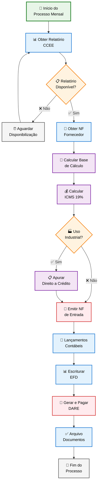
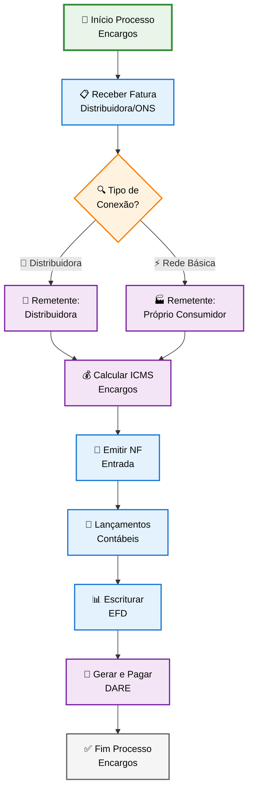
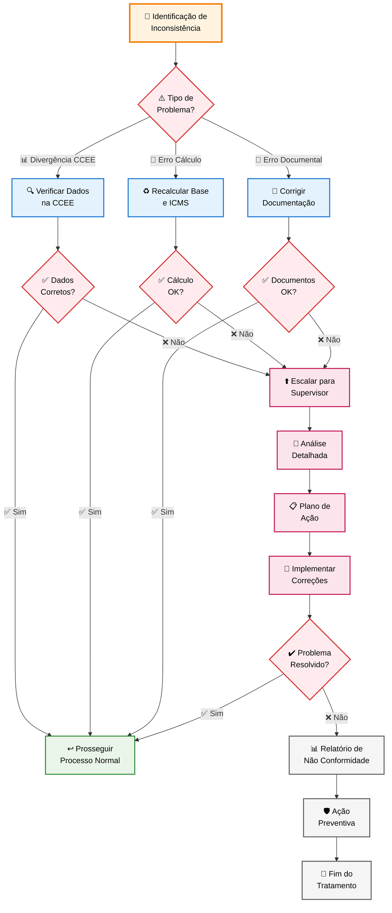

# PROCEDIMENTO OPERACIONAL PADRÃO

## CÁLCULO E REGISTRO DO ICMS-ST SOBRE ENERGIA ELÉTRICA ADQUIRIDA EM MERCADO LIVRE - GOIÁS - VERSÃO 1.0

### SUMÁRIO

1. **OBJETIVO** ........................................................................... 3
2. **ALCANCE** ........................................................................... 3
3. **DEFINIÇÕES E CONCEITOS** .......................................................... 3
4. **BASE LEGAL** ........................................................................ 4
5. **SISTEMÁTICA TRIBUTÁRIA E SUBSTITUIÇÃO TRIBUTÁRIA** ........................... 5
6. **PROCEDIMENTOS OPERACIONAIS** .................................................... 7
7. **CONTROLES E VALIDAÇÕES** ......................................................... 12
8. **RESPONSABILIDADES E PRAZOS** .................................................... 14
9. **FLUXOS OPERACIONAIS** ............................................................ 15
10. **ASPECTOS CONTÁBEIS E FISCAIS** ................................................. 17
11. **DOCUMENTAÇÃO E MODELOS** ........................................................ 20
12. **PERGUNTAS FREQUENTES** .......................................................... 21

---

# 1. OBJETIVO

Estabelecer procedimentos padronizados para o cálculo, registro contábil, fiscal e cumprimento das obrigações acessórias relacionadas ao ICMS-ST (Imposto sobre Circulação de Mercadorias e Serviços - Substituição Tributária) incidente sobre energia elétrica adquirida em Ambiente de Contratação Livre (ACL) por empresas estabelecidas no Estado de Goiás, assegurando conformidade com a legislação tributária estadual e otimização dos processos operacionais.

# 2. ALCANCE

Este procedimento aplica-se a todas as empresas estabelecidas em Goiás que:

- Sejam consumidoras livres de energia elétrica no ACL
- Estejam conectadas à rede de distribuição ou à rede básica de transmissão
- Realizem aquisições de energia elétrica por meio de contratos bilaterais
- Necessitem cumprir obrigações relacionadas aos encargos de transmissão, distribuição e conexão

**Exclusões:**

- Autoprodutores que não retiram energia da rede básica
- Transferências por rede interna própria (sem conexão ao SIN)
- Microgeração e minigeração distribuída (regime de compensação)

# 3. DEFINIÇÕES E CONCEITOS

## 3.1 Definições Operacionais

**Consumidor Livre:** Consumidor que tem direito de escolher seu fornecedor de energia elétrica e negociar livremente as condições comerciais, como preço, prazo e quantidade de energia.

**Ambiente de Contratação Livre (ACL):** Segmento do mercado no qual se realizam as operações de compra e venda de energia elétrica, objeto de contratos bilaterais livremente negociados.

**Substituição Tributária por Operação Anterior:** Sistemática na qual o consumidor final assume a posição de substituto tributário, sendo responsável pela apuração e recolhimento do ICMS incidente sobre toda a cadeia anterior da operação.

**CCEE:** Câmara de Comercialização de Energia Elétrica, entidade responsável pela liquidação do mercado de curto prazo.

## 3.2 Conceitos Técnicos

### 3.2.1 Base de Cálculo "Por Dentro"

O ICMS sobre energia elétrica integra sua própria base de cálculo, conforme art. 20, inciso I da Lei 11.651/91 (CTE-GO), sendo calculado pela fórmula:

**Base de Cálculo = Valor da NF do Fornecedor ÷ (1 - alíquota)**

### 3.2.2 Componentes Tributáveis

**Sujeitos ao ICMS:**

- Energia elétrica consumida (kWh)
- Demanda de potência efetivamente utilizada
- Encargos de transmissão, distribuição e conexão
- TUST (Tarifa de Uso do Sistema de Transmissão)
- TUSD (Tarifa de Uso do Sistema de Distribuição)
- Bandeiras tarifárias (quando aplicáveis)

**Não sujeitos ao ICMS:**

- Contribuições e taxas para órgãos reguladores (exceto TUST e TUSD)
- Multas contratuais
- Juros de mora
- Seguros não relacionados ao fornecimento

**Nota Importante:** A partir de 29/05/2024, conforme Nota Informativa 3/2024-ECONOMIA e acórdão do STJ no REsp 1692023/MT, TUST e TUSD devem obrigatoriamente compor a base de cálculo do ICMS.

# 4. BASE LEGAL

## 4.1 Legislação Federal

- **Lei Complementar nº 87/96 (Lei Kandir):** Regula o ICMS e estabelece direito a crédito para energia utilizada no processo industrial
- **Lei Complementar nº 194/2022:** Considera energia elétrica como bem essencial, limitando a alíquota
- **Convênio ICMS 77/2011:** Institui regime de substituição tributária para energia elétrica

## 4.2 Legislação Estadual

- **Lei nº 11.651/1991:** Código Tributário Estadual (CTE) de Goiás
- **Decreto nº 7.815/2013:** Regulamenta a substituição tributária nas operações com energia elétrica
- **RCTE - Anexo VIII, arts. 30-A ao 30-I:** Disposições específicas sobre energia elétrica no ACL
- **Decreto nº 4.852/1997:** Regulamento do Código Tributário Estadual

## 4.3 Normas e Regulamentações Específicas

- **Pareceres ECONOMIA/GEOT-15962:** Nº 09/2023, 62/2025, 109/2023, 136/2022
- **Súmula 391 do STJ:** ICMS incide apenas sobre demanda efetivamente utilizada
- **Resolução ANEEL:** Normas técnicas do setor elétrico

# 5. SISTEMÁTICA TRIBUTÁRIA E SUBSTITUIÇÃO TRIBUTÁRIA

## 5.1 Sujeição Passiva e Responsabilidade

### 5.1.1 Substituto Tributário (Art. 30-A do Anexo VIII do RCTE)

É substituto tributário o destinatário conectado:

**I -** À rede de distribuição operada por distribuidora goiana, que receber energia elétrica adquirida de terceiros;

**II -** Diretamente à Rede Básica de transmissão, que promover a entrada de energia elétrica no seu estabelecimento para consumo próprio.

### 5.1.2 Fato Gerador e Base de Cálculo

**Fato Gerador:** Consumo efetivo de energia elétrica e utilização dos sistemas de transmissão/distribuição.

**Base de Cálculo (§ 1º do Art. 30-A):** Valor da última operação, incluindo:

- Valor devido, cobrado ou pago pela energia elétrica
- Valores e encargos cobrados pelas empresas de distribuição/transmissão
- Quaisquer outros valores e encargos inerentes ao consumo

## 5.4 TUSD e TUST na Base de Cálculo

### 5.4.1 Mudança Jurisprudencial Importante

**Marco Legal:** Acórdão do Superior Tribunal de Justiça no Recurso Especial nº 1692023/MT
**Data de Vigência:** 29 de maio de 2024 (data da publicação da decisão)
**Normativa Local:** Nota Informativa nº 3/2024-ECONOMIA

### 5.4.2 Tarifas Incluídas na Base de Cálculo

**TUST (Tarifa de Uso do Sistema de Transmissão):** Valor cobrado pelo uso da rede básica de transmissão de energia elétrica.

**TUSD (Tarifa de Uso do Sistema de Distribuição):** Valor cobrado pelo uso do sistema de distribuição de energia elétrica.

**Impacto:** Ambas as tarifas devem ser incluídas na base de cálculo do ICMS, aumentando o valor do imposto devido sobre energia elétrica.

### 5.4.3 Obrigatoriedade do Recolhimento

Conforme Nota Informativa 3/2024-ECONOMIA, os contribuintes ficam obrigados a recolher o ICMS sobre TUSD e TUST independentemente de decisões judiciais anteriores em desacordo com o referido acórdão do STJ.

**Importante:** Esta alteração se aplica tanto ao mercado livre quanto ao mercado regulado de energia elétrica.

## 5.5 Alíquotas e Cálculo

### 5.5.1 Alíquotas Aplicáveis

**Alíquota Interna (a partir de abril/2024):** 19%
**Observação:** Não incide o adicional de 2% (PROTEGE) sobre energia elétrica desde junho/2022.

### 5.5.2 Metodologia de Cálculo

**Exemplo Prático:**

- Valor da NF do fornecedor (incluindo TUSD/TUST): R$ 10.000,00
- Alíquota: 19%
- Base de Cálculo = 10.000 ÷ 0,81 = **R$ 12.345,68**
- ICMS = 12.345,68 × 19% = **R$ 2.345,68**

## 5.3 Direito a Crédito

### 5.3.1 Energia para Processo Industrial

Empresas industriais têm direito ao crédito de ICMS sobre energia elétrica utilizada no processo produtivo, conforme:

- Lei Complementar 87/96 (Lei Kandir)
- Art. 522, II do RCTE-GO
- Art. 33, II, "b" da LC 87/96

### 5.3.2 Requisitos para Apropriação do Crédito

**Conforme Parecer GEOT 007/2018-SEFAZ/GO:**

**Não é obrigatório:**

- Medidor de energia elétrica exclusivo para o setor industrial
- Laudo técnico emitido por empresa especializada

**É necessário:**

- Cadastro industrial no CCE-GO (Cadastro de Contribuintes do Estado)
- Atividade preponderante efetivamente industrial
- Receitas do setor industrial preponderantes no faturamento da empresa

### 5.3.3 Mecanismo de Compensação

**Importante:** Para empresas com atividade preponderantemente industrial, conforme Parecer GEOT 007/2018, o crédito pode ser apropriado sobre 100% do ICMS-ST recolhido, desde que atendidos os requisitos de preponderância da atividade industrial.

**Procedimentos:**

1. **Recolhimento obrigatório:** ICMS-ST deve ser pago integralmente conforme sistemática específica
2. **Compensação:** Empresas industriais podem utilizar 100% do valor como crédito na apuração mensal normal, desde que comprovada a preponderância da atividade industrial

**Comprovação Opcional:** Embora não obrigatório, laudo técnico de engenheiro eletricista pode auxiliar na comprovação da destinação industrial da energia.

# 6. PROCEDIMENTOS OPERACIONAIS

## 6.1 Procedimentos para Energia Elétrica

### 6.1.1 Etapa Preparatória

**Passo 1:** Obter relatório de consumo mensal da CCEE
**Passo 2:** Conferir valor da nota fiscal do fornecedor de energia
**Passo 3:** Calcular base de cálculo incluindo ICMS "por dentro"
**Passo 4:** Apurar ICMS devido e direito a crédito (se aplicável)

### 6.1.2 Etapa de Execução - Emissão de NF-e de Entrada

**Prazo:** Até o último dia do mês de faturamento da energia

**Dados Obrigatórios:**

- **Remetente/Destinatário:** Dados do fornecedor da energia
- **NCM:** 27160000
- **Descrição:** "Energia Elétrica"
- **CFOP:** 1251 a 1257 (interno) / 2251 a 2257 (interestadual)
- **CST:** 00 (operação tributada integralmente)
- **Base de Cálculo:** Valor com ICMS "por dentro"
- **ICMS:** 19% sobre a base de cálculo

**ATENÇÃO:** Utilizar campos de ICMS e Base de Cálculo **NORMAL**, não os campos de Substituição Tributária.

### 6.1.3 Etapa de Finalização - Recolhimento

**Prazo:** Até o 20º dia do mês subsequente ao faturamento

**Procedimento DARE:**

- Código: 311 (ICMS Energia Elétrica Contratação Livre)
- Valor: 19% sobre a base de cálculo
- Campo "informações complementares": número da NF de entrada

## 6.2 Procedimentos para Encargos

### 6.2.1 Identificação dos Encargos

**Para consumidor conectado à distribuidora local:**

- Remetente: Dados da distribuidora
- Descrição: "Encargos de conexão e distribuição"

**Para consumidor conectado diretamente à Rede Básica:**

- Remetente: Dados do próprio consumidor
- Descrição: "Encargos de conexão e transmissão"

### 6.2.2 Emissão de NF-e de Encargos

**Prazo:** Até o último dia útil do 2º mês subsequente à operação

**Cálculo:** Mesma metodologia da energia elétrica

- Base de Cálculo = Valor dos Encargos ÷ 0,81
- ICMS = Base de Cálculo × 19%

### 6.2.3 Recolhimento dos Encargos

**Prazo:** Até o vigésimo dia útil do 2º mês subsequente à operação
**Código DARE:** 311

## 6.3 Casos Especiais

### 6.3.1 Mercado de Curto Prazo

**Consumo maior que contratado:**

- Emitir NF de entrada pelo consumo total
- Incluir energia adquirida no mercado spot

**Consumo menor que contratado:**

- Emitir NF apenas pela energia efetivamente consumida
- Liquidar excedente na CCEE ou ceder a terceiros

### 6.3.2 Microgeração e Minigeração

**Tratamento:** ICMS apenas sobre energia líquida consumida da rede
**Isenção:** Para energia injetada na rede (Art. 6º, CXLVIII do Anexo IX)

# 7. CONTROLES E VALIDAÇÕES

## 7.1 Controles Documentais

### 7.1.1 Documentos Obrigatórios

**Relatório CCEE:** Demonstrativo de consumo mensal e liquidação
**Nota Fiscal do Fornecedor:** Comprovação do valor da energia adquirida
**Fatura de Encargos:** Documento da distribuidora ou ONS
**Laudo Técnico:** Para comprovação de uso industrial (quando aplicável)

### 7.1.2 Validações Documentais

**Conferência de Dados:** Verificar consistência entre relatório CCEE e NF fornecedor
**Verificação de Autenticidade:** Validar documentos no site da CCEE/ANEEL
**Completude:** Checklist de todos os elementos obrigatórios
**Vencimentos:** Controle rigoroso de prazos para emissão e recolhimento

## 7.2 Controles Operacionais

### 7.2.1 Checklist de Validação

- ✅ Relatório CCEE conferido e validado
- ✅ Cálculo de base "por dentro" executado corretamente
- ✅ Alíquota de 19% aplicada
- ✅ Campos corretos preenchidos na NF-e (normal, não ST)
- ✅ Prazos de emissão e recolhimento respeitados
- ✅ Código DARE 311 utilizado
- ✅ Direito a crédito apurado (quando aplicável)
- ✅ EFD escriturada com códigos corretos

### 7.2.2 Controles de Qualidade

**Revisão por Segunda Pessoa:** Validação independente dos cálculos
**Documentação de Evidências:** Manter arquivo organizado dos documentos
**Backup de Dados:** Cópias de segurança de relatórios e cálculos
**Rastreabilidade:** Numeração sequencial e controle de versões

# 8. RESPONSABILIDADES E PRAZOS

## 8.1 Matriz de Responsabilidades

### 8.1.1 Responsabilidades por Função

**Analista Fiscal:**

- Obter e conferir relatórios da CCEE
- Calcular base de cálculo e ICMS devido
- Emitir notas fiscais de entrada
- Gerar e pagar DAREs

**Contador:**

- Efetuar lançamentos contábeis
- Escriturar EFD
- Apurar direito a crédito
- Manter arquivo organizado

**Coordenador Fiscal:**

- Supervisionar cálculos e procedimentos
- Validar lançamentos contábeis
- Assinar declarações
- Resolver questões complexas

### 8.1.2 Matriz RACI

| Atividade            | Analista Fiscal | Contador | Coordenador |
| -------------------- | --------------- | -------- | ----------- |
| Obter relatório CCEE | R               | I        | A           |
| Calcular ICMS        | R               | C        | A           |
| Emitir NF entrada    | R               | I        | A           |
| Lançar contabilmente | I               | R        | A           |
| Escriturar EFD       | C               | R        | A           |
| Pagar DARE           | R               | I        | A           |

*R=Responsável, A=Aprovador, C=Consultado, I=Informado*

## 8.2 Cronograma de Atividades

### 8.2.1 Prazos Críticos

**Energia Elétrica:**

- Emissão NF: até último dia do mês de faturamento
- Recolhimento: até 9º dia do mês subsequente

**Encargos:**

- Emissão NF: até último dia útil do 2º mês subsequente
- Recolhimento: até último dia útil do 2º mês subsequente

### 8.2.2 Cronograma Mensal Típico

**Dias 1-5:** Obtenção e conferência de relatórios
**Dias 6-15:** Cálculos e emissão de NF de energia
**Dias 16-20:** Lançamentos contábeis
**Dias 21-25:** Escrituração EFD
**Dias 26-31:** Emissão NF de encargos (quando aplicável)

# 9. FLUXOS OPERACIONAIS

## 9.1 Fluxo Principal - Energia Elétrica

### 9.1.1 Representação Gráfica em Mermaid



### 9.1.2 Fluxo de Encargos



## 9.2 Fluxo de Tratamento de Exceções

### 9.2.1 Identificação e Correção de Inconsistências



# 10. ASPECTOS CONTÁBEIS E FISCAIS

## 10.1 Tratamento Contábil

### 10.1.1 Aquisição da Energia Elétrica

**Lançamento na Compra:**

```
D - Energia Elétrica (Custo/Despesa)          R$ 10.000,00
D - ICMS a Recuperar                          R$  2.345,68
C - Fornecedores                              R$ 12.345,68
```

**Contas Envolvidas:**

- 6.1.1.01.001 - Energia Elétrica (Custo Industrial)
- 6.2.1.01.001 - Energia Elétrica (Despesa Administrativa)
- 1.1.2.05.001 - ICMS a Recuperar
- 2.1.1.01.001 - Fornecedores

### 10.1.2 Pagamento do DARE

**Lançamento no Recolhimento:**

```
D - ICMS ST a Recolher                        R$  2.345,68
C - Bancos                                    R$  2.345,68
```

### 10.1.3 Aproveitamento do Crédito (quando aplicável)

**Para Uso Industrial:**

```
D - ICMS a Compensar                          R$  1.876,54
C - ICMS a Recuperar                          R$  1.876,54
```

**Estorno do Uso Administrativo:**

```
D - Despesas com Energia Elétrica             R$    469,14
C - ICMS a Recuperar                          R$    469,14
```

## 10.2 Aspectos Fiscais

### 10.2.1 Escrituração na EFD

**Registro das NF do Fornecedor:**

- **CFOP:** 1949 (interno) / 2949 (interestadual)

**Registros Específicos:**

- **C197 - Energia:** Código GO71003006
- **C197 - Encargos:** Código GO71003005
- **E210:** Somatório dos débitos do C197
- **E250:** DAREs de arrecadação

### 10.2.2 Obrigações Acessórias

**EFD - Escrituração Fiscal Digital:**

- Prazo: até 15º dia do 2º mês subsequente
- Código de ajuste GO71003006 (energia)
- Código de ajuste GO71003005 (encargos)

**DIME - Declaração de Informações sobre Medidas de Energia:**

- Quando aplicável para grandes consumidores
- Prazo conforme cronograma ANEEL

# 11. DOCUMENTAÇÃO E MODELOS

## 11.1 Tabelas de Referência

### 11.1.1 Códigos e Classificações

| Elemento           | Código     | Descrição                        |
| ------------------ | ---------- | -------------------------------- |
| NCM                | 27160000   | Energia Elétrica                 |
| CST                | 00         | Operação tributada integralmente |
| CFOP Interno       | 1252/1257  | Compra energia elétrica          |
| CFOP Interestadual | 2252/2257  | Compra energia elétrica          |
| DARE               | 311        | ICMS Energia Elétrica            |
| EFD Energia        | GO71003006 | ST por operação anterior         |
| EFD Encargos       | GO71003005 | ST por operação anterior         |

### 11.1.2 Alíquotas e Percentuais

| Descrição          | Percentual | Observação                |
| ------------------ | ---------- | ------------------------- |
| Alíquota Interna   | 19%        | A partir de abril/2024    |
| PROTEGE            | 0%         | Não incide desde jun/2022 |
| Crédito Industrial | Variável   | Conforme laudo técnico    |

## 11.2 Modelos de Documentos

### 11.2.1 Checklist de Verificação

**☐** Relatório CCEE obtido e conferido
**☐** Valor da NF fornecedor confirmado
**☐** Base de cálculo "por dentro" calculada
**☐** ICMS de 19% apurado
**☐** Direito a crédito verificado (se industrial)
**☐** NF de entrada emitida corretamente
**☐** DARE gerado e pago no prazo
**☐** Lançamentos contábeis executados
**☐** EFD escriturada

### 11.2.2 Modelo de Laudo para Uso Industrial (Opcional)

**Elemento Facultativo:** Embora não obrigatório conforme Parecer GEOT 007/2018, laudo assinado por engenheiro eletricista registrado no CREA pode auxiliar na comprovação do uso industrial, especificando:

- Percentual de energia destinada ao processo produtivo
- Discriminação dos equipamentos industriais
- Metodologia de medição utilizada
- Período de validade do laudo

**Observação:** A ausência do laudo não impede o aproveitamento do crédito por empresas com atividade preponderantemente industrial cadastradas no CCE-GO.

# 12. PERGUNTAS FREQUENTES

## 12.1 Questões sobre Cálculo e Alíquotas

**Q: Qual a alíquota atual de ICMS sobre energia elétrica em Goiás?**

R: A alíquota interna é de 19% desde abril de 2024. O adicional de 2% (PROTEGE) não incide sobre energia elétrica desde junho de 2022.

**Q: Como calcular o ICMS "por dentro"?**

R: Base de Cálculo = Valor da NF ÷ (1 - alíquota). Exemplo: R\$ 10.000 ÷ 0,81 = R$ 12.345,68. ICMS = R\$ 12.345,68 × 19% = R$ 2.345,68.

**Q: A demanda contratada não utilizada está sujeita ao ICMS?**

R: Não. Conforme Súmula 391 do STJ, o ICMS incide apenas sobre a demanda efetivamente utilizada.

## 12.2 Questões sobre Emissão de Documentos

**Q: Qual CFOP usar na NF de entrada de energia elétrica?**

R: Para operações internas: 1251 a 1257. Para operações interestaduais: 2251 a 2257. Geralmente 1252 (interno) ou 2252 (interestadual) para compra por estabelecimento industrial.

**Q: Devo usar os campos de Substituição Tributária na NF?**

R: Não. Use os campos de ICMS e Base de Cálculo NORMAIS, pois a ST é por operação anterior e a NF é de entrada.

**Q: Qual o prazo para emitir a NF de energia elétrica?**

R: Até o último dia do mês de faturamento da energia pelo fornecedor.

## 12.3 Questões sobre Créditos e Encargos

**Q: Posso me creditar do ICMS da energia elétrica?**

R: Sim, se destinada ao processo industrial, conforme laudo técnico de engenheiro eletricista. Energia para uso administrativo não gera direito a crédito.

**Q: Como tratar os encargos de transmissão e distribuição?**

R: Emitir NF de entrada até o 2º mês subsequente, calcular ICMS pela mesma metodologia da energia, recolher no mesmo prazo da emissão.

**Q: E no caso de mercado de curto prazo da CCEE?**

R: Se consumir mais que o contratado, recolher ICMS sobre o consumo total. Se consumir menos, recolher apenas sobre o consumido.

---

**EXEMPLO PRÁTICO COMPLETO:**

**Situação-Exemplo:**
Empresa industrial goiana com atividade preponderantemente industrial, consumo de 1.000 MWh, valor da NF do fornecedor R$ 50.000,00 (incluindo TUSD/TUST), encargos de conexão R\$ 5.000,00.

**Dados da Operação:**

- **Consumo:** 1.000 MWh
- **NF Fornecedor (com TUSD/TUST):** R$ 50.000,00
- **Encargos de Conexão:** R$ 5.000,00
- **Atividade:** Preponderantemente industrial (conforme CCE-GO)

**ETAPA 1 - RECOLHIMENTO DO ICMS-ST (OBRIGATÓRIO):**

**Energia Elétrica:**

- Base de Cálculo = 50.000 ÷ 0,81 = R$ 61.728,40
- ICMS-ST a Recolher = 61.728,40 × 19% = **R$ 11.728,40**

**Encargos de Conexão:**

- Base de Cálculo = 5.000 ÷ 0,81 = R$ 6.172,84
- ICMS-ST a Recolher = 6.172,84 × 19% = **R$ 1.172,84**

**Total ICMS-ST a Recolher: R$ 12.901,24**

**ETAPA 2 - COMPENSAÇÃO NA APURAÇÃO NORMAL (EMPRESA PREPONDERANTEMENTE INDUSTRIAL):**

Conforme Parecer GEOT 007/2018, empresa com atividade preponderantemente industrial pode compensar 100% do ICMS-ST:

- **Crédito Integral Disponível: R$ 12.901,24**

**RESULTADO FINAL:**

- **ICMS-ST Recolhido (obrigatório):** R$ 12.901,24
- **Crédito para Compensação:** R$ 12.901,24
- **Custo Líquido para a Empresa:** R$ 0,00

**IMPORTANTE:** Mesmo com compensação integral, o recolhimento do ICMS-ST é obrigatório e deve ser feito em guia separada (código DARE 311). O crédito será utilizado na apuração mensal normal do ICMS.

---

**HISTÓRICO DE REVISÕES:**

| Versão | Data     | Responsável   | Alterações           |
| ------ | -------- | ------------- | -------------------- |
| 1.0    | Ago/2025 | Equipe Fiscal | Criação do documento |

---

## ANEXO A - DOCUMENTAÇÃO DO PROCESSO BPMN

### A.1 ESPECIFICAÇÃO OBRIGATÓRIA PARA INTEGRAÇÃO COM ERPs

**CARÁTER MANDATÓRIO:** Este anexo constitui elemento obrigatório e indispensável do Procedimento Operacional Padrão, estabelecendo requisitos técnicos específicos para documentação e modelagem BPMN do processo operacional.

### A.2 ESPECIFICAÇÃO DO PROCESSO

**Nome do Processo:** Cálculo e Registro ICMS-ST Energia Elétrica
**Objetivo:** Automatizar o fluxo de apuração e recolhimento de ICMS-ST
**Participantes:** Analista Fiscal, Contador, Coordenador Fiscal
**Sistemas Integrados:** ERP, SPED, CCEE, SEFAZ-GO

### A.3 ATIVIDADES E RESPONSABILIDADES

| Atividade            | Tipo         | Responsável     | Prazo          | Sistema |
| -------------------- | ------------ | --------------- | -------------- | ------- |
| Obter Relatório CCEE | User Task    | Analista Fiscal | Mensal         | CCEE    |
| Calcular ICMS        | Service Task | Sistema         | Automático     | ERP     |
| Emitir NF Entrada    | User Task    | Analista Fiscal | Até fim do mês | ERP     |
| Lançar Contabilmente | Service Task | Sistema         | Automático     | ERP     |
| Gerar DARE           | Service Task | Sistema         | Até 9º dia     | SEFAZ   |
| Escriturar EFD       | Service Task | Sistema         | Até 15º dia    | SPED    |

### A.4 TEMPLATE XML PARA CAMUNDA

```xml
<?xml version="1.0" encoding="UTF-8"?>
<definitions xmlns="http://www.omg.org/spec/BPMN/20100524/MODEL"
             xmlns:camunda="http://camunda.org/schema/1.0/bpmn"
             targetNamespace="http://empresa.com.br/icms-energia">

  <process id="icms-energia-livre" name="ICMS-ST Energia Elétrica" isExecutable="true">

    <startEvent id="inicio-mensal" name="Início Processo Mensal">
      <timerEventDefinition>
        <timeCycle>0 0 1 * * ?</timeCycle>
      </timerEventDefinition>
    </startEvent>

    <userTask id="obter-relatorio" name="Obter Relatório CCEE" 
              camunda:assignee="${analistaFiscal}">
      <documentation>Obter relatório mensal de consumo na CCEE</documentation>
    </userTask>

    <serviceTask id="calcular-icms" name="Calcular ICMS ST"
                 camunda:class="com.empresa.fiscal.CalculadorICMSEnergia">
      <documentation>Calcular base e ICMS automaticamente</documentation>
    </serviceTask>

    <userTask id="emitir-nf" name="Emitir NF Entrada"
              camunda:assignee="${analistaFiscal}">
      <documentation>Emitir nota fiscal de entrada</documentation>
    </userTask>

    <serviceTask id="lancar-contabil" name="Lançamentos Contábeis"
                 camunda:class="com.empresa.contabil.LancadorEnergia">
      <documentation>Executar lançamentos automáticos</documentation>
    </serviceTask>

    <serviceTask id="gerar-dare" name="Gerar DARE"
                 camunda:class="com.empresa.fiscal.GeradorDARE">
      <documentation>Gerar documento de arrecadação</documentation>
    </serviceTask>

    <endEvent id="processo-concluido" name="Processo Concluído"/>

    <!-- Sequence Flows -->
    <sequenceFlow id="seq1" sourceRef="inicio-mensal" targetRef="obter-relatorio"/>
    <sequenceFlow id="seq2" sourceRef="obter-relatorio" targetRef="calcular-icms"/>
    <sequenceFlow id="seq3" sourceRef="calcular-icms" targetRef="emitir-nf"/>
    <sequenceFlow id="seq4" sourceRef="emitir-nf" targetRef="lancar-contabil"/>
    <sequenceFlow id="seq5" sourceRef="lancar-contabil" targetRef="gerar-dare"/>
    <sequenceFlow id="seq6" sourceRef="gerar-dare" targetRef="processo-concluido"/>

  </process>

</definitions>
```

### A.5 TEMPLATE XML PARA BIZAGI

```xml
<?xml version="1.0" encoding="UTF-8"?>
<Package xmlns="http://www.wfmc.org/2009/XMLSchema" 
         Id="icms-energia-pkg" Name="ICMS-ST Energia">

  <WorkflowProcess Id="icms-energia-process" Name="Processo ICMS Energia">

    <Activities>
      <Activity Id="inicio" Name="Início">
        <Route/>
      </Activity>

      <Activity Id="obter-ccee" Name="Obter Dados CCEE">
        <Tool Id="form-ccee" Type="APPLICATION">
          <ActualParameters>
            <ActualParameter>mesReferencia</ActualParameter>
            <ActualParameter>consumoMWh</ActualParameter>
          </ActualParameters>
        </Tool>
      </Activity>

      <Activity Id="calc-icms" Name="Calcular ICMS">
        <Tool Id="calc-tool" Type="APPLICATION">
          <ActualParameters>
            <ActualParameter>baseCalculo</ActualParameter>
            <ActualParameter>icmsDevido</ActualParameter>
          </ActualParameters>
        </Tool>
      </Activity>

      <Activity Id="fim" Name="Processo Finalizado">
        <Route/>
      </Activity>

    </Activities>

    <Transitions>
      <Transition Id="t1" From="inicio" To="obter-ccee"/>
      <Transition Id="t2" From="obter-ccee" To="calc-icms"/>
      <Transition Id="t3" From="calc-icms" To="fim"/>
    </Transitions>

  </WorkflowProcess>

</Package>
```

---

**Data de Emissão:** Agosto/2025
**Versão:** 1.0
**Aprovação:** Coordenação Fiscal

---

*Este documento deve ser revisado anualmente ou sempre que houver alteração na legislação tributária aplicável.*