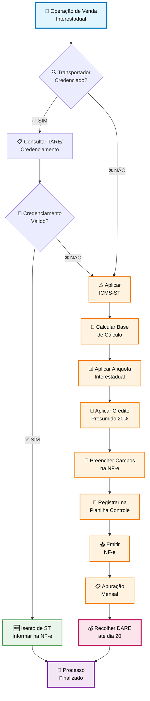
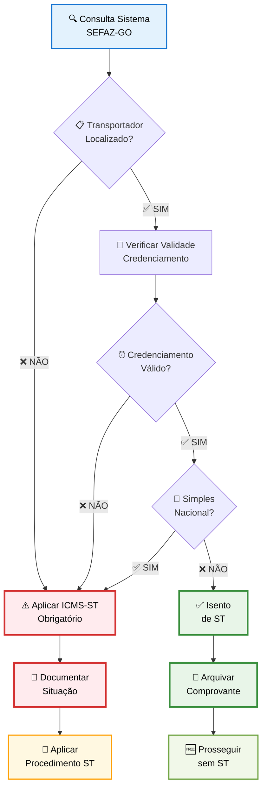
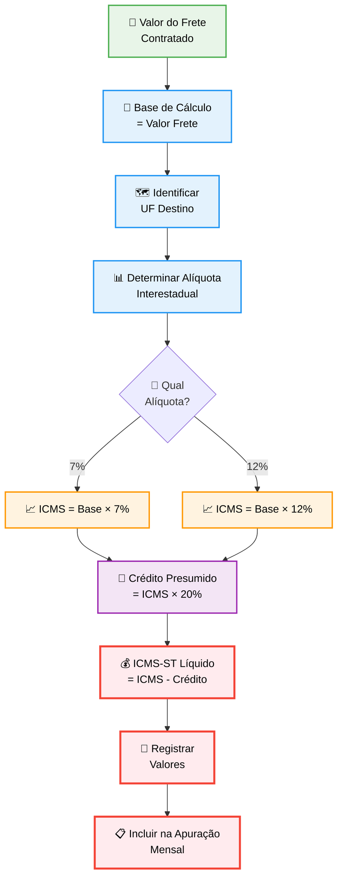
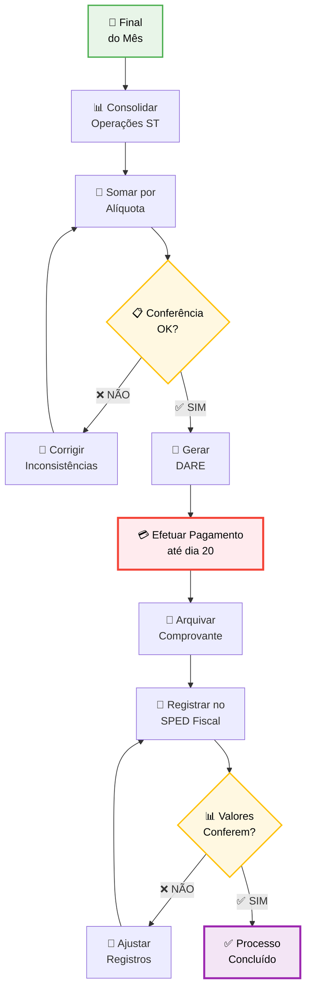

# PROCEDIMENTO OPERACIONAL PADRÃO

## ICMS-ST SOBRE FRETE - VERSÃO 1.0

### SUMÁRIO

1. **OBJETIVO** ........................................................................... 3
2. **ALCANCE** ........................................................................... 3
3. **DEFINIÇÕES E CONCEITOS** .......................................................... 3
4. **BASE LEGAL** ........................................................................ 4
5. **REQUISITOS PARA APLICAÇÃO DA SUBSTITUIÇÃO TRIBUTÁRIA** ........................ 5
6. **METODOLOGIA DE CÁLCULO E APURAÇÃO** .............................................. 6
7. **CONTROLES E VALIDAÇÕES** ......................................................... 8
8. **ASPECTOS OPERACIONAIS** .......................................................... 9
9. **FLUXOS E PROCESSOS** ............................................................. 10
10. **ASPECTOS CONTÁBEIS E FISCAIS** ................................................. 12
11. **DOCUMENTAÇÃO E MODELOS** ....................................................... 13
12. **PERGUNTAS FREQUENTES** ......................................................... 14

---

# 1. OBJETIVO

Este procedimento visa estabelecer metodologia padronizada para identificação, cálculo, apuração e recolhimento do ICMS por Substituição Tributária incidente sobre serviços de transporte de cargas, conforme regulamentação específica do Estado de Goiás. O documento objetiva assegurar conformidade tributária, minimizar riscos fiscais e garantir controle adequado dos procedimentos relacionados à retenção e recolhimento do imposto, proporcionando rastreabilidade completa das operações e uniformidade de procedimentos entre as unidades operacionais.

# 2. ALCANCE

Este procedimento aplica-se a todas as operações interestaduais de circulação de mercadorias sujeitas ao regime de substituição tributária do ICMS sobre frete, abrangendo especificamente as seguintes situações: operações realizadas por contribuintes estabelecidos no Estado de Goiás que contratem serviços de transporte com transportadores não credenciados ou sem Termo de Autorização para Regime Especial (TARE), operações com transportadores optantes pelo Simples Nacional, e operações onde não ocorra o pagamento antecipado do ICMS pelo transportador através de DARE próprio. Exclui-se do alcance deste procedimento as operações realizadas com transportadores possuidores de Termo de Credenciamento ou TARE válidos, bem como as operações onde comprovadamente ocorra o recolhimento antecipado pelo prestador do serviço.

# 3. DEFINIÇÕES E CONCEITOS

## 3.1 Definições Operacionais

**ICMS-ST:** Imposto sobre Circulação de Mercadorias e Serviços por Substituição Tributária, modalidade de tributação onde a responsabilidade pelo recolhimento do imposto é transferida para contribuinte diverso daquele que realiza o fato gerador.

**Substituição Tributária do Frete:** Regime especial onde o tomador do serviço de transporte assume a responsabilidade pelo cálculo, retenção e recolhimento do ICMS devido pela prestação do serviço.

**Termo de Credenciamento:** Documento expedido pela SEFAZ-GO que autoriza o transportador a realizar operações sem incidência da substituição tributária, mediante cumprimento de requisitos específicos estabelecidos pela administração tributária.

**TARE - Termo de Autorização para Regime Especial:** Documento que concede ao transportador tratamento diferenciado, dispensando a aplicação da substituição tributária em operações específicas.

**Crédito Presumido:** Benefício fiscal que permite a redução do valor do ICMS-ST devido, calculado como percentual sobre o montante do imposto apurado.

## 3.2 Conceitos Técnicos

### 3.2.1 Base de Cálculo do ICMS-ST

A base de cálculo do ICMS-ST sobre frete corresponde ao valor da prestação do serviço de transporte, incluindo todos os encargos e despesas acessórias cobradas do tomador do serviço, excluindo-se apenas os tributos destacados em documento fiscal próprio quando permitido pela legislação específica.

### 3.2.2 Momento de Incidência

A obrigação da substituição tributária surge no momento da saída da mercadoria do estabelecimento do remetente, independentemente do momento da contratação do serviço de transporte ou da emissão dos respectivos documentos fiscais.

# 4. BASE LEGAL

## 4.1 Legislação Estadual

- **Art. 17-A do Anexo VIII do RCTE-GO:** Estabelece as regras gerais para aplicação da substituição tributária sobre serviços de transporte no Estado de Goiás, definindo hipóteses de incidência, base de cálculo e responsáveis pelo recolhimento.

- **Instrução Normativa GSF nº 1.298/2016:** Regulamenta especificamente os procedimentos operacionais para aplicação da substituição tributária do ICMS sobre frete, detalhando aspectos práticos de cálculo, documentação e recolhimento.

- **Decreto nº 5.835/2003:** Institui o Programa LOGPRODUZIR e estabelece critérios para concessão de benefícios fiscais a empresas de transporte, incluindo a dispensa da substituição tributária para transportadores credenciados.

## 4.2 Legislação Federal

- **Lei Complementar nº 87/1996 (Lei Kandir):** Define princípios gerais do ICMS, incluindo as hipóteses de substituição tributária e responsabilidade solidária entre contribuintes.

- **Convênio ICMS nº 106/2017:** Estabelece procedimentos uniformes para operações interestaduais com substituição tributária, harmonizando critérios entre as unidades federativas.

## 4.3 Normas e Regulamentações Específicas

- **Resolução Normativa CR nº 249/2024:** Altera prazos de recolhimento do ICMS-ST, estabelecendo nova data limite para pagamento até o dia 20 do mês subsequente ao da ocorrência do fato gerador, aplicável a partir de janeiro de 2025.

# 5. REQUISITOS PARA APLICAÇÃO DA SUBSTITUIÇÃO TRIBUTÁRIA

## 5.1 Critérios de Incidência

### 5.1.1 Operações Sujeitas

A substituição tributária do ICMS sobre frete aplica-se obrigatoriamente às seguintes operações:

**Operações Interestaduais:** Todas as saídas de mercadorias com destino a outras unidades federativas, independentemente da natureza da operação ou do regime tributário do destinatário.

**Transportadores Não Credenciados:** Operações realizadas por transportadores que não possuam Termo de Credenciamento ou TARE válidos junto à SEFAZ-GO.

**Simples Nacional:** Operações com transportadores enquadrados no regime tributário do Simples Nacional, independentemente da existência de credenciamento.

### 5.1.2 Operações Excluídas

**Transportadores Credenciados:** Operações realizadas por transportadores portadores de Termo de Credenciamento válido, emitido pela SEFAZ-GO mediante cumprimento dos requisitos estabelecidos.

**TARE LOGPRODUZIR:** Transportadores beneficiários do Termo de Autorização para Regime Especial no âmbito do programa LOGPRODUZIR.

**Recolhimento Antecipado:** Situações onde o transportador efetue o recolhimento antecipado do ICMS através de DARE específico, devidamente comprovado.

## 5.2 Verificação de Credenciamento

### 5.2.1 Consulta Obrigatória

Antes da emissão de cada documento fiscal, deve ser realizada consulta ao sistema oficial da SEFAZ-GO para verificação da situação do transportador quanto ao credenciamento, utilizando o número de inscrição estadual ou CNPJ do prestador do serviço.

### 5.2.2 Documentação Comprobatória

A verificação deve ser documentada através de impressão de tela ou relatório do sistema oficial, mantendo-se arquivo organizado por período para eventual comprovação perante a fiscalização tributária.

# 6. METODOLOGIA DE CÁLCULO E APURAÇÃO

## 6.1 Procedimentos de Cálculo

### 6.1.1 Determinação da Base de Cálculo

**Passo 1:** Identificar o valor total da prestação do serviço de transporte conforme contratado com o transportador, incluindo todos os encargos acessórios.

**Passo 2:** Verificar a aplicabilidade de exclusões legais da base de cálculo, considerando especificamente os tributos destacados em documento fiscal próprio quando permitido pela legislação.

**Passo 3:** Confirmar a alíquota interestadual aplicável conforme a unidade federativa de destino da mercadoria transportada.

**Passo 4:** Calcular o ICMS-ST através da fórmula: ICMS-ST = Base de Cálculo × Alíquota Interestadual.

### 6.1.2 Aplicação do Crédito Presumido

**Passo 1:** Sobre o valor do ICMS-ST calculado, aplicar a redução correspondente ao crédito presumido de 20%, conforme estabelecido no art. 7º da IN GSF 1.298/2016.

**Passo 2:** Determinar o valor efetivo a recolher através da fórmula: ICMS-ST a Recolher = ICMS-ST Calculado × 0,80.

**Passo 3:** Registrar separadamente os valores brutos e líquidos para controle contábil e fiscal adequado.

## 6.2 Apuração Mensal

### 6.2.1 Consolidação das Operações

**Controle Individual:** Manter registro detalhado de cada operação sujeita à substituição tributária, contendo minimamente: número da NF-e, data da operação, valor do frete, base de cálculo, alíquota aplicada e valor do ICMS-ST.

**Apuração Consolidada:** Totalizar mensalmente todas as operações realizadas no período, segregando por alíquota interestadual para facilitar o controle e a conferência.

**Validação Cruzada:** Confrontar os valores apurados com os registros fiscais e contábeis para garantir consistência e completude das informações.

### 6.2.2 Planilha de Controle

Utilizar planilha padronizada contendo as seguintes colunas essenciais:

| Coluna            | Descrição                        | Formato    |
| ----------------- | -------------------------------- | ---------- |
| NF-e              | Número da nota fiscal de saída   | Numérico   |
| Data              | Data da operação                 | DD/MM/AAAA |
| Transportador     | Razão social e CNPJ              | Texto      |
| UF Destino        | Unidade federativa de destino    | Sigla      |
| Valor Frete       | Valor da prestação do serviço    | Monetário  |
| Alíquota          | Alíquota interestadual aplicável | Percentual |
| ICMS-ST Bruto     | Valor antes do crédito presumido | Monetário  |
| Crédito Presumido | Valor da redução (20%)           | Monetário  |
| ICMS-ST Líquido   | Valor efetivo a recolher         | Monetário  |

# 7. CONTROLES E VALIDAÇÕES

## 7.1 Controles Documentais

### 7.1.1 Documentos Obrigatórios

**Nota Fiscal Eletrônica:** Deve conter obrigatoriamente no campo de informações complementares a expressão "ICMS DO FRETE DE RESPONSABILIDADE DO REMETENTE", acompanhada dos dados específicos da operação.

**Comprovante de Consulta:** Impressão de tela ou relatório do sistema oficial da SEFAZ-GO comprovando a situação do transportador quanto ao credenciamento.

**Planilha de Controle:** Registro mensal detalhado de todas as operações sujeitas à substituição tributária, devidamente totalizada e conferida.

**DARE de Recolhimento:** Documento de arrecadação devidamente quitado dentro do prazo legal estabelecido.

### 7.1.2 Validações Documentais

**Conferência de Dados:** Verificar a correção e completude de todas as informações lançadas na nota fiscal eletrônica, especialmente os dados do transportador e valores de frete.

**Verificação de Autenticidade:** Confirmar a validade dos documentos de credenciamento apresentados pelos transportadores através de consulta aos sistemas oficiais.

**Completude das Informações:** Assegurar que todos os campos obrigatórios estejam preenchidos e que as informações complementares atendam aos requisitos legais específicos.

**Controle de Vencimentos:** Manter controle rigoroso dos prazos de credenciamento e TARE dos transportadores utilizados, evitando aplicação incorreta do regime de substituição tributária.

## 7.2 Controles Operacionais

### 7.2.1 Checklist de Validação

- ✅ Verificação da situação de credenciamento do transportador
- ✅ Confirmação da aplicabilidade da substituição tributária
- ✅ Cálculo correto do ICMS-ST com aplicação do crédito presumido
- ✅ Preenchimento adequado dos campos na NF-e
- ✅ Registro na planilha de controle mensal
- ✅ Arquivo da documentação comprobatória
- ✅ Validação cruzada com registros contábeis
- ✅ Conferência dos totalizadores mensais

### 7.2.2 Controles de Qualidade

**Revisão por Segunda Pessoa:** Implementar procedimento de revisão dupla para todas as operações de valor superior a R$ 10.000,00 ou quando solicitado pela gerência fiscal.

**Documentação de Evidências:** Manter arquivo físico ou eletrônico organizado por período, contendo todos os documentos e evidências relacionados à aplicação da substituição tributária.

**Arquivo Organizado:** Estabelecer critérios de organização que permitam recuperação rápida das informações para eventual consulta da fiscalização tributária.

**Backup de Dados:** Implementar rotina de backup das planilhas de controle e demais arquivos eletrônicos relacionados ao procedimento.

# 8. ASPECTOS OPERACIONAIS

## 8.1 Responsabilidades

### 8.1.1 Responsabilidades por Função

**Analista Fiscal:**

- Executar consultas diárias ao sistema de credenciamento de transportadores
- Calcular o ICMS-ST sobre as operações identificadas como sujeitas à substituição tributária
- Preencher adequadamente os campos da NF-e conforme exigências legais
- Manter atualizada a planilha de controle mensal

**Supervisor Fiscal:**

- Revisar cálculos de operações superiores a R$ 10.000,00
- Validar a apuração mensal consolidada antes do recolhimento
- Aprovar exceções e situações não previstas neste procedimento
- Supervisionar cumprimento dos prazos regulamentares

**Gerente Fiscal:**

- Aprovar alterações nos procedimentos estabelecidos
- Definir diretrizes para casos omissos ou duvidosos
- Acompanhar indicadores de performance do processo
- Responder por eventual autuação fiscal relacionada ao tema

### 8.1.2 Matriz de Responsabilidades

| Atividade               | Analista | Supervisor | Gerente |
| ----------------------- | -------- | ---------- | ------- |
| Consulta credenciamento | R        | I          | I       |
| Cálculo ICMS-ST         | R        | A          | I       |
| Preenchimento NF-e      | R        | C          | I       |
| Apuração mensal         | R        | A          | I       |
| Recolhimento DARE       | A        | R          | I       |
| Arquivo documentação    | R        | C          | I       |

*R=Responsável, A=Aprovador, C=Consultado, I=Informado*

## 8.2 Prazos e Cronogramas

### 8.2.1 Prazos Regulamentares

**Emissão da NF-e:** Conforme cronograma normal de expedição das mercadorias, observando que as informações da substituição tributária devem constar obrigatoriamente no documento fiscal.

**Apuração Mensal:** Até o 5º dia útil do mês subsequente ao da ocorrência dos fatos geradores, consolidando todas as operações realizadas no período anterior.

**Recolhimento do ICMS-ST:** Até o dia 20 do mês subsequente ao da ocorrência do fato gerador, conforme estabelecido pela Resolução Normativa CR nº 249/2024, aplicável a partir de janeiro de 2025.

### 8.2.2 Cronograma de Atividades

**Fase 1:** Dias 1 a 31 do mês - Identificação e registro das operações sujeitas à ST
**Fase 2:** Dias 1 a 5 do mês subsequente - Apuração consolidada e emissão de DARE
**Fase 3:** Até dia 20 do mês subsequente - Recolhimento efetivo do imposto devido

# 9. FLUXOS E PROCESSOS

## 9.1 Fluxo Principal de Substituição Tributária

### 9.1.1 Representação Gráfica em Mermaid

**ESPECIFICAÇÕES TÉCNICAS MANDATÓRIAS:** Aplicação rigorosa das diretrizes técnicas estabelecidas no modelo padrão, com utilização de aspas duplas para proteção de textos, quebras de linha técnicas via `\n`, e definição de classes após declaração de elementos.



### 9.1.2 Fluxo de Verificação de Credenciamento



## 9.2 Fluxo de Cálculo e Apuração

### 9.2.1 Processo de Cálculo do ICMS-ST



### 9.2.2 Processo de Apuração Mensal



# 10. ASPECTOS CONTÁBEIS E FISCAIS

## 10.1 Tratamento Contábil

### 10.1.1 Contabilização da Substituição Tributária

**Pela Retenção do ICMS-ST:** No momento da emissão da nota fiscal de saída com incidência da substituição tributária, deve ser registrado:

- **Débito:** Conta "ICMS-ST a Recolher" (Passivo Circulante)
- **Crédito:** Conta "ICMS-ST sobre Vendas" (Conta de Resultado)
- **Critério de Reconhecimento:** Regime de competência, no momento da saída da mercadoria

### 10.1.2 Contabilização do Recolhimento

**Pelo Pagamento do DARE:** No momento do efetivo recolhimento do imposto apurado:

- **Débito:** Conta "ICMS-ST a Recolher" (Passivo Circulante)
- **Crédito:** Conta "Bancos" ou "Caixa" (Ativo Circulante)
- **Critério de Reconhecimento:** Regime de caixa, na data do pagamento efetivo

## 10.2 Registros no SPED Fiscal EFD ICMS/IPI

### 10.2.1 Registro C100 - Documento Fiscal (NF-e de Saída)

**FUNDAMENTAL:** O registro C100 deve conter APENAS os dados da operação principal (venda das mercadorias), EXCLUINDO qualquer referência ao frete sujeito à substituição tributária.

**Campos Críticos:**

- **Campo 08 (VL_FRT):** Deve permanecer ZERADO quando há ICMS-ST sobre frete
- **Campo 09 (VL_SEG):** Valor do seguro, se aplicável
- **Campo 10 (VL_OUT_DA):** Outras despesas acessórias, exceto frete ST
- **Campo 11 (VL_BC_ICMS):** Base de cálculo do ICMS próprio (sem frete ST)
- **Campo 12 (VL_ICMS):** ICMS próprio da operação (sem ICMS-ST do frete)

### 10.2.2 Registro C170 - Itens do Documento Fiscal

**Preenchimento dos itens:** Registrar apenas os produtos/mercadorias vendidas, mantendo separação completa dos valores de frete sujeitos à ST.

**Campos Essenciais:**

- **Campo 07 (VL_ITEM):** Valor do item sem incluir frete
- **Campo 11 (VL_BC_ICMS):** Base de cálculo do ICMS do item
- **Campo 12 (ALIQ_ICMS):** Alíquota do ICMS aplicada ao item
- **Campo 13 (VL_ICMS):** ICMS incidente sobre o item

### 10.2.3 Registro C197 - Outras Obrigações Tributárias (ICMS-ST Frete)

**REGISTRO ESPECÍFICO OBRIGATÓRIO** para cada nota fiscal com ICMS-ST sobre frete:

**Estrutura do Registro C197:**

```
|C197|COD_AJ|DESCR_COMPL_AJ|VL_AJ|IND_AJ|
```

**Campo 02 - COD_AJ (Código de Ajuste):**

- **GO71101008:** Transportadora Pessoa Jurídica
- **GO71101001:** Transportador Autônomo
- **Outros códigos** conforme tabela específica da SEFAZ-GO

**Campo 03 - DESCR_COMPL_AJ (Descrição Complementar):**

```
ICMS-ST Frete - Substituição Tributária
NF-e: [Número da nota fiscal]
Transportador: [Razão Social - CNPJ]
Valor Frete: R$ [Valor do frete]
Base Cálculo: R$ [Base de cálculo ST]
ICMS Bruto: R$ [ICMS antes crédito presumido]
Crédito Presumido 20%: R$ [Valor do crédito]
UF Destino: [Sigla da UF]
```

**Campo 04 - VL_AJ (Valor do Ajuste):**
Valor do ICMS-ST JÁ LÍQUIDO (após aplicação do crédito presumido de 20%)

**Campo 05 - IND_AJ (Indicador de Ajuste):**

- **1:** Ajuste a débito (valor positivo)

### 10.2.4 Registro E200 - Identificação do Período de Apuração

**Campo 02 - UF (Unidade da Federação):** GO (Goiás)
**Campo 03 - DT_INI (Data Inicial):** Primeiro dia do mês de apuração (formato DDMMAAAA)
**Campo 04 - DT_FIN (Data Final):** Último dia do mês de apuração (formato DDMMAAAA)

### 10.2.5 Registro E210 - Apuração do ICMS

**CAMPOS FUNDAMENTAIS PARA ICMS-ST FRETE:**

**Campo 15 - VL_OUT_DEB (Outros Débitos):**
Somatório de TODOS os valores informados nos registros C197 do período. Este campo consolida o ICMS-ST sobre frete a recolher.

**Cálculo do Campo 15:**

```
VL_OUT_DEB = Σ (VL_AJ de todos os C197 do período)
```

**Campo 17 - VL_ICMS (Saldo Devedor do ICMS):**
Resultado da apuração do ICMS próprio + ICMS-ST do frete:

```
VL_ICMS = (VL_BC_ICMS × ALIQ_ICMS) - VL_ICMS_CRED + VL_OUT_DEB - VL_OUT_CRED
```

**Exemplo de Apuração E210:**

```
ICMS Próprio (operações normais): R$ 15.000,00
ICMS-ST Frete (consolidado C197): R$ 2.400,00
Total a Recolher: R$ 17.400,00
```

### 10.2.6 Registro E250 - Ajuste da Apuração do ICMS - Valores Declaratórios

**Utilização:** Para informações adicionais sobre o ICMS-ST do frete quando necessário.

**Campo 02 - COD_AJ:** Código de ajuste correspondente ao utilizado no C197
**Campo 03 - DESCR_COMPL_AJ:** Descrição complementar detalhada
**Campo 04 - VL_AJ:** Valor do ajuste (mesmo valor do C197)

### 10.2.7 Validações Críticas no SPED

**Consistência Matemática:**

```
Σ(C197.VL_AJ) = E210.VL_OUT_DEB
```

**Validação por Alíquota:**

- Operações com alíquota 7%: Estados do Norte/Nordeste/Centro-Oeste
- Operações com alíquota 12%: Estados do Sul/Sudeste + principais praças

**Exemplo Prático de Escrituração:**

**Operação:** Venda R$ 50.000,00 + Frete ST R\$ 3.000,00 para São Paulo

**Registro C100:**

```
|C100|0|1|12345|55|00|00001|000000123|0|0|0|45000.00|5400.00|50000.00|...
```

**Registro C197:**

```
|C197|GO71101008|ICMS-ST Frete - NF 123 - Transportes ABC|288.00|1|
```

**Registro E210:**

```
|E210|50000.00|45000.00|5400.00|0|0|0|0|0|0|0|0|0|0|288.00|0|5688.00|
```

## 10.3 Procedimentos no Sistema SAAM

### 10.3.1 Configuração Inicial no SAAM

**Rotina 1.6.1.11 - Criação do Código de Operação:**

**Passo 1:** Acessar Menu Principal → Cadastros → Operações Fiscais
**Passo 2:** Selecionar "Incluir Nova Operação"
**Passo 3:** Preencher dados obrigatórios:

```
Código: ST_FRETE_001
Descrição: ICMS-ST sobre Frete - Goiás
Tipo Operação: Substituição Tributária
CFOP: 9999 (código interno de controle)
CST/CSOSN: 090
Gera Débito: SIM
Aplica ST: SIM
```

**Passo 4:** Configurar Parâmetros Específicos:

```
Percentual Crédito: 20% (crédito presumido)
Código Ajuste SPED: GO71101008
Base Cálculo: Valor da Prestação
Alíquota: Conforme UF destino (7% ou 12%)
```

### 10.3.2 Rotina 1.5.1.10 - Preenchimento do Registro C197

**Acesso:** Menu SPED → EFD ICMS/IPI → Registros Especiais → C197

**Procedimento Detalhado:**

**Etapa 1 - Seleção da Nota Fiscal:**

- Localizar NF-e com ICMS-ST sobre frete
- Verificar se já possui registro C197 existente
- Confirmar dados da operação principal no C100/C170

**Etapa 2 - Inclusão do C197:**

```
Campo: Código Ajuste
Valor: GO71101008 (para PJ) ou GO71101001 (para autônomo)
Validação: Consultar tabela atualizada SEFAZ-GO

Campo: Descrição Complementar
Valor: Texto formatado conforme template pré-definido
Validação: Máximo 500 caracteres

Campo: Valor Ajuste
Valor: ICMS-ST líquido (com crédito presumido aplicado)
Validação: Valor > 0 e ≤ R$ 99.999.999,99
```

**Etapa 3 - Validação Automática:**

- Sistema executa críticas internas
- Verifica compatibilidade com registros C100/C170
- Confirma códigos de ajuste válidos
- Valida formatação e consistência de dados

### 10.3.3 Rotina 1.6.2.1.1 - Validação de Informações

**Funcionalidades da Validação:**

**Crítica 1 - Consistência de Valores:**

```SQL
SELECT SUM(VL_AJ) FROM SPED_C197 
WHERE PERIODO = '[MÊS/ANO]' AND COD_AJ LIKE 'GO711%'
```

**Crítica 2 - Duplicidade de Registros:**

```
Verificar se existem múltiplos C197 para mesma NF-e
Validar unicidade do par (NF-e, Código Ajuste)
```

**Crítica 3 - Completude de Dados:**

```
- Todos os campos obrigatórios preenchidos
- Códigos de ajuste válidos e atualizados
- Valores dentro dos limites estabelecidos
- Descrições complementares completas
```

### 10.3.4 Rotina 1.6.4.2 - Apuração Consolidada (Registros E200/E210/E250)

**Procedimento de Apuração:**

**Passo 1 - Geração do E200:**

```
Período: Automático (primeiro ao último dia do mês)
UF: GO (fixo para contribuintes de Goiás)
Status: Ativo
```

**Passo 2 - Consolidação E210:**

```
Operações Próprias:
- Soma valores C100/C170 (vendas normais)
- Calcula ICMS próprio da apuração

ICMS-ST Frete:
- Consolida todos os C197 do período
- Soma campo VL_AJ em VL_OUT_DEB (campo 15)
- Integra ao saldo final do ICMS
```

**Passo 3 - E250 (Se Necessário):**

```
Utilizar apenas para informações declaratórias
Detalhar ajustes complexos ou específicos
Manter consistência com C197 correspondente
```

### 10.3.5 Rotinas de Controle e Monitoramento

**Rotina 1.6.5.1 - Relatórios Gerenciais:**

**Relatório 1 - Consolidado ICMS-ST Frete:**

```
Período: Mensal
Dados: Valor por transportador, UF destino, alíquota
Totalização: Por código de ajuste e tipo de operação
```

**Relatório 2 - Análise de Crédito Presumido:**

```
ICMS-ST Bruto: R$ XXX.XXX,XX
Crédito Presumido (20%): R$ XXX.XXX,XX
ICMS-ST Líquido: R$ XXX.XXX,XX
Economia Tributária: R$ XXX.XXX,XX
```

**Rotina 1.6.6.1 - Backup e Histórico:**

```
Backup diário dos registros C197
Histórico de alterações e correções
Versionamento mensal das apurações
Arquivo de comprovantes DARE pagos
```

### 10.3.6 Integração com Outros Módulos SAAM

**Módulo Contas a Pagar:**

- Integração automática para provisão do ICMS-ST
- Geração de títulos a pagar com vencimento dia 20
- Controle de fluxo de caixa tributário

**Módulo Contabilidade:**

- Lançamentos automáticos conforme plano de contas
- Conciliação mensal das apurações fiscais
- Relatórios para auditoria externa

**Módulo Nota Fiscal:**

- Preenchimento automático campos complementares
- Validação de dados antes da transmissão
- Controle de contingência e rejeições

# 11. DOCUMENTAÇÃO E MODELOS

## 11.1 Modelo de Informações Complementares na NF-e

### 11.1.1 Campo Obrigatório

```
ICMS DO FRETE DE RESPONSABILIDADE DO REMETENTE
Valor da Prestação: R$ [VALOR_FRETE]
Base de Cálculo: R$ [BASE_CALCULO]
Alíquota: [ALIQUOTA]%
ICMS Devido: R$ [VALOR_ICMS_BRUTO]
ICMS com Crédito Presumido (20%): R$ [VALOR_ICMS_LIQUIDO]
Transportador: [RAZAO_SOCIAL] - CNPJ: [CNPJ]
Veículo: [PLACA] - UF: [UF_VEICULO]
```

### 11.1.2 Exemplo Prático

```
ICMS DO FRETE DE RESPONSABILIDADE DO REMETENTE
Valor da Prestação: R$ 2.500,00
Base de Cálculo: R$ 2.500,00
Alíquota: 12%
ICMS Devido: R$ 300,00
ICMS com Crédito Presumido (20%): R$ 240,00
Transportador: TRANSPORTES ABC LTDA - CNPJ: 12.345.678/0001-90
Veículo: ABC-1234 - UF: GO
```

## 11.2 Planilha de Controle Mensal

### 11.2.1 Estrutura da Planilha

| NF-e  | Data     | Transportador | CNPJ               | UF  | Valor Frete | Alíquota | ICMS Bruto | Créd.Pres. | ICMS Líquido |
| ----- | -------- | ------------- | ------------------ | --- | ----------- | -------- | ---------- | ---------- | ------------ |
| 12345 | 01/01/24 | ABC Transp.   | 12.345.678/0001-90 | SP  | 1.500,00    | 12%      | 180,00     | 36,00      | 144,00       |
| 12346 | 02/01/24 | XYZ Logistics | 98.765.432/0001-10 | MG  | 2.200,00    | 12%      | 264,00     | 52,80      | 211,20       |

### 11.2.2 Totalização por Alíquota

| Alíquota  | Qtd.Operações | Total Frete    | Total ICMS Bruto | Total Crédito | Total Líquido |
| --------- | ------------- | -------------- | ---------------- | ------------- | ------------- |
| 7%        | 15            | 45.600,00      | 3.192,00         | 638,40        | 2.553,60      |
| 12%       | 28            | 67.800,00      | 8.136,00         | 1.627,20      | 6.508,80      |
| **TOTAL** | **43**        | **113.400,00** | **11.328,00**    | **2.265,60**  | **9.062,40**  |

# 12. PERGUNTAS FREQUENTES

## 12.1 Questões Técnicas

**Q: Como proceder quando o transportador possui credenciamento vencido?**

R: Transportador com credenciamento vencido deve ser tratado como não credenciado, aplicando-se integralmente o regime de substituição tributária. A consulta ao sistema oficial da SEFAZ-GO indicará a situação atualizada, devendo ser impressa e arquivada como comprovação da verificação realizada.

**Q: O crédito presumido de 20% aplica-se a todas as operações?**

R: Sim, o crédito presumido de 20% aplica-se universalmente a todas as operações sujeitas à substituição tributária do ICMS sobre frete, conforme estabelecido no art. 7º da IN GSF 1.298/2016, independentemente da alíquota interestadual aplicável ou do valor da operação.

## 12.2 Questões Operacionais

**Q: É necessário emitir nota fiscal complementar para o ICMS-ST?**

R: Não. O ICMS-ST deve ser informado diretamente na nota fiscal de saída da mercadoria, através do preenchimento adequado do campo de informações complementares. A emissão de documento complementar específico não é exigida pela legislação vigente.

**Q: Como proceder em caso de frete FOB com transportador do Simples Nacional?**

R: Mesmo em operações FOB, quando o transportador é optante pelo Simples Nacional, o remetente da mercadoria mantém a responsabilidade pela substituição tributária, devendo aplicar integralmente os procedimentos estabelecidos neste POP.

## 12.3 Questões Regulamentares

**Q: A partir de quando se aplicam os novos prazos de recolhimento?**

R: Os novos prazos estabelecidos pela Resolução Normativa CR nº 249/2024, que alteram a data limite para o dia 20, aplicam-se aos fatos geradores ocorridos a partir de 1º de janeiro de 2025, mantendo-se o prazo anterior (dia 10) para as operações de dezembro de 2024 e anteriores.

**Q: Como comprovar o recolhimento antecipado pelo transportador?**

R: O transportador deve fornecer cópia do DARE quitado específico para o ICMS da prestação do serviço, sendo obrigatória a informação do número do documento de arrecadação no campo de informações complementares da NF-e, dispensando assim a aplicação da substituição tributária.

---

**EXEMPLO PRÁTICO:**

**Situação-Exemplo:**
Empresa sediada em Goiás realiza venda interestadual para São Paulo, no valor de R$ 50.000,00, contratando serviço de transporte no valor de R\$ 3.000,00 com transportador não credenciado.

**Dados da Operação:**

- **Valor da Mercadoria:** R$ 50.000,00
- **Valor do Frete:** R$ 3.000,00  
- **UF Destino:** São Paulo
- **Alíquota Interestadual:** 12%
- **ICMS-ST Bruto:** R$ 360,00 (R\$ 3.000,00 × 12%)

**Aplicação do Procedimento:**

1. Verificação de credenciamento: Transportador não credenciado
2. Cálculo do ICMS-ST: R$ 3.000,00 × 12% = R\$ 360,00
3. Aplicação do crédito presumido: R$ 360,00 × 20% = R\$ 72,00
4. Valor líquido a recolher: R$ 360,00 - R\$ 72,00 = R$ 288,00

**Resultado Final:**

- **ICMS-ST Bruto:** R$ 360,00 (100%)
- **Crédito Presumido:** R$ 72,00 (20%)  
- **ICMS-ST a Recolher:** R$ 288,00 (80%)

---

**HISTÓRICO DE REVISÕES:**

| Versão | Data          | Responsável           | Alterações                                  |
| ------ | ------------- | --------------------- | ------------------------------------------- |
| 1.0    | Dezembro/2024 | [Nome do Responsável] | Criação do documento conforme modelo padrão |

---

## ANEXO A - DOCUMENTAÇÃO DO PROCESSO BPMN

### A.1 ESPECIFICAÇÃO OBRIGATÓRIA PARA INTEGRAÇÃO COM ERPs

**CARÁTER MANDATÓRIO:** Este anexo constitui elemento obrigatório e indispensável do Procedimento Operacional Padrão de ICMS-ST sobre Frete, estabelecendo requisitos técnicos específicos para documentação e modelagem BPMN do processo operacional, viabilizando integração sistêmica com plataformas de gestão empresarial (ERPs).

**OBRIGAÇÕES TÉCNICAS IMPERATIVAS:**

- **XML Funcional:** Código XML completo e operacional para importação direta em sistemas ERP
- **Compatibilidade Dupla:** Especificações técnicas para Camunda Modeler e Bizagi Modeler
- **Padrões Validados:** Código testado em ambiente de desenvolvimento
- **Documentação Integral:** Especificação completa de papéis, atividades e regras de negócio

### A.2 ESPECIFICAÇÃO DETALHADA DO PROCESSO

#### A.2.1 Identificação do Processo

| Campo                 | Valor                                      |
| --------------------- | ------------------------------------------ |
| **Nome do Processo:** | Cálculo e Recolhimento ICMS-ST sobre Frete |
| **ID do Processo:**   | ICMS_ST_FRETE_001                          |
| **Versão:**           | 1.0                                        |
| **Responsável:**      | Departamento Fiscal                        |
| **Periodicidade:**    | Mensal                                     |
| **SLA:**              | 20 dias úteis                              |

#### A.2.2 Papéis e Responsabilidades

| Papel                 | Descrição                      | Responsabilidades                                          |
| --------------------- | ------------------------------ | ---------------------------------------------------------- |
| **Analista Fiscal**   | Executor principal do processo | Consultar credenciamento, calcular ICMS-ST, preencher NF-e |
| **Supervisor Fiscal** | Revisor e aprovador            | Revisar cálculos, aprovar apuração mensal                  |
| **Sistema ERP**       | Sistema automatizado           | Processar dados, gerar relatórios, integrar SPED           |

#### A.2.3 Atividades Principais

| ID  | Atividade                              | Tipo          | Responsável       | Duração |
| --- | -------------------------------------- | ------------- | ----------------- | ------- |
| A01 | Identificar Operação Interestadual     | User Task     | Analista Fiscal   | 5 min   |
| A02 | Consultar Credenciamento Transportador | Service Task  | Sistema ERP       | 1 min   |
| A03 | Calcular ICMS-ST                       | Business Rule | Sistema ERP       | 2 min   |
| A04 | Preencher Dados NF-e                   | User Task     | Analista Fiscal   | 3 min   |
| A05 | Registrar Planilha Controle            | User Task     | Analista Fiscal   | 2 min   |
| A06 | Revisar Cálculos                       | User Task     | Supervisor Fiscal | 5 min   |
| A07 | Apurar Valores Mensais                 | Service Task  | Sistema ERP       | 10 min  |
| A08 | Gerar DARE                             | Service Task  | Sistema ERP       | 2 min   |

### A.3 XML PARA CAMUNDA MODELER

```xml
<?xml version="1.0" encoding="UTF-8"?>
<definitions xmlns="http://www.omg.org/spec/BPMN/20100524/MODEL" 
             xmlns:xsi="http://www.w3.org/2001/XMLSchema-instance" 
             xmlns:bpmndi="http://www.omg.org/spec/BPMN/20100524/DI" 
             xmlns:omgdc="http://www.omg.org/spec/DD/20100524/DC" 
             xmlns:omgdi="http://www.omg.org/spec/DD/20100524/DI" 
             xmlns:camunda="http://camunda.org/schema/1.0/bpmn" 
             targetNamespace="http://bpmn.io/schema/bpmn" 
             exporter="Camunda Modeler" 
             exporterVersion="4.12.0">

  <process id="ICMS_ST_FRETE_001" name="ICMS-ST sobre Frete" isExecutable="true">

    <startEvent id="StartEvent_1" name="Operação Interestadual">
      <outgoing>Flow_01</outgoing>
    </startEvent>

    <userTask id="Task_IdentificarOperacao" name="Identificar Operação Interestadual" camunda:assignee="analista_fiscal">
      <incoming>Flow_01</incoming>
      <outgoing>Flow_02</outgoing>
    </userTask>

    <serviceTask id="Task_ConsultarCredenciamento" name="Consultar Credenciamento" camunda:delegateExpression="${consultarCredenciamentoService}">
      <incoming>Flow_02</incoming>
      <outgoing>Flow_03</outgoing>
    </serviceTask>

    <exclusiveGateway id="Gateway_Credenciado" name="Transportador Credenciado?">
      <incoming>Flow_03</incoming>
      <outgoing>Flow_04</outgoing>
      <outgoing>Flow_05</outgoing>
    </exclusiveGateway>

    <userTask id="Task_IsencaoST" name="Processar Isenção ST" camunda:assignee="analista_fiscal">
      <incoming>Flow_04</incoming>
      <outgoing>Flow_09</outgoing>
    </userTask>

    <businessRuleTask id="Task_CalcularICMSST" name="Calcular ICMS-ST" camunda:decisionRef="calcular_icms_st">
      <incoming>Flow_05</incoming>
      <outgoing>Flow_06</outgoing>
    </businessRuleTask>

    <userTask id="Task_PreencherNFe" name="Preencher Dados NF-e" camunda:assignee="analista_fiscal">
      <incoming>Flow_06</incoming>
      <outgoing>Flow_07</outgoing>
    </userTask>

    <userTask id="Task_RegistrarPlanilha" name="Registrar na Planilha" camunda:assignee="analista_fiscal">
      <incoming>Flow_07</incoming>
      <outgoing>Flow_08</outgoing>
    </userTask>

    <userTask id="Task_RevisarCalculos" name="Revisar Cálculos" camunda:assignee="supervisor_fiscal">
      <incoming>Flow_08</incoming>
      <outgoing>Flow_09</outgoing>
    </userTask>

    <endEvent id="EndEvent_1" name="Processo Concluído">
      <incoming>Flow_09</incoming>
    </endEvent>

    <!-- Sequence Flows -->
    <sequenceFlow id="Flow_01" sourceRef="StartEvent_1" targetRef="Task_IdentificarOperacao" />
    <sequenceFlow id="Flow_02" sourceRef="Task_IdentificarOperacao" targetRef="Task_ConsultarCredenciamento" />
    <sequenceFlow id="Flow_03" sourceRef="Task_ConsultarCredenciamento" targetRef="Gateway_Credenciado" />
    <sequenceFlow id="Flow_04" name="SIM" sourceRef="Gateway_Credenciado" targetRef="Task_IsencaoST">
      <conditionExpression xsi:type="tFormalExpression">${credenciado == true}</conditionExpression>
    </sequenceFlow>
    <sequenceFlow id="Flow_05" name="NÃO" sourceRef="Gateway_Credenciado" targetRef="Task_CalcularICMSST">
      <conditionExpression xsi:type="tFormalExpression">${credenciado == false}</conditionExpression>
    </sequenceFlow>
    <sequenceFlow id="Flow_06" sourceRef="Task_CalcularICMSST" targetRef="Task_PreencherNFe" />
    <sequenceFlow id="Flow_07" sourceRef="Task_PreencherNFe" targetRef="Task_RegistrarPlanilha" />
    <sequenceFlow id="Flow_08" sourceRef="Task_RegistrarPlanilha" targetRef="Task_RevisarCalculos" />
    <sequenceFlow id="Flow_09" sourceRef="Task_RevisarCalculos" targetRef="EndEvent_1" />

  </process>

  <!-- Business Rule Task Definition -->
  <decision id="calcular_icms_st" name="Calcular ICMS-ST">
    <decisionTable id="DecisionTable_ICMS_ST">
      <input id="input_valor_frete" label="Valor Frete">
        <inputExpression id="inputExpression_valor" typeRef="double">
          <text>valorFrete</text>
        </inputExpression>
      </input>
      <input id="input_uf_destino" label="UF Destino">
        <inputExpression id="inputExpression_uf" typeRef="string">
          <text>ufDestino</text>
        </inputExpression>
      </input>
      <output id="output_aliquota" label="Alíquota" typeRef="double" />
      <output id="output_icms_st" label="ICMS-ST" typeRef="double" />

      <rule id="rule_aliquota_12">
        <inputEntry id="inputEntry_12_1">
          <text>>= 0</text>
        </inputEntry>
        <inputEntry id="inputEntry_12_2">
          <text>"SP","RJ","MG","RS","PR","SC"</text>
        </inputEntry>
        <outputEntry id="outputEntry_12_1">
          <text>0.12</text>
        </outputEntry>
        <outputEntry id="outputEntry_12_2">
          <text>valorFrete * 0.12 * 0.8</text>
        </outputEntry>
      </rule>

      <rule id="rule_aliquota_7">
        <inputEntry id="inputEntry_7_1">
          <text>>= 0</text>
        </inputEntry>
        <inputEntry id="inputEntry_7_2">
          <text>not("SP","RJ","MG","RS","PR","SC")</text>
        </inputEntry>
        <outputEntry id="outputEntry_7_1">
          <text>0.07</text>
        </outputEntry>
        <outputEntry id="outputEntry_7_2">
          <text>valorFrete * 0.07 * 0.8</text>
        </outputEntry>
      </rule>
    </decisionTable>
  </decision>

  <!-- Diagram Information -->
  <bpmndi:BPMNDiagram id="BPMNDiagram_1">
    <bpmndi:BPMNPlane id="BPMNPlane_1" bpmnElement="ICMS_ST_FRETE_001">

      <bpmndi:BPMNShape id="StartEvent_1_di" bpmnElement="StartEvent_1">
        <omgdc:Bounds x="152" y="102" width="36" height="36" />
        <bpmndi:BPMNLabel>
          <omgdc:Bounds x="128" y="145" width="84" height="27" />
        </bpmndi:BPMNLabel>
      </bpmndi:BPMNShape>

      <bpmndi:BPMNShape id="Task_IdentificarOperacao_di" bpmnElement="Task_IdentificarOperacao">
        <omgdc:Bounds x="240" y="80" width="100" height="80" />
      </bpmndi:BPMNShape>

      <bpmndi:BPMNShape id="Task_ConsultarCredenciamento_di" bpmnElement="Task_ConsultarCredenciamento">
        <omgdc:Bounds x="390" y="80" width="100" height="80" />
      </bpmndi:BPMNShape>

      <bpmndi:BPMNShape id="Gateway_Credenciado_di" bpmnElement="Gateway_Credenciado" isMarkerVisible="true">
        <omgdc:Bounds x="540" y="95" width="50" height="50" />
        <bpmndi:BPMNLabel>
          <omgdc:Bounds x="522" y="152" width="86" height="27" />
        </bpmndi:BPMNLabel>
      </bpmndi:BPMNShape>

      <bpmndi:BPMNShape id="Task_IsencaoST_di" bpmnElement="Task_IsencaoST">
        <omgdc:Bounds x="640" y="180" width="100" height="80" />
      </bpmndi:BPMNShape>

      <bpmndi:BPMNShape id="Task_CalcularICMSST_di" bpmnElement="Task_CalcularICMSST">
        <omgdc:Bounds x="640" y="80" width="100" height="80" />
      </bpmndi:BPMNShape>

      <bpmndi:BPMNShape id="EndEvent_1_di" bpmnElement="EndEvent_1">
        <omgdc:Bounds x="942" y="102" width="36" height="36" />
        <bpmndi:BPMNLabel>
          <omgdc:Bounds x="920" y="145" width="80" height="14" />
        </bpmndi:BPMNLabel>
      </bpmndi:BPMNShape>

      <!-- Sequence Flow Graphics -->
      <bpmndi:BPMNEdge id="Flow_01_di" bpmnElement="Flow_01">
        <omgdi:waypoint x="188" y="120" />
        <omgdi:waypoint x="240" y="120" />
      </bpmndi:BPMNEdge>

      <bpmndi:BPMNEdge id="Flow_02_di" bpmnElement="Flow_02">
        <omgdi:waypoint x="340" y="120" />
        <omgdi:waypoint x="390" y="120" />
      </bpmndi:BPMNEdge>

      <bpmndi:BPMNEdge id="Flow_03_di" bpmnElement="Flow_03">
        <omgdi:waypoint x="490" y="120" />
        <omgdi:waypoint x="540" y="120" />
      </bpmndi:BPMNEdge>

    </bpmndi:BPMNPlane>
  </bpmndi:BPMNDiagram>

</definitions>
```

### A.4 XML PARA BIZAGI MODELER

```xml
<?xml version="1.0" encoding="UTF-8"?>
<definitions xmlns="http://www.omg.org/spec/BPMN/20100524/MODEL" 
             xmlns:xsi="http://www.w3.org/2001/XMLSchema-instance" 
             xmlns:bpmndi="http://www.omg.org/spec/BPMN/20100524/DI" 
             xmlns:omgdc="http://www.omg.org/spec/DD/20100524/DC" 
             xmlns:omgdi="http://www.omg.org/spec/DD/20100524/DI" 
             xmlns:bizagi="http://www.bizagi.com/BPMN20" 
             targetNamespace="http://bizagi.com/bpmn20" 
             exporter="Bizagi Modeler" 
             exporterVersion="3.8.0.011">

  <process id="Process_ICMS_ST_Frete" name="ICMS-ST sobre Frete" isExecutable="false">

    <startEvent id="StartEvent1" name="Início do Processo">
      <outgoing>SequenceFlow1</outgoing>
    </startEvent>

    <userTask id="UserTask1" name="Identificar Operação Interestadual">
      <documentation>Analista fiscal identifica operação de venda interestadual que requer análise para ICMS-ST sobre frete</documentation>
      <incoming>SequenceFlow1</incoming>
      <outgoing>SequenceFlow2</outgoing>
      <extensionElements>
        <bizagi:Form type="FormIdentificacao" name="Formulário de Identificação da Operação"/>
      </extensionElements>
    </userTask>

    <serviceTask id="ServiceTask1" name="Consultar Credenciamento">
      <documentation>Sistema consulta automaticamente o credenciamento do transportador no sistema SEFAZ-GO</documentation>
      <incoming>SequenceFlow2</incoming>
      <outgoing>SequenceFlow3</outgoing>
    </serviceTask>

    <exclusiveGateway id="ExclusiveGateway1" name="Credenciado?">
      <incoming>SequenceFlow3</incoming>
      <outgoing>SequenceFlow4</outgoing>
      <outgoing>SequenceFlow5</outgoing>
    </exclusiveGateway>

    <userTask id="UserTask2" name="Processar Isenção">
      <documentation>Processamento da operação sem incidência de ICMS-ST por transportador credenciado</documentation>
      <incoming>SequenceFlow4</incoming>
      <outgoing>SequenceFlow9</outgoing>
      <extensionElements>
        <bizagi:Form type="FormIsencao" name="Formulário de Isenção ST"/>
      </extensionElements>
    </userTask>

    <businessRuleTask id="BusinessRuleTask1" name="Calcular ICMS-ST">
      <documentation>Aplicação das regras de cálculo do ICMS-ST com crédito presumido de 20%</documentation>
      <incoming>SequenceFlow5</incoming>
      <outgoing>SequenceFlow6</outgoing>
    </businessRuleTask>

    <userTask id="UserTask3" name="Preencher NF-e">
      <documentation>Preenchimento dos campos obrigatórios na nota fiscal eletrônica</documentation>
      <incoming>SequenceFlow6</incoming>
      <outgoing>SequenceFlow7</outgoing>
      <extensionElements>
        <bizagi:Form type="FormNFe" name="Formulário de Preenchimento NF-e"/>
      </extensionElements>
    </userTask>

    <userTask id="UserTask4" name="Registrar Controle">
      <documentation>Registro das informações na planilha de controle mensal</documentation>
      <incoming>SequenceFlow7</incoming>
      <outgoing>SequenceFlow8</outgoing>
      <extensionElements>
        <bizagi:Form type="FormControle" name="Formulário de Controle Mensal"/>
      </extensionElements>
    </userTask>

    <userTask id="UserTask5" name="Revisar e Aprovar">
      <documentation>Revisão dos cálculos pelo supervisor fiscal antes da finalização</documentation>
      <incoming>SequenceFlow8</incoming>
      <outgoing>SequenceFlow9</outgoing>
      <extensionElements>
        <bizagi:Form type="FormRevisao" name="Formulário de Revisão"/>
      </extensionElements>
    </userTask>

    <endEvent id="EndEvent1" name="Processo Finalizado">
      <incoming>SequenceFlow9</incoming>
    </endEvent>

    <!-- Sequence Flows -->
    <sequenceFlow id="SequenceFlow1" name="" sourceRef="StartEvent1" targetRef="UserTask1"/>
    <sequenceFlow id="SequenceFlow2" name="" sourceRef="UserTask1" targetRef="ServiceTask1"/>
    <sequenceFlow id="SequenceFlow3" name="" sourceRef="ServiceTask1" targetRef="ExclusiveGateway1"/>
    <sequenceFlow id="SequenceFlow4" name="SIM" sourceRef="ExclusiveGateway1" targetRef="UserTask2"/>
    <sequenceFlow id="SequenceFlow5" name="NÃO" sourceRef="ExclusiveGateway1" targetRef="BusinessRuleTask1"/>
    <sequenceFlow id="SequenceFlow6" name="" sourceRef="BusinessRuleTask1" targetRef="UserTask3"/>
    <sequenceFlow id="SequenceFlow7" name="" sourceRef="UserTask3" targetRef="UserTask4"/>
    <sequenceFlow id="SequenceFlow8" name="" sourceRef="UserTask4" targetRef="UserTask5"/>
    <sequenceFlow id="SequenceFlow9" name="" sourceRef="UserTask5" targetRef="EndEvent1"/>

  </process>

</definitions>
```

### A.5 CHECKLIST DE VALIDAÇÃO BPMN

#### A.5.1 Validação Técnica

- ✅ **Sintaxe XML:** Estrutura válida conforme padrão BPMN 2.0
- ✅ **Namespaces:** Declaração correta de todos os namespaces obrigatórios
- ✅ **Elementos:** Presença de StartEvent, EndEvent, Tasks e Gateways
- ✅ **Fluxos:** Conectividade adequada entre todos os elementos
- ✅ **IDs Únicos:** Identificadores únicos para todos os elementos
- ✅ **Referências:** Consistência nas referências entre elementos

#### A.5.2 Validação Funcional

- ✅ **Papéis Definidos:** Responsabilidades claramente atribuídas
- ✅ **Regras de Negócio:** Decisões baseadas em critérios objetivos
- ✅ **Formulários:** Estrutura de dados para captura de informações
- ✅ **Integrações:** Conexões com sistemas externos especificadas
- ✅ **SLA:** Tempos de execução definidos para cada atividade

### A.6 DIRETRIZES PARA IMPLEMENTAÇÃO

#### A.6.1 Requisitos Técnicos Mínimos

**Plataforma BPM:** Camunda 7.x ou Bizagi Studio 3.8+
**Base de Dados:** PostgreSQL 12+ ou SQL Server 2019+
**Integração ERP:** APIs REST para consulta e atualização de dados
**Autenticação:** LDAP ou Active Directory para controle de acesso

#### A.6.2 Configurações Específicas

**Variáveis de Processo:**

- `valorFrete` (Double): Valor da prestação do serviço
- `ufDestino` (String): Unidade federativa de destino
- `credenciado` (Boolean): Status do credenciamento
- `aliquotaICMS` (Double): Alíquota interestadual aplicável
- `icmsSTLiquido` (Double): Valor final após crédito presumido

**Conectores de Sistema:**

- Serviço de consulta SEFAZ-GO
- API de cálculo tributário
- Integração com módulo fiscal do ERP
- Gerador de relatórios e DARE

---

**Data de Emissão:** Dezembro/2024
**Versão:** 1.0  
**Aprovação:** Departamento Fiscal

---

*Este documento deve ser revisado anualmente ou sempre que houver alteração na legislação tributária aplicável.*