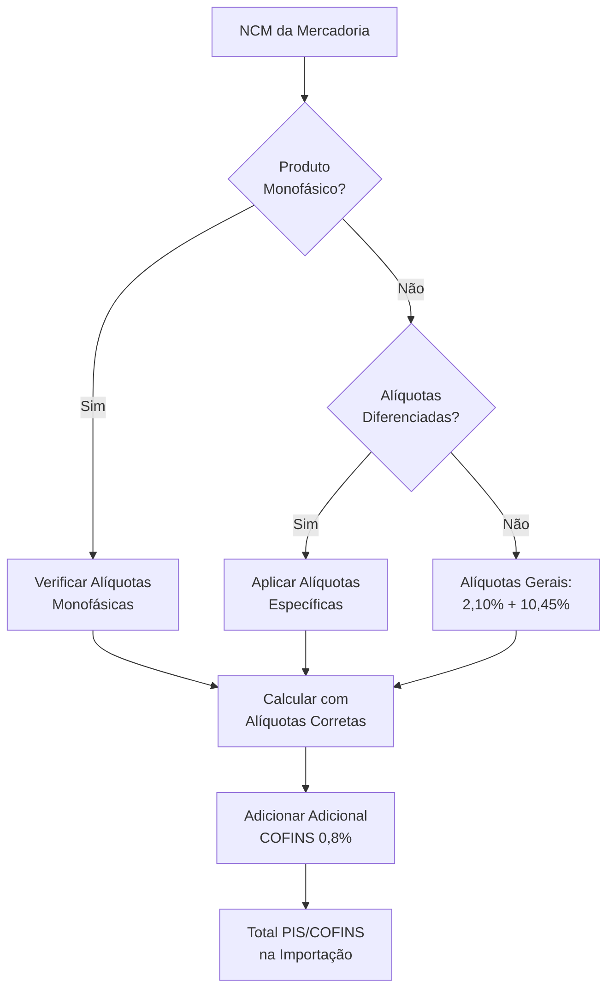
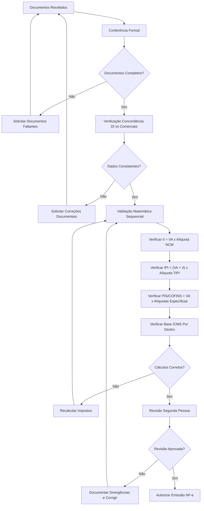
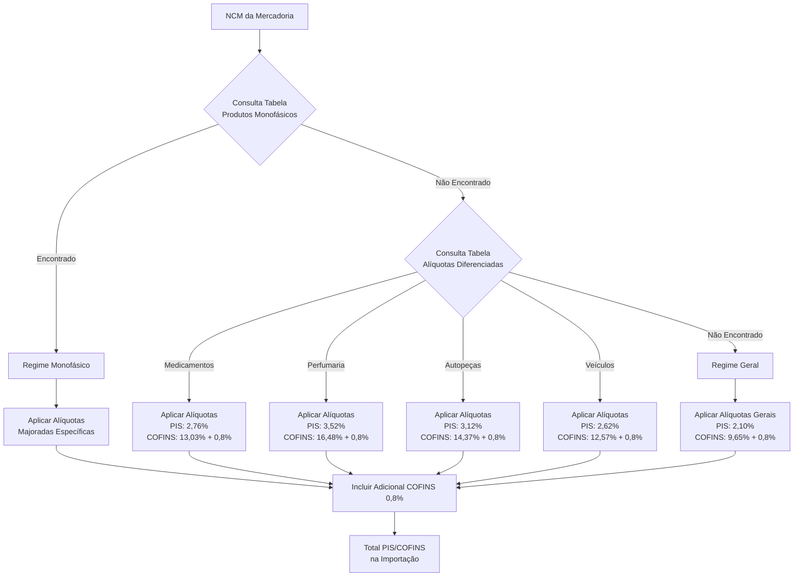
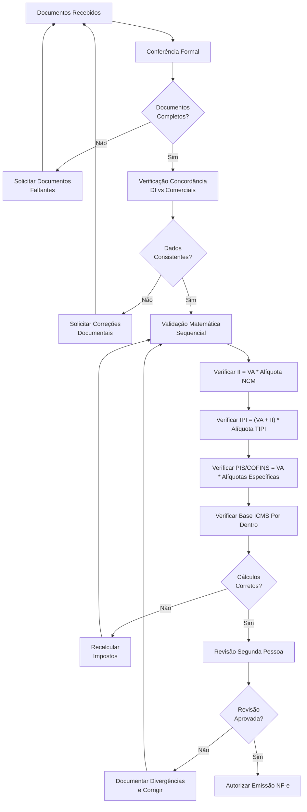
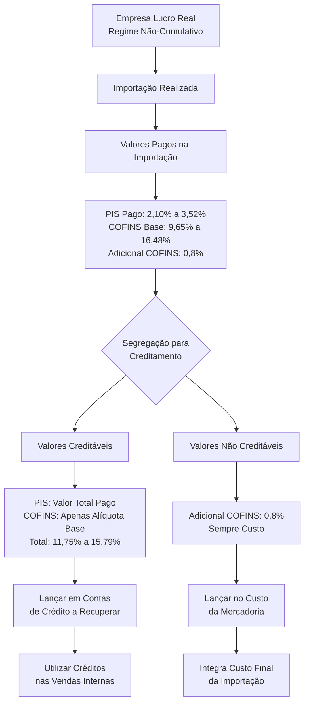

# PROCEDIMENTO OPERACIONAL PADRÃO

## APURAÇÃO DE IMPOSTOS DECORRENTES DE IMPORTAÇÃO E EMISSÃO DE NOTA FISCAL DE ENTRADA - VERSÃO 1.0

# SUMÁRIO

1. **OBJETIVO** ........................................................................... 3
2. **ALCANCE** ........................................................................... 3
3. **DEFINIÇÕES E CONCEITOS FISCAIS** ................................................. 3
4. **BASE LEGAL** ........................................................................ 6
5. **ESTRUTURA TRIBUTÁRIA NA IMPORTAÇÃO** ........................................... 7
6. **APURAÇÃO DOS IMPOSTOS DE IMPORTAÇÃO** .......................................... 12
7. **PREENCHIMENTO DA NOTA FISCAL DE IMPORTAÇÃO** ................................. 19
8. **CONTROLES INTERNOS E VALIDAÇÕES** ............................................... 24
9. **FLUXOS OPERACIONAIS** ............................................................ 27
10. **ASPECTOS CONTÁBEIS** ............................................................ 30
11. **FLUXOGRAMAS DE PROCESSO** ..................................................... 32
12. **PERGUNTAS FREQUENTES** ......................................................... 33

---

# 1. OBJETIVO

Este Procedimento Operacional Padrão estabelece diretrizes detalhadas para apuração de impostos decorrentes de operações de importação e emissão de nota fiscal eletrônica de entrada, assegurando conformidade fiscal, contábil e tributária em todas as etapas do processo de nacionalização de mercadorias. O documento visa padronizar procedimentos, minimizar riscos fiscais e garantir a correta aplicação da legislação tributária federal e estadual aplicável às operações de importação, com especial atenção aos regimes tributários diferenciados e às particularidades dos sistemas monofásicos.

# 2. ALCANCE

Este POP aplica-se a todas as operações de importação realizadas pela empresa, abrangendo desde o registro da Declaração de Importação (DI) até a emissão da nota fiscal de entrada correspondente. O escopo contempla a apuração dos impostos federais (II, IPI, PIS/COFINS, AFRMM), impostos estaduais (ICMS), regimes tributários especiais (monofásico, diferenciado por categoria), bem como os controles contábeis e fiscais necessários para adequada nacionalização das mercadorias importadas. O documento abrange tanto operações em regime geral quanto regimes especiais como Drawback e REPETRO.

# 3. DEFINIÇÕES E CONCEITOS FISCAIS

## 3.1 Definições Operacionais

**Declaração de Importação (DI):** Documento eletrônico que formaliza o despacho aduaneiro de importação, contendo informações sobre a mercadoria, valor aduaneiro, impostos devidos e demais dados necessários para liberação alfandegária.

**Valor Aduaneiro:** Base de cálculo para todos os impostos incidentes na importação, composto pelo valor FOB da mercadoria, acrescido do frete internacional, seguro internacional e despesas aduaneiras. Constitui-se na referência fundamental para determinação da carga tributária total da operação.

**Taxa PTAX:** Taxa de câmbio oficial estabelecida pelo Banco Central do Brasil, utilizada obrigatoriamente para conversão de moedas estrangeiras em reais nas operações de importação. Deve ser aplicada de forma uniforme em toda a operação, sem ajustes posteriores por variação cambial.

**Desembaraço Aduaneiro:** Procedimento mediante o qual é verificado o cumprimento de todas as obrigações fiscais e administrativas necessárias para liberação da mercadoria pela autoridade aduaneira, autorizando sua entrega ao importador.

**Regime Tributário Diferenciado:** Sistema de tributação específico aplicável a determinadas categorias de produtos, com alíquotas de PIS/COFINS superiores às gerais, estabelecidas conforme classificação NCM e finalidade da mercadoria.

## 3.2 Conceitos Tributários Fundamentais

**Imposto de Importação (II):** Tributo federal que incide sobre mercadorias estrangeiras quando de sua entrada no território nacional, com alíquota definida conforme classificação NCM na Tarifa Externa Comum (TEC) do Mercosul.

**IPI na Importação:** Imposto sobre Produtos Industrializados aplicado às mercadorias importadas, utilizando as alíquotas definidas na TIPI (Tabela de Incidência do Imposto sobre Produtos Industrializados), com base de cálculo ampliada pelo valor aduaneiro e Imposto de Importação.

**PIS/COFINS na Importação:** Contribuições sociais que incidem sobre o valor aduaneiro, com alíquotas específicas estabelecidas pela Lei 10.865/2004: **2,10% (PIS) e 9,65% (COFINS), totalizando 11,75%** sobre a base de cálculo. Adicionalmente, incide **adicional de COFINS-Importação de 0,8% em 2025**, conforme Lei 14.973/2024, resultando em carga tributária total de **12,55%** para produtos em geral.

**ICMS na Importação:** Imposto estadual que incide sobre operações de importação, com alíquotas definidas pelos estados, calculado "por dentro" sobre base ampliada que inclui o valor aduaneiro e todos os impostos federais incidentes.

**AFRMM - Adicional ao Frete para Renovação da Marinha Mercante:** Contribuição que incide sobre o frete internacional marítimo à alíquota de 25%, destinada ao financiamento da renovação e ampliação da frota mercante nacional. Transporte aéreo é isento desde 2015.

## 3.3 Regimes Especiais

**Regime Monofásico:** Sistema tributário que concentra a incidência de PIS/COFINS em uma única etapa da cadeia produtiva, normalmente no fabricante ou importador, com alíquotas majoradas específicas e aplicação de alíquota zero nas operações subsequentes de revenda.

**Drawback:** Regime especial que permite suspensão ou restituição de tributos incidentes sobre insumos importados utilizados na fabricação de produtos destinados à exportação, mediante compromisso de exportação em prazo determinado.

**REPETRO:** Regime especial de tributação para exploração e desenvolvimento de jazidas de petróleo e gás natural, com isenção de impostos federais para importação de equipamentos específicos destinados às atividades petrolíferas.

---

# 4. BASE LEGAL

## 4.1 Legislação Federal

**Decreto-Lei nº 37/1966:** Dispõe sobre o Imposto de Importação e institui a Tarifa Externa Comum
**Lei nº 4.502/1964:** Dispõe sobre o Imposto sobre Produtos Industrializados - IPI
**Lei nº 10.865/2004:** Dispõe sobre as Contribuições PIS/COFINS incidentes na importação
**Lei nº 14.973/2024:** Estabelece cronograma de redução gradual do adicional de COFINS-Importação até sua extinção em 2028
**Lei nº 10.336/2001:** Regulamenta regime monofásico para combustíveis e define sistemática específica de tributação
**Lei nº 10.893/2004:** Dispõe sobre o Adicional ao Frete para Renovação da Marinha Mercante - AFRMM
**Decreto nº 6.759/2009:** Regulamento Aduaneiro - procedimentos de importação
**Decreto nº 11.774/2023:** Atualiza tabela de incidência monofásica de PIS/COFINS

## 4.2 Legislação Estadual

**Lei Complementar nº 87/1996 (Lei Kandir):** Dispõe sobre o ICMS
**Convênio ICMS nº 85/2009:** Disciplina a emissão de documento fiscal na importação
**Legislação tributária específica de cada estado:** Para definição de alíquotas e benefícios locais

## 4.3 Instruções Normativas e Resoluções

**Instrução Normativa RFB nº 1.861/2018:** Disciplina o despacho aduaneiro de importação
**Instrução Normativa RFB nº 2.055/2021:** Procedimentos do Sistema Integrado de Comércio Exterior
**Resolução GECEX nº 272/2022:** Lista de produtos com tratamento tributário diferenciado

---

# 5. ESTRUTURA TRIBUTÁRIA NA IMPORTAÇÃO

## 5.1 Sequência de Cálculo dos Impostos

A apuração dos impostos de importação segue ordem específica estabelecida pela legislação, sendo fundamental respeitar esta sequência para correto cálculo das bases tributárias ampliadas:

**1º) Imposto de Importação (II)**
**2º) IPI** - Base: Valor Aduaneiro + II
**3º) PIS/COFINS** - Base: Valor Aduaneiro (independe dos demais)
**4º) AFRMM** - Base: Frete Internacional Marítimo
**5º) ICMS** - Base ampliada incluindo todos os impostos anteriores

## 5.2 Imposto de Importação (II)

### 5.2.1 Características Gerais

**Base Legal:** Decreto-Lei nº 37/1966 e Decreto nº 6.759/2009
**Finalidade:** Proteção da indústria nacional e regulação do comércio exterior
**Natureza:** Tributo regulatório com função extrafiscal

### 5.2.2 Incidência e Alíquotas

**Base de Cálculo:** Valor aduaneiro das mercadorias
**Alíquotas:** Definidas na Tarifa Externa Comum (TEC), variando de 0% a 35%
**Determinação:** Pela classificação NCM na DI

**Fórmula de Cálculo:**
II = Valor Aduaneiro × Alíquota NCM

### 5.2.3 Características Fiscais

**Recuperação:** Não há possibilidade de creditamento ou recuperação
**Impacto Contábil:** Sempre integra o custo da mercadoria importada
**Regime Tributário:** Independe do regime da empresa importadora

## 5.3 IPI na Importação

### 5.3.1 Características Gerais

**Base Legal:** Lei nº 4.502/1964 e Decreto nº 7.212/2010
**Finalidade:** Tributação do consumo de produtos industrializados
**Seletividade:** Alíquotas variam conforme essencialidade do produto

### 5.3.2 Base de Cálculo e Alíquotas

**Base de Cálculo:** Valor Aduaneiro + Imposto de Importação
**Alíquotas:** Conforme TIPI (0% a 330%), definidas por NCM
**Produtos NT:** Não Tributado - sem incidência do IPI

**Fórmula de Cálculo:**
IPI = (Valor Aduaneiro + II) × Alíquota TIPI

### 5.3.3 Recuperação e Creditamento

**Empresas Industriais:** Direito a crédito integral do IPI pago
**Empresas Equiparadas:** Conforme legislação específica
**Demais Empresas:** IPI integra custo da mercadoria
**Produtos com Alíquota Zero:** Geram direito a crédito presumido para indústrias

## 5.4 PIS/COFINS na Importação

### 5.4.1 Características Gerais

Contribuições sociais regidas pela Lei 10.865/2004, com sistemática específica para importação que **difere substancialmente** do regime não-cumulativo aplicado no mercado interno.

### 5.4.2 Alíquotas Gerais

**PIS-Importação:** 2,10% sobre o valor aduaneiro
**COFINS-Importação:** 9,65% sobre o valor aduaneiro
**Adicional COFINS-Importação 2025:** 0,8% adicional
**Total Geral:** 12,55% sobre o valor aduaneiro

### 5.4.3 Cronograma de Redução do Adicional COFINS

Conforme Lei 14.973/2024:

- **2025:** 0,8% (12,55% total)
- **2026:** 0,6% (12,35% total)
- **2027:** 0,4% (12,15% total)
- **2028:** 0,0% (11,75% total - extinção do adicional)

### 5.4.4 Produtos com Alíquotas Diferenciadas

| Categoria              | PIS   | COFINS Base | Adicional | **Total 2025** |
| ---------------------- | ----- | ----------- | --------- | -------------- |
| **Produtos Gerais**    | 2,10% | 9,65%       | 0,8%      | **12,55%**     |
| **Medicamentos**       | 2,76% | 13,03%      | 0,8%      | **16,59%**     |
| **Perfumaria/Higiene** | 3,52% | 16,48%      | 0,8%      | **20,80%**     |
| **Autopeças**          | 3,12% | 14,37%      | 0,8%      | **18,29%**     |
| **Veículos**           | 2,62% | 12,57%      | 0,8%      | **15,99%**     |
| **Produtos Químicos**  | 2,33% | 10,74%      | 0,8%      | **13,87%**     |
| **Produtos Têxteis**   | 2,44% | 11,24%      | 0,8%      | **14,48%**     |

### 5.4.5 Fórmula de Cálculo

**PIS-Importação** = Valor Aduaneiro × Alíquota PIS específica
**COFINS-Importação** = Valor Aduaneiro × (Alíquota COFINS + Adicional)
**Total** = PIS + COFINS

## 5.5 REGIME MONOFÁSICO DE PIS/COFINS

### 5.5.1 Características Gerais

O regime monofásico concentra a tributação de PIS/COFINS em uma única etapa da cadeia produtiva, normalmente no fabricante ou importador, com alíquota zero nas operações subsequentes de revenda.

**Características Principais:**

**Concentração Tributária:** Fabricantes/importadores pagam alíquotas majoradas
**Revenda com Alíquota Zero:** Distribuidores e revendedores aplicam alíquota 0%
**Base Legal:** Lei 10.336/2001, Lei 10.865/2004 e regulamentação específica

### 5.5.2 Produtos Abrangidos

**Combustíveis:**

- Gasolina, álcool, diesel e derivados
- GLP e gás natural

**Cigarros e Bebidas:**

- Todos os produtos do setor tabagista
- Cervejas, vinhos e destilados

**Medicamentos e Perfumaria:**

- Produtos farmacêuticos
- Cosméticos e artigos de higiene

**Autopeças e Pneus:**

- Peças e componentes automotivos
- Pneus e câmaras de ar

### 5.5.3 Impacto na Importação

Na importação de produtos monofásicos, aplicam-se as **alíquotas majoradas específicas**, não as alíquotas gerais de 2,10% e 9,65%. O importador deve:

1. **Identificar** se o produto está no regime monofásico
2. **Aplicar** as alíquotas específicas da categoria
3. **Emitir** NF-e com alíquota zero para revenda posterior
4. **Controlar** rigorosamente a destinação das mercadorias

## 5.6 AFRMM - Adicional ao Frete para Renovação da Marinha Mercante

### 5.6.1 Características Gerais

**Base Legal:** Lei nº 10.893/2004 e Decreto nº 6.759/2009
**Finalidade:** Financiar renovação e ampliação da frota mercante nacional

### 5.6.2 Incidência e Alíquotas

**Base de Cálculo:** Frete internacional (mesmo utilizado no valor aduaneiro)
**Alíquotas Vigentes 2025:**

- **Transporte aquaviário:** 25% sobre o frete internacional
- **Transporte aéreo:** 0% (isento desde 2015)

**Fórmula de Cálculo:**
AFRMM = Frete Internacional × 25%

### 5.6.3 Integração no Custo

- **Compõe despesas aduaneiras** para fins de valor aduaneiro
- **Integra base de cálculo do ICMS** quando devido
- **Não há recuperação** ou creditamento possível

### 5.6.4 Isenções Principais

- Mercadorias destinadas à Zona Franca de Manaus
- Produtos importados ao amparo do REPETRO
- Bens importados para feira, exposição ou evento similar

## 5.7 ICMS na Importação

### 5.7.1 Base de Cálculo Ampliada

O ICMS na importação é calculado "por dentro" sobre base ampliada que inclui:

- Valor aduaneiro
- Imposto de Importação
- IPI
- PIS/COFINS
- AFRMM
- Próprio ICMS (cálculo "por dentro")

### 5.7.2 Fórmula de Cálculo

**Base ICMS** = (Valor Aduaneiro + II + IPI + PIS/COFINS + AFRMM) ÷ (1 - Alíquota ICMS)
**ICMS** = Base ICMS × Alíquota ICMS

### 5.7.3 Alíquotas

**Alíquota Geral:** Definida por cada estado (normalmente 17% a 19%)
**Alíquotas Reduzidas:** Para produtos específicos conforme legislação estadual
**Benefícios Fiscais:** Conforme convênios e legislação local

---

# 6. APURAÇÃO DOS IMPOSTOS DE IMPORTAÇÃO

## 6.1 Valor Aduaneiro - Base de Cálculo Fundamental

### 6.1.1 Composição do Valor Aduaneiro

O valor aduaneiro constitui a base primária para cálculo de todos os impostos de importação, sendo formado pelos seguintes elementos:

**Valor FOB da Mercadoria:** Preço efetivamente pago ou a pagar pelas mercadorias
**Frete Internacional:** Custo de transporte da mercadoria até o porto/aeroporto brasileiro
**Seguro Internacional:** Prêmio de seguro da mercadoria durante o transporte internacional
**Despesas Aduaneiras:** AFRMM, taxa SISCOMEX e outras despesas portuárias

### 6.1.2 Conversão Cambial

**Taxa Utilizada:** PTAX do Banco Central da data de registro da DI
**Aplicação Uniforme:** Mesma taxa para todos os elementos do valor aduaneiro
**Documentação:** Manter registro da taxa utilizada para auditoria

## 6.2 Sequência de Cálculo dos Impostos

### 6.2.1 Imposto de Importação

**Base de Cálculo:** Valor Aduaneiro
**Alíquota:** Conforme NCM na Tarifa Externa Comum
**Cálculo:** II = Valor Aduaneiro × Alíquota NCM

### 6.2.2 IPI

**Base de Cálculo:** Valor Aduaneiro + Imposto de Importação
**Alíquota:** Conforme NCM na TIPI
**Cálculo:** IPI = (Valor Aduaneiro + II) × Alíquota TIPI

### 6.2.3 PIS/COFINS

**Procedimento de Identificação do Regime Aplicável:**

**Passo 1:** Identificar regime aplicável

- Verificar se o produto está sujeito a alíquotas diferenciadas
- Consultar NCM na tabela de produtos especiais
- Confirmar adicional de COFINS vigente no ano

**Passo 2:** Aplicar alíquotas corretas sobre valor aduaneiro

- PIS = Valor Aduaneiro × Alíquota PIS específica
- COFINS = Valor Aduaneiro × (Alíquota COFINS + Adicional)

**Exemplo Prático - Produto Geral:**

- Valor Aduaneiro: R$ 66.560,00
- PIS: R$ 66.560,00 × 2,10% = **R\$ 1.397,76**
- COFINS: R$ 66.560,00 × (9,65% + 0,8%) = R\$ 66.560,00 × 10,45% = **R$ 6.955,52**
- Total PIS/COFINS: **R$ 8.353,28**

**Exemplo Prático - Medicamentos:**

- Valor Aduaneiro: R$ 66.560,00
- PIS: R$ 66.560,00 × 2,76% = **R\$ 1.837,06**
- COFINS: R$ 66.560,00 × (13,03% + 0,8%) = R\$ 66.560,00 × 13,83% = **R$ 9.205,25**
- Total PIS/COFINS: **R$ 11.042,31**

### 6.2.4 AFRMM (quando aplicável)

**Identificação:** Verificar meio de transporte (marítimo sujeito, aéreo isento)
**Base:** Frete internacional marítimo
**Cálculo:** AFRMM = Frete Internacional × 25%

### 6.2.5 ICMS "Por Dentro"

**Passo 1:** Somar impostos federais e outras despesas
**Passo 2:** Aplicar fórmula específica para cálculo "por dentro"
**Passo 3:** Calcular ICMS sobre base ampliada

**Exemplo Prático Completo:**

- Soma antes do ICMS: R$ 66.560,00 + R\$ 6.656,00 + R$ 10.982,40 + R\$ 8.353,28 = R$ 92.551,68
- Base ICMS: R$ 92.551,68 ÷ (1 - 0,18) = R\$ 112.867,66
- ICMS: R$ 112.867,66 × 18% = **R\$ 20.316,38**

## 6.3 Fluxo de Identificação do Regime Aplicável



## 6.4 Validações e Controles dos Cálculos

### 6.4.1 Verificação Matemática

**Teste de Coerência ICMS:** Base ICMS - ICMS Calculado = Soma dos demais impostos e valor aduaneiro
**Exemplo:** R$ 112.867,66 - R\$ 20.316,38 = R$ 92.551,68 ✓

**Verificação de Alíquotas:** Confirmar aplicação das alíquotas corretas conforme legislação vigente

**Teste de Consistência:** Comparar valores calculados com demonstrativos oficiais do despachante aduaneiro

#### 6.4.2 Checklist de Validação

- ✅ NCM classificado corretamente
- ✅ Regime tributário identificado (geral/específico/monofásico)
- ✅ Alíquotas aplicadas conforme categoria
- ✅ Adicional de COFINS incluído quando devido
- ✅ Documentação da escolha das alíquotas

### 6.4.3 Controles de Qualidade

**Revisão por Segunda Pessoa:** Todo cálculo deve ser revisado por pessoa diferente do executor
**Documentação dos Cálculos:** Manter memória de cálculo detalhada para auditoria
**Arquivo de Evidências:** Conservar todos os documentos suporte por prazo legal

---

# 7. PREENCHIMENTO DA NOTA FISCAL DE IMPORTAÇÃO

## 7.1 Dados Obrigatórios do Cabeçalho

### 7.1.1 Informações Gerais

**Tipo de Operação:** 0 - Entrada (sempre para importação)
**Natureza da Operação:** Deve refletir destinação da mercadoria:

- "Compra para comercialização" - mercadorias destinadas à revenda
- "Compra para industrialização" - insumos para processo produtivo
- "Compra para o ativo imobilizado" - bens do ativo permanente
- "Compra para uso e consumo" - materiais de uso da empresa

**CFOP (Código Fiscal de Operações):**

- 3.102 - Compra para comercialização
- 3.101 - Compra para industrialização
- 3.551 - Compra para o ativo imobilizado
- 3.556 - Compra para uso e consumo

**Destino da Operação:** "Operação com o exterior" (sempre)

### 7.1.2 Dados do Emitente (Importador)

Informar razão social, CNPJ, inscrição estadual e endereço completo conforme cadastro na Receita Federal, garantindo perfeita concordância com dados da DI.

### 7.1.3 Dados do Remetente (Exportador)

**Razão Social:** Nome da empresa exportadora conforme DI
**CNPJ/CPF:** Deixar em branco (não aplicável para exterior)
**Estado:** EX (Exterior)
**País:** País de origem conforme DI
**Demais campos de endereço:** Deixar em branco

## 7.2 Dados dos Produtos

### 7.2.1 Informações Básicas do Item

**Código do Produto:** Código interno da empresa
**Descrição:** Descrição idêntica à constante na DI, traduzida para português
**NCM:** Código idêntico ao da DI (8 dígitos)
**CFOP:** Código correspondente à natureza da operação
**Unidade Comercial:** Conforme tabela NCM (KG, UN, MT, etc.)

### 7.2.2 Valores Comerciais

**Valor Unitário:** Valor aduaneiro dividido pela quantidade
**Quantidade:** Conforme declarado na DI
**Valor Total:** Valor aduaneiro total do item

## 7.3 Informações Tributárias por Imposto

### 7.3.1 ICMS

**Situação Tributária (CST):**

- **000** - Tributada integralmente (regra geral)
- **020** - Com redução da base de cálculo (produtos com benefício)
- **040** - Isenta (produtos específicos com isenção)
- **041** - Não tributada (produtos não sujeitos ao ICMS)
- **060** - ICMS cobrado anteriormente por substituição tributária

**Base de Cálculo ICMS:** Valor aduaneiro + II + IPI + PIS/COFINS + AFRMM + próprio ICMS
**Alíquota ICMS:** Conforme legislação estadual
**Valor ICMS:** Conforme calculado

### 7.3.2 IPI

**Situação Tributária (CST):**

- **000** - Entrada com recuperação de crédito (indústrias)
- **049** - Outras entradas (empresas não industriais)
- **050** - Saída tributada (quando aplicável)
- **053** - Saída não tributada (produtos com alíquota zero)
- **054** - Saída isenta (produtos com isenção específica)
- **055** - Saída não tributada e não creditable (NT)

**Base de Cálculo IPI:** Valor aduaneiro + Imposto de Importação
**Alíquota IPI:** Conforme TIPI
**Valor IPI:** Conforme calculado

### 7.3.3 PIS/COFINS

**Situação Tributária (CST) por Regime:**

**Regime Geral:**

- **001** - Operação tributável com alíquota básica
- **002** - Operação tributável com alíquota diferenciada

**Regime Monofásico:**

- **050** - Operação com incidência monofásica (importador)
- **051** - Operação com incidência monofásica (fabricante equiparado)

**Casos Especiais:**

- **004** - Operação tributável (tributação monofásica com alíquota zero)
- **006** - Operação tributável (alíquota zero)
- **007** - Operação isenta da contribuição

**Base de Cálculo PIS:** Valor Aduaneiro
**Alíquota PIS:** Conforme tabela específica por produto (geral: 2,10%)
**Valor PIS:** Base × Alíquota PIS

**Base de Cálculo COFINS:** Valor Aduaneiro
**Alíquota COFINS:** Alíquota base + Adicional vigente (geral 2025: 9,65% + 0,8% = 10,45%)
**Valor COFINS:** Base × Alíquota COFINS Total

**Observação Importante:** As alíquotas de PIS/COFINS na importação são **diferentes** das aplicadas no mercado interno e **variam conforme o produto**. Consultar sempre a tabela específica por NCM.

## 7.4 Informações Adicionais e Observações

### 7.4.1 Campo de Informações Adicionais

**Obrigatório informar:**

- Número da DI e data do desembaraço
- Taxa PTAX utilizada na conversão
- Regime especial aplicado (se houver)
- Identificação de produtos monofásicos

**Exemplo padrão:**
"Mercadoria importada conforme DI nº XXXXXXXXXX de XX/XX/XXXX. Taxa PTAX R$ X,XXXX em XX/XX/XXXX. Produto sujeito ao regime monofásico de PIS/COFINS - Alíquota zero nas vendas subsequentes."

### 7.4.2 Informações de Transporte

**Modal:** Marítimo, aéreo, rodoviário, ferroviário
**Transportadora:** Empresa responsável pelo transporte internacional
**Placa/Identificação:** Quando aplicável ao modal

## 7.5 Outras Despesas Acessórias

### 7.5.1 Despesas que Compõem o Valor da NF-e

**AFRMM (quando aplicável):**

- **Cálculo:** 25% sobre frete internacional marítimo
- **Isenção:** Transporte aéreo e determinados regimes

**Taxa SISCOMEX 2025:**

- **Valor por DI:** R$ 185,00 (modalidade normal)
- **Valor Reduzido:** R$ 92,50 (MPE e produtos específicos)

### 7.5.2 Outras Despesas Acessórias

**Despesas Portuárias:**

- **THC (Terminal Handling Charge):** Conforme tabela do porto
- **Armazenagem:** Valores por período e tipo de mercadoria
- **Movimentação:** Custos de carga/descarga

**Outros Custos:**

- Exames laboratoriais (quando exigidos)
- Inspeções especiais (ANVISA, IBAMA, etc.)
- Multas e penalidades (quando aplicáveis)
- Honorários de despachante aduaneiro

---

# 8. CONTROLES INTERNOS E VALIDAÇÕES

## 8.1 Controles Documentais

### 8.1.1 Documentos Obrigatórios

**Declaração de Importação (DI):** Original com comprovante de desembaraço
**Conhecimento de Carga:** Bill of Lading (marítimo) ou AWB (aéreo)
**Fatura Comercial (Commercial Invoice):** Com valores em moeda estrangeira
**Romaneio de Carga (Packing List):** Detalhamento da mercadoria
**Documento de Transporte:** Comprovação do frete internacional
**Apólice de Seguro:** Cobertura da mercadoria durante transporte

### 8.1.2 Validações Documentais

**Conferência de Dados:** Verificar concordância entre DI e documentos comerciais
**Verificação de Autenticidade:** Confirmar legitimidade dos documentos
**Completude:** Garantir presença de todos os documentos necessários
**Vencimentos:** Verificar se não há documentos vencidos

## 8.2 Validações Específicas por Regime Tributário

### 8.2.1 Checklist Regime Monofásico

**Identificação do Produto:**

- ✅ NCM consultado na Tabela 4.3.11 do SPED
- ✅ Confirmação de incidência monofásica
- ✅ Alíquotas específicas identificadas
- ✅ CST 050 aplicado corretamente

**Controles Operacionais:**

- ✅ Segregação física de produtos monofásicos
- ✅ Controle de revenda com alíquota zero
- ✅ Documentação específica mantida

### 8.2.2 Validação de Créditos PIS/COFINS

**Empresas Lucro Real:**

- ✅ Verificar valores pagos × valores apropriados como crédito
- ✅ Conferir se não está usando alíquotas básicas (1,65%/7,6%)
- ✅ Documentar diferença de crédito identificada
- ✅ Avaliar recuperação de períodos anteriores

### 8.2.3 Controle de Regimes Especiais

**Drawback:**

- ✅ Vincular importação ao ato concessório específico
- ✅ Controlar prazo de comprovação de exportação
- ✅ Segregar contabilmente mercadorias sob o regime

**REPETRO:**

- ✅ Confirmar habilitação da empresa no regime
- ✅ Verificar elegibilidade do bem importado
- ✅ Controlar destinação final dos equipamentos

## 8.3 Controles Matemáticos e de Consistência

### 8.3.1 Validações Automáticas Recomendadas

**Valor Aduaneiro:** Soma FOB + Frete + Seguro + Despesas = Total
**Sequência de Cálculo:** II → IPI → PIS/COFINS → ICMS
**Base ICMS:** Verificar fórmula "por dentro" corretamente aplicada
**Alíquotas:** Validar se estão de acordo com NCM e legislação vigente

### 8.3.2 Controles de Qualidade

**Revisão Cruzada:** Toda apuração deve ser verificada por segunda pessoa
**Memória de Cálculo:** Documentar todos os passos do cálculo
**Arquivo Organizado:** Manter documentação ordenada para fiscalização
**Backup de Dados:** Preservar cópia digital de todos os documentos

---

# 9. FLUXOS OPERACIONAIS

## 9.1 Fluxo Padrão de Importação

### 9.1.1 Fase Preparatória

**Etapa 1:** Recebimento da DI desembaraçada
**Etapa 2:** Coleta e validação de documentos suporte
**Etapa 3:** Verificação da taxa PTAX utilizada
**Etapa 4:** Conferência de valores e classificações

### 9.1.2 Fase de Identificação do Regime

**Etapa 1:** Análise do NCM para identificação de regime especial
**Etapa 2:** Consulta à tabela de produtos monofásicos
**Etapa 3:** Verificação de alíquotas diferenciadas por categoria
**Etapa 4:** Definição das alíquotas aplicáveis

### 9.1.3 Fase de Cálculo

**Etapa 1:** Apuração do valor aduaneiro
**Etapa 2:** Cálculo sequencial dos impostos (II → IPI → PIS/COFINS → ICMS)
**Etapa 3:** Validação matemática dos resultados
**Etapa 4:** Revisão por segunda pessoa

### 9.1.4 Fase de Emissão

**Etapa 1:** Preenchimento dos dados da NF-e
**Etapa 2:** Validação final dos campos obrigatórios
**Etapa 3:** Emissão e transmissão da NF-e
**Etapa 4:** Arquivo da documentação suporte

## 9.2 Fluxo de Exceções e Correções

### 9.2.1 Identificação de Inconsistências

**Trigger 1:** Divergência entre valores DI vs. documentos comerciais
**Trigger 2:** Erro na classificação NCM identificado
**Trigger 3:** Alíquota incorreta aplicada
**Trigger 4:** Falha na validação matemática
**Trigger 5:** Regime tributário mal identificado

### 9.2.2 Processo de Correção

**Passo 1:** Interrupção do processo de emissão
**Passo 2:** Análise detalhada da inconsistência
**Passo 3:** Consulta à legislação ou assessoria especializada
**Passo 4:** Correção dos dados/cálculos
**Passo 5:** Nova validação completa
**Passo 6:** Retomada do fluxo normal

## 9.3 Fluxo para Regimes Especiais

### 9.3.1 Operações com Drawback

**Diferencial:** Suspensão ou redução de impostos federais
**Controle Adicional:** Vinculação com compromisso de exportação
**Documentação:** Ato concessório do regime especial
**Prazo de Comprovação:** Conforme estabelecido no ato concessório

### 9.3.2 Operações REPETRO

**Diferencial:** Isenção de impostos para equipamentos petrolíferos
**Controle Adicional:** Classificação específica em subposição NCM
**Documentação:** Certificado de registro de empresa credenciada
**Validação:** Confirmação da elegibilidade do bem importado

---

# 10. ASPECTOS CONTÁBEIS

## 10.1 Tratamento Contábil dos Impostos

### 10.1.1 Impostos Sempre Recuperáveis

**ICMS:** Empresas do Lucro Real, Presumido ou Simples Nacional (exceto algumas restrições)
**Valor do Crédito:** Valor efetivamente pago conforme alíquota estadual

### 10.1.2 Impostos Condicionalmente Recuperáveis

**IPI:** Apenas para empresas industriais, equiparadas ou com direito específico
**Valor do Crédito:** Valor efetivamente pago na importação

**PIS/COFINS:** Empresas no regime não-cumulativo (Lucro Real)
**Valor do Crédito:** **Valores das alíquotas básicas efetivamente pagos na importação** (PIS 2,10% + COFINS 9,65% = 11,75%)
**Importante:** O adicional de COFINS-Importação (0,8% em 2025) **não é creditável**, integrando sempre o custo da mercadoria.

### 10.1.3 Aproveitamento de Créditos no Lucro Real

**Princípio Fundamental:**
O crédito deve ser calculado pelas **alíquotas básicas efetivamente pagas na importação** (PIS 2,10% + COFINS 9,65% = 11,75%), **excluindo o adicional de COFINS-Importação que não é creditável**.

**Cálculo Correto do Crédito:**

**❌ ERRADO:** Creditar 1,65% + 7,60% = 9,25%
**✅ CORRETO:** Creditar pelas alíquotas básicas realmente pagas na importação (PIS 2,10% + COFINS 9,65% = 11,75%)
**⚠️ ATENÇÃO:** O adicional de COFINS (0,8% em 2025) é sempre custo, nunca crédito.

**Exemplos Práticos:**

**Produto Geral importado em 2025:**

- PIS pago na importação: 2,10% (creditável: 2,10%)
- COFINS base pago na importação: 9,65% (creditável: 9,65%)
- Adicional COFINS: 0,8% (não creditável - sempre custo)
- **Crédito apropriável:** 2,10% + 9,65% = **11,75%**
- **Custo adicional:** 0,8%

**Medicamento importado em 2025:**

- PIS pago na importação: 2,76% (creditável: 2,76%)
- COFINS base pago na importação: 13,03% (creditável: 13,03%)
- Adicional COFINS: 0,8% (não creditável - sempre custo)
- **Crédito apropriável:** 2,76% + 13,03% = **15,79%**
- **Custo adicional:** 0,8%

### 10.1.4 Impostos Sempre Custo

**Imposto de Importação:** 100% integra custo da mercadoria
**AFRMM:** Sempre custo, sem possibilidade de recuperação
**Taxa SISCOMEX:** Sempre custo operacional

## 10.2 Lançamentos Contábeis

### 10.2.1 Exemplo de Contabilização Correta - Empresa Lucro Real

**Dados:** Produto geral, valor aduaneiro R$ 66.560,00

```
D - Estoque de Mercadorias                    R$ 67.092,48*
D - Imposto de Importação (custo)            R$  6.656,00 (sempre custo)
D - IPI a Recuperar                          R$ 10.982,40 (se industrial)
D - PIS a Recuperar                          R$  1.397,76 (2,1% creditável)
D - COFINS a Recuperar                       R$  6.424,96 (9,65% creditável)
D - ICMS a Recuperar                         R$ 20.315,98 (18% efetivo)
C - Fornecedores Exterior                    R$ 112.867,66
```

**Composição do Estoque:**

- Valor Aduaneiro: R$ 66.560,00
- Adicional COFINS (custo): R$ 532,48 (0,8%)
- **Total Estoque:** R$ 67.092,48

### 10.2.2 Oportunidade de Recuperação

Empresas que vêm aplicando incorretamente as alíquotas básicas (9,25%) podem ter **créditos não aproveitados significativos**. A diferença pode representar 2,50 pontos percentuais adicionais para produtos gerais (de 9,25% para 11,75%), chegando a 6,54 pontos para medicamentos (de 9,25% para 15,79%). 

**Importante:** O adicional de COFINS sempre permanece como custo, mas as alíquotas básicas devem ser creditadas corretamente.

---

# 11. FLUXOGRAMAS DE PROCESSO

## 11.1 Fluxograma Geral de Importação



## 11.2 Fluxograma de Identificação de Regime Tributário



## 11.3 Fluxograma de Validações e Controles



## 11.4 Fluxograma de Creditamento PIS/COFINS



---

# 12. PERGUNTAS FREQUENTES

## 12.1 PIS/COFINS na Importação

**Q: Por que as alíquotas de PIS/COFINS na importação são diferentes do mercado interno?**

R: A Lei 10.865/2004 estabeleceu alíquotas específicas e majoradas para importação visando **equalizar a carga tributária** entre produtos nacionais e importados. Enquanto no mercado interno as alíquotas não-cumulativas são 1,65% e 7,60%, na importação são 2,10% e 9,65% mais adicional, **totalizando 12,55% em 2025**. Esta diferenciação busca proteger a indústria nacional e evitar distorções concorrenciais.

**Q: Como identificar se um produto tem alíquotas diferenciadas na importação?**

R: Consulte a **tabela específica** constante na Lei 10.865/2004 e suas alterações. Produtos como medicamentos, perfumaria, autopeças e veículos possuem alíquotas próprias, **significativamente superiores** às alíquotas gerais. A classificação NCM é determinante para esta identificação. Sempre consulte a legislação atualizada antes de calcular os impostos.

**Q: Empresa do Lucro Real pode creditar-se dos valores pagos na importação?**

R: **Sim**, mas apenas das **alíquotas básicas efetivamente pagas**, não do adicional de COFINS-Importação. Se importou pagando 12,55% total (PIS 2,10% + COFINS 9,65% + Adicional 0,8%), deve creditar-se apenas de **11,75%** (PIS 2,10% + COFINS 9,65%). O adicional de 0,8% é sempre custo. Esta diferenciação pode representar economia tributária significativa quando corretamente aplicada. Recomenda-se revisão das importações dos últimos 5 anos para identificação de créditos perdidos e custos indevidamente creditados.

**Q: O adicional de COFINS-Importação será permanente?**

R: **Não**. A Lei 14.973/2024 estabeleceu **cronograma de extinção gradual**:

- 2025: 0,8%
- 2026: 0,6%
- 2027: 0,4%
- 2028: 0,0% (extinção completa)

Planeje-se para esta redução progressiva da carga tributária, que impactará positivamente o custo de importação.

**Q: Como tratar produtos monofásicos na importação?**

R: Produtos monofásicos na importação recebem **alíquotas majoradas específicas** e, posteriormente, são revendidos com **alíquota zero** de PIS/COFINS. O importador deve **identificar corretamente** o produto como monofásico, aplicar as alíquotas específicas da categoria, e controlar rigorosamente as vendas subsequentes com alíquota zero. **Erro nesta identificação** pode resultar em autuação fiscal significativa.

### 12.2 Regimes Especiais e Situações Específicas

**Q: Como identificar e calcular AFRMM na importação?**

R: AFRMM (25%) incide apenas sobre frete internacional marítimo. Transporte aéreo é isento desde 2015. Base de cálculo é o mesmo valor do frete usado no valor aduaneiro. Exemplo: frete marítimo R$ 5.000 = AFRMM R\$ 1.250. O valor integra as despesas aduaneiras e compõe a base do ICMS. Não há recuperação possível.

**Q: Produtos com IPI alíquota zero ou NT têm tratamento diferente?**

R: Sim. Produtos NT (Não Tributado) não geram crédito de IPI mesmo para indústrias. Produtos com alíquota zero permitem crédito presumido para indústrias. Na importação, verificar TIPI específica: "NT" = sem IPI; "0%" = alíquota zero com direito a crédito. Esta diferença impacta significativamente o custo final e os créditos apropriáveis.

**Q: Como tratar substituição tributária de ICMS na importação?**

R: Importações podem estar sujeitas à substituição tributária conforme NCM e estado de destino. Neste caso: 1) ICMS próprio calculado normalmente; 2) ICMS-ST calculado sobre base específica do produto; 3) Total de ICMS = ICMS próprio + ICMS-ST; 4) Valor total integra base própria do ICMS. Consultar legislação estadual para produtos e margens específicas.

**Q: Taxa SISCOMEX tem valores diferenciados?**

R: Sim. Em 2025: R$ 185,00 (valor normal) ou R\$ 92,50 (valor reduzido para MPE, amostras sem valor comercial, bagagem desacompanhada, remessa expressa até US$ 3.000, entre outros). Sempre integra despesas aduaneiras e compõe base de cálculo do ICMS.

## 12.3 Questões Operacionais

**Q: Qual o prazo para emissão da NF-e após o desembaraço?**

R: Embora não haja prazo legal específico, recomenda-se emissão em até 24 horas após o desembaraço para adequado controle fiscal e contábil. A NF-e deve ser emitida obrigatoriamente antes da entrada física da mercadoria no estabelecimento importador, conforme exige a legislação do ICMS.

**Q: Como proceder em caso de erro na NF-e de importação já emitida?**

R: Para erros sem impacto tributário: emitir carta de correção eletrônica (CC-e). Para erros com impacto tributário: cancelar a NF-e original (se dentro do prazo) e emitir nova NF-e correta, ou emitir nota fiscal complementar/de ajuste, conforme a natureza do erro. Sempre consultar a legislação estadual específica para procedimentos de correção.

**Q: Posso ratear os custos de importação entre diferentes mercadorias?**

R: Sim, custos comuns (frete, seguro, despesas portuárias) podem ser rateados proporcionalmente entre diferentes itens da mesma DI, utilizando critério de rateio consistente (valor FOB, peso, quantidade). Mantenha memória de cálculo detalhada do rateio aplicado para eventual fiscalização. O rateio deve preservar o valor total dos custos e impostos apurados na DI.

## 12.4 Aspectos Contábeis e Fiscais

**Q: Como contabilizar impostos recuperáveis na importação?**

R: Impostos recuperáveis (ICMS para contribuintes normais, IPI para indústrias, PIS/COFINS no regime não-cumulativo) devem ser registrados em contas próprias do ativo circulante. O lançamento típico debita a conta específica do imposto a recuperar e credita fornecedores/contas a pagar, não integrando o custo da mercadoria. Impostos não-recuperáveis integram diretamente o custo do bem importado.

**Q: O Imposto de Importação é sempre custo da mercadoria?**

R: Sim, o Imposto de Importação é sempre custo da mercadoria importada, independentemente do regime tributário da empresa. Não existe possibilidade de creditamento ou recuperação do II, sendo este sempre incorporado ao valor do ativo (estoque ou imobilizado) no momento da importação.

**Q: Como tratar diferenças cambiais durante o processo de importação?**

R: Diferenças cambiais entre o momento do pagamento antecipado ao fornecedor e a data do registro da DI devem ser reconhecidas como variação cambial ativa ou passiva no resultado do período. Não impactam o valor aduaneiro da mercadoria, que utiliza exclusivamente a taxa PTAX da DI para todos os cálculos tributários e contábeis.

## 12.5 Sistemas e Tecnologia

**Q: Quais validações automáticas devo implementar no sistema?**

R: Implementar validações de: 1) Concordância entre NCM e alíquotas aplicadas; 2) Sequência correta de cálculo dos impostos; 3) Fórmula "por dentro" do ICMS; 4) Valores totais da DI vs. valores calculados; 5) Identificação automática de produtos monofásicos; 6) Alertas para produtos com alíquotas diferenciadas. Estas validações reduzem significativamente erros operacionais.

---

**EXEMPLO PRÁTICO COMPLETO:**

**Dados da Importação:**

- Valor FOB: R$ 50.000,00
- Frete Internacional (marítimo): R$ 8.000,00
- Seguro: R$ 2.560,00
- AFRMM: R$ 2.000,00 (25% × R\$ 8.000)
- Taxa SISCOMEX: R$ 185,00
- Outras despesas: R$ 3.815,00
- **Valor Aduaneiro:** R$ 66.560,00
- Produto: Equipamento eletrônico (geral)

**Cálculo dos Impostos (2025):**

- II (10%): R$ 6.656,00
- IPI (15%): R$ 10.982,40
- PIS (2,1%): R$ 1.397,76 (creditável)
- COFINS base (9,65%): R$ 6.424,96 (creditável)
- Adicional COFINS (0,8%): R$ 532,48 (custo)
- **Soma pré-ICMS:** R$ 92.551,68
- **Base ICMS:** R$ 112.867,66
- **ICMS (18%):** R$ 20.315,98

**Resumo Creditamento (Lucro Real):**

- **Créditos PIS/COFINS:** R$ 7.822,72 (11,75%)
- **Custo Adicional:** R$ 532,48 (0,8%)
- **Carga Tributária Total:** R$ 46.307,66
- **Percentual sobre Valor Aduaneiro:** 69,57%
- **Valor Total da NF-e:** R$ 112.867,66

---

**Data de Emissão:** agosto de 2025
**Versão:** 1.0
**Aprovação:** [Área Fiscal/Tributária]

---

*Este documento deve ser revisado anualmente ou sempre que houver alteração na legislação tributária aplicável às operações de importação.*