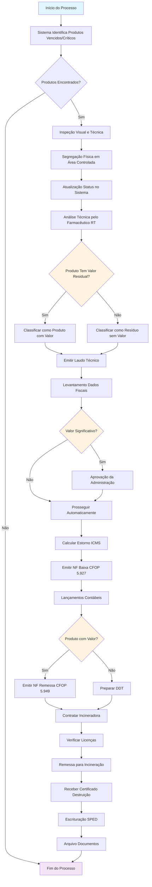
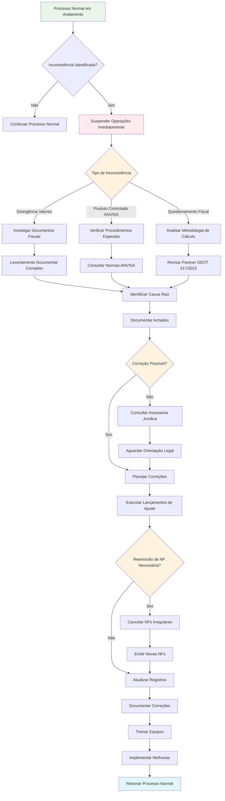
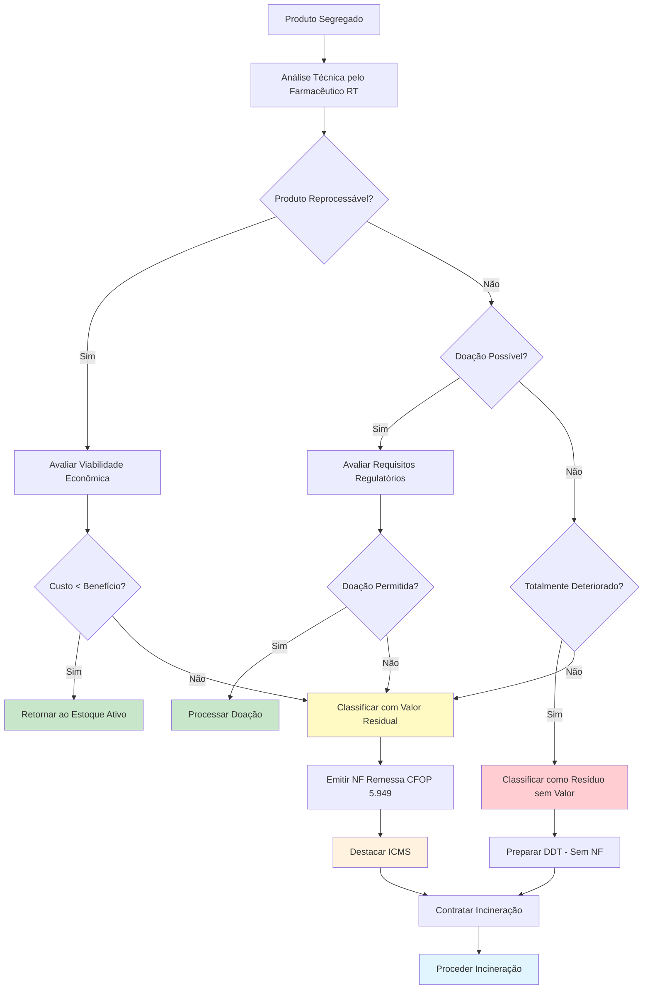

# PROCEDIMENTO OPERACIONAL PADRÃO

## REMESSA PARA INCINERAÇÃO DE PRODUTOS FARMACÊUTICOS - VERSÃO 1.0

### SUMÁRIO

1. **OBJETIVO** ......................................................................... 3
2. **ALCANCE** ........................................................................ 3
3. **DEFINIÇÕES E CONCEITOS** ......................................................... 4
4. **BASE LEGAL** ..................................................................... 5
5. **RESPONSABILIDADES E ESTRUTURA TRIBUTÁRIA** ...................................... 7
6. **METODOLOGIA E PROCEDIMENTOS FISCAIS** ........................................... 9
7. **CONTROLES E VALIDAÇÕES** ........................................................ 13
8. **ASPECTOS OPERACIONAIS** ......................................................... 15
9. **FLUXOS E PROCESSOS** ............................................................ 17
10. **ASPECTOS CONTÁBEIS E FISCAIS** ................................................. 19
11. **DOCUMENTAÇÃO E ANEXOS** ........................................................ 21
12. **PERGUNTAS FREQUENTES E TROUBLESHOOTING** ...................................... 22

---

# 1. OBJETIVO

Estabelecer procedimentos fiscais, contábeis e operacionais padronizados para remessa de produtos farmacêuticos vencidos, deteriorados ou impróprios para consumo ao processo de incineração. Este procedimento contempla a emissão de documentos fiscais obrigatórios, cálculo e estorno de tributos estaduais e federais, escrituração contábil e fiscal, controle e arquivamento de documentação comprobatória, garantindo conformidade integral com a legislação tributária vigente e minimizando riscos fiscais e operacionais.

# 2. ALCANCE

Este procedimento aplica-se a todas as operações de baixa de estoque e remessa para incineração de produtos farmacêuticos realizadas por empresas do setor farmacêutico estabelecidas no Estado de Goiás, abrangendo medicamentos, cosméticos, produtos de higiene pessoal, correlatos e dispositivos médicos que se tornem impróprios para comercialização por vencimento, deterioração, contaminação ou inadequação técnica.

O procedimento cobre especificamente as operações de baixa de estoque (CFOP 5.927), remessa para destruição (CFOP 5.949), cálculo de estorno de crédito de ICMS, tratamento de tributos federais (IPI, PIS/COFINS), escrituração contábil e fiscal, controle documental e arquivo de comprovantes. Não se aplica a produtos sujeitos a controle especial pela ANVISA, que demandam procedimentos específicos adicionais.

# 3. DEFINIÇÕES E CONCEITOS

## 3.1 Definições Operacionais

**Produtos com Valor Residual:** Mercadorias farmacêuticas vencidas ou deterioradas que ainda conservam algum valor econômico, ainda que reduzido, sujeitas ao regime tributário normal para operações de remessa para destruição.

**Resíduos sem Valor Econômico:** Produtos completamente deteriorados, contaminados ou que não possuam valor econômico algum, caracterizados como "lixo industrial" conforme Art. 204 do RCTE-GO.

**Laudo Técnico:** Documento emitido por profissional habilitado que atesta a impossibilidade de recuperação, reprocessamento ou qualquer forma de aproveitamento econômico da mercadoria.

**Estorno Proporcional:** Metodologia de cálculo do estorno de crédito de ICMS baseada na alíquota média efetiva das operações de entrada do período.

**Incineração Controlada:** Processo de destruição térmica de resíduos farmacêuticos realizado por empresa licenciada, com controle de temperatura, tempo e emissão de gases.

## 3.2 Conceitos Técnicos

### 3.2.1 Conceitos Tributários Estaduais

O estorno de crédito de ICMS fundamenta-se no princípio da não cumulatividade tributária, estabelecendo que créditos apropriados sobre mercadorias que não geram débito do imposto devem ser estornados proporcionalmente. A metodologia goiana utiliza a alíquota média ponderada das entradas do período, garantindo proporcionalidade e equidade no cálculo.

### 3.2.2 Conceitos Tributários Federais

Para fins de IPI, produtos farmacêuticos impróprios para consumo não geram incidência na operação de baixa nem na remessa para destruição, conforme Art. 74 do RIPI. No regime de PIS/COFINS não cumulativo, baixas de estoque não constituem receita tributável, devendo ser excluídas da base de cálculo das contribuições.

# 4. BASE LEGAL

## 4.1 Legislação Federal

**Lei nº 4.502/64 e Decreto nº 7.212/10 (RIPI):**
Regulamentação do IPI, estabelecendo não incidência sobre produtos destinados à destruição quando impróprios para comercialização (Art. 74).

**Leis nº 10.637/02 e 10.833/03:**
Institui o regime não cumulativo de PIS/COFINS, definindo exclusões de receitas para baixas de estoque e operações sem caráter de receita.

**Instrução Normativa RFB nº 1.700/17:**
Estabelece procedimentos para escrituração da EFD-Contribuições, incluindo tratamento de operações não tributadas.

**Ato Declaratório Interpretativo SRF nº 5/2004:**
Orientação específica sobre tratamento de baixas de estoque para fins de PIS/COFINS.

## 4.2 Legislação Estadual (Goiás)

**Decreto nº 4.852/97 (RCTE-GO):**

- Art. 58, III - Obrigatoriedade de estorno de crédito de ICMS
- Art. 59 - Metodologia de cálculo proporcional do estorno  
- Art. 204 - Conceituação de resíduos sem valor econômico

**Instrução Normativa nº 885/07-GSF:**
Estabelece critérios complementares para apuração de limites e exclusões em cálculos tributários.

## 4.3 Pareceres e Consultas Administrativas

**Parecer ECONOMIA/GEOT 217/2023:**

*"O cálculo do estorno proporcional de crédito de ICMS, previsto no art. 59 do RCTE, deve observar a seguinte metodologia: primeiro, apura-se a alíquota média efetiva das operações de entrada do período, mediante a divisão do total dos créditos de ICMS escriturados pelo valor contábil total das mercadorias adquiridas, multiplicando-se o resultado por 100 (cem) para obtenção do percentual. Em seguida, aplica-se esta alíquota média sobre o valor da mercadoria objeto da perda, deterioração ou sinistro."*

**Resposta à Consulta nº 1434/2013:**

*"Mercadorias farmacêuticas vencidas ou deterioradas que ainda conservem algum valor econômico, ainda que reduzido, sujeitam-se ao regime tributário normal para a operação de remessa para destruição, devendo ser emitido documento fiscal com o devido destaque do ICMS, aplicando-se o CFOP 5.949 - Saída não especificada para destinação."*

*"Quando se tratar de resíduos farmacêuticos completamente deteriorados, contaminados ou que, por qualquer razão, não possuam valor econômico algum, aplicar-se-á o disposto no art. 204 do RCTE, que os caracteriza como 'lixo industrial', dispensando a emissão de documento fiscal para a saída."*

**Parecer GEOT 1040/2012:**

*"O estorno de crédito de ICMS relativo às mercadorias perdidas, deterioradas ou sinistradas é obrigatório, devendo ser calculado proporcionalmente conforme disposto nos artigos 58, inciso III, e 59 do RCTE. A empresa deverá comprovar a efetiva perda mediante laudo técnico e documentação hábil."*

*"Para fins de cálculo do estorno de crédito, considera-se valor da mercadoria perdida o custo de aquisição ou o valor contábil registrado no estoque, devendo a empresa manter controles auxiliares que permitam a identificação precisa dos valores envolvidos e a correlação com os créditos de ICMS originalmente apropriados."*

# 5. RESPONSABILIDADES E ESTRUTURA TRIBUTÁRIA

## 5.1 Responsabilidade e Incidência Tributária

### 5.1.1 Operações de Armazenagem

Para produtos farmacêuticos em processo de segregação e avaliação técnica, mantém-se a responsabilidade tributária integral até definição da destinação final. Durante este período, aplicam-se controles rigorosos de estoque e escrituração fiscal normal.

### 5.1.2 Operações com Mercadorias

Mercadorias com valor econômico residual sujeitam-se à tributação normal na remessa para incineração, incluindo destaque de ICMS conforme alíquota interna do estado. Produtos classificados como resíduos dispensam tributação, mas exigem controles documentais específicos.

### 5.1.3 Situações de Não Incidência

Aplicam-se as hipóteses de não incidência de IPI previstas no Art. 74 do RIPI para produtos impróprios destinados à destruição. Para PIS/COFINS, as baixas de estoque não geram base de cálculo, caracterizando-se como operações não tributadas.

### 5.1.4 Situações de Suspensão

Não se aplicam regimes de suspensão tributária nas operações de baixa de estoque e remessa para incineração, mantendo-se a sistemática normal de apuração e recolhimento dos tributos devidos.

## 5.2 Estrutura Tributária e Particularidades por Estado no Transporte de Mercadorias

### 5.2.1 Goiás

**Alíquotas Aplicáveis:**

- ICMS interno: 17% (medicamentos não beneficiados)  
- ICMS reduzido: 7% (medicamentos da cesta básica)
- Produtos de higiene: 17%

**Particularidades:**

- Aplicação obrigatória do estorno proporcional (Art. 59 RCTE-GO)
- Exigência de laudo técnico para caracterização de resíduo
- Prazo de 30 dias para escrituração das baixas

### 5.2.2 Tocantins

**Interface Operacional:**
Para empresas que operam em Tocantins mas utilizam incineradoras em Goiás, aplicam-se regras específicas de transporte interestadual, com alíquota de 12% na remessa e possível geração de DIFAL quando aplicável.

### 5.2.3 Mato Grosso

**Considerações Especiais:**
Empresas com filiais em MT que remetem produtos para incineração em GO devem observar as regras de transferência entre estabelecimentos, aplicando CFOP 6.949 na origem e 2.949 no destino.

### 5.2.4 Pará

**Regras de Origem:**
Para produtos adquiridos originalmente no PA e destinados à incineração em GO, mantém-se o controle de origem para fins de cálculo correto da alíquota média de estorno.

# 6. METODOLOGIA E PROCEDIMENTOS FISCAIS

## 6.1 Procedimentos Padrão

### 6.1.1 Etapa Preparatória

**Passo 1:** Identificação e segregação física dos produtos impróprios para comercialização, com registro detalhado em planilha de controle incluindo: código do produto, lote, validade, quantidade e valor unitário de aquisição.

**Passo 2:** Solicitação de laudo técnico ao farmacêutico responsável técnico, especificando os motivos da impossibilidade de comercialização e classificação como produto com valor residual ou resíduo sem valor econômico.

**Passo 3:** Levantamento dos dados necessários para cálculo do estorno de ICMS, incluindo: total de créditos de ICMS do período, valor contábil das entradas do período e valor das mercadorias a serem baixadas.

**Passo 4:** Contratação de empresa licenciada para incineração, verificando licenças ambientais válidas e capacidade técnica para destruição de produtos farmacêuticos.

### 6.1.2 Etapa de Execução

**Passo 1:** Emissão de nota fiscal de baixa (CFOP 5.927) sem destaque de tributos, informando valor de aquisição e referência ao laudo técnico de inutilização.

**Passo 2:** Cálculo do estorno de ICMS utilizando a metodologia estabelecida no Parecer ECONOMIA/GEOT 217/2023, com memória de cálculo detalhada e fundamentação legal.

**Passo 3:** Lançamentos contábeis de reconhecimento da perda e estorno do crédito de ICMS, impactando adequadamente as contas de resultado e ativo circulante.

**Passo 4:** Para produtos com valor residual, emissão de nota fiscal de remessa (CFOP 5.949) com destaque de ICMS conforme alíquota interna aplicável.

### 6.1.3 Etapa de Finalização

**Passo 1:** Escrituração das operações no SPED EFD-ICMS/IPI, incluindo registros específicos para estorno de crédito e operações de baixa de estoque.

**Passo 2:** Registro na EFD-Contribuições das operações não tributadas para fins de PIS/COFINS, utilizando códigos de situação tributária apropriados.

**Passo 3:** Arquivo organizado de toda documentação comprobatória, incluindo notas fiscais, laudos técnicos, comprovantes de incineração e memórias de cálculo.

## 6.2 Procedimentos Especiais

### 6.2.1 Produtos Sob Controle Especial ANVISA

Para produtos sujeitos ao controle especial (psicotrópicos, entorpecentes), além dos procedimentos padrão, deve-se observar comunicação prévia à ANVISA, utilização de formulários específicos de baixa de estoque controlado e acompanhamento presencial da destruição por agente da vigilância sanitária quando exigível.

### 6.2.2 Produtos com Alto Valor Agregado

Medicamentos de alto custo ou produtos biológicos exigem avaliação criteriosa da possibilidade de aproveitamento, doação para instituições de caridade (quando permitido pela legislação sanitária) ou destinação alternativa antes da incineração. Nestes casos, deve-se documentar adequadamente a impossibilidade de destinações alternativas.

# 7. CONTROLES E VALIDAÇÕES

## 7.1 Controles Documentais

### 7.1.1 Documentos Obrigatórios

**Laudo Técnico de Inutilização:** Documento emitido pelo farmacêutico responsável técnico, contendo identificação completa dos produtos, motivos técnicos da inutilização, data de emissão, assinatura e número do registro profissional.

**Nota Fiscal de Baixa (CFOP 5.927):** Documento fiscal emitido sem destaque de tributos, informando valor de aquisição, justificativa legal e referência ao laudo técnico.

**Nota Fiscal de Remessa (CFOP 5.949):** Para produtos com valor residual, documento fiscal com destaque de ICMS conforme alíquota aplicável.

**Comprovante de Incineração:** Certificado emitido pela empresa incineradora, atestando a destruição completa dos produtos com especificação de temperatura, tempo de processo e destinação das cinzas.

### 7.1.2 Validações Documentais

**Conferência de Dados:** Verificação da correlação entre quantidades e valores informados no laudo técnico, notas fiscais de baixa e remessa, e controles de estoque da empresa.

**Verificação de Autenticidade:** Validação da licença ambiental da empresa incineradora, verificação da habilitação profissional do responsável técnico pelo laudo e autenticidade dos certificados emitidos.

**Completude:** Checklist de verificação da completude documental, incluindo informações obrigatórias em cada documento, assinaturas necessárias e prazos de validade.

**Vencimentos:** Controle de prazos para escrituração fiscal (30 dias), arquivo de documentos (5 anos) e validade das licenças da empresa contratada.

## 7.2 Controles Operacionais

### 7.2.1 Checklist de Validação

- ✅ Identificação e segregação física dos produtos realizada
- ✅ Laudo técnico emitido por profissional habilitado  
- ✅ Cálculo do estorno de ICMS conferido e fundamentado
- ✅ Notas fiscais emitidas com CFOPs corretos
- ✅ Lançamentos contábeis realizados adequadamente
- ✅ Escrituração fiscal executada nos prazos legais
- ✅ Empresa incineradora licenciada e contratada
- ✅ Documentação arquivada de forma organizada

### 7.2.2 Controles de Qualidade

**Revisão por Segunda Pessoa:** Todo cálculo de estorno de ICMS deve ser revisado por pessoa independente da que executou, com documentação da revisão e eventuais correções efetuadas.

**Documentação de Evidências:** Manutenção de arquivo fotográfico dos produtos segregados, cópia das licenças da incineradora e registro de todas as comunicações relevantes.

**Arquivo Organizado:** Estruturação de arquivo físico e digital por período de ocorrência, com indexação que permita localização rápida de documentos específicos.

**Backup de Dados:** Procedimentos de backup dos arquivos digitais, incluindo planilhas de cálculo, notas fiscais eletrônicas e comunicações por e-mail.

# 8. ASPECTOS OPERACIONAIS

## 8.1 Responsabilidades

### 8.1.1 Responsabilidades por Função

**Farmacêutico Responsável Técnico:**

- Emissão de laudos técnicos fundamentados
- Classificação dos produtos quanto ao valor econômico
- Acompanhamento da segregação física quando necessário
- Assinatura e responsabilidade técnica pelos documentos emitidos

**Setor Fiscal:**

- Emissão de documentos fiscais obrigatórios
- Cálculo do estorno de tributos estaduais e federais  
- Escrituração fiscal nos prazos regulamentares
- Controle de obrigações acessórias relacionadas

**Contabilidade:**

- Lançamentos contábeis de baixa de estoque
- Reconhecimento do estorno de crédito de ICMS no resultado
- Conciliação de contas de estoque e tributos a recuperar
- Elaboração de relatórios gerenciais de perdas

**Administração/Compras:**

- Contratação da empresa incineradora licenciada
- Negociação de custos e prazos do serviço
- Aprovação das baixas de alto valor
- Controle orçamentário das perdas

### 8.1.2 Matriz de Responsabilidades

| Atividade                | Farmacêutico | Fiscal | Contabilidade | Administração |
| ------------------------ | ------------ | ------ | ------------- | ------------- |
| Segregação de produtos   | R            | I      | I             | I             |
| Emissão de laudo técnico | R            | C      | I             | I             |
| Cálculo de estorno ICMS  | C            | R      | A             | I             |
| Emissão de notas fiscais | C            | R      | I             | I             |
| Lançamentos contábeis    | I            | C      | R             | A             |
| Contratação incineradora | I            | C      | I             | R             |
| Escrituração fiscal      | I            | R      | C             | A             |
| Arquivo documentos       | I            | R      | R             | A             |

*R=Responsável, A=Aprovador, C=Consultado, I=Informado*

## 8.2 Prazos e Cronogramas

### 8.2.1 Prazos Regulamentares

**30 dias:** Prazo para escrituração das operações no SPED EFD-ICMS/IPI após a data de ocorrência da perda (RCTE-GO, art. 647).

**Dia 25 do mês subsequente:** Prazo para transmissão da EFD-Contribuições contendo as informações de PIS/COFINS (IN RFB 1.700/17).

**5 anos:** Prazo de manutenção da documentação comprobatória das operações, contado da data de ocorrência do fato gerador (CTN, art. 173).

### 8.2.2 Cronograma de Atividades

**Fase 1 (Dias 1-7):** Identificação, segregação e avaliação técnica dos produtos impróprios para comercialização.

**Fase 2 (Dias 8-15):** Emissão de documentos fiscais, cálculo de tributos, lançamentos contábeis e contratação da incineradora.

**Fase 3 (Dias 16-30):** Remessa para incineração, escrituração fiscal, arquivo de documentos e controles de qualidade.

# 9. FLUXOS E PROCESSOS

## 9.1 Fluxo Padrão

O processo completo de remessa para incineração de produtos farmacêuticos estrutura-se em três fases distintas e interdependentes, conforme demonstrado no fluxograma a seguir:



### 9.1.1 Fase Inicial - Identificação e Segregação

A primeira fase do processo caracteriza-se pela identificação proativa de produtos que se tornaram impróprios para comercialização, seja por vencimento, deterioração ou outros fatores técnicos. Esta etapa compreende quatro atividades sequenciais fundamentais:

**Etapa 1:** Identificação automática de produtos próximos ao vencimento através do sistema de controle de estoque, com geração de relatórios semanais de itens críticos que demandam avaliação técnica prioritária.

**Etapa 2:** Inspeção visual e técnica dos produtos identificados, verificando condições de embalagem, sinais de deterioração ou contaminação, com documentação fotográfica quando necessário para comprovação posterior.

**Etapa 3:** Segregação física em área específica, devidamente identificada e com acesso controlado, registrando data, responsável e motivo da segregação em formulário padronizado.

**Etapa 4:** Atualização do sistema de estoque com status de "segregado para análise", impedindo movimentações inadvertidas dos produtos e mantendo rastreabilidade completa.

### 9.1.2 Fase Intermediária - Análise e Documentação

A segunda fase concentra-se na análise técnica aprofundada e na documentação formal das decisões tomadas, estabelecendo os fundamentos legais e técnicos para os procedimentos subsequentes:

**Etapa 1:** Análise técnica detalhada pelo farmacêutico responsável, avaliando possibilidades de reprocessamento, doação ou aproveitamento alternativo, considerando aspectos regulatórios e econômicos.

**Etapa 2:** Emissão do laudo técnico fundamentado, classificando os produtos e definindo a destinação mais adequada conforme critérios técnicos e econômicos estabelecidos na legislação sanitária.

**Etapa 3:** Levantamento dos dados fiscais necessários, incluindo valores de aquisição, créditos de ICMS relacionados e cálculo da alíquota média do período, conforme metodologia do Parecer ECONOMIA/GEOT 217/2023.

**Etapa 4:** Aprovação pela administração da empresa das baixas de valor significativo, com análise de impacto orçamentário e financeiro, documentando as justificativas para a decisão.

### 9.1.3 Fase Final - Execução e Controle

A terceira fase materializa as decisões tomadas através da execução dos procedimentos fiscais, contábeis e operacionais, garantindo conformidade legal e controle adequado:

**Etapa 1:** Emissão dos documentos fiscais obrigatórios, execução dos lançamentos contábeis e cálculo dos tributos aplicáveis, observando rigorosamente os prazos e formalidades legais.

**Etapa 2:** Contratação e agendamento dos serviços de incineração, com verificação das licenças da empresa prestadora e condições operacionais adequadas para destruição de produtos farmacêuticos.

**Etapa 3:** Remessa física dos produtos para incineração, com acompanhamento logístico e recebimento de comprovantes de destruição devidamente certificados pela empresa responsável.

## 9.2 Fluxo de Exceções

O tratamento de exceções constitui elemento fundamental para garantia da integridade do processo, especialmente considerando a complexidade tributária e regulatória envolvida. O fluxograma seguinte ilustra o processo de identificação e correção de inconsistências:



### 9.2.1 Identificação de Inconsistências

O sistema de identificação de exceções baseia-se em três categorias principais de irregularidades que podem comprometer a validade e conformidade do processo:

**Trigger 1:** Divergências entre o valor contábil do estoque e os valores de aquisição informados nos documentos fiscais originais, detectadas através de conciliação sistemática entre registros contábeis e controles auxiliares.

**Trigger 2:** Produtos sujeitos a controle especial da ANVISA identificados no lote para incineração, demandando procedimentos específicos adicionais conforme regulamentação sanitária vigente.

**Trigger 3:** Questionamentos da Receita Federal ou SEFAZ sobre a legitimidade das baixas efetuadas ou metodologia de cálculo utilizada, originados de malha fiscal ou procedimentos de fiscalização.

### 9.2.2 Processo de Correção

O processo de correção estrutura-se em cinco etapas sequenciais, projetadas para assegurar investigação completa, correção adequada e prevenção de reincidências:

**Passo 1:** Suspensão imediata das operações em andamento e isolamento dos produtos envolvidos na inconsistência identificada, preservando evidências e impedindo agravamento da situação.

**Passo 2:** Investigação detalhada das causas da divergência, com levantamento documental completo e análise dos controles internos falhos, envolvendo todas as áreas pertinentes ao processo.

**Passo 3:** Correção dos registros contábeis e fiscais através de lançamentos de ajuste, com adequada fundamentação legal e aprovação da administração, observando princípios contábeis e tributários aplicáveis.

**Passo 4:** Reemissão de documentos fiscais quando necessário, observando os prazos legais e procedimentos de cancelamento de notas irregulares conforme legislação estadual e federal.

**Passo 5:** Implementação de melhorias nos controles internos para prevenção de ocorrências similares, com treinamento das equipes envolvidas e atualização de procedimentos operacionais padrão.

## 9.3 Fluxo de Decisão para Classificação de Produtos

A classificação adequada dos produtos constitui elemento crítico para aplicação correta do tratamento tributário. O fluxograma seguinte detalha o processo decisório:



Este fluxo decisório garante que todos os produtos sejam adequadamente classificados conforme critérios técnicos, econômicos e regulatórios, assegurando aplicação correta do tratamento tributário previsto na Resposta à Consulta nº 1434/2013 e demais dispositivos legais aplicáveis.

# 10. ASPECTOS CONTÁBEIS E FISCAIS

## 10.1 Tratamento Contábil

### 10.1.1 Reconhecimento da Perda de Estoque

**Lançamento Principal:**

```
D - Perdas com Estoque (Conta de Resultado)           R$ 25.500,00
C - Estoque de Medicamentos (Ativo Circulante)        R$ 25.500,00
```

**Fundamentação Contábil:** O reconhecimento da perda deve ocorrer no momento da constatação técnica da impossibilidade de comercialização, independentemente da data efetiva da incineração. Aplica-se o princípio da competência, registrando a perda no período de sua ocorrência.

**Contas Envolvidas:** Utilizare-se contas específicas de resultado para perdas de estoque, permitindo controle analítico por tipo de produto e causa da perda. No ativo, dar baixa diretamente nas contas de estoque, mantendo rastreabilidade por centro de custo.

### 10.1.2 Estorno de Crédito de ICMS

**Lançamento de Ajuste:**

```
D - Perdas com Estoque (Resultado)                    R$ 3.060,00
C - ICMS a Recuperar (Ativo Circulante)               R$ 3.060,00
```

**Fundamentação Legal:** Conforme Art. 58, III do RCTE-GO, o estorno é obrigatório quando mercadorias saem sem tributação ou com isenção. O valor deve ser calculado proporcionalmente conforme metodologia do Parecer ECONOMIA/GEOT 217/2023.

**Critério de Reconhecimento:** O estorno deve ser reconhecido simultaneamente à baixa do estoque, impactando o resultado do período e reduzindo os créditos de ICMS disponíveis para compensação.

## 10.2 Aspectos Fiscais

### 10.2.1 Obrigações Principais

**ICMS (Goiás):** Estorno obrigatório de crédito conforme metodologia proporcional estabelecida no Art. 59 do RCTE-GO, com prazo de 30 dias para escrituração no SPED EFD.

**IPI (Federal):** Não incidência sobre baixas de produtos impróprios conforme Art. 74 do RIPI, dispensando destaque do imposto nas notas fiscais de baixa e remessa.

**PIS/COFINS (Federal):** Tratamento como operação não tributada, com base de cálculo zerada e exclusão das receitas tributáveis conforme Lei 10.833/03.

### 10.2.2 Obrigações Acessórias

**SPED EFD-ICMS/IPI:** Escrituração obrigatória no prazo de 30 dias, incluindo registros específicos para estorno de crédito (bloco E) e operações com mercadorias (bloco C).

**EFD-Contribuições:** Informação de receitas não tributadas no bloco F, com código de situação tributária 08 (operações isentas), prazo até o dia 25 do mês subsequente.

**RUDFTO (Livro de Ocorrências):** Registro detalhado da ocorrência, incluindo data, descrição, valores, CFOP, laudo técnico e destinação dos produtos, com prazo de escrituração de 48 horas.

# 11. DOCUMENTAÇÃO E ANEXOS

## 11.1 Modelos e Formulários

### 11.1.1 Modelo de Laudo Técnico

**Estrutura Obrigatória:**

- Identificação da empresa e do responsável técnico
- Relação detalhada dos produtos (código, lote, validade, quantidade)
- Fundamentação técnica da impossibilidade de comercialização
- Classificação quanto ao valor econômico residual
- Data de emissão, assinatura e número do registro profissional

### 11.1.2 Planilha de Cálculo do Estorno de ICMS

**Campos Obrigatórios:**

- Período de apuração considerado
- Total de créditos de ICMS do período
- Valor contábil total das entradas
- Cálculo da alíquota média percentual
- Valor das mercadorias perdidas
- Resultado do estorno calculado

## 11.2 Tabelas de Referência

### 11.2.1 CFOPs Aplicáveis

| CFOP  | Descrição                  | Aplicação                  | Destaque ICMS |
| ----- | -------------------------- | -------------------------- | ------------- |
| 5.927 | Baixa de estoque por perda | Primeira etapa             | Não           |
| 5.949 | Saída não especificada     | Remessa com valor          | Sim           |
| 6.927 | Baixa interestadual        | Filiais em outros estados  | Não           |
| 6.949 | Remessa interestadual      | Incineração fora do estado | Sim           |

### 11.2.2 Códigos de Situação Tributária - PIS/COFINS

| CST | Descrição              | Base de Cálculo | Alíquota |
| --- | ---------------------- | --------------- | -------- |
| 08  | Operação isenta        | Zerada          | 0%       |
| 32  | Receita sem incidência | Zerada          | 0%       |
| 34  | Operação de baixa      | Zerada          | 0%       |

# 12. PERGUNTAS FREQUENTES E TROUBLESHOOTING

## 12.1 Questões Técnicas

**Q: Como calcular a alíquota média quando a empresa teve operações com diferentes alíquotas de ICMS no período?**

R: Conforme Parecer ECONOMIA/GEOT 217/2023, deve-se somar todos os créditos de ICMS efetivamente apropriados no período (independentemente da alíquota de origem) e dividir pelo valor contábil total das entradas. Esta metodologia garante proporcionalidade real e atende ao princípio da praticabilidade tributária.

**Q: Produtos vencidos há mais de 6 meses podem ser classificados automaticamente como resíduo sem valor econômico?**

R: Não. Conforme Resposta à Consulta nº 1434/2013, "a mera proximidade do prazo de validade não constitui, por si só, motivo para classificação como resíduo". É obrigatória avaliação técnica caso a caso, considerando possibilidade de reprocessamento, doação ou aproveitamento alternativo.

## 12.2 Questões Operacionais

**Q: É possível utilizar a mesma nota fiscal para baixar produtos de diferentes fornecedores e lotes?**

R: Sim, desde que todos os produtos atendam aos mesmos critérios técnicos de inutilização e sejam classificados uniformemente quanto ao valor econômico. Recomenda-se discriminação detalhada na nota fiscal, incluindo códigos, lotes e valores individualizados para facilitar controles internos e eventuais fiscalizações.

**Q: Qual o prazo máximo entre a segregação dos produtos e a efetiva incineração?**

R: Não há prazo específico na legislação tributária, mas recomenda-se período máximo de 90 dias para evitar questionamentos sobre a legitimidade da baixa. Prazos superiores exigem justificativa documentada, como dificuldades logísticas ou indisponibilidade da empresa incineradora.

## 12.3 Questões Regulamentares

**Q: A empresa pode efetuar o estorno de ICMS em período diferente daquele em que ocorreu a perda?**

R: Conforme Parecer GEOT 1040/2012, o estorno deve ser efetuado no período de apuração em que ocorreu a perda. Estornos em períodos subsequentes podem ser questionados pelo Fisco e sujeitar a empresa a multas por recolhimento em atraso ou escrituração incorreta.

**Q: Produtos importados seguem a mesma sistemática de estorno de crédito?**

R: Sim, mas deve-se considerar que créditos de ICMS sobre importações podem ter origem em diferentes alíquotas (4%, 7%, 12%, 17%), exigindo controle específico. O cálculo da alíquota média deve incluir todas as operações do período, nacionais e importadas, mantendo proporcionalidade adequada conforme Art. 59 do RCTE-GO.

---

**EXEMPLO PRÁTICO:**

**Situação-Exemplo:**
Empresa farmacêutica identificou 1.500 unidades de medicamentos vencidos, adquiridos por R$ 17,00 a unidade, totalizando R\$ 25.500,00. No período de apuração, a empresa teve créditos totais de ICMS de R$ 45.000,00 sobre entradas contabilizadas de R\$ 375.000,00.

**Dados da Operação:**

- Valor das mercadorias perdidas: R$ 25.500,00
- Créditos de ICMS do período: R$ 45.000,00  
- Entradas contabilizadas: R$ 375.000,00
- **Alíquota média calculada:** 12%

**Aplicação do Procedimento:**

1. Emissão de laudo técnico classificando os produtos como vencidos sem valor residual
2. Emissão de nota fiscal CFOP 5.927 sem destaque de tributos
3. Cálculo do estorno: R$ 25.500,00 × 12% = R\$ 3.060,00
4. Lançamento contábil da perda e estorno
5. Escrituração no SPED EFD-ICMS/IPI

**Resultado Final:**

- **Perda reconhecida no resultado:** R$ 25.500,00
- **Estorno adicional de ICMS:** R$ 3.060,00  
- **Impacto total no resultado:** R$ 28.560,00 (1,12% do faturamento médio)

---

**HISTÓRICO DE REVISÕES:**

| Versão | Data     | Responsável  | Alterações                                       |
| ------ | -------- | ------------ | ------------------------------------------------ |
| 1.0    | Ago/2025 | Dept. Fiscal | Criação do documento baseada na legislação atual |

---

## ANEXO A - DOCUMENTAÇÃO DO PROCESSO BPMN

### A.1 ESPECIFICAÇÃO PARA INTEGRAÇÃO COM ERPs

Este anexo estabelece os requisitos técnicos para documentação e modelagem BPMN do processo de remessa para incineração de produtos farmacêuticos, viabilizando integração com sistemas de gestão empresarial (ERPs) através de padrões compatíveis com Camunda Modeler e Bizagi Modeler.

### A.2 TEMPLATE DE DOCUMENTAÇÃO DO PROCESSO

#### A.2.1 Informações do Processo

**Nome:** INCINERAÇÃO_FARMACÊUTICOS  
**Título:** Remessa para Incineração de Produtos Farmacêuticos  
**Descrição:** Processo integrado para baixa de estoque e destinação de produtos farmacêuticos impróprios para comercialização, incluindo cálculo de tributos, emissão de documentos fiscais e controles operacionais.  
**Categoria:** Fiscal-Operacional  
**Tipo de Processo:** Híbrido (Manual/Automático)  
**Formulário:** FRM_INCINERACAO_001  
**Versão BPMN:** 1.0  

#### A.2.2 Gestores do Processo

| Tipo             | Nome                | Cargo               | Responsabilidade                   |
| ---------------- | ------------------- | ------------------- | ---------------------------------- |
| Gestor Principal | Coordenador Fiscal  | Gerente Tributário  | Supervisão geral e aprovação final |
| Gestor Técnico   | Farmacêutico RT     | Responsável Técnico | Laudos e classificação técnica     |
| Aprovador        | Diretor Operacional | Diretoria           | Aprovação de perdas significativas |

#### A.2.3 Papéis e Responsabilidades (Lanes/Pools)

**Pool Principal: Empresa Farmacêutica**

**Lane 1: Farmacêutico Responsável Técnico**  

- **Tipo:** Usuário
- **Responsável:** Farmacêutico RT  
- **Atividades:** Análise técnica, emissão de laudos, classificação de produtos

**Lane 2: Setor Fiscal**  

- **Tipo:** Usuário/Sistema
- **Responsável:** Analista Fiscal
- **Atividades:** Cálculo de tributos, emissão de NF, escrituração fiscal

**Lane 3: Contabilidade**  

- **Tipo:** Sistema/Usuário  
- **Responsável:** Contador
- **Atividades:** Lançamentos contábeis, controles de estoque

**Lane 4: Pool Externa: Empresa Incineradora**  

- **Tipo:** Grupo Externo
- **Responsável:** Prestador de serviços
- **Atividades:** Destruição de produtos, emissão de certificados

### A.3 ATIVIDADES DETALHADAS

#### A.3.1 Identificar Produtos Impróprios

**Tipo:** User Task  
**Descrição:** Identificação e segregação de produtos farmacêuticos vencidos, deteriorados ou impróprios para comercialização  
**Responsável:** Farmacêutico RT  
**Tempo Estimado:** 2-4 horas  

**Campos de Entrada:**

| ID  | Nome                     | Descrição                       | Tipo  | Obrigatório | Validação              |
| --- | ------------------------ | ------------------------------- | ----- | ----------- | ---------------------- |
| 1   | listaProdutos            | Lista de produtos identificados | Array | Sim         | Min. 1 item            |
| 2   | motivoSegregacao         | Motivo da segregação            | Texto | Sim         | Max. 200 caracteres    |
| 3   | dataIdentificacao        | Data da identificação           | Data  | Sim         | Data válida            |
| 4   | responsavelIdentificacao | Funcionário responsável         | Texto | Sim         | Funcionário cadastrado |

**Fluxos de Saída:**

| Nome                   | Condição                 | Atividade Destino    |
| ---------------------- | ------------------------ | -------------------- |
| Produtos Identificados | listaProdutos.length > 0 | Emitir Laudo Técnico |
| Nenhum Produto         | listaProdutos.length = 0 | Finalizar Processo   |

#### A.3.2 Calcular Estorno ICMS

**Tipo:** Service Task  
**Descrição:** Cálculo automático do estorno de crédito de ICMS baseado na alíquota média do período  
**Responsável:** Sistema Fiscal  
**Tempo Estimado:** Automático  

**Campos de Entrada:**

| ID  | Nome                     | Descrição                | Tipo    | Obrigatório | Validação       |
| --- | ------------------------ | ------------------------ | ------- | ----------- | --------------- |
| 1   | valorMercadoriasPerdidas | Valor total das perdas   | Decimal | Sim         | > 0             |
| 2   | creditosICMSPeriodo      | Créditos ICMS do período | Decimal | Sim         | >= 0            |
| 3   | valorEntradasPeriodo     | Valor das entradas       | Decimal | Sim         | > 0             |
| 4   | periodoApuracao          | Período de referência    | Data    | Sim         | Formato MM/YYYY |

**Cálculo Automático:**

```
aliquotaMedia = (creditosICMSPeriodo / valorEntradasPeriodo) * 100
valorEstorno = valorMercadoriasPerdidas * (aliquotaMedia / 100)
```

---

**Data de Emissão:** Agosto/2025  
**Versão:** 1.0  
**Aprovação:** Departamento Fiscal  

---

© 2025 Expertzy Inteligência Tributária

*Este documento deve ser revisado semestralmente ou sempre que houver alteração na legislação estadual ou federal aplicável.*