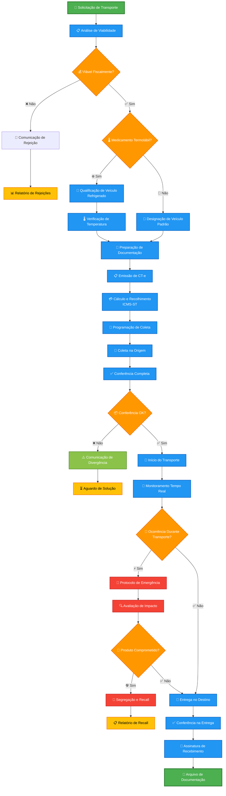
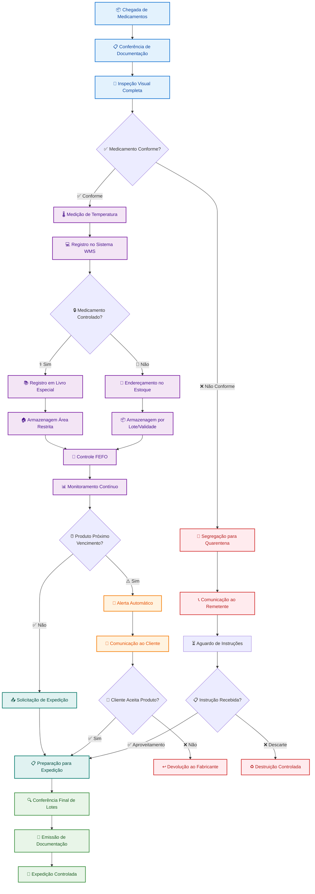
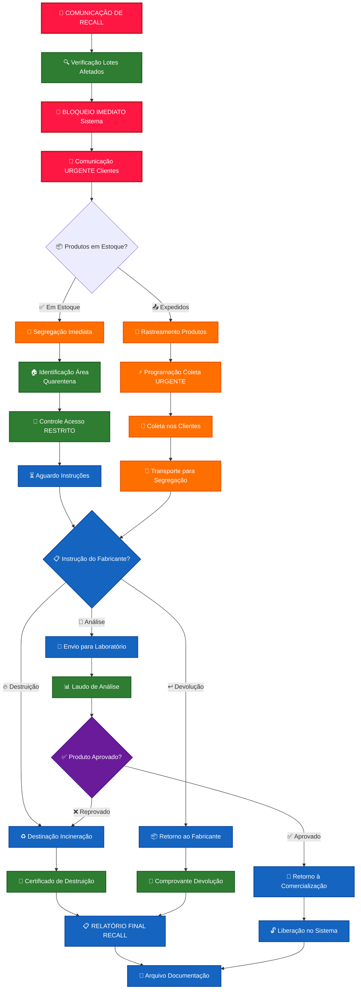
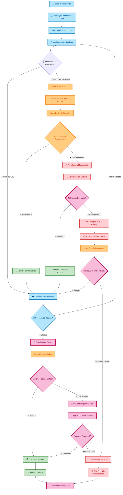
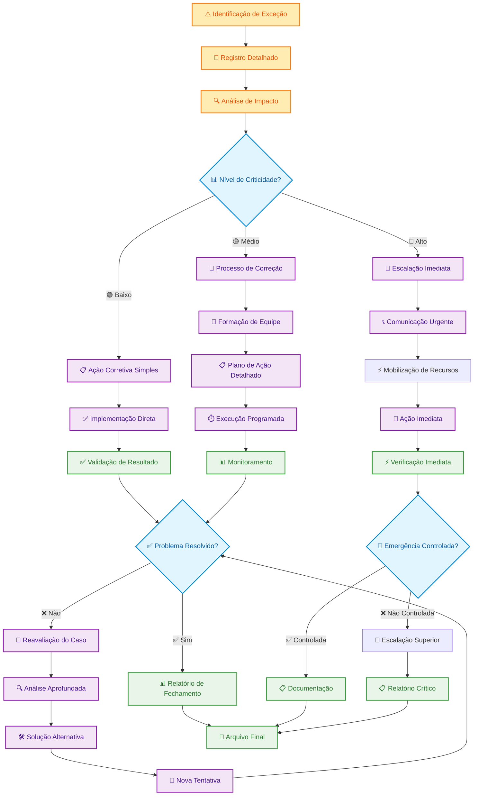

# PROCEDIMENTO OPERACIONAL PADRÃO

## FLUXOS TRANSPORTADORA - MEDICAMENTOS - VERSÃO 2.0

### SUMÁRIO

1. **OBJETIVO** ........................................................................... 3
2. **ALCANCE** ........................................................................... 3
3. **DEFINIÇÕES E CONCEITOS** .......................................................... 4
4. **BASE LEGAL** ........................................................................ 6
5. **OPERAÇÕES DE TRANSPORTE E ARMAZENAGEM** ........................................ 7
6. **METODOLOGIA E PROCEDIMENTOS** ................................................... 12
7. **CONTROLES E VALIDAÇÕES** ......................................................... 17
8. **ASPECTOS OPERACIONAIS** .......................................................... 20
9. **FLUXOS E PROCESSOS** ............................................................. 23
10. **ASPECTOS CONTÁBEIS E FISCAIS** ................................................. 31
11. **DOCUMENTAÇÃO E ANEXOS** ......................................................... 36
12. **PERGUNTAS FREQUENTES E TROUBLESHOOTING** ..................................... 38

---

# 1. OBJETIVO

Este Procedimento Operacional Padrão tem por objetivo estabelecer diretrizes operacionais, fiscais e sanitárias detalhadas para todas as atividades de transporte e armazenamento realizadas pela empresa, com ênfase especial nos procedimentos específicos para medicamentos e produtos farmacêuticos. O documento visa assegurar o cumprimento integral das obrigações tributárias federais e estaduais estabelecidas pela legislação fiscal brasileira, bem como das exigências sanitárias determinadas pela ANVISA através das Resoluções de Diretoria Colegiada aplicáveis, promovendo a padronização de processos, a mitigação de riscos operacionais e de compliance, e a garantia da qualidade e segurança dos medicamentos durante toda a cadeia logística.

# 2. ALCANCE

Este POP aplica-se a todas as operações de transporte rodoviário de cargas e armazenagem realizadas pela empresa em território nacional, incluindo operações interestaduais e internas, com abrangência específica na região Nordeste e Estado de Sergipe onde a empresa mantém operações diretas. O escopo contempla desde o recebimento da solicitação de transporte até a entrega final ao destinatário, incluindo procedimentos de armazenagem temporária e permanente, controle de qualidade farmacêutica, documentação fiscal e sanitária, rastreabilidade de lotes, controle de temperatura para medicamentos termolábeis, procedimentos especiais para medicamentos controlados, e todos os controles exigidos pela legislação sanitária e tributária aplicável.

O procedimento abrange especificamente as seguintes modalidades operacionais: transporte direto de medicamentos com coleta e entrega imediata, armazenagem com posterior distribuição incluindo consolidação de cargas, transferências entre filiais da empresa, operações de devolução e recall de produtos farmacêuticos, e todos os controles fiscais relacionados ao regime de substituição tributária aplicável a medicamentos, bem como procedimentos específicos para atendimento às particularidades da legislação estadual de Sergipe e demais estados nordestinos.

# 3. DEFINIÇÕES E CONCEITOS

## 3.1 Definições Operacionais

**Transporte Farmacêutico:** Constitui prestação de serviço de transporte rodoviário especializado de medicamentos, produtos farmacêuticos e correlatos entre estabelecimentos da cadeia de distribuição, sujeita à incidência de ICMS conforme legislação estadual de origem do prestador e às exigências sanitárias específicas da RDC 430/2020 da ANVISA. Esta atividade engloba desde o carregamento da mercadoria no estabelecimento remetente até sua entrega no destinatário final, incluindo eventuais paradas técnicas, procedimentos de armazenagem temporária, controle contínuo de temperatura para produtos termolábeis, e manutenção da rastreabilidade completa de todos os lotes transportados.

**Armazenagem Farmacêutica:** Atividade de guarda e conservação de medicamentos e produtos correlatos em depósito ou armazém especializado, prestada mediante remuneração e caracterizando-se como serviço logístico complementar ao transporte. Esta atividade exige condições especiais de temperatura controlada, umidade relativa adequada, controle sanitário rigoroso, segregação por tipos de produtos e lotes, sistema de rastreabilidade eletrônica, responsável técnico farmacêutico legalmente habilitado, e cumprimento integral das Boas Práticas de Armazenagem estabelecidas pela ANVISA.

**Substituto Tributário:** Estabelecimento responsável pelo recolhimento antecipado do ICMS devido nas operações subsequentes da cadeia produtiva, regime amplamente aplicado no segmento farmacêutico através dos Convênios ICMS específicos, especialmente o Convênio ICMS 234/2017 que estabelece metodologia nacional baseada no Preço Médio Ponderado ao Consumidor Final (PMPF) para cálculo do ICMS-ST sobre medicamentos.

**Cadeia Fria Farmacêutica:** Sistema logístico especializado que mantém medicamentos termolábeis em condições controladas de temperatura entre 2°C e 8°C durante toda cadeia de distribuição, desde a saída do fabricante até a dispensação ao consumidor final, utilizando equipamentos de refrigeração validados, monitoramento contínuo através de data loggers calibrados, procedimentos específicos de carregamento e descarregamento, e protocolos de emergência para situações de quebra da cadeia fria.

## 3.2 Conceitos Técnicos

### 3.2.1 Conceitos Tributários Específicos

**ICMS sobre Transporte:** Imposto estadual incidente sobre prestações de serviços de transporte interestadual e intermunicipal, calculado sobre o valor total do frete incluindo despesas acessórias como seguro, pedágio e taxas administrativas. Para medicamentos, aplica-se simultaneamente sobre o valor do frete e sobre o valor das mercadorias em regime de substituição tributária, exigindo controles específicos para correta apuração e recolhimento.

**PMPF - Preço Médio Ponderado ao Consumidor Final:** Base de cálculo fundamental para determinação do ICMS-ST em medicamentos, estabelecida mensalmente por cada estado através de levantamento dos preços praticados no mercado varejista farmacêutico. O PMPF considera diferentes canais de distribuição, variações regionais de preços, e eventual sazonalidade na comercialização, constituindo referência nacional harmonizada para aplicação do regime de substituição tributária.

**DIFAL - Diferencial de Alíquota:** Tributo devido ao estado de destino em operações interestaduais destinadas a consumidor final não contribuinte do ICMS, calculado pela diferença entre a alíquota interna do estado de destino e a alíquota interestadual aplicada na operação, recolhido através de GNRE específica antes do início do transporte.

### 3.2.2 Conceitos Sanitários Fundamentais

**Boas Práticas de Distribuição:** Conjunto de normas técnicas estabelecidas pela RDC 430/2020 que definem padrões mínimos de qualidade para todas as operações de distribuição, armazenagem e transporte de medicamentos, incluindo qualificação de fornecedores, validação de equipamentos, treinamento de pessoal, controle de documentação, sistema de qualidade, e procedimentos de recall.

**Rastreabilidade Farmacêutica:** Sistema que permite identificação e localização de qualquer lote específico de medicamento em toda cadeia de distribuição, desde a fabricação até a dispensação ao consumidor final, utilizando códigos únicos de identificação, registro eletrônico de todas as movimentações, e integração com o Sistema Nacional de Controle de Medicamentos (SNCM) quando aplicável.

**Validação de Sistemas Críticos:** Processo documentado que demonstra que equipamentos, sistemas e procedimentos utilizados no transporte e armazenagem de medicamentos operam consistentemente conforme especificações estabelecidas, incluindo qualificação de equipamentos de refrigeração, calibração de instrumentos de medição, mapeamento térmico de veículos e armazéns, e teste de integridade de sistemas de monitoramento.

# 4. BASE LEGAL

## 4.1 Legislação Federal

**Lei Complementar 87/1996 (Lei Kandir):** Estabelece normas gerais do ICMS definindo competências estaduais, princípios de não cumulatividade, e determinando que o ICMS sobre serviços de transporte é devido ao estado de origem da prestação. Esta lei fundamental estabelece também os critérios para aplicação de regimes especiais como substituição tributária e diferimento, essenciais para compreensão da tributação no setor logístico farmacêutico.

**Lei 11.903/2009 (Lei de Controle e Rastreabilidade):** Institui sistema nacional de controle e rastreabilidade na cadeia dos produtos farmacêuticos, estabelecendo obrigações de monitoramento desde a fabricação até a dispensação ao consumidor final através de códigos únicos de identificação, registro eletrônico de movimentações, e integração com sistemas de farmacovigilância. Esta norma impacta diretamente as operações logísticas exigindo controles específicos de lote e rastreabilidade.

**Decreto 7.508/2011:** Regulamenta a Lei 8.080/1990 estabelecendo requisitos sanitários específicos para cadeia fria farmacêutica e boas práticas de distribuição, definindo protocolos de temperatura, procedimentos de validação, sistema de qualidade, controle de fornecedores, e critérios de qualificação profissional que devem ser observados por todos os agentes da cadeia logística farmacêutica.

**Convênio ICMS 234/2017:** Institui regime nacional de substituição tributária para medicamentos determinando metodologia de cálculo baseada no Preço Médio Ponderado ao Consumidor Final (PMPF), com atualizações periódicas por cada unidade federativa, margens de valor agregado específicas por categoria terapêutica, e procedimentos harmonizados para apuração e recolhimento do ICMS-ST em todo território nacional.

## 4.2 Legislação Estadual

**RICMS dos Estados Nordestinos:** Os regulamentos estaduais do ICMS de Alagoas (Lei 5.900/1996), Bahia (Decreto 13.780/2012), Ceará (Decreto 24.569/1997), Maranhão (Decreto 17.674/2001), Paraíba (Decreto 18.930/1997), Pernambuco (Decreto 14.876/1991), Piauí (Decreto 13.500/2008), Rio Grande do Norte (Decreto 13.640/1997) e Sergipe (Decreto 21.400/2002) estabelecem alíquotas específicas, procedimentos de substituição tributária, exigências documentais, benefícios fiscais regionais, e obrigações acessórias que impactam diretamente as operações interestaduais da empresa na região Nordeste.

**Decreto 21.400/2002 (RICMS-SE):** Regulamento específico de Sergipe estabelece alíquota interna de 19% para serviços de transporte podendo haver adicional para Fundo Especial de Combate à Pobreza (FECP), procedimentos específicos de recolhimento antecipado para operações interestaduais através de GNRE-SE, metodologia estadual de aplicação do PMPF para medicamentos considerando particularidades do mercado sergipano, e regime especial de tributação para operações com órgãos públicos de saúde.

## 4.3 Normas e Regulamentações Específicas

**RDC 430/2020 da ANVISA:** Estabelece Boas Práticas de Distribuição, Armazenagem e Transporte de Medicamentos definindo padrões técnicos de infraestrutura, procedimentos operacionais, sistema de qualidade, controle de fornecedores, qualificação de equipamentos, treinamento de pessoal, documentação obrigatória, e critérios de responsabilidade técnica que devem ser atendidos por todas as empresas que operam na cadeia de distribuição farmacêutica.

**Portaria 344/1998 da ANVISA:** Regulamenta substâncias e medicamentos sujeitos a controle especial estabelecendo procedimentos específicos para transporte, armazenagem, dispensação e controle de medicamentos controlados, incluindo exigências de documentação especial, livros de registro, balanços periódicos, sistema de dupla conferência, área de armazenagem com acesso restrito, e responsabilidade técnica específica para farmacêutico habilitado.

**Resolução ANTT 5.232/2016:** Estabelece requisitos técnicos para transporte rodoviário de produtos perigosos incluindo alguns medicamentos específicos, definindo procedimentos de classificação, acondicionamento, sinalização, documentação de emergência, treinamento de condutores, e equipamentos de segurança que devem ser observados quando aplicáveis a determinadas categorias de produtos farmacêuticos.

# 5. OPERAÇÕES DE TRANSPORTE E ARMAZENAGEM

## 5.1 Classificação das Operações

### 5.1.1 Transporte Direto de Medicamentos

O transporte direto constitui modalidade operacional caracterizada pela coleta de medicamentos diretamente no estabelecimento remetente com entrega imediata ao destinatário final, sem armazenagem intermediária prolongada. Esta modalidade é especialmente adequada para medicamentos termolábeis que exigem manutenção rigorosa da cadeia fria, produtos de alto valor agregado que demandam minimização do tempo de trânsito, e medicamentos com prazo de validade reduzido que necessitam comercialização urgente.

O procedimento inicia-se com análise prévia da viabilidade operacional considerando compatibilidade entre origem e destino, disponibilidade de veículo adequado às características específicas da carga, condições climáticas previstas para o trajeto, e eventual necessidade de equipamentos especiais como sistemas de refrigeração ou monitoramento em tempo real. Para medicamentos controlados, deve ser verificada previamente a disponibilidade de documentação especial e eventual necessidade de escolta ou procedimentos adicionais de segurança.

A qualificação do veículo para transporte direto deve considerar capacidade de carga compatível com volume a transportar, sistema de refrigeração validado para medicamentos termolábeis, equipamentos de monitoramento de temperatura com data logger calibrado, sistema de rastreamento em tempo real, e isolamento térmico adequado para proteção contra variações climáticas externas. O motorista designado deve possuir treinamento específico em procedimentos farmacêuticos e certificação para transporte de cargas especiais.

### 5.1.2 Armazenagem com Distribuição Posterior

A armazenagem farmacêutica caracteriza-se pela guarda temporária ou prolongada de medicamentos em instalações especializadas, seguida de distribuição conforme demanda dos clientes. Esta modalidade permite consolidação de cargas de diferentes origens, otimização de rotas de distribuição, manutenção de estoque de segurança para atendimento de demanda urgente, e prestação de serviços logísticos complementares como fracionamento de lotes e reembalagem quando autorizada.

As instalações de armazenagem devem atender rigorosamente às especificações da RDC 430/2020 incluindo controle ambiental com temperatura e umidade monitoradas continuamente, segregação física entre diferentes tipos de produtos, área específica para quarentena de produtos em análise ou desacordo sanitário, sistema de endereçamento que facilite localização e rastreabilidade, e área restrita para medicamentos controlados com acesso limitado a pessoas autorizadas.

O sistema de gestão de estoque deve operar em tempo real permitindo controle preciso de lotes e validades, aplicação automática do princípio FEFO (First Expired, First Out), alertas preventivos para produtos próximos ao vencimento, rastreabilidade completa desde recebimento até expedição, e integração com sistema fiscal para correlação adequada entre movimentação física e documentação tributária correspondente.

### 5.1.3 Operações Interestaduais Especializadas

As operações interestaduais para a região Nordeste exigem procedimentos específicos que consideram particularidades da legislação tributária de cada estado, condições climáticas regionais que podem impactar a conservação de medicamentos, infraestrutura logística variável entre diferentes localidades, e eventual necessidade de atendimento a regiões de difícil acesso com recursos limitados.

A documentação fiscal para operações interestaduais deve incluir nota fiscal de remessa emitida conforme legislação do estado de origem, CT-e com todas as informações obrigatórias incluindo identificação de lotes e condições de transporte, GNRE para recolhimento de ICMS-ST e eventual DIFAL calculados conforme alíquotas vigentes no estado de destino, e documentação sanitária específica quando exigida pela vigilância sanitária estadual do destino.

## 5.2 Procedimentos por Estado de Destino

### 5.2.1 Sergipe - Operações Especializadas

Sergipe apresenta particularidades operacionais específicas decorrentes da instalação de unidade da empresa no estado, exigindo procedimentos diferenciados para operações internas, recebimento de mercadorias de outras unidades, e distribuição para clientes locais e demais estados nordestinos. A unidade sergipana deve manter licenciamento sanitário completo junto à VISA-SE, responsável técnico farmacêutico inscrito no CRF-SE, e autorização especial para medicamentos controlados quando aplicável.

**Estrutura Tributária Sergipana:** O RICMS-SE estabelece alíquota de 19% para transporte interno podendo haver adicional de FECP, procedimento específico para recolhimento antecipado em operações de saída para outros estados através de GNRE-SE gerada no portal da SEFAZ, e metodologia própria de aplicação do PMPF considerando preços praticados no mercado sergipano com atualização mensal através de Portaria específica.

**Controles Operacionais em Sergipe:** Toda operação deve ser precedida de análise fiscal específica identificando regime tributário aplicável, eventual incidência de benefícios fiscais estaduais, e necessidade de recolhimento antecipado. A documentação deve ser emitida sequencialmente sem emendas ou rasuras, com backup automático em sistema certificado digitalmente pela SEFAZ-SE, e arquivamento organizado para facilitar eventual fiscalização estadual.

### 5.2.2 Demais Estados Nordestinos

**Bahia:** Aplicação de alíquota interna de 18% para transporte, regime de ST conforme Convênio ICMS 234/17 com PMPF atualizado pela SEFAZ-BA, procedimento específico para operações com Salvador que podem ter tratamento diferenciado, e exigência de GNRE-BA para operações interestaduais com recolhimento antecipado.

**Pernambuco:** Utilização de alíquota de 18% para operações internas, aplicação integral do regime de ST para medicamentos com base no PMPF pernambucano, procedimento especial para operações destinadas à região metropolitana do Recife, e eventual benefício para medicamentos destinados a programas estaduais de saúde.

**Ceará:** Incidência de alíquota de 18% para transporte interno, regime de ST harmonizado com demais estados através do Convênio nacional, procedimento específico para operações destinadas a municípios do interior com eventual diferimento, e controle especial para medicamentos destinados à rede pública estadual.

# 6. METODOLOGIA E PROCEDIMENTOS

## 6.1 Procedimentos Padrão

### 6.1.1 Etapa Preparatória

**Passo 1 - Análise da Solicitação:** Recebida solicitação de transporte através dos canais oficiais da empresa, deve ser realizada análise completa identificando tipo de medicamento a transportar, origem e destino da operação, condições especiais exigidas como refrigeração ou controle especial, prazo de entrega solicitado, e eventual compatibilidade com outras cargas para otimização logística. Para medicamentos controlados deve ser verificada previamente a documentação de autorização específica.

**Passo 2 - Qualificação Fiscal:** Identificação do regime tributário aplicável considerando classificação fiscal NCM dos produtos, enquadramento em substituição tributária ou regime especial, alíquotas incidentes conforme origem e destino, eventual aplicação de benefícios fiscais, e necessidade de recolhimento antecipado através de GNRE. Para operações interestaduais deve ser calculado eventual DIFAL quando aplicável.

**Passo 3 - Seleção de Recursos:** Designação de veículo adequado às características da carga considerando capacidade, sistema de refrigeração quando necessário, equipamentos de monitoramento, e qualificação para transporte farmacêutico. Seleção de motorista com treinamento específico em procedimentos farmacêuticos e eventual certificação para transporte de produtos controlados.

**Passo 4 - Preparação Documental:** Emissão de toda documentação fiscal obrigatória incluindo nota fiscal de remessa ou prestação de serviço, CT-e com informações completas de lote e condições de transporte, guias de recolhimento tributário quando necessárias, e documentação sanitária específica. Verificação da numeração sequencial e integridade de todos os documentos.

### 6.1.2 Etapa de Execução

**Passo 1 - Coleta Especializada:** Chegada ao local de origem com verificação das condições de temperatura do compartimento de carga, conferência detalhada da documentação fiscal e sanitária, inspeção visual das embalagens verificando integridade e identificação correta, medição e registro da temperatura dos produtos termolábeis, e carregamento seguindo procedimentos específicos para cada tipo de medicamento.

**Passo 2 - Monitoramento Durante Transporte:** Ativação de sistema de monitoramento em tempo real incluindo rastreamento GPS, monitoramento contínuo de temperatura com alertas automáticos para desvios, comunicação periódica com central de operações, e registro de eventuais paradas técnicas ou ocorrências durante trajeto. Para medicamentos controlados deve ser mantido controle adicional de segurança.

**Passo 3 - Gestão de Ocorrências:** Em caso de qualquer anormalidade durante transporte como variação de temperatura fora dos parâmetros, avaria mecânica, acidente, ou qualquer situação que possa comprometer a integridade dos medicamentos, deve ser imediatamente acionado protocolo de emergência incluindo comunicação com responsável técnico, avaliação da necessidade de medidas corretivas, e eventual transferência da carga para veículo backup.

**Passo 4 - Entrega Controlada:** Chegada ao destino com verificação das condições de recebimento, conferência completa da documentação e identificação dos lotes, inspeção visual final das embalagens, medição da temperatura de chegada para produtos termolábeis, e obtenção de comprovante de entrega assinado pelo destinatário ou pessoa autorizada incluindo eventual ressalva identificada.

### 6.1.3 Etapa de Finalização

**Passo 1 - Documentação de Encerramento:** Download e análise dos dados de monitoramento de temperatura, elaboração de relatório de transporte incluindo todas as condições mantidas durante trajeto, arquivo organizado de toda documentação da operação, e eventual comunicação de ocorrências identificadas durante transporte que possam impactar a qualidade dos medicamentos.

**Passo 2 - Controle de Qualidade:** Análise dos dados coletados durante transporte verificando conformidade com padrões estabelecidos, identificação de eventual desvio ou não conformidade, comunicação ao responsável técnico sobre condições mantidas, e eventual necessidade de segregação de produtos que possam ter sido comprometidos durante transporte.

**Passo 3 - Registro Contábil-Fiscal:** Lançamento da operação no sistema fiscal da empresa, conciliação entre documentação emitida e valores recolhidos, arquivo da documentação conforme exigências legais, e eventual ajuste ou complementação de tributos quando identificadas divergências no cálculo original.

## 6.2 Procedimentos Especiais

### 6.2.1 Medicamentos Termolábeis

Medicamentos termolábeis exigem procedimentos específicos que garantam manutenção da temperatura entre 2°C e 8°C durante todo período de transporte. O veículo deve ser pré-condicionado à temperatura adequada antes do carregamento, com verificação do funcionamento de todos os sistemas de refrigeração, calibração dos equipamentos de medição, e teste da autonomia do sistema em caso de falha da alimentação principal.

O carregamento deve ser realizado rapidamente para minimizar exposição à temperatura ambiente, com disposição adequada dos produtos para permitir circulação uniforme do ar refrigerado, utilização de isolamento térmico complementar quando necessário, e posicionamento de sensores de temperatura em pontos críticos da carga. Durante transporte deve ser evitada abertura desnecessária do compartimento refrigerado.

### 6.2.2 Medicamentos Controlados

O transporte de medicamentos controlados deve seguir rigorosamente a Portaria 344/1998 da ANVISA incluindo documentação especial de autorização, sistema de dupla conferência no carregamento e descarregamento, identificação clara da natureza controlada da carga, procedimentos adicionais de segurança durante transporte, e controle específico de acesso restrito às pessoas autorizadas para manuseio.

A documentação deve incluir autorização específica da ANVISA para transporte, identificação completa do responsável técnico, relação detalhada de todos os lotes transportados, comprovante de origem lícita dos produtos, e eventual autorização especial para transporte interestadual quando exigida pela legislação estadual do destino.

# 7. CONTROLES E VALIDAÇÕES

## 7.1 Controles Documentais

### 7.1.1 Documentos Obrigatórios

**Documentação Fiscal Básica:** Nota fiscal eletrônica de remessa ou prestação de serviço emitida conforme legislação do estado de origem, com classificação fiscal correta NCM, código de situação tributária (CST) apropriado, destaque adequado de ICMS próprio e ICMS-ST quando aplicável, e informações complementares sobre lotes e condições especiais de transporte quando exigidas pela natureza dos medicamentos.

**Conhecimento de Transporte Eletrônico (CT-e):** Documento fiscal específico para prestação de serviço de transporte contendo identificação completa do prestador e tomador, descrição detalhada da carga incluindo lotes e validades, condições especiais de transporte como temperatura controlada, valor do frete discriminando ICMS incidente, e eventual destaque de recolhimento antecipado quando exigido pela legislação estadual.

**Documentação Tributária Complementar:** GNRE para recolhimento de ICMS-ST calculado conforme PMPF vigente no estado de destino, eventual GNRE para DIFAL em operações destinadas a consumidor final não contribuinte, comprovante de pagamento das guias emitidas, e eventual documentação específica para operações beneficiadas por incentivos fiscais estaduais ou federais.

**Documentação Sanitária Específica:** Autorização de Funcionamento da empresa emitida pela ANVISA, Licença de Funcionamento da unidade expedida pela vigilância sanitária estadual, Certificado de Responsabilidade Técnica do farmacêutico responsável, autorização especial para medicamentos controlados quando aplicável, e eventual documentação complementar exigida por estados específicos.

### 7.1.2 Validações Documentais

**Conferência de Autenticidade:** Verificação da validade e autenticidade de todas as licenças sanitárias dos estabelecimentos envolvidos na operação, confirmação da regularidade do responsável técnico junto ao conselho profissional competente, validação dos números de registro dos medicamentos junto à ANVISA, e eventual verificação de autorizações especiais para produtos sujeitos a controle especial.

**Verificação de Completude:** Checklist completo de toda documentação exigida para o tipo específico de operação, verificação da presença de todas as informações obrigatórias em cada documento, confirmação da correlação adequada entre documentação fiscal e sanitária, e validação da sequência numérica dos documentos emitidos.

**Controle de Vencimentos:** Monitoramento sistemático dos prazos de validade de todas as licenças e autorizações utilizadas, alerta preventivo para documentos próximos ao vencimento, renovação antecipada de documentação essencial, e manutenção de arquivo organizado com controle de validades para facilitar gestão proativa.

**Validação de Cálculos Fiscais:** Conferência detalhada dos cálculos de ICMS próprio e ICMS-ST utilizando tabelas oficiais vigentes, validação das alíquotas aplicadas conforme origem e destino da operação, verificação da aplicação correta de benefícios fiscais quando applicable, e eventual recálculo quando identificadas divergências nos valores originais.

## 7.2 Controles Operacionais

### 7.2.1 Checklist de Validação Operacional

- ✅ **Qualificação de Veículo:** Certificado de qualificação válido, sistema de refrigeração testado e funcionando adequadamente, equipamentos de monitoramento calibrados, isolamento térmico íntegro, sistema de rastreamento ativo
- ✅ **Qualificação de Motorista:** Treinamento em procedimentos farmacêuticos concluído, certificação para transporte de cargas especiais válida, conhecimento dos procedimentos de emergência, documentação pessoal regular
- ✅ **Condições de Carregamento:** Temperatura do compartimento adequada antes do carregamento, produtos organizados para circulação adequada do ar, sensores posicionados corretamente, isolamento complementar quando necessário
- ✅ **Documentação de Transporte:** CT-e emitido corretamente, documentação fiscal completa e regular, autorizações especiais quando necessárias, comprovantes de recolhimento tributário
- ✅ **Sistema de Monitoramento:** Data logger ativado e funcionando, sistema GPS operacional, comunicação com central estabelecida, alarmes configurados adequadamente

### 7.2.2 Controles de Qualidade Farmacêutica

**Controle de Temperatura:** Monitoramento contínuo através de sistema eletrônico validado, registro automático de dados em intervalos regulares, alarmes configurados para temperatura fora da faixa especificada, procedimento de emergência definido para situações de desvio, e relatório detalhado de todas as condições mantidas durante transporte.

**Controle de Rastreabilidade:** Sistema eletrônico integrado que permite localização imediata de qualquer lote específico, registro de todas as movimentações com identificação de responsáveis, correlação entre documentação física e registros eletrônicos, e capacidade de rastreabilidade reversa para atendimento de eventual recall ou investigação sanitária.

**Controle de Integridade:** Inspeção visual sistemática das embalagens antes do carregamento e após chegada ao destino, registro fotográfico de eventual dano identificado, procedimento específico para produtos danificados incluindo segregação e comunicação ao responsável técnico, e documentação detalhada de todas as ocorrências identificadas.

**Verificação de Lotes e Validades:** Conferência detalhada de todos os lotes transportados contra documentação de origem, verificação de datas de validade com alerta para produtos próximos ao vencimento, aplicação do princípio FEFO em operações de armazenagem, e comunicação proativa sobre produtos com prazo reduzido.

# 8. ASPECTOS OPERACIONAIS

## 8.1 Responsabilidades

### 8.1.1 Responsabilidades por Função

**Responsável Técnico Farmacêutico:**

- Supervisão técnica de todas as operações farmacêuticas garantindo cumprimento das Boas Práticas de Distribuição
- Aprovação de procedimentos operacionais específicos para cada tipo de medicamento transportado ou armazenado
- Análise técnica de desvios de temperatura ou outras não conformidades identificadas durante operações
- Comunicação com autoridades sanitárias em situações que exijam notificação compulsória
- Supervisão de treinamento específico para pessoal envolvido em operações farmacêuticas

**Coordenador de Operações:**

- Planejamento e programação de todas as operações de transporte e armazenagem
- Alocação de recursos humanos e materiais conforme demanda operacional
- Monitoramento de indicadores de desempenho operacional e qualidade de serviço
- Coordenação com equipe comercial para atendimento adequado das necessidades dos clientes
- Gestão de situações de emergência e acionamento de protocolos específicos

**Analista Fiscal:**

- Análise prévia de viabilidade fiscal para todas as operações solicitadas
- Cálculo correto de todos os tributos incidentes conforme legislação aplicável
- Emissão de documentação fiscal em conformidade com exigências legais
- Acompanhamento de alterações na legislação tributária federal e estadual
- Suporte técnico para resolução de questões fiscais complexas

**Motorista Especializado:**

- Transporte seguro mantendo todas as condições especiais exigidas para medicamentos
- Monitoramento contínuo das condições da carga durante todo trajeto
- Comunicação imediata de qualquer anormalidade identificada durante transporte
- Aplicação de procedimentos de emergência quando necessário
- Manutenção de registro detalhado de todas as atividades realizadas

### 8.1.2 Matriz de Responsabilidades - RACI

| Atividade               | Resp. Técnico | Coord. Operações | Analista Fiscal | Motorista |
| ----------------------- | ------------- | ---------------- | --------------- | --------- |
| Análise de Solicitação  | C             | R                | A               | I         |
| Qualificação Fiscal     | I             | C                | R               | I         |
| Seleção de Veículo      | A             | R                | I               | C         |
| Emissão de Documentação | C             | I                | R               | I         |
| Carregamento            | R             | A                | I               | R         |
| Transporte              | R             | C                | I               | R         |
| Monitoramento           | A             | R                | I               | R         |
| Tratamento de Desvios   | R             | A                | C               | R         |
| Entrega                 | A             | C                | I               | R         |

*R=Responsável, A=Aprovador, C=Consultado, I=Informado*

## 8.2 Prazos e Cronogramas

### 8.2.1 Prazos Regulamentares

**Prazo de Emissão de CT-e:** 24 horas antes do início da prestação do serviço conforme estabelecido pela legislação federal, sendo recomendada emissão com antecedência superior para permitir validação e eventual correção de inconsistências identificadas antes do início efetivo do transporte.

**Prazo de Recolhimento de ICMS-ST:** Até o 10º dia do mês subsequente ao da operação para operações internas, ou antes do início do transporte para operações interestaduais que exijam recolhimento antecipado conforme legislação específica de cada estado de destino.

**Prazo de Entrega de Medicamentos:** Conforme acordado comercialmente com cada cliente, considerando condições especiais como medicamentos termolábeis que exigem entrega prioritária, produtos próximos ao vencimento, ou situações de emergência que demandem tratamento urgente.

**Prazo de Arquivo de Documentação:** Mínimo de 5 anos conforme exigência legal, sendo recomendado prazo superior para documentação crítica relacionada a medicamentos controlados ou produtos sujeitos a investigações sanitárias prolongadas.

### 8.2.2 Cronograma de Atividades Tipo

**Fase 1 - Planejamento (D-2 a D-1):** Recebimento e análise de solicitações, qualificação fiscal das operações, seleção e preparação de recursos, emissão de documentação fiscal e sanitária, programação de coletas e entregas.

**Fase 2 - Execução (D0):** Coleta especializada na origem, carregamento controlado, início do transporte com monitoramento contínuo, gestão proativa de eventuais ocorrências, entrega controlada no destino.

**Fase 3 - Finalização (D+1 a D+2):** Análise de dados de monitoramento, elaboração de relatórios operacionais, arquivo organizado de documentação, lançamentos contábeis e fiscais, comunicação de resultados aos stakeholders.

## 8.3 Indicadores de Desempenho

### 8.3.1 Indicadores de Qualidade

**Taxa de Manutenção da Cadeia Fria:** Percentual de operações com medicamentos termolábeis que mantiveram temperatura dentro da faixa especificada durante 100% do tempo de transporte, com meta mínima de 99,5% para demonstração de excelência operacional.

**Índice de Conformidade Documental:** Percentual de operações com documentação fiscal e sanitária 100% conforme exigências legais na primeira verificação, sem necessidade de correções posteriores, com meta mínima de 98%.

**Taxa de Entregas no Prazo:** Percentual de entregas realizadas dentro do prazo acordado com cliente, considerando eventual tolerância para situações excepcionais como condições climáticas adversas ou emergências de trânsito, com meta mínima de 95%.

### 8.3.2 Indicadores de Eficiência

**Tempo Médio de Carregamento:** Tempo decorrido desde chegada do veículo até conclusão do carregamento, medido separadamente para medicamentos convencionais (meta: máximo 30 minutos) e termolábeis (meta: máximo 15 minutos).

**Taxa de Utilização de Veículos:** Percentual de aproveitamento da capacidade de carga dos veículos, considerando limitações específicas para medicamentos que podem exigir segregação ou condições especiais, com meta mínima de 80%.

**Índice de Ocorrências Zero:** Percentual de operações concluídas sem qualquer tipo de ocorrência (desvio de temperatura, avaria, atraso, documentação), demonstrando excelência operacional com meta mínima de 92%.

# 9. FLUXOS E PROCESSOS

## 9.1 Fluxo Padrão

### 9.1.1 Representação Gráfica - Transporte de Medicamentos



### 9.1.2 Fluxograma de Armazenagem Controlada



### 9.1.3 Fluxograma de Recall de Emergência



### 9.1.4 Fluxograma de Controle de Temperatura



## 9.2 Fluxos Especiais

### 9.2.1 Tratamento de Exceções e Não Conformidades



### 9.2.2 Matriz de Processo de Correção

| Passo | Ação Corretiva Detalhada                                                      | Responsável           | Prazo          | Validação           |
| ----- | ----------------------------------------------------------------------------- | --------------------- | -------------- | ------------------- |
| 1     | Identificação e isolamento do problema com documentação fotográfica detalhada | Operador de Campo     | Imediato       | Responsável Técnico |
| 2     | Comunicação imediata às partes interessadas incluindo cliente e supervisão    | Coordenador           | 30 minutos     | Gerente Operacional |
| 3     | Análise de causa raiz utilizando metodologia estruturada (5 Porquês)          | Equipe Técnica        | 2 horas        | Responsável Técnico |
| 4     | Desenvolvimento de plano de ação com cronograma específico                    | Coordenador           | 4 horas        | Gerente Operacional |
| 5     | Implementação das ações corretivas com monitoramento contínuo                 | Equipe Designada      | Conforme plano | Responsável Técnico |
| 6     | Verificação da eficácia das ações através de indicadores específicos          | Analista de Qualidade | 24 horas       | Gerente Operacional |
| 7     | Documentação completa do caso com lições aprendidas                           | Coordenador           | 48 horas       | Responsável Técnico |
| 8     | Atualização de procedimentos quando necessário                                | Equipe Técnica        | 7 dias         | Gerente Operacional |

# 10. ASPECTOS CONTÁBEIS E FISCAIS

## 10.1 Tratamento Contábil

### 10.1.1 Receitas de Transporte Farmacêutico

**Reconhecimento de Receita:** A receita de transporte de medicamentos deve ser reconhecida pelo regime de competência no momento da conclusão efetiva do serviço, ou seja, na entrega da mercadoria no destino final com comprovante assinado pelo destinatário. Para operações de armazenagem, o reconhecimento ocorre proporcionalmente ao período de prestação do serviço, com faturamento mensal ou conforme acordado contratualmente.

**Contas Envolvidas:** Débito em "Clientes - Serviços de Transporte" (Ativo Circulante) e crédito em "Receita de Prestação de Serviços" (Resultado). Para operações com substituição tributária, deve ser criada subconta específica "Receitas - Transporte Farmacêutico ST" para permitir controle segregado e facilitação de conciliações fiscais.

**Critério de Mensuração:** O valor da receita corresponde ao montante acordado com cliente, líquido de impostos sobre vendas (ICMS, PIS, COFINS, ISS quando aplicável), descontos concedidos, e eventual ajuste para valor presente quando o prazo de recebimento for superior a um ano. Para medicamentos termolábeis, eventuais custos adicionais de equipamentos especiais devem ser considerados na formação do preço.

### 10.1.2 Custos Operacionais Específicos

**Custos Diretos de Transporte:** Incluem combustível, pedágio, manutenção de veículos, salários e encargos de motoristas, seguro de carga, e eventual custo de equipamentos especiais como sistemas de refrigeração para medicamentos termolábeis. Estes custos devem ser apropriados diretamente às operações através de centro de custos específico.

**Custos Indiretos de Estrutura:** Abrangem licenças sanitárias, taxa ANVISA, honorários de responsável técnico, sistema de rastreamento, equipamentos de monitoramento de temperatura, treinamento especializado, e eventual consultoria técnica. Estes custos devem ser rateados às operações conforme critério técnico adequado como quilometragem percorrida ou valor da carga transportada.

**Provisões e Contingências:** Devem ser constituídas provisões para eventual multa por descumprimento de prazo, indenização por dano a medicamentos, custo de recall por responsabilidade do transportador, e contingências fiscais relacionadas a questionamentos sobre cálculos de ICMS-ST. O valor deve ser baseado em análise técnica de probabilidade de ocorrência.

## 10.2 Aspectos Fiscais

### 10.2.1 Obrigações Principais

**ICMS sobre Prestação de Serviço:** Incidência sobre o valor total do frete incluindo despesas acessórias, calculado conforme alíquota do estado de origem (geralmente 17% a 20% para operações internas e 7% ou 12% para interestaduais). Para medicamentos, deve ser observada eventual aplicação de benefício fiscal específico para produtos destinados a programas governamentais de saúde.

**ICMS Substituição Tributária:** Para medicamentos enquadrados no Convênio ICMS 234/17, deve ser verificado se o ICMS-ST foi corretamente recolhido pelo remetente substituto tributário, validando cálculo baseado no PMPF vigente e eventual necessidade de complementação quando identificadas diferenças entre estados de origem e destino.

**PIS e COFINS:** Incidência sobre receita de prestação de serviços conforme regime tributário da empresa (Lucro Real, Presumido ou Simples Nacional), com eventual direito a crédito sobre custos e despesas operacionais quando aplicável o regime não cumulativo. Para medicamentos, deve ser observada eventual aplicação de alíquota zero conforme legislação específica.

**ISS:** Eventual incidência municipal sobre serviços complementares como armazenagem, quando caracterizada como atividade-meio e não meramente acessória ao transporte principal. A alíquota varia conforme município (2% a 5%) e deve ser recolhida no local de prestação do serviço.

### 10.2.2 Obrigações Acessórias

**EFD-ICMS/IPI:** Entrega mensal de arquivo digital contendo todas as operações de entrada e saída, apuração do ICMS, controle de créditos e débitos, e informações sobre substituição tributária. Para medicamentos, deve ser observado o correto preenchimento do registro H005 com informações específicas sobre PMPF e MVA aplicados.

**SPED Contribuições:** Arquivo digital mensal para PIS e COFINS contendo detalhamento de receitas, custos, despesas, base de cálculo, e créditos apropriados. Para operações com medicamentos, deve ser mantida segregação adequada para facilitar eventual fiscalização sobre aplicação de benefícios específicos.

**DEFIS (para Simples Nacional):** Declaração anual simplificada contendo receita bruta total, eventual excesso de sublimite, base de cálculo e valor devido de ICMS-ST quando a empresa atuar como substituto tributário, e informações sobre atividades desenvolvidas. Para medicamentos, deve ser identificada especificamente a receita desta atividade.

**Escrituração Contábil Digital (ECD):** Quando obrigatória, deve conter todos os lançamentos contábeis relativos às operações de transporte e armazenagem de medicamentos, com plano de contas adequado para segregação das operações farmacêuticas das demais atividades da empresa.

### 10.2.3 Controles Fiscais Específicos

**Controle de PMPF:** Manutenção de tabela atualizada mensalmente com PMPF vigente em todos os estados de destino das operações, permitindo validação dos cálculos de ICMS-ST realizados pelos remetentes e eventual identificação de complementação necessária. Esta tabela deve ser integrada ao sistema de emissão de documentos fiscais.

**Controle de Benefícios Fiscais:** Registro detalhado de todas as operações beneficiadas por isenção, redução de base de cálculo, ou diferimento, incluindo fundamento legal, período de vigência, condições para fruição, e documentação comprobatória exigida. Este controle é essencial para defesa em eventual questionamento fiscal.

**Conciliação Mensal:** Procedimento de conciliação entre documentos fiscais emitidos, tributos recolhidos, movimentação financeira, e registros contábeis, identificando eventual divergência e promovendo correção imediata. Para medicamentos com ST, deve incluir conciliação específica dos valores de ICMS-ST destacados nos documentos.

# 11. DOCUMENTAÇÃO E ANEXOS

## 11.1 Modelos e Formulários

### 11.1.1 Checklist de Transporte de Medicamentos

Formulário padronizado para verificação de conformidade em todas as operações de transporte farmacêutico, incluindo itens específicos para medicamentos convencionais, termolábeis e controlados. Deve ser preenchido pelo responsável técnico ou pessoa designada antes do início de cada operação.

### 11.1.2 Relatório de Monitoramento de Temperatura

Modelo padronizado para registro das condições de temperatura mantidas durante transporte, incluindo gráfico de variação, identificação de eventuais desvios, ações corretivas adotadas, e aprovação técnica para liberação da carga. Deve acompanhar toda operação com medicamentos termolábeis.

### 11.1.3 Formulário de Recall

Template para comunicação de recall incluindo identificação do lote afetado, motivo do recolhimento, procedimentos específicos de coleta e segregação, prazo para conclusão, e responsabilidades de cada parte envolvida.

## 11.2 Tabelas de Referência

### 11.2.1 Tabela de PMPF por Estado

| Estado | Código NCM | PMPF Vigente | MVA Aplicável | Última Atualização |
| ------ | ---------- | ------------ | ------------- | ------------------ |
| SE     | 3004.90.99 | R$ 45,32     | 45,50%        | Janeiro/2025       |
| BA     | 3004.90.99 | R$ 47,18     | 46,20%        | Janeiro/2025       |
| PE     | 3004.90.99 | R$ 44,95     | 44,80%        | Janeiro/2025       |
| CE     | 3004.90.99 | R$ 46,77     | 45,90%        | Janeiro/2025       |

### 11.2.2 Alíquotas de ICMS por Estado

| Estado | Interna | Interestadual | FECP | Observações                          |
| ------ | ------- | ------------- | ---- | ------------------------------------ |
| SE     | 19%     | 7%/12%        | 2%   | Adicional FECP sobre base de cálculo |
| BA     | 18%     | 7%/12%        | 1%   | Redução para medicamentos genéricos  |
| PE     | 18%     | 7%/12%        | 1%   | Benefício para rede pública          |
| CE     | 18%     | 7%/12%        | 1%   | Isenção para programas sociais       |

# 12. PERGUNTAS FREQUENTES E TROUBLESHOOTING

## 12.1 Questões Técnicas

**Q: Como proceder quando há quebra da cadeia fria durante transporte?**

R: Deve ser imediatamente acionado o protocolo de emergência incluindo comunicação com responsável técnico farmacêutico, avaliação do tempo e extensão da quebra, verificação da integridade dos produtos através de inspeção visual e eventual análise laboratorial, segregação preventiva da carga, e comunicação aos stakeholders. A liberação dos produtos deve ser condicionada à aprovação técnica baseada em análise de risco conforme guidelines da ANVISA.

**Q: Qual a diferença entre PMPF e MVA no cálculo de ICMS-ST?**

R: O PMPF (Preço Médio Ponderado ao Consumidor Final) é o preço de referência estabelecido pelo estado com base em pesquisa de mercado, enquanto a MVA (Margem de Valor Agregado) é o percentual aplicado sobre o preço de aquisição para chegar à base de cálculo do ICMS-ST. A fórmula é: Base ST = (Preço + IPI + Frete + Despesas) × (1 + MVA), limitada ao PMPF quando este for menor.

**Q: É obrigatório ter farmacêutico responsável para transporte de todos os medicamentos?**

R: Sim, conforme RDC 430/2020 da ANVISA, é obrigatória a designação de responsável técnico farmacêutico para todas as atividades de distribuição, armazenagem e transporte de medicamentos, com responsabilidade técnica registrada no respectivo Conselho Regional de Farmácia.

## 12.2 Questões Operacionais

**Q: Como identificar se um medicamento é termolábil?**

R: A informação deve constar na embalagem do medicamento através de símbolos específicos (floco de neve), na documentação do fabricante, ou pode ser consultada no bulário oficial da ANVISA. Em caso de dúvida, deve ser solicitada orientação específica ao fabricante ou responsável técnico, adotando-se por precaução o protocolo de cadeia fria.

**Q: Qual o prazo para arquivo da documentação de transporte farmacêutico?**

R: O prazo legal mínimo é de 5 anos conforme legislação tributária, porém recomenda-se prazo superior para documentação crítica relacionada a medicamentos controlados, recall, ou investigações sanitárias. A documentação deve ser mantida de forma organizada e facilmente acessível para eventual fiscalização.

**Q: Como proceder em caso de divergência na entrega?**

R: Deve ser imediatamente registrada a divergência no comprovante de entrega com identificação clara do problema, comunicação ao coordenador de operações, registro fotográfico quando aplicável, segregação preventiva dos produtos envolvidos, e investigação para identificação da causa raiz. A resolução deve ser documentada e comunicada a todas as partes interessadas.

## 12.3 Questões Regulamentares

**Q: Quais são as principais diferenças entre RICMS dos estados nordestinos?**

R: As principais diferenças estão nas alíquotas internas (variando de 18% a 20%), adicional de FECP (1% a 2%), procedimentos específicos para recolhimento antecipado, benefícios para medicamentos destinados à rede pública, e metodologia de aplicação do PMPF. Cada estado mantém particularidades que devem ser observadas nas operações interestaduais.

**Q: Como é calculado o DIFAL para medicamentos?**

R: O DIFAL é calculado pela fórmula: (Alíquota interna do estado de destino - Alíquota interestadual) × Base de cálculo da operação. Para medicamentos com ST, deve ser considerada a base de cálculo com ICMS-ST incluído. O valor é repartido entre estado de destino (80%) e origem (20%) conforme EC 87/2015.

---

**EXEMPLO PRÁTICO:**

**Situação-Exemplo:**
Transporte de medicamentos termolábeis de Anápolis/GO para Aracaju/SE, incluindo produtos sob regime de substituição tributária e medicamentos controlados, com valor da carga R$ 50.000,00 e frete de R\$ 2.500,00.

**Dados da Operação:**

- **Origem:** Anápolis/GO - **Destino:** Aracaju/SE
- **Valor da Mercadoria:** R$ 50.000,00 (com ICMS-ST já recolhido)
- **Valor do Frete:** R$ 2.500,00
- **Temperatura:** 2°C a 8°C (medicamentos termolábeis)
- **PMPF Sergipe:** R$ 45,32 por unidade
- **Alíquota ICMS Frete:** 7% (interestadual)
- **ICMS sobre Frete:** R$ 175,00 (7% × R$ 2.500,00)

**Aplicação do Procedimento:**

1. Análise prévia: verificação da documentação de ST, qualificação do veículo refrigerado
2. Emissão CT-e com destaque do ICMS R$ 175,00 e informações de temperatura
3. Coleta com verificação de temperatura inicial e carregamento controlado
4. Transporte com monitoramento contínuo de temperatura e rastreamento
5. Entrega em Sergipe com conferência final e comprovante assinado

**Resultado Final:**

- **Receita Bruta:** R$ 2.500,00 (100%)
- **ICMS Recolhido:** R$ 175,00 (7%)
- **Receita Líquida:** R$ 2.325,00 (93%)
- **Temperatura Mantida:** 100% do trajeto entre 2°C-8°C

---

**HISTÓRICO DE REVISÕES:**

| Versão | Data     | Responsável             | Alterações                        |
| ------ | -------- | ----------------------- | --------------------------------- |
| 1.0    | Fev/2024 | Equipe Técnica          | Criação do documento base         |
| 1.5    | Jun/2024 | Coord. Fiscal           | Inclusão de procedimentos Sergipe |
| 2.0    | Ago/2025 | Equipe Multidisciplinar | Reforma completa com medicamentos |

---

## ANEXO A - DOCUMENTAÇÃO DO PROCESSO BPMN

### A.1 ESPECIFICAÇÃO PARA INTEGRAÇÃO COM ERPs

Este anexo estabelece os requisitos técnicos para documentação e modelagem BPMN dos processos de transporte e armazenagem de medicamentos, viabilizando integração com sistemas de gestão empresarial (ERPs) através de padrões compatíveis com Camunda Modeler e Bizagi Modeler.

### A.2 TEMPLATE DE DOCUMENTAÇÃO DO PROCESSO

#### A.2.1 Informações do Processo

**Nome:** TRANSP_MEDICAMENTOS  
**Título:** TRANSPORTE E ARMAZENAGEM DE MEDICAMENTOS - OPERAÇÕES ESPECIALIZADAS  
**Descrição:** Processo integrado para transporte rodoviário e armazenagem de produtos farmacêuticos com controles sanitários rigorosos, compliance fiscal integral, e rastreabilidade completa conforme RDC 430/2020 ANVISA e Convênio ICMS 234/17  
**Categoria:** Operacional-Sanitário-Fiscal  
**Tipo de Processo:** Híbrido (Manual + Automático)  
**Formulário:** FORM_MEDICAMENTOS_001  
**Versão BPMN:** 2.0.1  

#### A.2.2 Gestores do Processo

| Tipo             | Nome                         | Cargo                  | Responsabilidade                                  |
| ---------------- | ---------------------------- | ---------------------- | ------------------------------------------------- |
| Gestor Principal | Dr. Farmacêutico Responsável | Responsável Técnico RT | Supervisão sanitária integral e aprovação técnica |
| Gestor Técnico   | Coordenador Operacional      | Gerente de Operações   | Execução operacional e controle de qualidade      |
| Aprovador        | Diretor Técnico              | Diretor de Operações   | Aprovação final de procedimentos e compliance     |

#### A.2.3 Papéis e Responsabilidades (Lanes/Pools)

**Solicitante/Cliente**  

- **Tipo:** Usuário Externo
- **Responsável:** Estabelecimentos farmacêuticos clientes
- **Atividades:** Solicitação de transporte, fornecimento de documentação, recebimento de produtos

**Análise Fiscal**  

- **Tipo:** Grupo Interno  
- **Responsável:** Equipe fiscal especializada
- **Atividades:** Análise tributária, cálculo de impostos, emissão de documentação fiscal, compliance regulatório

**Operações Técnicas**

- **Tipo:** Grupo Interno
- **Responsável:** Equipe operacional especializada  
- **Atividades:** Qualificação de veículos, execução de transporte, monitoramento de temperatura, controles de qualidade

**Responsável Técnico**

- **Tipo:** Usuário Específico
- **Responsável:** Farmacêutico RT designado
- **Atividades:** Aprovação técnica, liberação de cargas, tratamento de desvios, supervisão sanitária

**Sistema Integrado**

- **Tipo:** Sistema Automático
- **Responsável:** ERP + WMS + Monitoramento
- **Atividades:** Controle de lotes, monitoramento temperatura, rastreabilidade, alertas automáticos

#### A.2.4 Atividades Detalhadas

##### A.2.4.1 Análise de Solicitação de Transporte

**Tipo:** User Task (Manual)  
**Descrição:** Análise completa da solicitação incluindo viabilidade técnica, fiscal e operacional para transporte de medicamentos  
**Responsável:** Análise Fiscal  
**Tempo Estimado:** 30 minutos  

**Campos/Dados de Entrada:**

| ID  | Nome                    | Descrição                        | Tipo    | Obrigatório | Validação                        |
| --- | ----------------------- | -------------------------------- | ------- | ----------- | -------------------------------- |
| 1   | origem_estabelecimento  | CNPJ e razão social remetente    | Texto   | Sim         | CNPJ válido + Licença ANVISA     |
| 2   | destino_estabelecimento | CNPJ e razão social destinatário | Texto   | Sim         | CNPJ válido + Inscrição estadual |
| 3   | lista_medicamentos      | Relação produtos com NCM e lotes | Array   | Sim         | NCM farmacêutico + Lote válido   |
| 4   | valor_mercadoria        | Valor total dos medicamentos     | Número  | Sim         | > 0 e <= limite operacional      |
| 5   | condicoes_especiais     | Refrigeração, controlados, etc.  | Boolean | Não         | Validação por tipo de produto    |

**Atividades de Entrada:** Solicitação de Transporte (StartEvent)  
**Fluxos de Saída:**

| Nome      | Condição                                            | Atividade Destino       |
| --------- | --------------------------------------------------- | ----------------------- |
| Aprovado  | viavel_fiscal == true AND licencas_validas == true  | Qualificação de Veículo |
| Rejeitado | viavel_fiscal == false OR licencas_validas == false | Comunicação Rejeição    |

##### A.2.4.2 Qualificação de Veículo Especializado

**Tipo:** User Task (Manual)  
**Descrição:** Seleção e verificação de veículo adequado às características específicas dos medicamentos  
**Responsável:** Operações Técnicas  
**Tempo Estimado:** 45 minutos  

**Campos/Dados de Entrada:**

| ID  | Nome                | Descrição                       | Tipo      | Obrigatório | Validação                    |
| --- | ------------------- | ------------------------------- | --------- | ----------- | ---------------------------- |
| 1   | tipo_medicamento    | Termolábil, controlado, comum   | Enum      | Sim         | Valores pré-definidos        |
| 2   | volume_carga        | Volume total em m³              | Número    | Sim         | > 0 e <= capacidade veículo  |
| 3   | temperatura_exigida | Faixa de temperatura necessária | Range     | Condicional | 2-8°C para termolábeis       |
| 4   | prazo_entrega       | Prazo solicitado pelo cliente   | Data/Hora | Sim         | >= data atual + tempo mínimo |

**Fluxos de Saída:**

| Nome                | Condição                                    | Atividade Destino                |
| ------------------- | ------------------------------------------- | -------------------------------- |
| Veículo Refrigerado | termolabil == true                          | Verificação Sistema Refrigeração |
| Veículo Padrão      | termolabil == false AND controlado == false | Preparação Documentação          |
| Veículo Especial    | controlado == true                          | Preparação Segurança Reforçada   |

##### A.2.4.3 Monitoramento Temperatura em Tempo Real

**Tipo:** Service Task (Automático)  
**Descrição:** Monitoramento contínuo e automático das condições de temperatura durante todo transporte  
**Responsável:** Sistema Integrado  
**Tempo Estimado:** Contínuo durante transporte  

**Campos/Dados de Entrada:**

| ID  | Nome              | Descrição                       | Tipo   | Obrigatório | Validação                      |
| --- | ----------------- | ------------------------------- | ------ | ----------- | ------------------------------ |
| 1   | temperatura_min   | Temperatura mínima permitida    | Número | Sim         | Conforme especificação produto |
| 2   | temperatura_max   | Temperatura máxima permitida    | Número | Sim         | Conforme especificação produto |
| 3   | intervalo_medicao | Frequência de medição (minutos) | Número | Sim         | Entre 1 e 15 minutos           |
| 4   | tolerancia_tempo  | Tempo tolerável fora da faixa   | Número | Sim         | Máximo 30 minutos              |

**Fluxos de Saída:**

| Nome               | Condição                                     | Atividade Destino      |
| ------------------ | -------------------------------------------- | ---------------------- |
| Temperatura Normal | temp_atual BETWEEN temp_min AND temp_max     | Continuação Transporte |
| Alerta Temperatura | temp_atual NOT BETWEEN temp_min AND temp_max | Protocolo Emergência   |

### A.3 ESPECIFICAÇÕES TÉCNICAS PARA XML BPMN

#### A.3.1 Requisitos para Compatibilidade com Camunda Modeler

**Namespaces Obrigatórios:**

```xml
<definitions 
  xmlns="http://www.omg.org/spec/BPMN/20100524/MODEL"  
  xmlns:xsi="http://www.w3.org/2001/XMLSchema-instance"  
  xmlns:bpmndi="http://www.omg.org/spec/BPMN/20100524/DI"  
  xmlns:omgdc="http://www.omg.org/spec/DD/20100524/DC"  
  xmlns:omgdi="http://www.omg.org/spec/DD/20100524/DI"
  xmlns:camunda="http://camunda.org/schema/1.0/bpmn"
  targetNamespace="http://transportadora.com.br/medicamentos">
```

**Estrutura de Processo Principal:**

```xml
<process id="TRANSP_MEDICAMENTOS" name="Transporte de Medicamentos" isExecutable="true">
  <extensionElements>
    <camunda:properties>
      <camunda:property name="categoria" value="farmaceutico" />
      <camunda:property name="criticidade" value="alta" />
      <camunda:property name="compliance" value="ANVISA_RDC430" />
    </camunda:properties>
  </extensionElements>
</process>
```

**Elementos Essenciais Farmacêuticos:**

```xml
<!-- Evento de Início -->
<startEvent id="StartEvent_Solicitacao" name="Solicitação Recebida">
  <extensionElements>
    <camunda:formData>
      <camunda:formField id="cnpj_origem" label="CNPJ Remetente" type="string" />
      <camunda:formField id="produtos" label="Lista Medicamentos" type="json" />
    </camunda:formData>
  </extensionElements>
</startEvent>

<!-- Tarefa de Usuário para Análise Fiscal -->
<userTask id="Task_Analise_Fiscal" name="Análise Fiscal Especializada" 
          camunda:assignee="${analista_fiscal}">
  <extensionElements>
    <camunda:properties>
      <camunda:property name="sla_minutos" value="30" />
      <camunda:property name="escalacao" value="coordenador_fiscal" />
    </camunda:properties>
  </extensionElements>
</userTask>

<!-- Gateway Exclusivo para Decisão -->
<exclusiveGateway id="Gateway_Viabilidade" name="Operação Viável?" />

<!-- Tarefa de Serviço para Monitoramento -->
<serviceTask id="Service_Monitoramento" name="Monitor Temperatura" 
             camunda:delegateExpression="${monitorTemperaturaDelegate}">
  <extensionElements>
    <camunda:properties>
      <camunda:property name="intervalo_segundos" value="60" />
      <camunda:property name="alerta_desvio" value="true" />
    </camunda:properties>
  </extensionElements>
</serviceTask>
```

#### A.3.2 Requisitos para Compatibilidade com Bizagi Modeler

**Namespaces Padrão BPMN 2.0:**

```xml
<definitions 
  xmlns="http://www.omg.org/spec/BPMN/20100524/MODEL"  
  xmlns:xsi="http://www.w3.org/2001/XMLSchema-instance"  
  xmlns:bpmndi="http://www.omg.org/spec/BPMN/20100524/DI"  
  xmlns:omgdc="http://www.omg.org/spec/DD/20100524/DC"  
  xmlns:omgdi="http://www.omg.org/spec/DD/20100524/DI"
  xmlns:bizagi="http://www.bizagi.com/BPMN20"
  targetNamespace="http://transportadora.bizagi.com/medicamentos">
```

**Documentação de Elementos com Bizagi:**

```xml
<userTask id="Task_Qualificacao_Veiculo" name="Qualificar Veículo Especializado">
  <documentation>
    Processo de seleção e verificação de veículo adequado para transporte 
    de medicamentos, incluindo verificação de sistemas de refrigeração 
    para produtos termolábeis e protocolos de segurança para controlados.
  </documentation>
  <extensionElements>
    <bizagi:Form type="FORM_QUALIFICACAO" name="Formulário Qualificação Veículo">
      <bizagi:Field name="tipo_veiculo" type="dropdown" required="true" />
      <bizagi:Field name="temperatura_controlada" type="boolean" />
      <bizagi:Field name="certificacao_valida" type="boolean" required="true" />
    </bizagi:Form>
  </extensionElements>
</userTask>
```

### A.4 TEMPLATE XML CAMUNDA - PROCESSO PRINCIPAL

```xml
<?xml version="1.0" encoding="UTF-8"?>
<definitions xmlns="http://www.omg.org/spec/BPMN/20100524/MODEL" 
             xmlns:camunda="http://camunda.org/schema/1.0/bpmn"
             targetNamespace="http://transportadora.com.br/medicamentos"
             id="Definition_TransporteMedicamentos">

  <process id="TRANSP_MEDICAMENTOS_V2" name="Transporte Medicamentos v2.0" isExecutable="true">

    <!-- Evento Início -->
    <startEvent id="StartEvent_1" name="Solicitação&#10;Transporte">
      <outgoing>Flow_1</outgoing>
    </startEvent>

    <!-- Análise Fiscal -->
    <userTask id="Task_Analise" name="Análise Fiscal&#10;Especializada" camunda:assignee="${analista}">
      <incoming>Flow_1</incoming>
      <outgoing>Flow_2</outgoing>
    </userTask>

    <!-- Gateway de Decisão -->
    <exclusiveGateway id="Gateway_1" name="Viável?">
      <incoming>Flow_2</incoming>
      <outgoing>Flow_Aprovado</outgoing>
      <outgoing>Flow_Rejeitado</outgoing>
    </exclusiveGateway>

    <!-- Qualificação de Veículo -->
    <userTask id="Task_Qualificacao" name="Qualificação&#10;Veículo" camunda:candidateGroups="operacoes">
      <incoming>Flow_Aprovado</incoming>
      <outgoing>Flow_3</outgoing>
    </userTask>

    <!-- Monitoramento Automático -->
    <serviceTask id="Service_Monitor" name="Monitoramento&#10;Temperatura" 
                 camunda:delegateExpression="${temperaturaMonitor}">
      <incoming>Flow_3</incoming>
      <outgoing>Flow_4</outgoing>
    </serviceTask>

    <!-- Entrega Final -->
    <userTask id="Task_Entrega" name="Entrega&#10;Controlada" camunda:assignee="${motorista}">
      <incoming>Flow_4</incoming>
      <outgoing>Flow_5</outgoing>
    </userTask>

    <!-- Evento Fim -->
    <endEvent id="EndEvent_1" name="Processo&#10;Concluído">
      <incoming>Flow_5</incoming>
    </endEvent>

    <!-- Fluxos de Sequência -->
    <sequenceFlow id="Flow_1" sourceRef="StartEvent_1" targetRef="Task_Analise" />
    <sequenceFlow id="Flow_2" sourceRef="Task_Analise" targetRef="Gateway_1" />
    <sequenceFlow id="Flow_Aprovado" name="Aprovado" sourceRef="Gateway_1" targetRef="Task_Qualificacao">
      <conditionExpression xsi:type="tFormalExpression">${aprovado == true}</conditionExpression>
    </sequenceFlow>
    <sequenceFlow id="Flow_3" sourceRef="Task_Qualificacao" targetRef="Service_Monitor" />
    <sequenceFlow id="Flow_4" sourceRef="Service_Monitor" targetRef="Task_Entrega" />
    <sequenceFlow id="Flow_5" sourceRef="Task_Entrega" targetRef="EndEvent_1" />

  </process>
</definitions>
```

### A.5 TEMPLATE XML BIZAGI - PROCESSO SIMPLIFICADO

```xml
<?xml version="1.0" encoding="UTF-8"?>
<definitions xmlns="http://www.omg.org/spec/BPMN/20100524/MODEL"
             xmlns:bizagi="http://www.bizagi.com/BPMN20"
             targetNamespace="http://transportadora.bizagi.com/medicamentos"
             id="Definitions_Medicamentos_Bizagi">

  <collaboration id="Collaboration_TransporteMedicamentos">
    <participant id="Participant_Transportadora" name="Transportadora Especializada" 
                 processRef="Process_TransporteMedicamentos" />
    <participant id="Participant_Cliente" name="Cliente Farmacêutico" />
  </collaboration>

  <process id="Process_TransporteMedicamentos" name="Processo Transporte Medicamentos">

    <laneSet id="LaneSet_Principal">
      <lane id="Lane_Fiscal" name="Área Fiscal">
        <flowNodeRef>Task_Analise_Fiscal</flowNodeRef>
        <flowNodeRef>Gateway_Viabilidade</flowNodeRef>
      </lane>
      <lane id="Lane_Operacional" name="Operações">
        <flowNodeRef>Task_Qualificacao</flowNodeRef>
        <flowNodeRef>Task_Transporte</flowNodeRef>
        <flowNodeRef>Task_Entrega</flowNodeRef>
      </lane>
      <lane id="Lane_Tecnico" name="Responsável Técnico">
        <flowNodeRef>Task_Aprovacao_Tecnica</flowNodeRef>
      </lane>
    </laneSet>

    <!-- Elementos do processo com documentação Bizagi -->
    <startEvent id="StartEvent_Solicitacao" name="Solicitação&#10;Recebida" />

    <userTask id="Task_Analise_Fiscal" name="Análise Fiscal&#10;Especializada">
      <documentation>
        Análise completa da viabilidade fiscal e regulatória da operação,
        incluindo verificação de licenças, cálculo de tributos e compliance.
      </documentation>
      <extensionElements>
        <bizagi:Form type="AnaliseForm">
          <bizagi:Field name="cnpj_origem" type="text" required="true" />
          <bizagi:Field name="medicamentos" type="grid" required="true" />
          <bizagi:Field name="valor_total" type="currency" required="true" />
        </bizagi:Form>
      </extensionElements>
    </userTask>

    <endEvent id="EndEvent_Concluido" name="Transporte&#10;Concluído" />

  </process>
</definitions>
```

### A.6 CHECKLIST DE VALIDAÇÃO BPMN

#### A.6.1 Validação Estrutural

- ✅ **Eventos de início e fim definidos** - Todo processo deve ter pelo menos um StartEvent e um EndEvent
- ✅ **Fluxos de sequência conectados** - Todos os elementos devem estar conectados por SequenceFlow
- ✅ **Gateways balanceados** - Número de fluxos de entrada = número de fluxos de saída  
- ✅ **Pools e Lanes definidos** - Responsabilidades claramente demarcadas
- ✅ **IDs únicos** - Cada elemento deve ter ID único no modelo

#### A.6.2 Validação de Negócio

- ✅ **Conformidade regulatória** - Processo atende RDC 430/2020 e legislação fiscal
- ✅ **Responsabilidades definidas** - Cada task tem responsável designado
- ✅ **SLAs especificados** - Tempos máximos definidos para atividades críticas
- ✅ **Controles de qualidade** - Pontos de verificação em etapas críticas
- ✅ **Tratamento de exceções** - Fluxos alternativos para situações anômalas

#### A.6.3 Validação Técnica

- ✅ **Compatibilidade com ERP** - Campos e dados integráveis com sistema principal
- ✅ **Automatização possível** - Service Tasks configuráveis com delegates
- ✅ **Formulários definidos** - User Tasks com forms adequados
- ✅ **Variáveis de processo** - Dados necessários para decisões automáticas
- ✅ **Monitoramento configurado** - Indicadores e alertas implementáveis

### A.7 PROCEDIMENTOS DE IMPLEMENTAÇÃO

#### A.7.1 Roteiro de Deploy

**Preparação (Fase 1):**

1. **Modelagem:** Criar o diagrama BPMN seguindo este template
2. **Documentação:** Preencher todas as seções do anexo A.2
3. **Exportação:** Gerar XML conforme templates A.4 ou A.5  
4. **Validação:** Verificar conformidade usando checklist A.6
5. **Importação:** Importar no Camunda/Bizagi para validação
6. **Deploy:** Implementar no ERP seguindo procedimentos específicos

#### A.7.2 Considerações para Deploy em Produção

- **Testes:** Executar testes completos em ambiente de homologação
- **Permissões:** Configurar perfis de usuário conforme papéis definidos  
- **Formulários:** Implementar interfaces de usuário para tarefas manuais
- **Monitoramento:** Configurar logs e métricas de desempenho
- **Backup:** Manter versionamento dos modelos BPMN

---

**Data de Emissão:** Agosto/2025
**Versão:** 2.0
**Aprovação:** Diretoria Operacional

---

*Este documento deve ser revisado semestralmente ou sempre que houver alteração na legislação tributária, sanitária ou regulamentações aplicáveis ao transporte de medicamentos.*