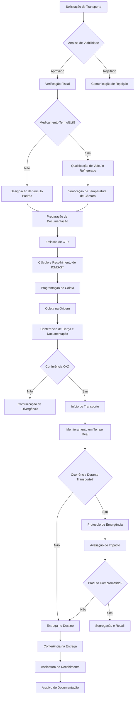
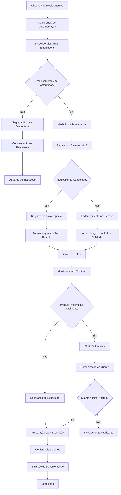
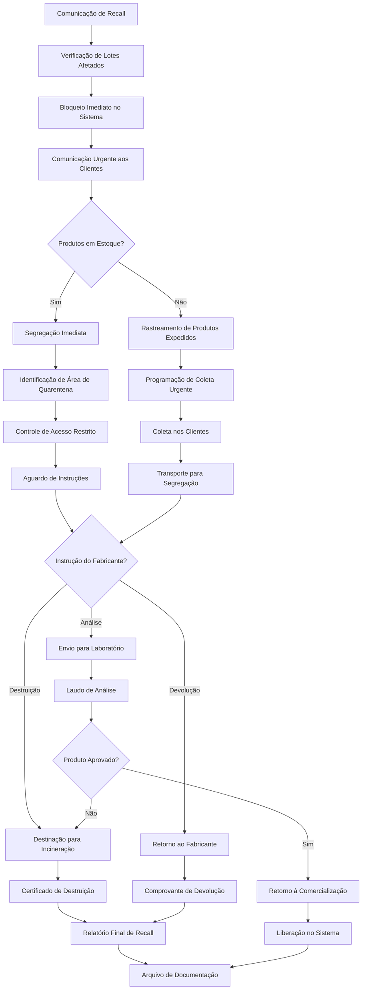
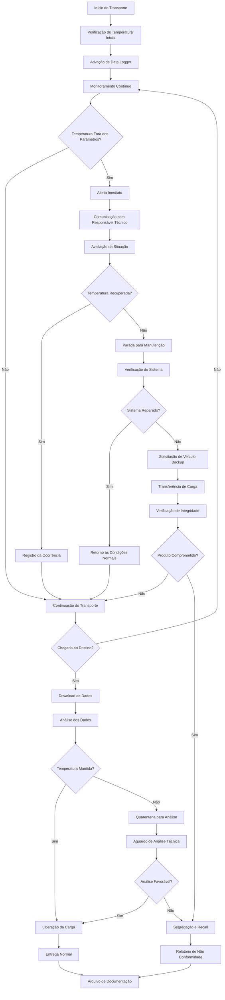

# PROCEDIMENTO OPERACIONAL PADRÃO
## FLUXOS TRANSPORTADORA - VERSÃO 2.0

### SUMÁRIO

1. **OBJETIVO** ........................................................................... 3
2. **ALCANCE** ........................................................................... 3
3. **DEFINIÇÕES E CONCEITOS FISCAIS** ................................................. 3
4. **BASE LEGAL** ........................................................................ 4
5. **RESPONSABILIDADES E ESTRUTURA TRIBUTÁRIA** ................................... 5
6. **CRÉDITO PRESUMIDO DO ICMS NO TRANSPORTE** ..................................... 9
7. **TIPOS DE MERCADORIAS E TRATAMENTO FISCAL** ................................... 10
8. **CONTROLES INTERNOS** .............................................................. 10
9. **FLUXOS DE OPERAÇÃO** ............................................................. 12
10. **TRANSPORTE E ARMAZENAMENTO DE MEDICAMENTOS** ............................ 15
11. **FLUXOGRAMAS OPERACIONAIS** ..................................................... 25

---

## 1. OBJETIVO

Este Procedimento Operacional Padrão tem por objetivo estabelecer diretrizes operacionais, fiscais e sanitárias detalhadas para todas as atividades de transporte e armazenamento realizadas pela empresa, com ênfase especial nos procedimentos específicos para medicamentos e produtos farmacêuticos. O documento visa assegurar o cumprimento integral das obrigações tributárias federais e estaduais, bem como das exigências sanitárias estabelecidas pela ANVISA, promovendo a padronização de processos e a mitigação de riscos operacionais e de compliance.

## 2. ALCANCE

Este POP aplica-se a todas as operações de transporte rodoviário de cargas realizadas pela empresa, incluindo operações interestaduais e internas, com abrangência nacional e foco específico na região Nordeste e Estado de Sergipe. O escopo contempla desde o recebimento da solicitação de transporte até a entrega final, incluindo procedimentos de armazenagem temporária, controle de qualidade, documentação fiscal e sanitária, e todos os controles especiais exigidos para produtos farmacêuticos e medicamentos.

## 3. DEFINIÇÕES E CONCEITOS FISCAIS

### 3.1 Definições Operacionais

**Transporte de Carga:** Constitui prestação de serviço de transporte rodoviário de bens e mercadorias entre estabelecimentos, sujeita à incidência de ICMS conforme legislação estadual de origem do prestador do serviço. Esta atividade engloba desde o carregamento da mercadoria no estabelecimento remetente até sua entrega no destinatário final, incluindo eventuais paradas técnicas e procedimentos de armazenagem temporária.

**Armazenagem Geral:** Atividade de guarda e conservação de mercadorias em depósito ou armazém, prestada mediante remuneração, caracterizando-se como serviço logístico complementar ao transporte. Para produtos farmacêuticos, esta atividade exige condições especiais de temperatura, umidade e controle sanitário, além de responsável técnico legalmente habilitado.

**Substituto Tributário:** Estabelecimento responsável pelo recolhimento do ICMS devido nas operações subsequentes da cadeia produtiva, especialmente relevante no segmento farmacêutico onde o regime de substituição tributária é amplamente aplicado através dos Convênios ICMS específicos.

### 3.2 Conceitos Fiscais

**ICMS - Imposto sobre Circulação de Mercadorias e Serviços:** Tributo estadual incidente sobre prestações de serviços de transporte interestadual, intermunicipal e de comunicação, bem como sobre operações relativas à circulação de mercadorias. No contexto do transporte de medicamentos, aplica-se tanto sobre o valor do frete quanto sobre o valor das mercadorias em regime de substituição tributária.

**CT-e - Conhecimento de Transporte Eletrônico:** Documento fiscal eletrônico que deve ser emitido previamente à prestação do serviço de transporte, contendo informações detalhadas sobre o prestador, tomador, carga transportada, valores envolvidos e tributos incidentes. Para medicamentos, deve especificar informações de lote, validade, temperatura de transporte e responsável técnico.

**GNRE - Guia Nacional de Recolhimento de Tributos Estaduais:** Documento padronizado para recolhimento de tributos estaduais em operações interestaduais, especialmente utilizado para pagamento de ICMS-ST e diferencial de alíquota (DIFAL).

## 4. BASE LEGAL

### 4.1 Legislação Federal

O transporte rodoviário de cargas e a armazenagem de medicamentos estão fundamentados em extensa base legal federal que estabelece princípios gerais, diretrizes sanitárias e normas tributárias aplicáveis em todo território nacional:

**Lei Complementar 87/1996 (Lei Kandir):** Define as normas gerais do ICMS, estabelecendo competências estaduais e princípios de não cumulatividade. Esta lei fundamental determina que o ICMS sobre serviços de transporte é devido ao estado de origem da prestação, princípio essencial para compreensão da tributação no setor.

**Lei 11.903/2009 (Lei de Controle e Rastreabilidade):** Institui o controle e a rastreabilidade na cadeia dos produtos farmacêuticos, estabelecendo obrigações de monitoramento desde a fabricação até a dispensação ao consumidor final. Esta norma fundamental impacta diretamente as operações de transporte e armazenagem farmacêutica.

**Decreto 7.508/2011:** Regulamenta a Lei 8.080/1990, estabelecendo requisitos sanitários específicos para cadeia fria farmacêutica e boas práticas de distribuição, definindo protocolos de temperatura, rastreabilidade e controle de qualidade que devem ser observados em todas as operações logísticas.

**Convênio ICMS 234/2017:** Institui o regime de substituição tributária para medicamentos em âmbito nacional, determinando metodologia de cálculo baseada no Preço Médio Ponderado ao Consumidor Final (PMPF), com atualizações periódicas por cada unidade federativa. Este convênio harmoniza o tratamento tributário em todo território nacional.

### 4.2 Legislações Estaduais Aplicáveis

Cada estado da federação possui legislação específica que regulamenta a aplicação do ICMS sobre serviços de transporte e operações com medicamentos, sendo fundamentais para operações interestaduais:

**RICMS dos Estados Nordestinos:** Os regulamentos estaduais do ICMS de Alagoas, Bahia, Ceará, Maranhão, Paraíba, Pernambuco, Piauí, Rio Grande do Norte e Sergipe estabelecem alíquotas específicas, procedimentos de substituição tributária e exigências documentais que impactam diretamente as operações interestaduais da empresa.

**Decreto 21.400/2002 (RICMS-SE):** Especificamente para Sergipe, estabelece alíquota interna de 19% para serviços de transporte, procedimentos de recolhimento antecipado para operações interestaduais e metodologia de aplicação do PMPF para medicamentos em operações de substituição tributária.

## 5. RESPONSABILIDADES E ESTRUTURA TRIBUTÁRIA

### 5.1 Responsabilidade e Incidência Tributária

A estrutura de responsabilidades tributárias no transporte de medicamentos é complexa e demanda compreensão aprofundada dos diferentes regimes aplicáveis:

#### 5.1.1 Operações de Armazenagem

Nas operações de armazenagem de medicamentos, a empresa atua como depositário legal das mercadorias, assumindo responsabilidades sanitárias e fiscais específicas. O recebimento de produtos farmacêuticos para armazenagem caracteriza entrada simbólica que deve ser documentada através de nota fiscal de entrada (CFOP 1.901 para operações internas ou 2.901 para interestaduais), sem incidência de ICMS por tratar-se de operação sem transferência de propriedade. Contudo, a responsabilidade pela integridade, conservação e rastreabilidade dos produtos permanece com o armazém durante todo período de guarda.

A saída das mercadorias do armazém para entrega ao destinatário final caracteriza operação de retorno simbólico (CFOP 5.901 ou 6.901), igualmente sem incidência de ICMS, mas com obrigatoriedade de manutenção de todos os controles de lote, validade e cadeia fria estabelecidos pela ANVISA. Durante todo período de armazenagem, deve ser mantido controle rigoroso de temperatura através de data loggers calibrados, com relatórios periódicos enviados ao depositante e disponibilizados para fiscalização sanitária quando solicitado.

#### 5.1.2 Operações com Mercadorias

O transporte de mercadorias sujeitas ao regime de substituição tributária, especialmente medicamentos, exige atenção especial quanto à correta aplicação das alíquotas e bases de cálculo. O transportador deve verificar na documentação fiscal de origem se o ICMS-ST foi corretamente calculado e recolhido pelo remetente substituto tributário, validando o valor através de consulta às tabelas PMPF atualizadas pelos órgãos fazendários estaduais.

Em operações interestaduais destinadas ao Nordeste, deve ser observado se o estabelecimento destinatário é contribuinte substituído (não recolhe ICMS-ST adicional) ou consumidor final (pode haver incidência de DIFAL). Esta verificação é fundamental para evitar autuações por falta de recolhimento de tributos devidos.

#### 5.1.3 Situações de Não Incidência

Algumas situações específicas caracterizam não incidência de ICMS sobre o transporte, devendo ser adequadamente documentadas para evitar questionamentos fiscais. O transporte de medicamentos destinados a órgãos públicos de saúde, quando expressamente beneficiado por imunidade tributária, deve ser acompanhado de declaração específica do destinatário confirmando a destinação e natureza da operação.

Remessas para fins de demonstração científica, amostras grátis e produtos destinados a pesquisa clínica também podem gozar de benefícios fiscais específicos, desde que adequadamente documentados e acompanhados dos termos de responsabilidade exigidos pela ANVISA para estas modalidades de operação.

#### 5.1.4 Situações de Suspensão

O regime de suspensão do ICMS pode ser aplicado em situações específicas previstas na legislação, como remessas para industrialização por encomenda ou operações entre estabelecimentos do mesmo titular. Em medicamentos, este regime é menos comum, mas pode ocorrer em operações entre indústrias farmacêuticas e seus centros de distribuição, desde que devidamente fundamentado em convênio específico ou legislação estadual.

### 5.2 Estrutura Tributária e Particularidades por Estado no Transporte de Medicamentos

#### 5.2.1 Goiás

O Estado de Goiás apresenta estrutura tributária robusta para operações com medicamentos, sendo origem de significativa parcela das remessas para a região Nordeste. A legislação goiana estabelece alíquota padrão de 17% para transporte interno e 12% ou 7% para transporte interestadual, dependendo do estado de destino, conforme regras constitucionais de partilha de receitas.

Para medicamentos, aplica-se integralmente o regime de substituição tributária com base no PMPF estabelecido pela SEFAZ-GO, atualizado mensalmente através de atos normativos específicos. O cálculo do ICMS-ST considera não apenas o PMPF, mas também a Margem de Valor Agregado (MVA) estabelecida para cada categoria terapêutica, podendo variar entre 30% a 60% dependendo do tipo de medicamento.

A documentação fiscal em Goiás exige detalhamento específico do lote, data de validade, princípio ativo e classificação terapêutica em campo próprio da nota fiscal. O CT-e correspondente deve informar temperatura de transporte, identificação do responsável técnico pela carga e eventual necessidade de segregação especial para medicamentos controlados.

#### 5.2.2 Tocantins

Tocantins aplica estrutura tributária simplificada para operações de transporte, com alíquota interna de 20% para operações dentro do estado e alíquotas interestaduais de 12% para operações entre estados. O estado aderiu integralmente ao Convênio ICMS 234/2017 para medicamentos, aplicando PMPF harmonizado nacionalmente.

O diferencial em Tocantins está nos benefícios fiscais específicos para transporte rodoviário intermunicipal de cargas, incluindo isenção para transporte rodoviarário intermunicipal de cargas e operações com bens destinados a ferrovias. Estas isenções podem ser aplicadas a medicamentos quando o transporte atender aos requisitos específicos estabelecidos na legislação estadual.

Para operações beneficiadas, o procedimento exige emissão de CT-e com destaque da isenção e código específico, além de controles específicos para operações beneficiadas. A documentação deve ser mantida pelo prazo de cinco anos para eventuais fiscalizações.

#### 5.2.3 Mato Grosso

O Estado de Mato Grosso possui particularidades específicas para operações logísticas, especialmente relacionadas ao agronegócio, mas que impactam também o transporte farmacêutico. A alíquota padrão de 17% para transporte interno pode ser reduzida através de benefícios fiscais específicos, especialmente para operações que promovam o desenvolvimento da infraestrutura logística estadual.

Para transporte interestadual, aplica-se recolhimento antecipado por operação através de GNRE específica, com procedimento que deve ser concluído antes do início da prestação do serviço. O sistema GNRE-MT exige cadastramento prévio do contribuinte e validação eletrônica dos dados da operação.

O diferimento do ICMS sobre frete pode ser aplicado quando o transporte destina-se a estabelecimentos do mesmo titular ou em operações específicas entre estabelecimentos agropecuários. Para medicamentos, esta regra aplica-se principalmente em operações entre indústrias farmacêuticas e seus centros de distribuição regionais.

#### 5.2.4 Pará

No Estado do Pará, as operações de transporte de medicamentos seguem legislação específica que privilegia o desenvolvimento da logística regional amazônica. A alíquota interna de 17% para transporte pode ser beneficiada por redução em operações que contribuam para melhoria da infraestrutura de saúde regional.

O estado possui protocolo específico para medicamentos destinados a regiões de difícil acesso, incluindo comunidades ribeirinhas e indígenas, com procedimentos simplificados de documentação fiscal, mas com controles sanitários reforçados devido às condições especiais de transporte e armazenagem temporária.

A substituição tributária para medicamentos em operações com origem no Pará segue PMPF específico estabelecido pela SEFAZ-PA, com atualizações que consideram as particularidades logísticas regionais e eventual impacto dos custos de transporte fluvial complementar ao rodoviário.

#### 5.2.5 Sergipe – Particularidades Fiscais e Operacionais

O Estado de Sergipe, inserido no escopo operacional através da abertura de unidade específica, apresenta complexidade tributária particular que demanda atenção especial às exigências fiscais, sanitárias e documentais pertinentes ao transporte e armazenamento de medicamentos.

**Estrutura Legal Sergipana**

A legislação tributária sergipana está fundamentada no Decreto 21.400/2002 (RICMS-SE), complementado por portarias e instruções normativas que normatizam operações específicas de transporte, armazenagem e comercialização de produtos sujeitos à substituição tributária. O estado aderiu integralmente aos acordos nacionais do CONFAZ, especialmente o Convênio ICMS 234/17 para medicamentos, e mantém protocolos interestaduais específicos para operações com outros estados nordestinos.

**Operações Internas em Sergipe**

Toda prestação de serviço de transporte realizada por estabelecimento sergipano destinada a contribuinte situado no mesmo estado observa alíquota interna de 19% sobre o valor integral da prestação, incluindo custos acessórios como seguro, pedágio e despesas de carregamento/descarregamento. Para medicamentos sujeitos à substituição tributária, deve ser acrescido eventual adicional para Fundo Especial de Combate à Pobreza (FECP), com consulta mensal às tabelas oficiais da SEFAZ-SE.

A base de cálculo para ICMS-ST em medicamentos utiliza o PMPF definido pela SEFAZ-SE, atualizado através de Portaria mensal que considera preços praticados no mercado sergipano e eventual variação regional. O cálculo deve considerar não apenas o PMPF, mas também despesas acessórias e margens específicas estabelecidas para cada categoria terapêutica.

Antes do início do transporte, deve ser emitido CT-e com vinculação obrigatória à nota fiscal da mercadoria, destacando claramente ICMS próprio e ICMS-ST quando aplicável. A documentação fiscal deve ser arquivada por cinco anos, com backup digital em sistema auditável e acesso facilitado para fiscalizações.

**Operações Interestaduais – Saída de Sergipe para o Nordeste**

As operações de saída interestadual com destino aos demais estados nordestinos seguem regras específicas que consideram acordos regionais e protocolos de cooperação fiscal. A alíquota interestadual é de 7% quando o destinatário está localizado em estado das regiões Norte, Nordeste, Centro-Oeste ou Espírito Santo, e de 12% para demais destinações.

Para vendas destinadas a consumidor final não contribuinte, aplica-se obrigatoriamente o diferencial de alíquota (DIFAL), recolhido ao estado de destino através de GNRE específica. O cálculo considera a diferença entre a alíquota interna do estado de destino e a alíquota interestadual aplicada, sobre a base de cálculo da operação.

**Procedimento Operacional Detalhado para Sergipe**

O procedimento operacional em Sergipe inicia-se com análise fiscal prévia da operação, identificando regime tributário aplicável, alíquotas incidentes e eventual necessidade de recolhimento antecipado. Para medicamentos, deve ser verificada a adequação do PMPF utilizado pelo remetente com os valores vigentes em Sergipe, validando eventual diferença a recolher.

A emissão de documentos fiscais segue sequência específica: primeiro a nota fiscal de remessa ou venda (conforme a natureza da operação), depois o CT-e vinculado, e por fim as guias de recolhimento quando aplicáveis. Todos os documentos devem ser emitidos antes do início do transporte, com numeração sequencial e sem emendas ou rasuras.

Para medicamentos termolábeis ou controlados, deve ser anexada à documentação fiscal a declaração de temperatura de transporte, identificação do responsável técnico pela carga e eventual autorização especial da ANVISA para produtos sujeitos a controle especial. Esta documentação adicional deve acompanhar a carga durante todo trajeto.

O controle de lotes é obrigatório para todos os medicamentos, com registro individual de cada lote na documentação fiscal. Em caso de divergência no destino por vencimento ou dano, deve ser emitida nota fiscal de devolução (CFOP 6.906) com CT-e de retorno (CFOP 6.909), informando a reversão do ICMS-ST retido e registrando crédito correspondente no livro de apuração.

## 6. CRÉDITO PRESUMIDO DO ICMS NO TRANSPORTE

### 6.1 Fundamentação Legal

O crédito presumido do ICMS no transporte rodoviário de cargas constitui benefício fiscal estabelecido por diversos estados para redução da carga tributária efetiva e estímulo ao desenvolvimento do setor logístico. Este mecanismo permite que o transportador aproprie crédito fiscal em percentual superior ao ICMS efetivamente recolhido na aquisição de combustíveis e outros insumos, reduzindo a carga tributária líquida da operação.

A fundamentação legal varia conforme cada estado, mas geralmente está baseada na Lei Complementar 24/1975 e em convênios específicos do CONFAZ que autorizam a concessão destes benefícios. Para medicamentos, alguns estados concedem créditos presumidos adicionais, considerando a importância social do transporte farmacêutico e eventual necessidade de investimentos especiais em equipamentos de refrigeração e controle de qualidade.

### 6.2 Procedimentos Operacionais para Adoção do Crédito Presumido

A adoção do crédito presumido exige procedimentos específicos que devem ser rigorosamente seguidos para evitar questionamentos fiscais posteriores. Inicialmente, deve ser verificada a legislação estadual aplicável, identificando percentuais de crédito permitidos, condições para fruição e eventuais limitações por tipo de operação ou mercadoria transportada.

Para medicamentos, alguns estados estabelecem percentuais diferenciados de crédito presumido, reconhecendo os custos adicionais com equipamentos de refrigeração, sistemas de monitoramento de temperatura e pessoal técnico especializado. Estes percentuais devem ser aplicados mensalmente através de lançamento no livro de apuração do ICMS, com detalhamento específico das operações beneficiadas.

O controle interno deve segregar as operações por tipo de mercadoria transportada, permitindo aplicação correta dos percentuais de crédito presumido conforme estabelecido na legislação. Para transporte de medicamentos, deve ser mantido controle adicional dos custos com equipamentos especiais, permitindo eventual comprovação da destinação adequada do benefício fiscal.

A documentação comprobatória deve incluir relatórios mensais de operações realizadas, discriminando valores de frete por tipo de mercadoria, ICMS recolhido e crédito presumido apropriado. Esta documentação deve ser mantida pelo prazo legal de cinco anos, organizada de forma a facilitar eventual fiscalização.

## 7. TIPOS DE MERCADORIAS E TRATAMENTO FISCAL

### 7.1 Mercadorias do Convênio ICMS 100/97

As mercadorias enquadradas no Convênio ICMS 100/97 recebem tratamento fiscal específico que reduz significativamente a incidência tributária sobre operações de transporte. Este convênio estabelece que determinados produtos essenciais, incluindo alguns medicamentos e insumos farmacêuticos, podem ser beneficiados por alíquotas reduzidas ou isenção total do ICMS em operações interestaduais.

Para identificação correta das mercadorias beneficiadas, deve ser consultada regularmente a lista atualizada do convênio, verificando se os produtos transportados enquadram-se nas especificações técnicas estabelecidas. Medicamentos genéricos, fitoterápicos e alguns produtos de higiene pessoal podem estar incluídos, dependendo da formulação e destinação específica.

O transporte de mercadorias beneficiadas pelo Convênio 100/97 exige documentação fiscal específica, com destaque da isenção ou redução aplicada e código de benefício correspondente. A nota fiscal de origem deve conter CST (Código de Situação Tributária) apropriado, e o CT-e deve referenciar expressamente o fundamento legal da desoneração.

### 7.2 Mercadorias em Geral

As demais mercadorias transportadas seguem regime tributário padrão, com aplicação das alíquotas internas ou interestaduais conforme origem e destino da operação. Para medicamentos não beneficiados por convênios específicos, aplica-se integralmente o regime de substituição tributária, com cálculo baseado no PMPF vigente no estado de origem.

O controle adequado exige classificação fiscal correta de cada produto transportado, verificando NCM (Nomenclatura Comum do Mercosul), CST aplicável e eventual enquadramento em regimes especiais. Para produtos farmacêuticos, deve ser verificada também a classificação sanitária junto à ANVISA, identificando eventual sujeição a controles especiais.

A documentação fiscal deve refletir adequadamente a classificação de cada produto, permitindo rastreabilidade completa desde a origem até o destino final. Para medicamentos, informações adicionais como lote, validade, temperatura de conservação e responsável técnico devem estar claramente identificadas na documentação de transporte.

## 8. CONTROLES INTERNOS

### 8.1 Controle de Documentos

O controle documental constitui elemento fundamental para garantia da conformidade fiscal e sanitária das operações de transporte de medicamentos. Este controle deve abranger desde a documentação de origem até os comprovantes de entrega, passando por todas as guias de recolhimento tributário e certificados sanitários aplicáveis.

Para medicamentos, o controle documental deve incluir verificação sistemática da validade das licenças sanitárias dos estabelecimentos envolvidos, confirmação da regularidade do responsável técnico indicado na documentação e validação dos certificados de análise quando exigidos para produtos específicos. Toda documentação deve ser arquivada em ordem cronológica, com indexação que permita localização rápida por número de lote, cliente ou produto.

O sistema de controle deve prever backup automático de toda documentação eletrônica, com armazenamento em nuvem segura e acesso restrito a pessoas autorizadas. Para documentos físicos essenciais, deve ser mantida cópia digitalizada, garantindo preservação das informações mesmo em caso de sinistro ou deterioração natural.

### 8.2 Controle de Estoques

O controle de estoques para medicamentos armazenados temporariamente exige rigor específico devido às implicações sanitárias e fiscais envolvidas. Este controle deve considerar não apenas quantidades, mas também lotes, datas de validade, condições de conservação e rastreabilidade completa desde o recebimento até a expedição.

O sistema de controle deve operar em tempo real, com alertas automáticos para medicamentos próximos ao vencimento, variações de temperatura fora dos parâmetros estabelecidos e eventual necessidade de segregação de produtos em desacordo sanitário. Cada movimentação deve ser documentada com identificação do responsável, horário exato e motivo da operação.

Para medicamentos controlados, o controle de estoque deve seguir rigorosamente as exigências da Portaria 344/98 da ANVISA, com livro específico para registro de movimentações, balanços periódicos e relatórios mensais aos órgãos competentes. O acesso físico a estes produtos deve ser restrito a pessoas autorizadas, com sistema de dupla conferência em todas as operações.

### 8.3 Controle Fiscal

O controle fiscal abrange todas as obrigações tributárias principais e acessórias relacionadas às operações de transporte e armazenagem. Para medicamentos, este controle deve considerar particularidades do regime de substituição tributária, eventual aplicação de benefícios fiscais específicos e cumprimento de obrigações acessórias especiais.

O controle deve incluir verificação sistemática da correção dos cálculos de ICMS e ICMS-ST, validação dos códigos fiscais utilizados na documentação e conferência da aplicação correta de alíquotas conforme origem e destino das operações. Divergências identificadas devem ser imediatamente corrigidas, com comunicação aos clientes quando necessário.

#### 8.3.1 Controles específicos para MT e PA

Para operações com origem ou destino em Mato Grosso e Pará, devem ser observadas particularidades específicas relacionadas à logística da região Centro-Norte. Em Mato Grosso, o controle deve considerar eventual aplicação do diferimento em operações agropecuárias e procedimentos específicos para recolhimento antecipado em operações interestaduais.

No Pará, deve ser observado o protocolo específico para medicamentos destinados a regiões de difícil acesso, que pode exigir documentação adicional e procedimentos simplificados para comunidades especiais. O controle deve incluir verificação da destinação declarada e eventual necessidade de autorizações específicas para transporte em áreas de proteção ambiental.

## 9. FLUXOS DE OPERAÇÃO

Os fluxos operacionais da empresa estão estruturados para atender diferentes modalidades de transporte e armazenagem, cada uma com particularidades fiscais e operacionais específicas. A padronização destes fluxos é essencial para garantia da qualidade do serviço prestado e cumprimento integral das obrigações legais aplicáveis.

Para medicamentos, todos os fluxos operacionais devem considerar as exigências de Boas Práticas de Distribuição estabelecidas pela RDC 430/2020 da ANVISA, incluindo controles de temperatura, rastreabilidade de lotes, qualificação de fornecedores e procedimentos de recall quando necessários.

### 9.1 Fluxo de Coleta Direta

O fluxo de coleta direta caracteriza-se pela retirada da mercadoria diretamente no estabelecimento do cliente, sem armazenagem intermediária. Este fluxo é amplamente utilizado para medicamentos que exigem entrega rápida ou produtos termolábeis que não podem sofrer quebra da cadeia fria.

**Etapa 1 - Recebimento da Solicitação:** A solicitação de transporte é recebida através dos canais oficiais da empresa, com identificação completa do cliente, origem, destino, tipo de mercadoria e condições especiais exigidas. Para medicamentos, deve ser verificada a necessidade de equipamentos especiais de refrigeração, identificação de produtos controlados e eventual exigência de acompanhamento de responsável técnico.

**Etapa 2 - Análise Fiscal Prévia:** Antes do aceite da operação, deve ser realizada análise fiscal completa, identificando regime tributário aplicável, alíquotas incidentes, eventual necessidade de recolhimento antecipado e adequação da documentação fiscal de origem. Para medicamentos sujeitos à substituição tributária, deve ser validado o PMPF utilizado e eventual necessidade de complemento de ICMS-ST.

**Etapa 3 - Programação e Coleta:** Após confirmação fiscal, é programada a coleta com veículo adequado às características da carga. Para medicamentos, deve ser verificada a calibração dos equipamentos de refrigeração, funcionamento dos data loggers e disponibilidade de documentação técnica exigida. A coleta deve ser realizada por motorista treinado em procedimentos farmacêuticos.

**Etapa 4 - Transporte e Entrega:** Durante o transporte, devem ser seguidos rigorosamente os protocolos de temperatura, com monitoramento contínuo e registro de eventuais ocorrências. A entrega deve ser realizada diretamente ao destinatário ou pessoa autorizada, com conferência da documentação e assinatura de comprovante de recebimento.

### 9.2 Fluxo de Armazenagem com Posterior Distribuição

Este fluxo é utilizado quando há necessidade de consolidação de cargas, atendimento de múltiplos destinos ou armazenagem por período determinado. Para medicamentos, exige estrutura física adequada com controle rígido de temperatura, umidade e acesso restrito.

**Etapa 1 - Recebimento no Armazém:** O recebimento de medicamentos deve seguir protocolo específico de conferência que inclui verificação de integridade das embalagens, conferência de lotes e validades, medição de temperatura de chegada e registro fotográfico quando necessário. Produtos em desacordo devem ser imediatamente segregados e comunicados ao remetente.

**Etapa 2 - Armazenagem Controlada:** A armazenagem deve ser realizada em áreas específicas conforme tipo de produto, com segregação por lote e controle FEFO (First Expired, First Out). Medicamentos termolábeis devem ser armazenados em câmaras frias com temperatura controlada, sistema de alarme e gerador de emergência.

**Etapa 3 - Controle de Qualidade:** Durante todo período de armazenagem, deve ser mantido controle rigoroso das condições ambientais, com registros automáticos de temperatura e umidade, inspeções visuais periódicas e relatórios de não conformidade quando identificadas situações inadequadas.

**Etapa 4 - Expedição Programada:** A expedição deve ser programada considerando rotas otimizadas, compatibilidade entre produtos transportados e condições especiais exigidas. Para medicamentos controlados, deve ser seguido protocolo específico com dupla conferência e assinatura do responsável técnico.

### 9.3 Fluxo de Transferência Interfilial

As transferências entre filiais da empresa seguem procedimento específico que considera aspectos fiscais de operações interestaduais e necessidades operacionais de cada unidade. Para medicamentos, deve ser mantida rastreabilidade completa e controle de temperatura durante todo trajeto.

**Etapa 1 - Planejamento da Transferência:** O planejamento considera necessidades de estoque de cada filial, condições fiscais da operação e disponibilidade de veículos adequados. Para medicamentos próximos ao vencimento, deve ser priorizada transferência para unidades com maior rotatividade.

**Etapa 2 - Documentação Interestadual:** A documentação deve incluir nota fiscal de transferência entre estabelecimentos do mesmo titular, CT-e específico para transferência e eventual GNRE para recolhimento de diferencial de alíquota. Para medicamentos, deve ser anexada planilha de controle de lotes e temperaturas.

**Etapa 3 - Transporte Monitorado:** Durante o transporte, deve ser mantido monitoramento em tempo real da localização do veículo e condições da carga. Para medicamentos, deve ser disponibilizado canal de comunicação 24 horas para atendimento de emergências relacionadas à quebra da cadeia fria.

**Etapa 4 - Recebimento na Filial Destino:** O recebimento deve seguir o mesmo protocolo rigoroso aplicado a mercadorias de terceiros, com conferência completa da documentação, verificação das condições da carga e registro de eventuais ocorrências identificadas durante o transporte.

### 9.4 Fluxo de Devolução e Recall

O fluxo de devolução é essencial para medicamentos, considerando eventual necessidade de recall por determinação sanitária ou comercial. Este fluxo deve ser rápido e eficiente, permitindo rastreabilidade reversa completa.

**Etapa 1 - Comunicação do Recall:** Recebida comunicação de recall, deve ser imediatamente identificado o lote afetado em todos os pontos da cadeia logística, com bloqueio automático no sistema e comunicação urgente aos clientes que possam estar em posse dos produtos.

**Etapa 2 - Coleta dos Produtos:** A coleta deve ser realizada com urgência, utilizando veículos adequados e seguindo protocolos específicos para produtos sujeitos a recall. Deve ser mantido controle rigoroso da documentação de coleta, com identificação precisa dos lotes recolhidos.

**Etapa 3 - Segregação e Controle:** Os produtos recolhidos devem ser segregados em área específica, com acesso restrito e identificação clara de sua condição. Deve ser mantido controle individual de cada lote recolhido, com rastreabilidade completa desde a origem até o recolhimento final.

**Etapa 4 - Destinação Final:** A destinação final deve seguir orientações do fabricante e eventual determinação da ANVISA, podendo incluir devolução ao fabricante, destruição controlada ou outras medidas específicas conforme a natureza do problema identificado.

## 10. TRANSPORTE E ARMAZENAMENTO DE MEDICAMENTOS

O transporte e armazenamento de produtos farmacêuticos constituem atividades de alta complexidade regulatória que combinam exigências sanitárias rigorosas da ANVISA com obrigações tributárias específicas do sistema fiscal brasileiro. Esta seção detalha todos os procedimentos necessários para garantir conformidade integral com as normas aplicáveis, preservando a qualidade, eficácia e segurança dos medicamentos durante toda cadeia logística.

### 10.1 Enquadramento Normativo e Responsabilidades

O transporte e armazenagem de medicamentos são regulamentados por um complexo sistema normativo que integra legislação federal, estadual e regulamentações técnicas específicas. A ANVISA, através da RDC 430/2020 e suas atualizações posteriores, estabelece as diretrizes gerais de Boas Práticas de Distribuição, Armazenagem e Transporte de Medicamentos, definindo padrões mínimos de qualidade, rastreabilidade e controle sanitário que devem ser observados por todos os agentes da cadeia logística farmacêutica.

**Responsabilidades Sanitárias**

A responsabilidade sanitária no transporte de medicamentos é compartilhada entre todos os agentes da cadeia, desde o fabricante até o distribuidor final. O transportador assume responsabilidade específica pela manutenção das condições adequadas de conservação durante o trajeto, incluindo controle de temperatura, proteção contra luz, umidade e contaminação, além de garantir a integridade física das embalagens e a rastreabilidade completa dos lotes transportados.

Para medicamentos termolábeis, a responsabilidade inclui utilização de equipamentos de refrigeração validados, monitoramento contínuo de temperatura através de data loggers calibrados, procedimentos de emergência para situações de quebra da cadeia fria e relatórios detalhados de todas as condições de transporte. O responsável técnico designado deve supervisionar todas estas atividades, assumindo responsabilidade profissional perante o Conselho Regional de Farmácia.

**Responsabilidades Tributárias**

No âmbito tributário, as operações com medicamentos estão sujeitas ao regime de substituição tributária estabelecido pelo Convênio ICMS 234/17, que determina metodologia específica de cálculo baseada no Preço Médio Ponderado ao Consumidor Final (PMPF). Este regime transfere a responsabilidade pelo recolhimento do ICMS devido nas operações subsequentes para o primeiro estabelecimento da cadeia, geralmente o fabricante ou importador.

O transportador deve verificar a correta aplicação do regime de substituição tributária na documentação fiscal de origem, validando se os valores de ICMS-ST foram adequadamente calculados e recolhidos. Em operações interestaduais, deve ser observada a eventual incidência do diferencial de alíquota (DIFAL) em vendas para consumidores finais não contribuintes, com recolhimento específico ao estado de destino através de GNRE.

**Obrigações Acessórias**

As obrigações acessórias incluem manutenção de registros detalhados de todas as operações, envio de relatórios periódicos aos órgãos sanitários e fazendários, manutenção de documentação comprobatória das condições de transporte e armazenagem, e disponibilização de informações para eventual rastreabilidade em situações de recall ou investigação sanitária.

O sistema de controle deve permitir rastreabilidade completa desde a origem até o destino final, incluindo informações sobre lotes, condições de transporte, responsáveis pelas operações e eventual ocorrência de situações anômalas durante o processo logístico. Esta documentação deve ser mantida pelo prazo mínimo de cinco anos, em formato que permita consulta rápida e auditoria pelos órgãos competentes.

### 10.2 Estrutura Tributária Específica para Medicamentos

A estrutura tributária aplicável ao transporte de medicamentos é significativamente mais complexa que outras mercadorias devido à aplicação generalizada do regime de substituição tributária e às especificidades regulatórias do setor farmacêutico. Esta complexidade exige compreensão aprofundada dos mecanismos de cálculo, procedimentos de recolhimento e controles específicos exigidos pela legislação.

**Base de Cálculo e PMPF**

O Preço Médio Ponderado ao Consumidor Final (PMPF) constitui a base fundamental para cálculo do ICMS-ST em medicamentos. Este preço é estabelecido mensalmente por cada estado através de levantamento específico dos preços praticados no mercado varejista, considerando diferentes canais de distribuição e eventual variação regional nos custos de comercialização.

Para operações interestaduais, deve ser utilizado o PMPF vigente no estado de destino da mercadoria, o que pode exigir consulta a múltiplas fontes de informação quando a operação envolve diferentes unidades federativas. O cálculo do ICMS-ST considera não apenas o PMPF, mas também a Margem de Valor Agregado (MVA) específica de cada categoria terapêutica, podendo variar entre 30% a 80% dependendo do tipo de medicamento e estado de destino.

**Procedimentos de Recolhimento**

O recolhimento do ICMS-ST deve ser realizado através de GNRE específica, emitida antes do início do transporte e quitada através dos canais bancários autorizados. Para operações complexas envolvendo múltiplos estados de destino, pode ser necessária emissão de múltiplas guias, cada uma correspondente às especificidades tributárias de cada unidade federativa.

A documentação de recolhimento deve ser arquivada junto com a documentação fiscal da operação, permitindo comprovação imediata em eventual fiscalização. O sistema de controle deve alertar automaticamente para eventual pendência de recolhimento, evitando início de transporte sem a devida quitação das obrigações tributárias.

**Regimes Especiais e Benefícios**

Alguns medicamentos podem ser beneficiados por regimes tributários especiais, incluindo isenções para produtos destinados a programas governamentais de saúde, redução de alíquotas para medicamentos genéricos ou benefícios específicos para produtos de alto custo utilizados em tratamentos excepcionais.

A identificação correta destes benefícios exige consulta constante às legislações estaduais e federais, verificando se os produtos transportados enquadram-se nas condições estabelecidas para fruição dos incentivos. A documentação fiscal deve refletir adequadamente a aplicação destes benefícios, com código específico e fundamentação legal clara.

### 10.3 Boas Práticas de Armazenamento

As Boas Práticas de Armazenamento para medicamentos são estabelecidas pela RDC 430/2020 da ANVISA e complementadas por normas técnicas específicas que detalham procedimentos operacionais, controles de qualidade e sistemas de gestão que devem ser implementados em todas as instalações de armazenagem farmacêutica.

**Infraestrutura e Instalações**

As instalações de armazenagem de medicamentos devem atender requisitos específicos de construção e layout que garantam condições adequadas de conservação e controle sanitário. O projeto deve considerar segregação de diferentes tipos de produtos, controle de acesso, sistemas de ventilação e climatização adequados, e áreas específicas para quarentena de produtos em análise ou desacordo sanitário.

Para medicamentos termolábeis, devem ser disponibilizadas câmaras frias com controle rigoroso de temperatura, sistemas redundantes de refrigeração, alarmes de temperatura com monitoramento 24 horas, e gerador de emergência para garantir continuidade da cadeia fria mesmo em situações de falta de energia elétrica. O sistema de monitoramento deve registrar automaticamente todas as variações de temperatura, com relatórios que permitam comprovação da manutenção das condições adequadas.

As áreas de armazenagem devem ser dimensionadas adequadamente para permitir circulação segura de pessoas e equipamentos, com sistema de endereçamento que facilite localização rápida de produtos específicos e inventários periódicos. O sistema de ventilação deve garantir renovação adequada do ar, evitando formação de pontos de umidade que possam comprometer a qualidade dos medicamentos armazenados.

**Sistemas de Controle de Qualidade**

O controle de qualidade durante armazenagem envolve monitoramento contínuo das condições ambientais, inspeção visual periódica dos produtos armazenados, controle rigoroso de lotes e validades, e procedimentos específicos para identificação e segregação de produtos em desacordo sanitário.

O sistema de monitoramento ambiental deve incluir medição automática de temperatura e umidade em múltiplos pontos das áreas de armazenagem, com registro eletrônico que permita rastreabilidade completa das condições mantidas. Para medicamentos que exigem proteção contra luz, devem ser utilizadas embalagens opacas ou áreas com iluminação controlada.

O controle de lotes deve seguir rigorosamente o princípio FEFO (First Expired, First Out), priorizando a expedição de produtos com menor prazo de validade. O sistema de gestão deve alertar automaticamente para medicamentos próximos ao vencimento, permitindo adoção de medidas preventivas como transferência para unidades com maior rotatividade ou comunicação proativa aos clientes.

**Procedimentos de Recebimento**

O recebimento de medicamentos deve seguir protocolo rigoroso que inclui conferência completa da documentação fiscal e sanitária, inspeção visual das condições das embalagens, verificação de lotes e prazos de validade, medição de temperatura de chegada para produtos termolábeis, e registro fotográfico quando identificadas situações anômalas.

Para medicamentos controlados, o recebimento deve incluir conferência específica das autorizações sanitárias, verificação da documentação de transporte e registro em livro específico conforme exigências da Portaria 344/98 da ANVISA. O acesso a estes produtos deve ser restrito a pessoas devidamente autorizadas, com sistema de dupla conferência em todas as operações.

Produtos que chegarem em desacordo com as especificações devem ser imediatamente segregados em área de quarentena, com identificação clara de sua condição e comunicação imediata ao remetente. Deve ser elaborado relatório de não conformidade detalhado, incluindo fotografias das situações identificadas e proposta de solução para regularização.

### 10.4 Protocolos de Transporte

Os protocolos de transporte para medicamentos são estabelecidos considerando as características específicas de cada tipo de produto, condições exigidas para manutenção da qualidade e eficácia, e requisitos regulamentares aplicáveis. Estes protocolos devem ser seguidos rigorosamente para garantir que os medicamentos cheguem ao destino final em condições adequadas para consumo.

**Qualificação de Veículos**

Todos os veículos utilizados para transporte de medicamentos devem ser qualificados através de processo específico que inclui validação dos sistemas de refrigeração (quando aplicável), verificação da integridade das carrocerias, calibração dos instrumentos de medição e treinamento específico dos motoristas em procedimentos farmacêuticos.

Para medicamentos termolábeis, a qualificação deve incluir mapeamento térmico completo do compartimento de carga, teste de uniformidade de temperatura em diferentes condições de carga, validação do tempo de recuperação após abertura das portas, e verificação da autonomia do sistema de refrigeração. Deve ser emitido certificado de qualificação com validade definida, exigindo requalificação periódica para manutenção da habilitação.

Os equipamentos de monitoramento de temperatura (data loggers) devem ser calibrados periodicamente por laboratório acreditado, com certificados que comprovem a precisão das medições realizadas. O sistema deve permitir monitoramento em tempo real, com alarmes automáticos para situações fora dos parâmetros estabelecidos.

**Procedimentos de Carregamento**

O carregamento de medicamentos deve seguir sequência específica que garanta adequada distribuição da carga, facilitando acesso para conferências intermediárias e otimizando as condições de conservação durante transporte. Para medicamentos termolábeis, deve ser verificada a temperatura do compartimento de carga antes do carregamento, garantindo que as condições adequadas sejam mantidas desde o início.

A distribuição da carga deve considerar compatibilidade entre diferentes produtos, evitando contaminação cruzada ou interferência entre medicamentos incompatíveis. Produtos controlados devem ser acondicionados em compartimentos específicos, com acesso restrito e identificação clara de sua natureza especial.

Deve ser elaborada planilha de carregamento detalhada, informando localização de cada lote na carga, condições específicas exigidas para conservação, e eventual ordem de entrega quando a operação envolve múltiplos destinatários. Esta planilha deve acompanhar a carga durante todo trajeto, permitindo localização rápida de produtos específicos quando necessário.

**Monitoramento Durante Transporte**

Durante todo período de transporte, deve ser mantido monitoramento contínuo das condições da carga, incluindo temperatura, localização do veículo, e eventual ocorrência de situações que possam comprometer a qualidade dos medicamentos transportados. Para medicamentos termolábeis, qualquer variação de temperatura fora dos parâmetros estabelecidos deve gerar alerta imediato.

O sistema de rastreamento deve permitir localização precisa do veículo em tempo real, com histórico completo de trajeto percorrido e eventuais paradas realizadas. Para medicamentos de alto valor ou controlados, pode ser exigido sistema adicional de segurança, incluindo câmeras de monitoramento e comunicação direta com central de emergência.

Situações anômalas identificadas durante transporte devem gerar protocolo específico de atendimento, incluindo comunicação imediata com o responsável técnico, avaliação da necessidade de medidas corretivas, e eventual necessidade de interrupção do transporte para proteção da integridade dos produtos.

### 10.5 Controle de Lotes e Rastreabilidade

O controle de lotes constitui elemento fundamental do sistema de qualidade farmacêutica, permitindo rastreabilidade completa desde a fabricação até o consumo final, facilitando eventual recall de produtos e garantindo conformidade com exigências regulamentares de farmacovigilância.

**Sistema de Identificação de Lotes**

Cada lote de medicamento deve ser inequivocamente identificado através de sistema padronizado que inclui código alfanumérico único, data de fabricação, data de validade, e identificação do fabricante. Para produtos sujeitos ao Sistema Nacional de Controle de Medicamentos (SNCM), deve ser incluído também código bidimensional (DataMatrix) que permite rastreabilidade eletrônica.

O sistema de gestão deve registrar automaticamente todas as informações de lote durante recebimento, armazenagem e expedição, criando histórico completo que permita rastreabilidade reversa em caso de necessidade. Esta informação deve ser integrada com a documentação fiscal, permitindo correlação precisa entre aspectos comerciais e sanitários de cada operação.

Para medicamentos com controle especial, o registro de lotes deve incluir informações adicionais exigidas pela legislação específica, incluindo identificação dos responsáveis pelas operações, motivo de cada movimentação, e balanço periódico conforme periodicidade estabelecida pela ANVISA.

**Procedimentos de Rastreabilidade**

A rastreabilidade deve permitir localização imediata de qualquer lote específico em toda cadeia logística, identificando sua localização atual, histórico de movimentações, condições de conservação mantidas durante transporte e armazenagem, e eventual destinação final. Este sistema é fundamental para atendimento eficaz de determinações de recall ou investigações sanitárias.

O tempo de resposta para localização de lotes específicos deve ser compatível com urgência típica de situações de recall, preferencialmente permitindo resposta imediata através de consulta eletrônica ao sistema de gestão. Para isto, todas as informações devem ser registradas em tempo real, sem defasagem que possa comprometer a eficácia do sistema de rastreabilidade.

O sistema deve incluir também rastreabilidade reversa, permitindo identificação de todos os lotes que passaram por determinado veículo, armazém ou responsável técnico em período específico. Esta funcionalidade é essencial para investigação de eventual contaminação cruzada ou identificação de falhas sistemáticas em procedimentos operacionais.

**Gestão de Validades**

O controle de validades deve ser automatizado através de sistema que identifique medicamentos próximos ao vencimento, alertando para necessidade de medidas preventivas como transferência entre unidades, comunicação proativa aos clientes, ou eventual segregação para devolução ao fabricante.

O prazo de antecedência para emissão de alertas deve ser estabelecido considerando o tempo médio de rotatividade de cada produto e eventual complexidade logística para transferência entre diferentes pontos da rede. Para medicamentos de baixa rotatividade, o alerta deve ser emitido com maior antecedência, permitindo adoção de medidas comerciais para acelerar a comercialização.

Medicamentos vencidos devem ser imediatamente segregados em área específica, com acesso restrito e identificação clara de sua condição. A destinação final deve seguir procedimentos estabelecidos pela legislação ambiental e sanitária, preferencialmente através de empresas especializadas em destruição de resíduos farmacêuticos.

### 10.6 Procedimentos Específicos para Sergipe

A operação da unidade em Sergipe exige procedimentos específicos que considerem as particularidades da legislação estadual, características do mercado regional nordestino, e eventual necessidade de atendimento a localidades de difícil acesso com infraestrutura logística limitada.

**Licenciamento Sanitário em Sergipe**

A unidade de Sergipe deve manter licenciamento sanitário específico junto à Vigilância Sanitária Estadual (VISA-SE), renovado periodicamente conforme prazos estabelecidos na legislação estadual. Este licenciamento deve abranger todas as atividades desenvolvidas, incluindo armazenagem de diferentes categorias de medicamentos, transporte com controle de temperatura, e eventual manipulação de produtos controlados.

O responsável técnico designado deve ser farmacêutico devidamente inscrito no Conselho Regional de Farmácia de Sergipe (CRF-SE), com anotação específica de responsabilidade técnica pela unidade. Deve ser mantido registro atualizado de sua presença nas instalações, conforme periodicidade mínima estabelecida pela ANVISA para cada tipo de atividade desenvolvida.

A documentação de licenciamento deve ser mantida sempre atualizada e disponível para fiscalização, incluindo licenças da unidade, certificado de responsabilidade técnica, autorizações especiais para medicamentos controlados (quando aplicável), e comprovantes de pagamento das taxas regulamentares exigidas.

**Procedimentos Fiscais Específicos**

Em Sergipe, todas as operações de transporte de medicamentos devem observar as particularidades do RICMS-SE, especialmente quanto à aplicação de alíquotas específicas, cálculo de ICMS-ST baseado no PMPF sergipano, e eventual incidência de adicional para Fundo Especial de Combate à Pobreza (FECP).

Para operações interestaduais com destino aos demais estados nordestinos, deve ser aplicado o diferencial de alíquota (DIFAL) através de GNRE específica quando a operação destinar-se a consumidor final não contribuinte. O cálculo deve considerar as alíquotas internas vigentes em cada estado de destino, que podem ser diferentes das aplicadas em Sergipe.

A documentação fiscal deve ser emitida através de sistema certificado digitalmente, com backup automático em servidor autorizado pela Secretaria da Fazenda de Sergipe. Para medicamentos controlados, deve ser anexada à documentação fiscal a autorização específica exigida pela ANVISA, com via acompanhando a carga durante transporte.

**Controles Específicos para o Nordeste**

As operações destinadas aos demais estados nordestinos devem considerar particularidades logísticas da região, incluindo eventual necessidade de transporte em condições climáticas adversas, atendimento a localidades de difícil acesso, e coordenação com diferentes órgãos regulamentares estaduais.

Para medicamentos destinados a programas governamentais de saúde, deve ser verificada a existência de procedimentos específicos estabelecidos pelos órgãos de saúde estaduais, incluindo eventual necessidade de documentação adicional, prazos diferenciados de entrega, ou protocolos especiais de segurança.

O controle de temperatura durante transporte em clima tropical exige atenção especial, com utilização de equipamentos dimensionados adequadamente para as condições ambientais da região e procedimentos de emergência para situações de falha dos sistemas de refrigeração em localidades distantes de centros de assistência técnica.

### 10.7 Procedimentos de Emergência e Recall

Os procedimentos de emergência e recall constituem elemento crítico do sistema de qualidade farmacêutica, devendo ser rapidamente ativados em situações que possam comprometer a segurança dos medicamentos ou a saúde dos pacientes usuários.

**Comunicação de Recall**

Recebida comunicação oficial de recall emitida pelo fabricante, importador ou ANVISA, deve ser imediatamente ativado protocolo de emergência que inclui bloqueio automático de todos os lotes afetados no sistema de gestão, comunicação urgente a todos os pontos da rede de distribuição, e início imediato dos procedimentos de recolhimento.

A comunicação deve utilizar todos os canais disponíveis, incluindo telefone, email, sistema eletrônico de gestão, e eventual comunicação presencial em situações de extrema urgência. Deve ser mantido registro de todas as comunicações realizadas, incluindo horário, responsável pelo contato, e confirmação de recebimento por parte dos destinatários.

Para medicamentos que já foram expedidos, deve ser imediatamente comunicado aos clientes destinatários, solicitando suspensão imediata da comercialização ou uso, segregação dos produtos afetados, e disponibilização para recolhimento urgente. Esta comunicação deve incluir orientações específicas sobre procedimentos de identificação dos lotes afetados e medidas de segurança a serem adotadas.

**Procedimentos de Recolhimento**

O recolhimento deve ser realizado com máxima urgência, utilizando recursos prioritários da empresa e eventual contratação de serviços especializados para atendimento em localidades de difícil acesso. Todos os custos de recolhimento devem ser documentados adequadamente para eventual ressarcimento pelo responsável pela determinação do recall.

Durante recolhimento, deve ser mantido controle rigoroso de cada lote coletado, com documentação específica que inclua identificação precisa do produto, quantidade recolhida, localização de origem, responsável pela entrega, e condições de conservação verificadas no momento da coleta. Esta documentação é essencial para comprovação da eficácia do recall perante os órgãos regulamentadores.

Os produtos recolhidos devem ser segregados em área específica com acesso altamente restrito, identificação clara de sua condição especial, e controles adicionais de segurança para evitar eventual retorno acidental à comercialização. A destinação final deve seguir orientações específicas do fabricante e eventual determinação da ANVISA.

**Relatórios de Eficácia**

Concluído o processo de recolhimento, deve ser elaborado relatório detalhado da eficácia do recall, incluindo quantidade total de produtos afetados na rede de distribuição, percentual efetivamente recolhido, tempo médio de recolhimento por região, identificação de eventual produto não localizado, e medidas adotadas para localização dos produtos remanescentes.

Este relatório deve ser enviado ao fabricante responsável pelo recall e eventualmente à ANVISA quando solicitado, demonstrando a eficácia do sistema de rastreabilidade e a capacidade de resposta da empresa em situações de emergência sanitária.

As lições aprendidas durante o processo de recall devem ser incorporadas aos procedimentos operacionais, incluindo eventual necessidade de aprimoramento nos sistemas de rastreabilidade, treinamento adicional de equipes, ou ajustes nos protocolos de comunicação de emergência.

### 10.8 Documentação e Registros Obrigatórios

A documentação relacionada ao transporte e armazenamento de medicamentos deve atender simultaneamente às exigências sanitárias da ANVISA e às obrigações fiscais estabelecidas pelas legislações tributárias federal e estaduais. Esta documentação constitui evidência fundamental para comprovação da conformidade operacional e deve ser mantida de forma organizada e acessível.

**Documentação Sanitária**

A documentação sanitária deve incluir licenças de funcionamento atualizadas, certificados de responsabilidade técnica, autorizações especiais para medicamentos controlados, relatórios de qualificação de equipamentos, certificados de calibração de instrumentos de medição, e registros de treinamento de pessoal envolvido nas operações.

Para cada lote de medicamento processado, deve ser mantida documentação específica que inclua certificado de análise do fabricante, registro das condições de recebimento, relatório de inspeção visual, dados de monitoramento de temperatura durante armazenagem, e comprovante das condições de expedição. Esta documentação deve permitir rastreabilidade completa de todo histórico do produto na empresa.

Os registros de monitoramento ambiental devem ser mantidos permanentemente, incluindo dados de temperatura e umidade de todas as áreas de armazenagem, registros de manutenção preventiva e corretiva de equipamentos, relatórios de validação de sistemas críticos, e comprovantes de eventual medida corretiva adotada em situações de desvio.

**Documentação Fiscal**

A documentação fiscal deve incluir todas as notas fiscais de entrada e saída, conhecimentos de transporte eletrônico, guias de recolhimento tributário, comprovantes de pagamento, e eventual documentação específica exigida para operações beneficiadas por incentivos fiscais.

Para medicamentos sujeitos à substituição tributária, deve ser mantida documentação comprobatória dos cálculos realizados, incluindo consulta às tabelas PMPF utilizadas, aplicação das margens de valor agregado, e eventual ajuste decorrente de diferenças entre estados de origem e destino. Esta documentação é fundamental para defesa em eventual questionamento fiscal.

A correspondência entre documentação sanitária e fiscal deve ser rigorosamente mantida, permitindo correlação precisa entre lotes de medicamentos e respectiva documentação tributária. Esta correlação é essencial para atendimento de eventual auditoria integrada entre órgãos sanitários e fazendários.

**Sistema de Arquivo e Controle**

O sistema de arquivo deve garantir preservação adequada de toda documentação pelo prazo legal mínimo de cinco anos, com organização que permita localização rápida de documentos específicos. Para documentação crítica relacionada à segurança de medicamentos, recomenda-se prazo de guarda superior ao mínimo legal.

A documentação eletrônica deve ser armazenada em sistema com backup automático, preferencialmente com cópia em localização física diferente da matriz, garantindo preservação mesmo em situações de sinistro. O acesso à documentação deve ser controlado através de sistema de permissões que garanta confidencialidade e integridade das informações.

Para facilitar eventual fiscalização, deve ser mantido índice geral de toda documentação arquivada, permitindo localização rápida por diferentes critérios de busca, incluindo data, cliente, produto, lote, ou tipo de documento. Este índice deve ser atualizado permanentemente, refletindo todas as inclusões e exclusões realizadas no arquivo.

## 11. FLUXOGRAMAS OPERACIONAIS

Os fluxogramas a seguir representam graficamente os principais processos operacionais da empresa, facilitando compreensão das etapas, responsabilidades e pontos de controle críticos em cada modalidade de operação.

### 11.1 Fluxograma de Transporte de Medicamentos - Operação Padrão

### 11.2 Fluxograma de Armazenagem de Medicamentos

### 11.3 Fluxograma de Recall de Medicamentos

### 11.4 Fluxograma de Controle de Temperatura

---

## CONSIDERAÇÕES FINAIS

Esta versão revisada e expandida do Procedimento Operacional Padrão incorpora de forma integral todos os requisitos específicos para transporte e armazenamento de medicamentos, estabelecendo diretrizes operacionais robustas que asseguram conformidade simultânea com exigências sanitárias da ANVISA e obrigações tributárias federais e estaduais.

A implementação efetiva deste POP exige treinamento contínuo das equipes operacionais, atualização periódica conforme evolução da legislação aplicável, e auditoria interna regular para verificação da aderência aos procedimentos estabelecidos. Recomenda-se revisão semestral do documento, com incorporação de eventuais alterações normativas e ajustes decorrentes da experiência operacional acumulada.

A conformidade integral com os procedimentos aqui estabelecidos garante elevado padrão de segurança jurídica, fiscal e sanitária nas operações, contribuindo para consolidação da empresa como referência em logística farmacêutica no território nacional, especialmente na região Nordeste onde há significativo potencial de crescimento do setor.

---

**Documento:** Procedimento Operacional Padrão - Fluxos Transportadora v2.0  
**Data de Revisão:** Agosto 2025  
**Próxima Revisão:** Fevereiro 2026  
**Aprovado por:** [Identificação do Responsável]