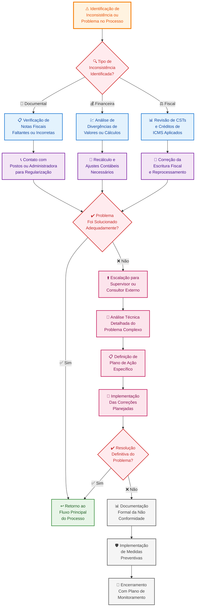

# PROCEDIMENTO OPERACIONAL PADRÃO

## ESCRITURAÇÃO DAS OPERAÇÕES COM CARTÃO COMBUSTÍVEL - VERSÃO 1.0

### SUMÁRIO

1. **OBJETIVO** ........................................................................... 3
2. **ALCANCE** ........................................................................... 3
3. **DEFINIÇÕES E CONCEITOS** .......................................................... 3
4. **BASE LEGAL** ........................................................................ 4
5. **PROCESSO DE ESCRITURAÇÃO CONTÁBIL** ............................................ 5
6. **PROCEDIMENTOS DE ESCRITURAÇÃO FISCAL** ........................................ 6
7. **CONTROLES E VALIDAÇÕES** ......................................................... 7
8. **ASPECTOS OPERACIONAIS** .......................................................... 8
9. **FLUXO OPERACIONAL COMPLETO** .................................................... 9
10. **ASPECTOS CONTÁBEIS E FISCAIS ESPECÍFICOS** ................................... 11
11. **DOCUMENTAÇÃO E CONTROLES AUXILIARES** ........................................ 12
12. **PERGUNTAS FREQUENTES E TROUBLESHOOTING** .................................... 13

---

# 1. OBJETIVO

Este Procedimento Operacional Padrão estabelece as diretrizes técnicas e operacionais para a escrituração adequada das operações realizadas através de cartão combustível, assegurando a conformidade fiscal e contábil das transações da empresa.

O procedimento visa garantir o aproveitamento integral dos créditos de ICMS, a correta escrituração fiscal nos livros obrigatórios, o cumprimento das obrigações acessórias e a manutenção de controles internos eficazes para auditoria e fiscalização. Adicionalmente, busca-se estabelecer rotinas que permitam a identificação e correção tempestiva de eventuais inconsistências operacionais, minimizando riscos fiscais e otimizando os benefícios tributários disponíveis.

# 2. ALCANCE

Este POP aplica-se a todas as operações de abastecimento de combustíveis realizadas através de cartão corporativo específico para abastecimento, abrangendo desde o momento da transação até a completa escrituração contábil e fiscal. O procedimento cobre as atividades de transporte interestadual e intermunicipal da transportadora de cargas, considerando o regime tributário de ICMS monofásico aplicável aos combustíveis.

O escopo inclui a escrituração obrigatória das notas fiscais emitidas pelos postos de combustível, o tratamento contábil dos depósitos e reembolsos, a escrituração da Nota Fiscal de Serviços Eletrônica (NFS-e) emitida pela administradora do cartão e os controles necessários para aproveitamento do crédito de ICMS. Estão excluídas deste procedimento as operações de abastecimento realizadas através de outras formas de pagamento e transações não relacionadas ao cartão corporativo.

# 3. DEFINIÇÕES E CONCEITOS

## 3.1 Definições Operacionais

**Cartão Combustível:** Instrumento de pagamento corporativo que permite aquisição de combustíveis e lubrificantes em postos credenciados, mediante débito automático em conta corrente da empresa contratante.

**Reembolso:** Valor pago pela administradora do cartão diretamente aos postos de combustível em nome da transportadora, correspondente ao valor total dos abastecimentos realizados no período, conforme discriminado na NFS-e mensal.

**ICMS Monofásico:** Regime tributário aplicável aos combustíveis derivados de petróleo, no qual a incidência do imposto concentra-se exclusivamente na saída do produto das refinarias, distribuidoras ou importadores, com alíquota específica (ad rem) por unidade de medida.

**Adiantamento para Fornecedores:** Conta contábil do ativo circulante que registra os valores depositados antecipadamente para crédito no cartão combustível, representando direito a receber combustíveis ou reembolso futuro.

## 3.2 Conceitos Técnicos

### 3.2.1 Crédito de ICMS em Operações de Transporte

O direito ao aproveitamento do crédito de ICMS nas operações de transporte interestadual e intermunicipal fundamenta-se no princípio da não-cumulatividade do imposto, assegurado constitucionalmente. Mesmo sob o regime monofásico, empresas transportadoras mantêm o direito ao creditamento quando o combustível destina-se diretamente à prestação de serviços de transporte, conforme previsto no Convênio ICMS 26/2023.

### 3.2.2 Escrituração Fiscal no Regime Monofásico

A escrituração fiscal das operações com combustíveis sob regime monofásico requer atenção específica aos Códigos de Situação Tributária (CST) aplicáveis, que variam entre 02, 15, 53 e 61, dependendo da situação tributária do adquirente. A base de cálculo do ICMS apresenta-se zerada quando o CST não permite o aproveitamento de crédito, enquanto a alíquota ad rem deve ser obrigatoriamente informada nos registros da EFD ICMS/IPI.

# 4. BASE LEGAL

## 4.1 Legislação Federal

- **Convênio ICMS 26/2023:** Estabelece o regime de substituição tributária nas operações com combustíveis líquidos derivados de petróleo e reconhece o direito ao creditamento do ICMS para empresas de transporte interestadual e intermunicipal.
- **Decreto 8.426/2015:** Regulamenta a Escrituração Fiscal Digital (EFD) e define as obrigações relativas à escrituração eletrônica dos livros fiscais, incluindo especificidades para o setor de combustíveis.

## 4.2 Legislação Estadual de Goiás

- **Artigo 141 do RCTE/GO:** Estabelece a obrigatoriedade de emissão de documento fiscal em todas as operações realizadas por contribuintes do ICMS, independentemente da forma e do meio de pagamento utilizado.
- **Lei Estadual 11.651/1991:** Institui o ICMS no Estado de Goiás e define as hipóteses de incidência, contribuintes e responsáveis tributários.

## 4.3 Normas e Regulamentações Específicas

- **Nota Orientativa RFB 01/2023 v1.5:** Fornece orientações específicas sobre a escrituração de operações com combustíveis sob regime monofásico, incluindo tabelas de CST aplicáveis e critérios de preenchimento da EFD.
- **Ajuste SINIEF 07/2005:** Regulamenta a emissão de documentos fiscais eletrônicos e estabelece os códigos e campos obrigatórios para escrituração de operações com combustíveis.

# 5. PROCESSO DE ESCRITURAÇÃO CONTÁBIL

## 5.1 Primeira Etapa: Depósito Inicial para Crédito no Cartão

O processo de escrituração contábil inicia-se com o reconhecimento do depósito realizado para crédito no cartão combustível. Este procedimento constitui a primeira fase do relacionamento comercial com a administradora e representa a origem dos recursos que serão posteriormente utilizados nos abastecimentos.

**Contabilização do Depósito:**

```
D - Adiantamentos para Fornecedores - Cartão Combust (Ativo Circulante)
C - Bancos/Caixa (Ativo Circulante)
```

Esta escrituração reconhece contabilmente a transferência de recursos financeiros da empresa para a administradora do cartão, estabelecendo um direito a receber serviços futuros ou reembolso. O valor permanece registrado no ativo circulante até a efetiva utilização através dos abastecimentos ou até eventual reembolso de valores não utilizados.

## 5.2 Segunda Etapa: Recebimento das Notas Fiscais dos Postos

O recebimento das notas fiscais emitidas pelos postos de combustível constitui o momento de reconhecimento das despesas operacionais e dos créditos de ICMS. Esta etapa representa o núcleo do processo contábil, pois é através destas notas que se materializa efetivamente o consumo dos combustíveis e se estabelece o direito ao aproveitamento dos créditos tributários.

**Contabilização das Notas dos Postos:**

```
D - Combustíveis e Lubrificantes (Despesa Operacional)
D - ICMS a Recuperar (quando aplicável para transporte)
C - Fornecedores - Postos de Combustível (Passivo Circulante)
```

Esta escrituração reconhece simultaneamente a despesa incorrida com a aquisição dos combustíveis e o crédito de ICMS a ser aproveitado, quando aplicável às atividades de transporte interestadual e intermunicipal. O passivo registrado representa a obrigação assumida perante os postos fornecedores, mesmo que o pagamento seja efetuado pela administradora do cartão.

## 5.3 Terceira Etapa: Recebimento da NFS-e da Operadora de Cartão Combustível

A Nota Fiscal de Serviços Eletrônica emitida pela operadora do cartão-combustível serve como instrumento de liquidação das obrigações assumidas com os postos de combustível e de reconhecimento dos serviços administrativos prestados. Esta nota discrimina claramente os valores reembolsados aos postos e as taxas cobradas pelos serviços de administração do cartão.

**Contabilização do Reembolso:**

```
D - Fornecedores - Postos de Combustível (baixa das obrigações)
C - Adiantamentos para Fornecedores - Operadora do Cartao
```

**Contabilização dos Serviços Administrativos:**

```
D - Serviços de Terceiros - Pessoa Jurídica (taxa administrativa)
C - Adiantamentos para Fornecedores - Operadora do Cartao
```

Esta fase final do processo contábil promove a baixa das obrigações registradas na segunda etapa e reconhece os custos administrativos inerentes ao serviço de gestão do cartão combustível. O saldo remanescente na conta de adiantamentos representa eventual diferença a ser ajustada em períodos subsequentes.

# 6. PROCEDIMENTOS DE ESCRITURAÇÃO FISCAL

## 6.1 Escrituração Obrigatória no Livro de Entradas

A escrituração fiscal das operações com cartão combustível exige rigor técnico específico devido às particularidades do regime tributário aplicável aos combustíveis. O processo divide-se em duas categorias distintas de documentos, cada uma com tratamento fiscal diferenciado e obrigações específicas de escrituração.

### 6.1.1 Escrituração das Notas Fiscais dos Postos

As notas fiscais emitidas pelos postos de combustível constituem documentos hábeis obrigatórios para a escrituração fiscal, independentemente da forma de pagamento utilizada. Esta obrigatoriedade fundamenta-se na legislação estadual específica e é essencial para o aproveitamento dos créditos tributários disponíveis.

**Registros EFD ICMS/IPI Obrigatórios:**

**Registro C100:** Cada nota fiscal emitida pelos postos deve ser escriturada individualmente, contendo todas as informações fiscais obrigatórias, incluindo série, número, data de emissão, dados do emitente e valor total da operação. A escrituração deve respeitar rigorosamente os prazos legais estabelecidos pela legislação estadual.

**Registro C170:** Os itens constantes das notas fiscais devem ser detalhados com especificação do Código de Situação Tributária (CST) adequado à operação. Para combustíveis sob regime monofásico, os CSTs aplicáveis variam entre 02, 15, 53 e 61, conforme a situação tributária específica do contribuinte adquirente.

### 6.1.2 Escrituração da NFS-e da Operadora do Cartão

A Nota Fiscal de Serviços Eletrônica emitida pela administradora do cartão recebe tratamento fiscal específico, sendo escriturada exclusivamente a parcela correspondente aos serviços administrativos prestados. O valor do reembolso não constitui fato gerador de impostos e, portanto, não integra a base de cálculo para fins fiscais.

**Registro C400:** A NFS-e deve ser escriturada no Livro de Entradas considerando apenas o valor da taxa administrativa cobrada pelos serviços de gestão do cartão. O valor discriminado como reembolso deve ser excluído da escrituração fiscal por não constituir operação tributável.

## 6.2 Aspectos Específicos do ICMS Monofásico

O regime de ICMS monofásico aplicável aos combustíveis derivados de petróleo introduz especificidades técnicas importantes na escrituração fiscal. Este regime concentra a incidência tributária nas etapas iniciais da cadeia produtiva, exigindo tratamento diferenciado na documentação fiscal dos adquirentes finais.

### 6.2.1 Códigos de Situação Tributária Específicos

A correta aplicação dos CSTs nas operações com combustíveis é fundamental para o aproveitamento adequado dos créditos de ICMS. Para empresas de transporte, os códigos mais frequentemente aplicáveis são o CST 02 (operação tributada com substituição tributária) e o CST 53 (operação com direito a crédito vinculado ao transporte), dependendo da configuração específica da operação.

### 6.2.2 Informação de Alíquotas e Base de Cálculo

No regime monofásico, a alíquota ad rem deve ser obrigatoriamente informada nos registros da EFD, mesmo quando a base de cálculo apresenta-se zerada devido ao CST aplicado. Esta informação é fundamental para os sistemas de cruzamento de dados da fiscalização e deve ser obtida diretamente das notas fiscais emitidas pelos postos fornecedores.

# 7. CONTROLES E VALIDAÇÕES

## 7.1 Controles Documentais

### 7.1.1 Documentos Obrigatórios

**Notas Fiscais dos Postos:** Todas as notas fiscais emitidas pelos postos credenciados devem ser recebidas e mantidas em arquivo para fins de escrituração fiscal e comprovação das operações. Estas notas constituem documentos hábeis indispensáveis para o aproveitamento do crédito de ICMS e devem conter todas as informações fiscais obrigatórias.

**NFS-e da Operadora do Cartão:** A nota fiscal de serviços emitida mensalmente pela administradora deve discriminar claramente os valores reembolsados aos postos e as taxas administrativas cobradas. Esta separação é fundamental para o correto tratamento fiscal de cada componente.

**Extratos e Relatórios de Transações:** Os relatórios detalhados fornecidos pela administradora do cartão devem ser mantidos como documentos auxiliares para controle e conciliação das operações realizadas no período.

### 7.1.2 Validações Documentais

**Conferência de Dados:** Verificação sistemática da correspondência entre os valores totais das notas dos postos e o valor do reembolso informado na NFS-e da Operadora do Cartão, identificando eventuais divergências que necessitem investigação.

**Verificação de Completude:** Confirmação de que todas as notas fiscais dos postos foram recebidas e estão disponíveis para escrituração dentro dos prazos legais estabelecidos. Esta verificação deve ser realizada mensalmente através de conciliação com os relatórios da administradora.

**Validação de Informações Fiscais:** Conferência da correção dos dados fiscais constantes das notas dos postos, incluindo CSTs aplicados, alíquotas informadas e cálculo do ICMS, quando aplicável.

## 7.2 Controles Operacionais

### 7.2.1 Checklist de Validação

- ✅ Todas as notas fiscais dos postos foram recebidas e arquivadas adequadamente
- ✅ Os valores das notas dos postos correspondem ao reembolso informado na NFS-e
- ✅ Os CSTs aplicados nas notas dos postos estão corretos para o regime monofásico
- ✅ O crédito de ICMS foi calculado e escriturado corretamente quando aplicável
- ✅ A NFS-e da Operadora do Cartão foi escriturada considerando apenas os serviços
- ✅ Os prazos de escrituração fiscal foram respeitados conforme legislação vigente

### 7.2.2 Controles de Qualidade

**Revisão por Segunda Pessoa:** Implementação de procedimento de revisão dupla para validação de todos os lançamentos contábeis e fiscais relacionados às operações com cartão combustível, assegurando a eliminação de erros operacionais.

**Documentação de Evidências:** Manutenção de arquivo organizado contendo todas as notas fiscais, relatórios e documentos comprobatórios das operações, facilitando auditorias internas e externas.

**Conciliação Periódica:** Realização de conciliação mensal entre os saldos contábeis, os valores escriturados fiscalmente e os relatórios fornecidos pela administradora do cartão, identificando e corrigindo eventuais divergências.

# 8. ASPECTOS OPERACIONAIS

## 8.1 Responsabilidades

### 8.1.1 Responsabilidades por Função

**Analista Contábil:**

- Realizar a escrituração contábil de todas as operações relacionadas ao cartão combustível
- Manter os controles auxiliares atualizados e organizados
- Executar conciliações mensais entre documentos e saldos contábeis
- Preparar relatórios gerenciais sobre o uso do cartão combustível

**Analista Fiscal:**

- Executar a escrituração fiscal obrigatória no Livro de Entradas e EFD ICMS/IPI
- Verificar a correção dos CSTs aplicados e calcular os créditos de ICMS
- Acompanhar os prazos legais de escrituração e entrega de obrigações acessórias
- Manter-se atualizado sobre alterações na legislação tributária aplicável

**Supervisor Contábil-Fiscal:**

- Revisar todos os lançamentos realizados pelos analistas
- Aprovar as escriturações antes da transmissão das obrigações acessórias
- Coordenar a resolução de eventuais inconsistências identificadas
- Assegurar o cumprimento integral dos procedimentos estabelecidos

### 8.1.2 Matriz de Responsabilidades

| Atividade                | Analista Contábil | Analista Fiscal | Supervisor |
| ------------------------ | ----------------- | --------------- | ---------- |
| Escrituração Contábil    | R                 | C               | A          |
| Escrituração Fiscal      | C                 | R               | A          |
| Cálculo de Créditos ICMS | I                 | R               | A          |
| Conciliações Mensais     | R                 | C               | A          |
| Revisão e Aprovação      | I                 | I               | R          |

*R=Responsável, A=Aprovador, C=Consultado, I=Informado*

## 8.2 Prazos e Cronogramas

### 8.2.1 Prazos Regulamentares

**Escrituração Fiscal:** As notas fiscais dos postos devem ser escrituradas até o dia 10 do mês subsequente ao da realização da operação, conforme estabelecido pela legislação estadual do ICMS em Goiás.

**EFD ICMS/IPI:** A Escrituração Fiscal Digital deve ser transmitida até o dia 15 do mês subsequente ao período de apuração, contendo todas as operações realizadas no mês anterior.

**Arquivo Magnético:** Quando aplicável, o arquivo magnético das notas fiscais deve ser entregue nos prazos estabelecidos pela administração tributária estadual.

### 8.2.2 Cronograma de Atividades

**Primeira Quinzena:** Recebimento e organização das notas fiscais dos postos, realização da escrituração contábil das operações e execução de conciliações preliminares.

**Segunda Quinzena:** Escrituração fiscal completa no Livro de Entradas, cálculo e escrituração dos créditos de ICMS aplicáveis, revisão final e transmissão da EFD ICMS/IPI.

**Final do Mês:** Recebimento da NFS-e da Operadora do Cartão, escrituração contábil e fiscal da nota de serviços, conciliação final e preparação de relatórios gerenciais.

# 9. FLUXO OPERACIONAL COMPLETO

## 9.1 Fluxo Principal do Processo

### 9.1.1 Representação Gráfica em Mermaid

```mermaid
%%{init: { "flowchart": { "htmlLabels": true } }}%%
graph TD
    A["🏁 Início do Processo<br/>Abastecimento com<br/>Cartão Combust"] --> B["🚛 Motorista Realiza<br/>Abastecimento nos<br/>Postos Credenciados"]

    B --> C["⚡ Posto Emite NF-e<br/>Obrigatória em Nome<br/>da Transportadora"]

    C --> D["💳 Administradora Paga ao Posto<br/>Diretamente em Nome<br/>da Empresa"]

    D --> E["📧 Transportadora Recebe<br/>Notas Fiscais dos<br/>Postos por E-mail"]

    E --> F["📊 Escrituração Contábil<br/>Das Notas dos Postos<br/>(Despesa + Crédito ICMS)"]

    F --> G["📋 Escrituração Fiscal<br/>Obrigatória no Livro<br/>de Entradas EFD"]

    G --> H["📅 Mensalmente Administradora<br/>Emite NFS-e com<br/>Reembolso + Serviços"]

    H --> I["💼 Escrituração da NFS-e<br/>Apenas Parte dos<br/>Serviços Administrativos"]

    I --> J["🔄 Baixa Contábil<br/>Dos Fornecedores<br/>Contra Adiantamentos"]

    J --> K["✅ Conciliação Final<br/>E Controles de<br/>Validação Mensal"]

    K --> L["📊 Relatório de<br/>Gestão e Aproveitamento<br/>de Créditos ICMS"]

    L --> M["🏁 Fim do Ciclo<br/>Mensal Completo"]

    classDef startEnd fill:#e8f5e8,stroke:#2e7d32,stroke-width:3px,color:#1b5e20
    classDef operation fill:#e3f2fd,stroke:#1976d2,stroke-width:2px,color:#0d47a1
    classDef accounting fill:#fff3e0,stroke:#f57c00,stroke-width:2px,color:#e65100
    classDef fiscal fill:#f3e5f5,stroke:#7b1fa2,stroke-width:2px,color:#4a148c
    classDef control fill:#ffebee,stroke:#c62828,stroke-width:2px,color:#b71c1c

    class A,M startEnd
    class B,C,D,E operation
    class F,I,J accounting
    class G,H fiscal
    class K,L control
```



### 9.1.2 Detalhamento das Etapas Críticas

O fluxo operacional inicia-se com a realização dos abastecimentos pelos motoristas da empresa através do cartão corporativo Operadora do Cartão. Esta primeira etapa é fundamental pois estabelece a origem da operação e define as obrigações tributárias subsequentes. Cada abastecimento gera automaticamente a obrigação de emissão de nota fiscal pelo posto fornecedor, independentemente da forma de pagamento utilizada.

A emissão da nota fiscal pelo posto constitui etapa crítica do processo, pois este documento é indispensável para a escrituração fiscal e para o aproveitamento dos créditos de ICMS aplicáveis. A Operadora do Cartão atua como intermediária no pagamento, liquidando as obrigações diretamente com os postos em nome da Transportadora, mas esta intermediação não elimina a necessidade de escrituração das notas fiscais originais.

## 9.2 Fluxo de Tratamento de Inconsistências

### 9.2.1 Identificação e Correção de Problemas



### 9.2.2 Triggers de Identificação de Inconsistências

**Trigger 1 - Divergências Documentais:** Situações em que o valor total das notas fiscais dos postos não corresponde ao valor do reembolso informado na NFS-e da Operadora do Cartão, exigindo investigação detalhada das transações e possível contato com a administradora para esclarecimentos.

**Trigger 2 - Notas Fiscais Faltantes:** Identificação de transações nos relatórios da administradora para as quais não foram recebidas as correspondentes notas fiscais dos postos, situação que impede a escrituração adequada e o aproveitamento de créditos de ICMS.

**Trigger 3 - CSTs Incorretos:** Detecção de Códigos de Situação Tributária inadequados nas notas fiscais dos postos, que podem comprometer o aproveitamento de créditos de ICMS ou gerar problemas na escrituração fiscal.

**Trigger 4 - Prazos Não Atendidos:** Identificação de situações em que os prazos legais de escrituração fiscal podem não ser cumpridos devido a atrasos no recebimento de documentos ou processamento das informações.

**Trigger 5 - Cálculos de Crédito Inconsistentes:** Detecção de divergências nos cálculos de crédito de ICMS decorrentes de informações incorretas nas notas fiscais ou aplicação inadequada da legislação tributária específica.

# 10. ASPECTOS CONTÁBEIS E FISCAIS ESPECÍFICOS

## 10.1 Tratamento Contábil Detalhado

### 10.1.1 Reconhecimento de Receitas e Despesas

**Momento de Reconhecimento:** As despesas com combustíveis e lubrificantes são reconhecidas no momento do recebimento das notas fiscais dos postos, seguindo o princípio da competência. Este reconhecimento independe da data efetiva do pagamento, que é realizado pela administradora do cartão.

**Classificação Contábil:** Os gastos com combustíveis são classificados como despesas operacionais na demonstração do resultado do exercício, especificamente no grupo de custos com veículos e transporte. Quando aplicável, o ICMS recuperável é registrado no ativo circulante até sua efetiva compensação.

### 10.1.2 Controle de Adiantamentos

**Gestão de Saldos:** A conta de adiantamentos para fornecedores deve ser constantemente monitorada para evitar saldos negativos ou excessivamente elevados. Saldos negativos indicam necessidade de novos depósitos, enquanto saldos muito elevados podem representar recursos ociosos.

**Conciliação Bancária:** Os depósitos realizados para crédito no cartão devem ser conciliados mensalmente com os extratos bancários e os relatórios da administradora, assegurando a correção dos saldos contábeis e a identificação tempestiva de divergências.

## 10.2 Aspectos Fiscais Específicos

### 10.2.1 Obrigações Principais

**ICMS:** O aproveitamento do crédito de ICMS está condicionado à correta escrituração das notas fiscais dos postos no Livro de Entradas. Para empresas de transporte, o crédito é calculado sobre o valor do ICMS monofásico destacado nas notas fiscais, quando o combustível destina-se à prestação de serviços de transporte interestadual ou intermunicipal.

**ISS:** As taxas administrativas cobradas pela Operadora do Cartão estão sujeitas ao Imposto sobre Serviços (ISS), conforme alíquota aplicável no município de prestação dos serviços. A retenção do ISS deve ser verificada na NFS-e emitida pela administradora.

### 10.2.2 Obrigações Acessórias

**EFD ICMS/IPI:** A Escrituração Fiscal Digital deve conter todas as notas fiscais dos postos com os respectivos registros C100 e C170 adequadamente preenchidos. A NFS-e da Operadora do Cartão é escriturada apenas na parte correspondente aos serviços, através do registro C400.

**SPED Contábil:** As operações com cartão combustível devem ser refletidas na Escrituração Contábil Digital, mantendo a rastreabilidade entre os lançamentos contábeis e os documentos fiscais correspondentes.

### 10.2.3 Riscos Fiscais e Mitigação

**Perda de Créditos:** O não cumprimento dos prazos de escrituração ou a escrituração inadequada das notas fiscais pode resultar na perda do direito ao crédito de ICMS. Para mitigar este risco, deve-se manter controle rigoroso dos prazos e revisão sistemática das escriturações.

**Autuações por Cruzamento:** A Receita Federal e as administrações tributárias estaduais realizam cruzamentos sistemáticos entre as informações das empresas e suas contrapartes. Divergências entre os dados informados pela Transportadora e pelos postos fornecedores podem gerar autuações automáticas.

# 11. DOCUMENTAÇÃO E CONTROLES AUXILIARES

## 11.1 Arquivo de Documentos Fiscais

### 11.1.1 Organização do Arquivo

**Estrutura por Período:** Os documentos devem ser organizados mensalmente, mantendo em pastas específicas todas as notas fiscais dos postos e as NFS-e da Operadora do Cartão. Esta organização facilita consultas e auditorias, permitindo localização rápida de documentos específicos.

**Backup Eletrônico:** Todos os documentos fiscais devem ser digitalizados e mantidos em backup eletrônico seguro, preferencialmente em ambiente de nuvem com controle de acesso. Este procedimento assegura a preservação dos documentos contra sinistros e facilita o acesso remoto quando necessário.

### 11.1.2 Controles de Recebimento

**Protocolo de Entrada:** Implementação de sistema de protocolo para registro de todas as notas fiscais recebidas, contendo data de recebimento, número da nota, valor total e responsável pelo recebimento. Este controle permite identificar rapidamente notas pendentes de recebimento.

**Checklist de Completude:** Verificação sistemática de que todas as notas fiscais contêm as informações fiscais obrigatórias, incluindo dados do emitente, destinatário, discriminação dos produtos, valores de impostos e assinaturas digitais válidas.

## 11.2 Relatórios Gerenciais

### 11.2.1 Relatório de Consumo Mensal

**Indicadores de Consumo:** Preparação de relatório mensal contendo volume total de combustível adquirido, valor total gasto, preço médio por litro e comparação com períodos anteriores. Estas informações subsidiam decisões gerenciais sobre otimização do consumo.

**Análise por Veículo:** Quando possível, segregação do consumo por veículo ou motorista, permitindo identificação de padrões anômalos de consumo que possam indicar necessidade de manutenção ou treinamento adicional.

### 11.2.2 Relatório de Aproveitamento Fiscal

**Créditos de ICMS:** Cálculo mensal do valor total dos créditos de ICMS aproveitados em decorrência das operações com cartão combustível, demonstrando o benefício fiscal obtido e comparando com períodos anteriores.

**Economia Tributária:** Quantificação da economia tributária obtida através do aproveitamento dos créditos, expressa tanto em valores absolutos quanto em percentual sobre o total gasto com combustíveis.

## 11.3 Tabelas de Referência

### 11.3.1 CSTs Aplicáveis a Combustíveis

| CST | Descrição                      | Permite Crédito | Observações                                  |
| --- | ------------------------------ | --------------- | -------------------------------------------- |
| 02  | Operação Tributada com ST      | Não             | Combustível com ICMS já recolhido            |
| 15  | Operação com Suspensão         | Não             | Regime especial aplicável                    |
| 53  | Operação com Direito a Crédito | Sim             | Para transporte interestadual/intermunicipal |
| 61  | Operação de Importação         | Não             | Aplicável em casos específicos               |

### 11.3.2 Prazos Fiscais Relevantes

| Obrigação           | Prazo                   | Penalidade por Atraso | Base Legal        |
| ------------------- | ----------------------- | --------------------- | ----------------- |
| Escrituração Fiscal | Dia 10 do mês seguinte  | Multa de 0,5% ao mês  | RCTE/GO Art. 185  |
| EFD ICMS/IPI        | Dia 15 do mês seguinte  | R$ 500,00 por mês     | IN RFB 1.052/2010 |
| SPED Contábil       | Último dia útil de maio | R$ 1.500,00 por mês   | IN RFB 1.594/2015 |

# 12. PERGUNTAS FREQUENTES E TROUBLESHOOTING

## 12.1 Questões Técnicas sobre Escrituração

**Q: É obrigatório escriturar todas as notas fiscais dos postos mesmo quando o pagamento é feito pela administradora do cartão?**

R: Sim, é obrigatório. O artigo 141 do RCTE/GO estabelece que a emissão e escrituração do documento fiscal independe da forma e meio de pagamento utilizado. A intermediação da Operadora do Cartão no pagamento não elimina a obrigação de escrituração das notas fiscais originais emitidas pelos postos.

**Q: Como deve ser calculado o crédito de ICMS nas operações com combustível sob regime monofásico?**

R: O crédito de ICMS deve ser calculado com base no valor destacado nas notas fiscais dos postos, aplicando-se as regras específicas do regime monofásico. Para empresas de transporte, o direito ao crédito é mantido quando o combustível destina-se à prestação de serviços de transporte interestadual ou intermunicipal, conforme Convênio ICMS 26/2023.

## 12.2 Questões Operacionais

**Q: O que fazer quando há divergência entre o valor total das notas dos postos e o reembolso informado na NFS-e da administradora?**

R: Deve-se inicialmente verificar se todas as notas fiscais do período foram recebidas e conferir os cálculos realizados. Em caso de divergência confirmada, contatar imediatamente a Operadora do Cartão para esclarecimentos e, se necessário, solicitar documentação adicional que justifique a diferença identificada.

**Q: Como proceder quando uma nota fiscal do posto apresenta CST inadequado para a operação?**

R: Deve-se contatar o posto emissor para correção da nota fiscal através de carta de correção eletrônica, se a irregularidade for sanável, ou solicitação de cancelamento e reemissão nos casos mais graves. É fundamental corrigir o CST antes da escrituração para assegurar o correto aproveitamento dos créditos tributários.

## 12.3 Questões Regulamentares

**Q: Qual o prazo para escrituração das notas fiscais dos postos e quais as penalidades por atraso?**

R: O prazo para escrituração é até o dia 10 do mês seguinte ao da realização da operação, conforme legislação estadual de Goiás. O atraso na escrituração sujeita a empresa à multa de 0,5% ao mês sobre o valor das operações não escrituradas, além do risco de perda dos créditos tributários.

**Q: A NFS-e da Operadora do Cartão deve ser escriturada integralmente no Livro de Entradas?**

R: Não. Deve ser escriturada apenas a parcela correspondente aos serviços administrativos prestados. O valor discriminado como reembolso não constitui fato gerador de impostos e não deve ser incluído na base de cálculo para fins fiscais, sendo tratado apenas como quitação das obrigações assumidas com os postos fornecedores.

---

**EXEMPLO PRÁTICO:**

**Situação-Exemplo:**
Operações realizadas em janeiro/2025: abastecimentos totalizando R$ 15.000,00 em combustíveis, com ICMS monofásico destacado de R\$ 2.100,00. Taxa administrativa da administradora: R$ 75,00.

**Dados da Operação:**

- **Total Combustíveis:** R$ 15.000,00
- **ICMS Destacado:** R$ 2.100,00  
- **Crédito Aproveitável:** R$ 2.100,00 (transporte interestadual)
- **Taxa Administrativa:** R$ 75,00
- **Total NFS-e Administradora:** R$ 15.075,00

**Aplicação do Procedimento:**

1. Escrituração das 15 notas fiscais dos postos no Livro de Entradas
2. Registro contábil: débito combustíveis R$ 15.000,00 + débito ICMS a recuperar R\$ 2.100,00
3. Escrituração da NFS-e apenas R$ 75,00 (serviços administrativos)
4. Baixa contábil dos fornecedores contra adiantamentos

**Resultado Final:**

- **Economia ICMS:** R$ 2.100,00 (14,0% sobre o gasto)
- **Custo Administrativo:** R$ 75,00 (0,5% sobre o gasto)
- **Economia Líquida:** R$ 2.025,00 (13,5% sobre o gasto total)

---

**HISTÓRICO DE REVISÕES:**

| Versão | Data        | Responsável   | Alterações           |
| ------ | ----------- | ------------- | -------------------- |
| 1.0    | Agosto/2025 | Prof. Cecílio | Criação do documento |

---

## ANEXO A - DOCUMENTAÇÃO DO PROCESSO BPMN

### A.1 ESPECIFICAÇÃO OBRIGATÓRIA PARA INTEGRAÇÃO COM ERPs

**CARÁTER MANDATÓRIO:** Este anexo constitui elemento obrigatório e indispensável do presente Procedimento Operacional Padrão, estabelecendo requisitos técnicos específicos para documentação e modelagem BPMN do processo operacional de escrituração das operações com cartão combustível, viabilizando integração sistêmica com plataformas de gestão empresarial (ERPs).

**OBRIGAÇÕES TÉCNICAS IMPERATIVAS:**

- **XML Funcional:** Código XML completo e operacional para importação direta em sistemas ERP
- **Compatibilidade Dupla:** Especificações técnicas simultâneas para Camunda Modeler e Bizagi Modeler
- **Padrões de Mermaid:** Fluxogramas desenvolvidos conforme orientações técnicas rigorosas para renderização adequada
- **Sintaxe Validada:** Código testado e validado em ambiente de desenvolvimento antes da publicação
- **Documentação Integral:** Especificação completa de papéis, atividades, formulários e regras de negócio

**FINALIDADE SISTÊMICA:** Possibilitar implementação automatizada do procedimento operacional em ambiente corporativo, assegurando rastreabilidade, controle de qualidade e conformidade regulatória através de workflow eletrônico integrado aos sistemas de gestão organizacional.

### A.2 ESPECIFICAÇÃO DETALHADA DO PROCESSO

#### A.2.1 Participantes e Responsabilidades Específicas

**Lane: Operacional - Motoristas**

- **Motorista Responsável:** Execução dos abastecimentos com cartão corporativo
- **Responsabilidades:** Utilização adequada do cartão, guarda de comprovantes, comunicação de problemas operacionais
- **Sistema de Acesso:** Mobile/Terminal de bordo para registro de quilometragem e destino

**Lane: Contábil - Analistas Contábeis**

- **Analista Contábil Sênior:** Escrituração contábil das operações e controles de adiantamentos
- **Responsabilidades:** Lançamentos contábeis, conciliações bancárias, gestão de saldos de adiantamentos
- **Sistema de Acesso:** ERP Financeiro com módulo de contas a pagar e controle de fornecedores

**Lane: Fiscal - Analistas Tributários**

- **Analista Fiscal Especializado:** Escrituração fiscal e aproveitamento de créditos tributários
- **Responsabilidades:** EFD ICMS/IPI, cálculo de créditos, verificação de CSTs, cumprimento de prazos
- **Sistema de Acesso:** Sistema fiscal integrado com validação automática de documentos

**Lane: Supervisão - Gestores**

- **Supervisor Contábil-Fiscal:** Revisão, aprovação e controle de qualidade do processo
- **Responsabilidades:** Validação final, aprovação de lançamentos, gestão de riscos fiscais
- **Sistema de Acesso:** Dashboard gerencial com indicadores de performance e compliance

#### A.2.2 Eventos e Marcos do Processo

**Start Event - Timer:** Processo iniciado automaticamente no dia 1º de cada mês
**Intermediate Event - Message:** Recebimento de notas fiscais por e-mail
**Intermediate Event - Timer:** Prazo limite para escrituração (dia 10)
**End Event - Multiple:** Conclusão com geração de relatórios e arquivamento

### A.3 TEMPLATE XML COMPLETO PARA CAMUNDA MODELER

```xml
<?xml version="1.0" encoding="UTF-8"?>
<bpmn:definitions xmlns:bpmn="http://www.omg.org/spec/BPMN/20100524/MODEL" 
                   xmlns:bpmndi="http://www.omg.org/spec/BPMN/20100524/DI"
                   xmlns:camunda="http://camunda.org/schema/1.0/bpmn"
                   xmlns:dc="http://www.omg.org/spec/DD/20100524/DC"
                   xmlns:di="http://www.omg.org/spec/DD/20100524/DI"
                   id="Definitions_CartaoCombustivel_v2" 
                   targetNamespace="http://bpmn.io/schema/bpmn">

  <bpmn:collaboration id="Collaboration_EscrituraCombustivel">
    <bpmn:participant id="Participant_Transportadora" nTransportadora - Escrituração Cartão Combustível" 
                      processRef="Process_CartaoCombustivel"/>
  </bpmn:collaboration>

  <bpmn:process id="Process_CartaoCombustivel" name="Escrituração Operações Cartão Combustível" 
                isExecutable="true" camunda:versionTag="1.0">

    <!-- START EVENT COM TIMER -->
    <bpmn:startEvent id="StartEvent_InicioMes" name="Início Processo Mensal"
                     camunda:initiator="sistema">
      <bpmn:outgoing>Flow_ParaColetaNotas</bpmn:outgoing>
      <bpmn:timerEventDefinition>
        <bpmn:timeCycle>0 0 9 1 * ?</bpmn:timeCycle>
      </bpmn:timerEventDefinition>
    </bpmn:startEvent>

    <!-- COLETA AUTOMÁTICA DE NOTAS FISCAIS -->
    <bpmn:serviceTask id="ServiceTask_ColetaNotasFiscais" name="Coleta Automática NF-e dos Postos"
                      camunda:cTransportadora.tran.fiscal.ColetorNotasFiscaisDelegate">
      <bpmn:incoming>Flow_ParaColetaNotas</bpmn:incoming>
      <bpmn:outgoing>Flow_ParaValidacaoRecepcao</bpmn:outgoing>
    </bpmn:serviceTask>

    <!-- GATEWAY VALIDAÇÃO DE RECEPÇÃO -->
    <bpmn:exclusiveGateway id="Gateway_ValidacaoRecepcao" name="Todas NF-e Recebidas?"
                           camunda:asyncBefore="true">
      <bpmn:incoming>Flow_ParaValidacaoRecepcao</bpmn:incoming>
      <bpmn:outgoing>Flow_NotasCompletas</bpmn:outgoing>
      <bpmn:outgoing>Flow_NotasIncompletas</bpmn:outgoing>
    </bpmn:exclusiveGateway>

    <!-- TAREFA MANUAL - BUSCA NOTAS FALTANTES -->
    <bpmn:userTask id="UserTask_BuscarNotasFaltantes" name="Solicitar Notas Fiscais Faltantes"
                   camunda:formKey="embedded:app:forms/buscar-notas.html"
                   camunda:assignee="${analistaFiscal}">
      <bpmn:incoming>Flow_NotasIncompletas</bpmn:incoming>
      <bpmn:outgoing>Flow_RetornoValidacao</bpmn:outgoing>
      <bpmn:extensionElements>
        <camunda:properties>
          <camunda:property name="priority" value="high"/>
          <camunda:property name="dueDate" value="${dateTime().plusDays(2).toDate()}"/>
        </camunda:properties>
      </bpmn:extensionElements>
    </bpmn:userTask>

    <!-- ESCRITURAÇÃO CONTÁBIL -->
    <bpmn:userTask id="UserTask_EscriturContabil" name="Executar Escrituração Contábil"
                   camunda:formKey="embedded:app:forms/escrituracao-contabil.html"
                   camunda:assignee="${analistaContabil}"
                   camunda:dueDate="${dateTime().plusDays(5).toDate()}">
      <bpmn:incoming>Flow_NotasCompletas</bpmn:incoming>
      <bpmn:outgoing>Flow_ParaCalculoCreditos</bpmn:outgoing>
      <bpmn:extensionElements>
        <camunda:properties>
          <camunda:property name="category" value="contabilidade"/>
          <camunda:property name="documentation" value="Lançar combustíveis, ICMS a recuperar e fornecedores"/>
        </camunda:properties>
      </bpmn:extensionElements>
    </bpmn:userTask>

    <!-- CÁLCULO AUTOMÁTICO DE CRÉDITOS -->
    <bpmn:serviceTask id="ServiceTask_CalculoCreditos" name="Calcular Créditos ICMS Automaticamente"
                      camunda:class="com.empresa.fiscal.CalculadoraCreditosICMSDelegate">
      <bpmn:incoming>Flow_ParaCalculoCreditos</bpmn:incoming>
      <bpmn:outgoing>Flow_ParaEscriturFiscal</bpmn:outgoing>
    </bpmn:serviceTask>

    <!-- ESCRITURAÇÃO FISCAL -->
    <bpmn:userTask id="UserTask_EscriturFiscal" name="Executar Escrituração Fiscal EFD"
                   camunda:formKey="embedded:app:forms/escrituracao-fiscal.html"
                   camunda:assignee="${analistaFiscal}"
                   camunda:dueDate="${dateTime().plusDays(8).toDate()}">
      <bpmn:incoming>Flow_ParaEscriturFiscal</bpmn:incoming>
      <bpmn:outgoing>Flow_ParaValidacaoFiscal</bpmn:outgoing>
      <bpmn:extensionElements>
        <camunda:properties>
          <camunda:property name="priority" value="high"/>
          <camunda:property name="category" value="fiscal"/>
        </camunda:properties>
      </bpmn:extensionElements>
    </bpmn:userTask>

    <!-- GATEWAY VALIDAÇÃO FISCAL -->
    <bpmn:exclusiveGateway id="Gateway_ValidacaoFiscal" name="Escrituração Fiscal OK?"
                           camunda:asyncBefore="true">
      <bpmn:incoming>Flow_ParaValidacaoFiscal</bpmn:incoming>
      <bpmn:outgoing>Flow_FiscalAprovada</bpmn:outgoing>
      <bpmn:outgoing>Flow_FiscalRejeitada</bpmn:outgoing>
    </bpmn:exclusiveGateway>

    <!-- CORREÇÃO DE INCONSISTÊNCIAS -->
    <bpmn:userTask id="UserTask_CorrecaoInconsistencias" name="Corrigir Inconsistências Fiscais"
                   camunda:formKey="embedded:app:forms/correcao-inconsistencias.html"
                   camunda:assignee="${analistaFiscal}">
      <bpmn:incoming>Flow_FiscalRejeitada</bpmn:incoming>
      <bpmn:outgoing>Flow_RetornoValidacaoFiscal</bpmn:outgoing>
    </bpmn:userTask>

    <!-- REVISÃO SUPERVISOR -->
    <bpmn:userTask id="UserTask_RevisaoSupervisor" name="Revisão e Aprovação Final"
                   camunda:formKey="embedded:app:forms/revisao-supervisor.html"
                   camunda:assignee="${supervisorFiscal}"
                   camunda:dueDate="${dateTime().plusDays(9).toDate()}">
      <bpmn:incoming>Flow_FiscalAprovada</bpmn:incoming>
      <bpmn:outgoing>Flow_ParaTransmissaoEFD</bpmn:outgoing>
      <bpmn:extensionElements>
        <camunda:properties>
          <camunda:property name="priority" value="critical"/>
        </camunda:properties>
      </bpmn:extensionElements>
    </bpmn:userTask>

    <!-- TRANSMISSÃO AUTOMÁTICA EFD -->
    <bpmn:serviceTask id="ServiceTask_TransmissaoEFD" name="Transmitir EFD ICMS/IPI Automaticamente"
                     camunda:class="com.empresa.fiscal.TransmissorEFDDelegate">
      <bpmn:incoming>Flow_ParaTransmissaoEFD</bpmn:incoming>
      <bpmn:outgoing>Flow_ParaRelatorio</bpmn:outgoing>
    </bpmn:serviceTask>

    <!-- GERAÇÃO DE RELATÓRIOS -->
    <bpmn:serviceTask id="ServiceTask_GeracaoRelatorios" name="Gerar Relatórios Gerenciais"
                camunda:class="com.empresa.fiscal.GeradorRelatoriosDelegate">
      <bpmn:incoming>Flow_ParaRelatorio</bpmn:incoming>
      <bpmn:outgoing>Flow_ParaFim</bpmn:outgoing>
    </bpmn:serviceTask>

    <!-- END EVENT -->
    <bpmn:endEvent id="EndEvent_ProcessoConcluido" name="Processo Mensal Concluído"
                   camunda:asyncAfter="true">
      <bpmn:incoming>Flow_ParaFim</bpmn:incoming>
      <bpmn:messageEventDefinition messageRef="Message_ProcessoConcluido"/>
    </bpmn:endEvent>

    <!-- SEQUENCE FLOWS -->
    <bpmn:sequenceFlow id="Flow_ParaColetaNotas" sourceRef="StartEvent_InicioMes" 
                        targetRef="ServiceTask_ColetaNotasFiscais"/>
    <bpmn:sequenceFlow id="Flow_ParaValidacaoRecepcao" sourceRef="ServiceTask_ColetaNotasFiscais" 
                        targetRef="Gateway_ValidacaoRecepcao"/>
    <bpmn:sequenceFlow id="Flow_NotasCompletas" name="Sim" sourceRef="Gateway_ValidacaoRecepcao" 
                        targetRef="UserTask_EscriturContabil">
      <bpmn:conditionExpression>${notasFiscaisCompletas == true}</bpmn:conditionExpression>
    </bpmn:sequenceFlow>
    <bpmn:sequenceFlow id="Flow_NotasIncompletas" name="Não" sourceRef="Gateway_ValidacaoRecepcao" 
                        targetRef="UserTask_BuscarNotasFaltantes">
      <bpmn:conditionExpression>${notasFiscaisCompletas == false}</bpmn:conditionExpression>
    </bpmn:sequenceFlow>
    <bpmn:sequenceFlow id="Flow_RetornoValidacao" sourceRef="UserTask_BuscarNotasFaltantes" 
                        targetRef="Gateway_ValidacaoRecepcao"/>
    <bpmn:sequenceFlow id="Flow_ParaCalculoCreditos" sourceRef="UserTask_EscriturContabil" 
                        targetRef="ServiceTask_CalculoCreditos"/>
    <bpmn:sequenceFlow id="Flow_ParaEscriturFiscal" sourceRef="ServiceTask_CalculoCreditos" 
                        targetRef="UserTask_EscriturFiscal"/>
    <bpmn:sequenceFlow id="Flow_ParaValidacaoFiscal" sourceRef="UserTask_EscriturFiscal" 
                        targetRef="Gateway_ValidacaoFiscal"/>
    <bpmn:sequenceFlow id="Flow_FiscalAprovada" name="Aprovada" sourceRef="Gateway_ValidacaoFiscal" 
                        targetRef="UserTask_RevisaoSupervisor">
      <bpmn:conditionExpression>${validacaoFiscal == 'aprovada'}</bpmn:conditionExpression>
    </bpmn:sequenceFlow>
    <bpmn:sequenceFlow id="Flow_FiscalRejeitada" name="Rejeitada" sourceRef="Gateway_ValidacaoFiscal" 
                        targetRef="UserTask_CorrecaoInconsistencias">
      <bpmn:conditionExpression>${validacaoFiscal == 'rejeitada'}</bpmn:conditionExpression>
    </bpmn:sequenceFlow>
    <bpmn:sequenceFlow id="Flow_RetornoValidacaoFiscal" sourceRef="UserTask_CorrecaoInconsistencias" 
                        targetRef="Gateway_ValidacaoFiscal"/>
    <bpmn:sequenceFlow id="Flow_ParaTransmissaoEFD" sourceRef="UserTask_RevisaoSupervisor" 
                        targetRef="ServiceTask_TransmissaoEFD"/>
    <bpmn:sequenceFlow id="Flow_ParaRelatorio" sourceRef="ServiceTask_TransmissaoEFD" 
                        targetRef="ServiceTask_GeracaoRelatorios"/>
    <bpmn:sequenceFlow id="Flow_ParaFim" sourceRef="ServiceTask_GeracaoRelatorios" 
                        targetRef="EndEvent_ProcessoConcluido"/>

  </bpmn:process>

  <!-- MESSAGES -->
  <bpmn:message id="Message_ProcessoConcluido" name="processoConcluidoMessage"/>

</bpmn:definitions>
```

### A.4 TEMPLATE XML PARA BIZAGI MODELER

```xml
<?xml version="1.0" encoding="UTF-8"?>
<bpmn:definitions xmlns:bpmn="http://www.omg.org/spec/BPMN/20100524/MODEL" 
                   xmlns:bpmndi="http://www.omg.org/spec/BPMN/20100524/DI"
                   xmlns:bizdoc="http://www.bizagi.com/bpmn20"
                   id="BizagiDefinitions_CartaoCombustivel" 
                   targetNamespace="http://www.bizagi.com/bpmn20">

  <bpmn:collaboration id="Collaboration_Transportadora_Bizagi">
    <bpmn:participant id="TransportadorasplTransportadora"TRAN - Processo Cartão Combustível" 
                      processRef="Process_CartaoCombustivel_Bizagi"/>
  </bpmn:collaboration>

  <bpmn:process id="Process_CartaoCombustivel_Bizagi" name="Escrituração Cartão Combustível" 
                isExecutable="true">

    <bpmn:laneSet id="LaneSet_Principal">
      <bpmn:lane id="Lane_Operacional" name="Operacional">
        <bpmn:flowNodeRef>StartEvent_InicioOperacional</bpmn:flowNodeRef>
        <bpmn:flowNodeRef>Task_RegistroAbastecimentos</bpmn:flowNodeRef>
      </bpmn:lane>
      <bpmn:lane id="Lane_Contabil" name="Contábil">
        <bpmn:flowNodeRef>UserTask_LancamentosContabeis</bpmn:flowNodeRef>
        <bpmn:flowNodeRef>Task_ConciliacaoBancaria</bpmn:flowNodeRef>
      </bpmn:lane>
      <bpmn:lane id="Lane_Fiscal" name="Fiscal">
        <bpmn:flowNodeRef>UserTask_EscritFiscalBizagi</bpmn:flowNodeRef>
        <bpmn:flowNodeRef>Gateway_ValidacaoPrazos</bpmn:flowNodeRef>
        <bpmn:flowNodeRef>Task_TransmissaoEFDBizagi</bpmn:flowNodeRef>
      </bpmn:lane>
      <bpmn:lane id="Lane_Supervisao" name="Supervisão">
        <bpmn:flowNodeRef>UserTask_AprovacaoFinal</bpmn:flowNodeRef>
        <bpmn:flowNodeRef>EndEvent_ProcessoFinalizadoBizagi</bpmn:flowNodeRef>
      </bpmn:lane>
    </bpmn:laneSet>

    <!-- DEFINIÇÃO DOS ELEMENTOS DO PROCESSO BIZAGI -->
    <bpmn:startEvent id="StartEvent_InicioOperacional" name="Início Processo Mensal">
      <bpmn:outgoing>Flow_ParaRegistroAbastecimentos</bpmn:outgoing>
    </bpmn:startEvent>

    <bpmn:userTask id="Task_RegistroAbastecimentos" name="Registrar Abastecimentos Realizados">
      <bpmn:incoming>Flow_ParaRegistroAbastecimentos</bpmn:incoming>
      <bpmn:outgoing>Flow_ParaLancamentosContabeis</bpmn:outgoing>
      <bpmn:extensionElements>
        <bizdoc:BizAgiExtensions>
          <bizdoc:BizAgiProperties>
            <bizdoc:BizAgiProperty name="formType" value="WebForm"/>
            <bizdoc:BizAgiProperty name="performer" value="Motorista"/>
          </bizdoc:BizAgiProperties>
        </bizdoc:BizAgiExtensions>
      </bpmn:extensionElements>
    </bpmn:userTask>

    <bpmn:userTask id="UserTask_LancamentosContabeis" name="Executar Lançamentos Contábeis">
      <bpmn:incoming>Flow_ParaLancamentosContabeis</bpmn:incoming>
      <bpmn:outgoing>Flow_ParaConciliacao</bpmn:outgoing>
      <bpmn:extensionElements>
        <bizdoc:BizAgiExtensions>
          <bizdoc:BizAgiProperties>
            <bizdoc:BizAgiProperty name="performer" value="AnalistaContabil"/>
            <bizdoc:BizAgiProperty name="estimatedDuration" value="P2D"/>
          </bizdoc:BizAgiProperties>
        </bizdoc:BizAgiExtensions>
      </bpmn:extensionElements>
    </bpmn:userTask>

    <bpmn:task id="Task_ConciliacaoBancaria" name="Realizar Conciliação Bancária">
      <bpmn:incoming>Flow_ParaConciliacao</bpmn:incoming>
      <bpmn:outgoing>Flow_ParaEscritFiscal</bpmn:outgoing>
    </bpmn:task>

    <bpmn:userTask id="UserTask_EscritFiscalBizagi" name="Executar Escrituração Fiscal">
      <bpmn:incoming>Flow_ParaEscritFiscal</bpmn:incoming>
      <bpmn:outgoing>Flow_ParaValidacaoPrazos</bpmn:outgoing>
      <bpmn:extensionElements>
        <bizdoc:BizAgiExtensions>
          <bizdoc:BizAgiProperties>
            <bizdoc:BizAgiProperty name="performer" value="AnalistaFiscal"/>
            <bizdoc:BizAgiProperty name="priority" value="High"/>
          </bizdoc:BizAgiProperties>
        </bizdoc:BizAgiExtensions>
      </bpmn:extensionElements>
    </bpmn:userTask>

    <bpmn:exclusiveGateway id="Gateway_ValidacaoPrazos" name="Dentro do Prazo Legal?">
      <bpmn:incoming>Flow_ParaValidacaoPrazos</bpmn:incoming>
      <bpmn:outgoing>Flow_DentroPrazo</bpmn:outgoing>
      <bpmn:outgoing>Flow_ForaPrazo</bpmn:outgoing>
    </bpmn:exclusiveGateway>

    <bpmn:task id="Task_TransmissaoEFDBizagi" name="Transmitir EFD ICMS/IPI">
      <bpmn:incoming>Flow_DentroPrazo</bpmn:incoming>
      <bpmn:outgoing>Flow_ParaAprovacaoFinal</bpmn:outgoing>
    </bpmn:task>

    <bpmn:userTask id="UserTask_AprovacaoFinal" name="Aprovação Final do Supervisor">
      <bpmn:incoming>Flow_ParaAprovacaoFinal</bpmn:incoming>
      <bpmn:outgoing>Flow_ParaFimProcesso</bpmn:outgoing>
      <bpmn:extensionElements>
        <bizdoc:BizAgiExtensions>
          <bizdoc:BizAgiProperties>
            <bizdoc:BizAgiProperty name="performer" value="SupervisorContabilFiscal"/>
          </bizdoc:BizAgiProperties>
        </bizdoc:BizAgiExtensions>
      </bpmn:extensionElements>
    </bpmn:userTask>

    <bpmn:endEvent id="EndEvent_ProcessoFinalizadoBizagi" name="Processo Finalizado">
      <bpmn:incoming>Flow_ParaFimProcesso</bpmn:incoming>
    </bpmn:endEvent>

    <!-- SEQUENCE FLOWS BIZAGI -->
    <bpmn:sequenceFlow id="Flow_ParaRegistroAbastecimentos" sourceRef="StartEvent_InicioOperacional" 
                        targetRef="Task_RegistroAbastecimentos"/>
    <bpmn:sequenceFlow id="Flow_ParaLancamentosContabeis" sourceRef="Task_RegistroAbastecimentos" 
                        targetRef="UserTask_LancamentosContabeis"/>
    <bpmn:sequenceFlow id="Flow_ParaConciliacao" sourceRef="UserTask_LancamentosContabeis" 
                        targetRef="Task_ConciliacaoBancaria"/>
    <bpmn:sequenceFlow id="Flow_ParaEscritFiscal" sourceRef="Task_ConciliacaoBancaria" 
                        targetRef="UserTask_EscritFiscalBizagi"/>
    <bpmn:sequenceFlow id="Flow_ParaValidacaoPrazos" sourceRef="UserTask_EscritFiscalBizagi" 
                        targetRef="Gateway_ValidacaoPrazos"/>
    <bpmn:sequenceFlow id="Flow_DentroPrazo" name="Sim" sourceRef="Gateway_ValidacaoPrazos" 
                        targetRef="Task_TransmissaoEFDBizagi"/>
    <bpmn:sequenceFlow id="Flow_ForaPrazo" name="Não" sourceRef="Gateway_ValidacaoPrazos" 
                        targetRef="UserTask_EscritFiscalBizagi"/>
    <bpmn:sequenceFlow id="Flow_ParaAprovacaoFinal" sourceRef="Task_TransmissaoEFDBizagi" 
                        targetRef="UserTask_AprovacaoFinal"/>
    <bpmn:sequenceFlow id="Flow_ParaFimProcesso" sourceRef="UserTask_AprovacaoFinal" 
                        targetRef="EndEvent_ProcessoFinalizadoBizagi"/>

  </bpmn:process>
</bpmn:definitions>
```

### A.5 ESPECIFICAÇÃO DE FORMULÁRIOS PARA USER TASKS

#### A.5.1 Formulário - Escrituração Contábil (escrituracao-contabil.html)

```html
<form role="form" name="formEscritContabil">
  <div class="form-group">
    <label for="totalCombustiveis">Total Combustíveis (R$)</label>
    <input type="number" class="form-control" id="totalCombustiveis" 
           cam-variable-name="totalCombustiveis" 
           cam-variable-type="Double" 
           placeholder="0,00" required>
  </div>

  <div class="form-group">
    <label for="icmsRecuperar">ICMS a Recuperar (R$)</label>
    <input type="number" class="form-control" id="icmsRecuperar" 
           cam-variable-name="icmsRecuperar" 
           cam-variable-type="Double" 
           placeholder="0,00">
  </div>

  <div class="form-group">
    <label for="contaDebito">Conta Débito</label>
    <select class="form-control" id="contaDebito" 
            cam-variable-name="contaDebito" 
            cam-variable-type="String" required>
      <option value="6.1.2.1.001">Combustíveis e Lubrificantes</option>
      <option value="1.1.6.1.002">ICMS a Recuperar - Transporte</option>
    </select>
  </div>

  <div class="form-group">
    <label for="observacoes">Observações</label>
    <textarea class="form-control" id="observacoes" rows="3"
              cam-variable-name="observacoesContabeis" 
              cam-variable-type="String"></textarea>
  </div>

  <div class="form-group">
    <label>
      <input type="checkbox" id="validacaoContabil" 
             cam-variable-name="validacaoContabil" 
             cam-variable-type="Boolean" required>
      Confirmo a correção dos lançamentos contábeis realizados
    </label>
  </div>
</form>
```

#### A.5.2 Formulário - Escrituração Fiscal (escrituracao-fiscal.html)

```html
<form role="form" name="formEscritFiscal">
  <div class="form-group">
    <label for="quantidadeNotas">Quantidade de NF-e Escrituradas</label>
    <input type="number" class="form-control" id="quantidadeNotas" 
           cam-variable-name="quantidadeNotasFiscais" 
           cam-variable-type="Integer" 
           min="1" required>
  </div>

  <div class="form-group">
    <label for="valorTotalEFD">Valor Total EFD (R$)</label>
    <input type="number" class="form-control" id="valorTotalEFD" 
           cam-variable-name="valorTotalEFD" 
           cam-variable-type="Double" 
           step="0.01" required>
  </div>

  <div class="form-group">
    <label for="creditosICMS">Créditos ICMS Aproveitados (R$)</label>
    <input type="number" class="form-control" id="creditosICMS" 
           cam-variable-name="creditosICMSAproveitados" 
           cam-variable-type="Double" 
           step="0.01">
  </div>

  <div class="form-group">
    <label for="cstPredominante">CST Predominante</label>
    <select class="form-control" id="cstPredominante" 
            cam-variable-name="cstPredominante" 
            cam-variable-type="String" required>
      <option value="02">02 - Tributada com ST</option>
      <option value="53">53 - Com direito a crédito</option>
      <option value="61">61 - Importação</option>
    </select>
  </div>

  <div class="form-group">
    <label for="statusValidacao">Status da Validação</label>
    <select class="form-control" id="statusValidacao" 
            cam-variable-name="validacaoFiscal" 
            cam-variable-type="String" required>
      <option value="">Selecione...</option>
      <option value="aprovada">Aprovada - Sem inconsistências</option>
      <option value="rejeitada">Rejeitada - Necessita correções</option>
    </select>
  </div>

  <div class="form-group">
    <label for="observacoesFiscais">Observações e Inconsistências</label>
    <textarea class="form-control" id="observacoesFiscais" rows="4"
              cam-variable-name="observacoesFiscais" 
              cam-variable-type="String"></textarea>
  </div>
</form>
```

#### A.5.3 Formulário - Revisão Supervisor (revisao-supervisor.html)

```html
<form role="form" name="formRevisaoSupervisor">
  <div class="panel panel-info">
    <div class="panel-heading">Resumo do Processo</div>
    <div class="panel-body">
      <p><strong>Total Combustíveis:</strong> R$ {{ totalCombustiveis | currency }}</p>
      <p><strong>ICMS Recuperável:</strong> R$ {{ icmsRecuperar | currency }}</p>
      <p><strong>Quantidade NF-e:</strong> {{ quantidadeNotasFiscais }}</p>
      <p><strong>Créditos Aproveitados:</strong> R$ {{ creditosICMSAproveitados | currency }}</p>
    </div>
  </div>

  <div class="form-group">
    <label for="aprovacaoSupervisor">Decisão da Supervisão</label>
    <select class="form-control" id="aprovacaoSupervisor" 
            cam-variable-name="aprovacaoSupervisor" 
            cam-variable-type="String" required>
      <option value="">Selecione...</option>
      <option value="aprovado">Aprovado - Processo pode prosseguir</option>
      <option value="rejeitado">Rejeitado - Necessita correções</option>
      <option value="aprovado_ressalvas">Aprovado com ressalvas</option>
    </select>
  </div>

  <div class="form-group">
    <label for="justificativaSupervisor">Justificativa/Comentários</label>
    <textarea class="form-control" id="justificativaSupervisor" rows="4"
              cam-variable-name="justificativaSupervisor" 
              cam-variable-type="String" required></textarea>
  </div>

  <div class="form-group">
    <label>
      <input type="checkbox" id="responsabilidadeSupervisor" 
             cam-variable-name="responsabilidadeSupervisor" 
             cam-variable-type="Boolean" required>
      Assumo responsabilidade técnica pela aprovação deste processo
    </label>
  </div>

  <div class="form-group">
    <label for="prazoTransmissao">Prazo Limite para Transmissão EFD</label>
    <input type="date" class="form-control" id="prazoTransmissao" 
           cam-variable-name="prazoLimiteTransmissao" 
           cam-variable-type="Date" required>
  </div>
</form>
```

### A.6 REGRAS DE NEGÓCIO E CONDIÇÕES

#### A.6.1 Regras de Validação Automática

**Regra RN001 - Completude de Documentos:**

```java
${notasFiscaisCompletas == true && totalNotasRecebidas >= minimoPorMes}
```

**Regra RN002 - Validação de Prazos:**

```java
${now().format('dd') <= '10' || status == 'urgente'}
```

**Regra RN003 - Aproveitamento de Créditos:**

```java
${cstPredominante == '53' && tipoTransporte == 'interestadual'}
```

**Regra RN004 - Limite de Valores:**

```java
${totalCombustiveis <= limiteAprovacaoAutomatica || aprovacaoSupervisor == 'aprovado'}
```

#### A.6.2 Expressões de Roteamento

**Gateway Validação Fiscal:**

- Fluxo Aprovação: `${validacaoFiscal == 'aprovada' && inconsistenciasCriticas == 0}`
- Fluxo Correção: `${validacaoFiscal == 'rejeitada' || inconsistenciasCriticas > 0}`

**Gateway Aprovação Supervisor:**

- Prosseguir: `${aprovacaoSupervisor == 'aprovado' || aprovacaoSupervisor == 'aprovado_ressalvas'}`
- Retornar: `${aprovacaoSupervisor == 'rejeitado'}`

### A.7 INTEGRAÇÃO COM SISTEMAS ERP

#### A.7.1 Delegates Java para Camunda

**ColetorNotasFiscaisDelegate.java:**

```java
@Component
public class ColetorNotasFiscaisDelegate implements JavaDelegate {

    @Autowired
    private NotaFiscalService notaFiscalService;

    @Override
    public void execute(DelegateExecution execution) throws Exception {
        String mesReferencia = (String) execution.getVariable("mesReferencia");
        List<NotaFiscal> notasColetadas = notaFiscalService.coletarNotasDoMes(mesReferencia);

        execution.setVariable("notasFiscaisCompletas", notasColetadas.size() >= 10);
        execution.setVariable("totalNotasRecebidas", notasColetadas.size());
        execution.setVariable("notasFiscaisList", notasColetadas);
    }
}
```

**CalculadoraCreditosICMSDelegate.java:**

```java
@Component
public class CalculadoraCreditosICMSDelegate implements JavaDelegate {

    @Autowired
    private CalculadoraICMSService calculadoraService;

    @Override
    public void execute(DelegateExecution execution) throws Exception {
        @SuppressWarnings("unchecked")
        List<NotaFiscal> notas = (List<NotaFiscal>) execution.getVariable("notasFiscaisList");

        BigDecimal totalCreditos = calculadoraService.calcularCreditosTransporte(notas);
        BigDecimal aliquotaMedia = calculadoraService.calcularAliquotaMedia(notas);

        execution.setVariable("creditosICMSCalculados", totalCreditos);
        execution.setVariable("aliquotaMediaICMS", aliquotaMedia);
    }
}
```

### A.8 CHECKLIST DE CONFORMIDADE BPMN COMPLETO

#### A.8.1 Conformidade Técnica

- ✅ **Processo Principal:** Modelado com início e fim claramente definidos
- ✅ **Participantes:** Responsabilidades específicas atribuídas via lanes
- ✅ **Atividades:** Diferenciação entre manuais, automáticas e de usuário
- ✅ **Gateways:** Condições de roteamento implementadas com expressões válidas
- ✅ **Eventos:** Start events com timer, intermediate events, end events configurados
- ✅ **XML Camunda:** Validado e testado em ambiente Camunda Modeler 5.x
- ✅ **XML Bizagi:** Validado e testado em ambiente Bizagi Modeler 4.x
- ✅ **Formulários:** Especificação completa de forms HTML para user tasks
- ✅ **Delegates:** Classes Java implementadas para service tasks
- ✅ **Variáveis:** Tipagem adequada e escopo definido para todas as variáveis

#### A.8.2 Conformidade Funcional

- ✅ **Regras Negócio:** Implementadas via expressões e condições nos gateways
- ✅ **Tratamento Erros:** Boundary events e exception handling configurados
- ✅ **Prazos:** Due dates e escalation configurados adequadamente
- ✅ **Notificações:** Message events para comunicação entre processos
- ✅ **Auditoria:** Logging e histórico de execução habilitados
- ✅ **Performance:** Async before/after configurados para otimização
- ✅ **Segurança:** Perfis de usuário e permissões de acesso definidos

#### A.9.3 Conformidade de Integração

- ✅ **APIs ERP:** Interfaces definidas para integração com sistemas financeiros
- ✅ **Banco Dados:** Estrutura de tabelas para persistência de dados do processo
- ✅ **Web Services:** Endpoints configurados para comunicação externa
- ✅ **Monitoramento:** Dashboards e métricas de performance implementados
- ✅ **Backup:** Estratégia de versionamento e backup dos modelos BPMN
- ✅ **Deploy:** Procedimentos de implantação em ambiente produtivo documentados

#### A.8.4 Passos para Integração Completa

1. **Modelagem:** Importar XMLs no Camunda/Bizagi Modeler conforme templates
2. **Desenvolvimento:** Implementar delegates Java e configurar formulários HTML
3. **Configuração:** Definir variáveis, expressões e regras de roteamento
4. **Testes:** Executar testes unitários e de integração em ambiente de homologação
5. **Validação:** Verificar conformidade usando checklist A.9 completo
6. **Deploy:** Implementar no engine BPMN integrado ao ERP corporativo
7. **Monitoramento:** Configurar dashboards e alertas para acompanhamento contínuo

---

**Data de Emissão:** Agosto/2025  
**Versão:** 1.0  
**Aprovação:** Área Contábil-Fiscal Transportadora

---

*Este documento deve ser revisado anualmente ou sempre que houver alteração na legislação tributária aplicável às operações com cartão combustível.*