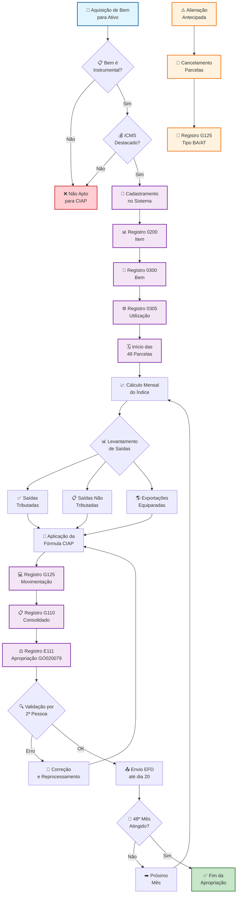
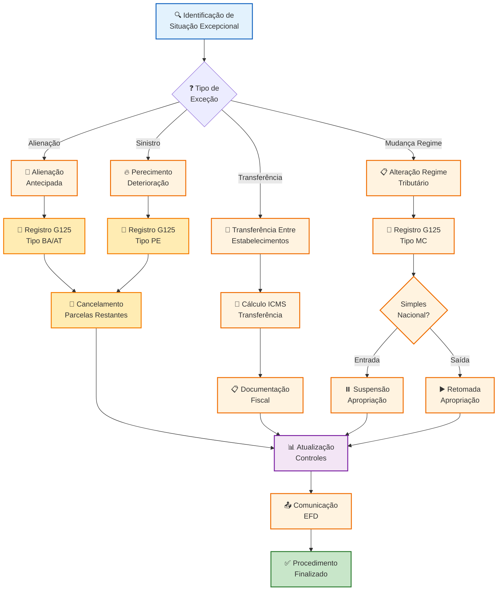
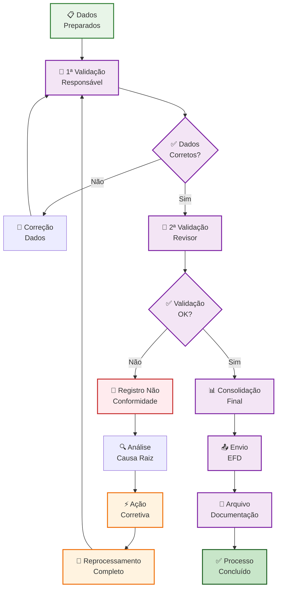

# PROCEDIMENTO OPERACIONAL PADRÃO

## CONTROLE DE CRÉDITO DE ICMS DO ATIVO PERMANENTE (CIAP) - GOIÁS - VERSÃO 1.0

### SUMÁRIO

1. **OBJETIVO** ........................................................................... 3
2. **ALCANCE** ........................................................................... 3
3. **DEFINIÇÕES E CONCEITOS** .......................................................... 4
4. **BASE LEGAL** ........................................................................ 6
5. **CONTROLE DE CRÉDITO DE ICMS DO ATIVO PERMANENTE** ............................ 7
6. **METODOLOGIA E PROCEDIMENTOS** .................................................... 9
7. **CONTROLES E VALIDAÇÕES** ......................................................... 12
8. **ASPECTOS OPERACIONAIS** .......................................................... 15
9. **FLUXOS E PROCESSOS** ............................................................. 17
10. **ASPECTOS CONTÁBEIS E FISCAIS** ................................................. 19
11. **DOCUMENTAÇÃO E ANEXOS** ......................................................... 21
12. **PERGUNTAS FREQUENTES** .......................................................... 23

---

# 1. OBJETIVO

Este Procedimento Operacional Padrão estabelece a metodologia completa para o **Controle de Crédito de ICMS do Ativo Permanente (CIAP)** no Estado de Goiás, definindo os critérios técnicos, operacionais e regulamentares necessários para a correta apropriação parcelada dos créditos tributários decorrentes da aquisição de bens destinados ao ativo imobilizado.

O objetivo específico contempla assegurar o aproveitamento integral dos direitos creditórios de ICMS, em conformidade com a legislação estadual goiana, evitando contingências fiscais e proporcionando controle sistêmico das obrigações principais e acessórias relacionadas ao CIAP.

# 2. ALCANCE

Este procedimento aplica-se a **todos os contribuintes de ICMS** estabelecidos no Estado de Goiás que:

- Adquiram bens corpóreos destinados ao ativo imobilizado
- Possuam ICMS destacado nas notas fiscais de aquisição
- Utilizem os bens de forma **instrumental** em suas atividades operacionais
- Estejam sujeitos à escrituração digital obrigatória via **EFD ICMS/IPI**

**Exclusões do Alcance:**

- Contribuintes optantes pelo **Simples Nacional** (vedação absoluta)
- Empresas de atividade exclusiva de prestação de serviços não tributados pelo ICMS
- Bens destinados exclusivamente ao uso ou consumo
- Bens não instrumentais à atividade empresarial

# 3. DEFINIÇÕES E CONCEITOS

## 3.1 Definições Operacionais

**CIAP:** Controle de Crédito de ICMS do Ativo Permanente, sistemática de apropriação parcelada em 48 meses dos créditos de ICMS decorrentes da aquisição de bens destinados ao ativo imobilizado.

**Ativo Imobilizado:** Conjunto de bens corpóreos destinados à manutenção das atividades da empresa, incluindo aqueles destinados ao aluguel a terceiros ou fins administrativos, utilizados por período superior a 12 meses.

**Bem:** Mercadoria que possui todas as condições necessárias para ser utilizada nas atividades do estabelecimento, classificada como ativo imobilizado tangível.

**Componente:** Mercadoria que fará parte de um bem móvel em construção no estabelecimento, onde apenas o bem resultante possuirá condições para uso nas atividades.

**Bem Instrumental:** Bem que participa exclusivamente do processo de produção e/ou comercialização das mercadorias no estabelecimento cujas operações sejam tributadas pelo ICMS.

**Faturamento Total:** Valor de todas as operações de circulação de mercadorias e prestações de serviços realizadas pelo estabelecimento no período, incluindo saídas tributadas e não tributadas.

**Índice de Participação:** Coeficiente mensal calculado pela divisão do valor das saídas tributadas pelo valor total das saídas, utilizado para determinação proporcional do crédito apropriável.

## 3.2 Conceitos Técnicos

### 3.2.1 Operações Tributadas para CIAP

**Saídas com Tributação Normal:**

- Vendas com ICMS efetivamente recolhido
- Operações com substituição tributária
- Saídas com diferimento do ICMS
- Saídas com suspensão do ICMS

**Operações Equiparadas às Tributadas:**

- **Exportações** (equiparadas por determinação legal)
- **Papel para livros/jornais** (equiparação específica)

### 3.2.2 Base de Crédito para Apropriação

**Créditos Considerados:**

- ICMS destacado na nota fiscal de aquisição
- Diferencial de alíquotas (DIFAL) em aquisições interestaduais
- ICMS do frete quando destacado na aquisição
- ICMS-ST quando superior ao diferencial de alíquotas

# 4. BASE LEGAL

## 4.1 Legislação Federal

- **Lei Complementar nº 87/1996 (Lei Kandir)** - art. 20, § 5º: Estabelece o direito ao crédito do ICMS incidente sobre aquisição de bens destinados ao ativo imobilizado
- **Lei Complementar nº 102/2000:** Alterações na apropriação e equiparação de operações
- **Lei Complementar nº 120/2005:** Equiparação de exportações às operações tributadas

## 4.2 Legislação Estadual de Goiás

- **RCTE - Decreto nº 4.852/1997** - art. 46, § 4º: Regulamentação específica do CIAP no Estado de Goiás
- **Instrução Normativa GSF nº 1.020/2010:** Procedimentos operacionais do controle

## 4.3 Ajustes SINIEF

- **Ajuste SINIEF nº 08/1997** e alterações: Disciplina nacional do controle
- **Ajuste SINIEF nº 03/2001:** Sistematização dos procedimentos
- **Ajuste SINIEF nº 02/2009:** Obrigatoriedade da escrituração digital

## 4.4 Códigos de Ajuste Específicos para Goiás

- **Código GO020079:** "Cr. decorrente da entrada de bem destinado ao Ativo Imobilizado, à razão de 1/48 por mês - RCTE - Art. 46, § 4º"

# 5. CONTROLE DE CRÉDITO DE ICMS DO ATIVO PERMANENTE

## 5.1 Estrutura do Controle CIAP

### 5.1.1 Período de Apropriação

**Duração:** 48 meses consecutivos (4 anos)
**Início:** Primeira fração apropriada no mês da entrada do bem
**Cancelamento:** Automático no final do 48º mês ou em situações excepcionais

#### 5.1.1.1 Interrupções da Apropriação

**Situações que Interrompem:**

- Alienação do bem antes dos 48 meses
- Transferência para outro estabelecimento
- Baixa por perecimento, extravio ou deterioração
- Mudança de destinação (deixa de ser instrumental)

#### 5.1.1.2 Apropriação Proporcional

Aplicação do fator temporal *pro rata die* quando período diferente de um mês completo.

### 5.1.2 Composição do Faturamento Total

**Operações Incluídas no Denominador:**

#### Saídas Tributadas:

- Vendas com ICMS normal
- Operações com substituição tributária
- Saídas com diferimento do ICMS
- Saídas com suspensão do ICMS
- Exportações (equiparadas às tributadas)

#### Saídas Não Tributadas:

- Operações isentas ou imunes
- Operações não tributadas por não incidência
- Prestações de serviços não sujeitas ao ICMS

**Operações Excluídas do Faturamento Total:**

- Remessas para conserto/reparo (CFOP 5.915/6.915)
- Remessas para industrialização (CFOP 5.901/6.901)
- Remessas para armazém geral (CFOP 5.905/6.905)
- Remessas em comodato/locação (CFOP 5.908/6.908)

## 5.2 Fórmula de Cálculo Fundamental

### 5.2.1 Expressão Matemática

**Crédito Mensal = (1/48) × (Valor das Saídas Tributadas / Valor Total das Saídas) × Crédito Total Disponível**

### 5.2.2 Componentes Detalhados

**Fração Temporal:** 1/48 avos (equivalente a 0,020833)
**Índice de Participação:** Saídas Tributadas ÷ Total das Saídas (sempre ≤ 1)
**Base de Crédito:** Somatório dos créditos de ICMS na aquisição

# 6. METODOLOGIA E PROCEDIMENTOS

## 6.1 Procedimentos de Entrada de Bens

### 6.1.1 Etapa Preparatória

**Passo 1:** Identificação e classificação do bem como ativo imobilizado
**Passo 2:** Verificação da instrumentalidade do bem para a atividade empresarial
**Passo 3:** Confirmação da presença de ICMS destacado na nota fiscal
**Passo 4:** Validação da documentação fiscal completa

### 6.1.2 Etapa de Cadastramento

**Passo 1:** Registro no sistema ERP/fiscal com código individualizado
**Passo 2:** Cadastramento no **Registro 0200** da EFD (Identificação do Item)
**Passo 3:** Cadastramento no **Registro 0300** da EFD (Cadastro do Bem)
**Passo 4:** Preenchimento do **Registro 0305** quando aplicável (Utilização do Bem)

### 6.1.3 Etapa de Início da Apropriação

**Passo 1:** Cálculo do crédito total disponível para apropriação
**Passo 2:** Programação das 48 parcelas mensais no sistema
**Passo 3:** Registro da primeira movimentação no **Registro G125**
**Passo 4:** Documentação e arquivo dos comprovantes

## 6.2 Procedimentos Mensais de Apropriação

### 6.2.1 Cálculo Mensal do Índice

**Passo 1:** Levantamento de todas as operações de saída do período
**Passo 2:** Segregação entre operações tributadas e não tributadas
**Passo 3:** Tratamento específico de exportações (equiparação às tributadas)
**Passo 4:** Cálculo do índice de participação mensal

### 6.2.2 Aplicação da Fórmula de Crédito

**Passo 1:** Identificação de todos os bens em processo de apropriação
**Passo 2:** Aplicação da fórmula para cada bem individualmente
**Passo 3:** Consolidação do crédito total do estabelecimento
**Passo 4:** Validação dos cálculos por segunda pessoa

### 6.2.3 Escrituração na EFD

**Passo 1:** Preenchimento do **Registro G110** com dados consolidados
**Passo 2:** Detalhamento individual no **Registro G125** por bem
**Passo 3:** Apropriação via **Registro E111** com código GO020079
**Passo 4:** Validação e consistência antes do envio

## 6.3 Procedimentos Especiais

### 6.3.1 Transferências Entre Estabelecimentos

**Base de Cálculo para ICMS:**

- Valor da aquisição original
- Ajuste por tempo de uso quando aplicável
- Aplicação do fator histórico (1/60 avos por mês para bens até 31/12/2000)

### 6.3.2 Alienação de Bens do Ativo

**Tratamento Fiscal:**

- Não incidência do ICMS na venda para usuário final
- Cancelamento das parcelas restantes do CIAP
- Registro G125 com tipo de movimentação "BA" ou "AT"

# 7. CONTROLES E VALIDAÇÕES

## 7.1 Controles Documentais

### 7.1.1 Documentos Obrigatórios

**Nota Fiscal de Aquisição:** Documento fiscal com ICMS destacado, dados completos do fornecedor e especificação detalhada do bem.

**Comprovante de DIFAL:** Documento de arrecadação estadual quando aplicável a aquisições interestaduais.

**Conhecimento de Transporte:** Quando houver ICMS do frete a ser considerado no crédito.

**Documento de Importação:** Para bens importados, incluindo DI e comprovantes de recolhimento.

### 7.1.2 Validações Documentais

**Conferência de Dados:** Validação de CNPJ, datas, valores e cálculos de ICMS
**Verificação de Autenticidade:** Consulta aos sistemas oficiais de validação
**Completude:** Checklist de campos obrigatórios preenchidos
**Vencimentos:** Controle de prazos de recolhimento e aproveitamento

## 7.2 Controles Operacionais

### 7.2.1 Checklist de Validação Mensal

- ✅ Levantamento completo das operações de saída
- ✅ Classificação correta entre tributadas e não tributadas  
- ✅ Aplicação da fórmula para todos os bens em apropriação
- ✅ Conferência dos cálculos por segunda pessoa
- ✅ Consistência com registros da EFD anterior
- ✅ Validação dos códigos de ajuste utilizados
- ✅ Arquivo de documentação comprobatória
- ✅ Backup dos controles eletrônicos

### 7.2.2 Controles de Qualidade

**Revisão por Segunda Pessoa:** Todo cálculo mensal deve ser revisado independentemente por profissional qualificado, com documentação da revisão.

**Documentação de Evidências:** Manutenção de pasta física e eletrônica com todos os documentos comprobatórios organizados por bem e período.

**Arquivo Organizado:** Estrutura de arquivamento por ano, mês e estabelecimento, com indexação para consulta rápida.

**Backup de Dados:** Cópia de segurança mensal dos controles eletrônicos em local separado do sistema principal.

## 7.3 Controles de Conformidade

### 7.3.1 Validações Regulamentares

**Vedações ao Crédito:** Verificação permanente das situações que impedem apropriação
**Prazos Decadenciais:** Controle do prazo de 5 anos para exercício do direito
**Obrigações Acessórias:** Acompanhamento dos prazos de entrega da EFD

### 7.3.2 Auditoria Interna

**Revisão Trimestral:** Análise completa dos procedimentos e controles
**Testes de Aderência:** Verificação da aplicação correta dos procedimentos
**Relatórios Gerenciais:** Indicadores de performance e conformidade

# 8. ASPECTOS OPERACIONAIS

## 8.1 Responsabilidades

### 8.1.1 Responsabilidades por Função

**Coordenador Fiscal:**

- Supervisão geral dos procedimentos CIAP
- Validação dos controles e cálculos mensais
- Interface com auditoria externa e fiscalização
- Aprovação de situações excepcionais

**Analista Fiscal Sênior:**

- Execução dos cálculos mensais de apropriação  
- Escrituração dos registros na EFD ICMS/IPI
- Controle da documentação comprobatória
- Elaboração de relatórios gerenciais

**Assistente Fiscal:**

- Organização da documentação de entrada
- Cadastramento inicial dos bens no sistema
- Suporte na conferência dos cálculos
- Arquivo e controle de documentos

**Departamento Contábil:**

- Integração com a contabilidade patrimonial
- Validação da classificação dos bens
- Conferência dos lançamentos contábeis
- Suporte em questões patrimoniais

### 8.1.2 Matriz de Responsabilidades

| Atividade             | Coord. Fiscal | Analista Sênior | Assistente | Contábil |
| --------------------- | ------------- | --------------- | ---------- | -------- |
| Cadastramento de Bens | A             | R               | C          | I        |
| Cálculos Mensais      | A             | R               | C          | I        |
| Escrituração EFD      | A             | R               | I          | C        |
| Controles Documentais | I             | A               | R          | C        |
| Auditoria Interna     | R             | C               | I          | A        |

*R=Responsável, A=Aprovador, C=Consultado, I=Informado*

## 8.2 Prazos e Cronogramas

### 8.2.1 Prazos Regulamentares

**Entrega da EFD:** Até o dia 20 do mês subsequente ao período de apuração, incluindo Bloco G completo com movimentações CIAP.

**Retificação da EFD:** Permitida até o mesmo prazo da entrega original, com observância das regras de arquivo substituto.

**Controle Decadencial:** Direito ao crédito extingue-se após 5 anos da emissão do documento fiscal de aquisição.

### 8.2.2 Cronograma Mensal de Atividades

**Dias 1 a 5:** Levantamento das operações de saída e organização da documentação
**Dias 6 a 10:** Cálculo dos índices de participação e apropriação dos créditos
**Dias 11 a 15:** Escrituração na EFD e validação por segunda pessoa  
**Dias 16 a 20:** Revisão final, arquivo da documentação e envio da EFD

## 8.3 Situações Excepcionais

### 8.3.1 Mudança de Regime Tributário

**Transição para Simples Nacional:**

- Suspensão da apropriação das parcelas restantes
- Manutenção dos créditos já apropriados
- Registro G125 com tipo "MC" (modificação/ciência)

**Saída do Simples Nacional:**

- Retomada da apropriação se dentro dos 48 meses
- Atualização dos controles no CIAP

### 8.3.2 Incorporação, Fusão ou Cisão

**Sucessão de Direitos:** Transferência dos controles CIAP para a empresa sucessora
**Reavaliação de Bens:** Possível necessidade de ajuste na base de cálculo
**Comunicação à Fiscalização:** Informação formal sobre a alteração

# 9. FLUXOS E PROCESSOS

## 9.1 Fluxo Principal do CIAP

### 9.1.1 Representação Gráfica em Mermaid



### 9.1.2 Fluxo de Tratamento de Exceções

**Situações Excepcionais que Requerem Tratamento Diferenciado:**



## 9.2 Fluxo de Controle de Qualidade

### 9.2.1 Processo de Validação e Correção



# 10. ASPECTOS CONTÁBEIS E FISCAIS

## 10.1 Tratamento Contábil

### 10.1.1 Reconhecimento do Crédito CIAP

**Lançamento da Apropriação Mensal:**

- **Débito:** Conta "ICMS a Compensar" ou "Créditos de ICMS"
- **Crédito:** Conta "Receitas Fiscais - Aproveitamento ICMS Ativo"

**Controle Patrimonial:**

- Registro do bem no ativo imobilizado pelo valor líquido
- Controle em subconta específica dos créditos em apropriação

### 10.1.2 Tratamento de Alienações Antecipadas

**Cancelamento de Parcelas:** Baixa dos créditos não apropriados contra conta de resultado
**Manutenção de Créditos:** Créditos já apropriados permanecem válidos

## 10.2 Aspectos Fiscais Específicos

### 10.2.1 Obrigações Principais

**ICMS Normal:** Apropriação mensal dos créditos na apuração regular do ICMS
**DIFAL:** Recolhimento do diferencial de alíquotas quando aplicável
**ICMS-ST:** Tratamento específico quando superior ao DIFAL

### 10.2.2 Obrigações Acessórias

**EFD ICMS/IPI:** Entrega mensal até o dia 20 com Bloco G completo
**DCTFWeb:** Informação dos créditos apropriados quando aplicável
**CIAP-ES:** Controle específico para estabelecimentos em Estados com exigência adicional

## 10.3 Integração com Incentivos Fiscais

### 10.3.1 Programas de Incentivo em Goiás

**FOMENTAR/PRODUZIR:** Interação com créditos presumidos
**ProGoiás:** Segregação entre operações incentivadas e não incentivadas
**LogPRODUZIR:** Tratamento específico para transporte de cargas

### 10.3.2 Códigos de Ajuste Específicos

**GO020079:** Crédito CIAP normal
**GO020072:** Outros créditos relacionados (excesso ICMS-ST)

# 11. DOCUMENTAÇÃO E ANEXOS

## 11.1 Modelos e Formulários

### 11.1.1 Controle Interno de Bens CIAP

| Código Bem | Descrição   | Data Entrada | Crédito Total | Parcelas Restantes | Status          |
| ---------- | ----------- | ------------ | ------------- | ------------------ | --------------- |
| [Código]   | [Descrição] | [DD/MM/AAAA] | [R$ 0,00]     | [0-48]             | [Ativo/Baixado] |

### 11.1.2 Planilha de Cálculo Mensal

| Mês/Ano   | Saídas Tributadas | Total Saídas | Índice   | Crédito Apropriado |
| --------- | ----------------- | ------------ | -------- | ------------------ |
| [MM/AAAA] | [R$ 0,00]         | [R$ 0,00]    | [0,0000] | [R$ 0,00]          |

## 11.2 Tabelas de Referência

### 11.2.1 Códigos de Movimentação G125

| Código | Descrição               | Aplicação             |
| ------ | ----------------------- | --------------------- |
| IM     | Imobilização Individual | Entrada de bem único  |
| IA     | Imobilização Anterior   | Bem já existente      |
| CI     | Conclusão de Bem        | Bem construído        |
| MC     | Modificação/Ciência     | Alterações            |
| BA     | Baixa por Alienação     | Venda do bem          |
| AT     | Alienação/Transferência | Transferência         |
| PE     | Perecimento             | Sinistro/deterioração |

### 11.2.2 CFOPs Excluídos do Faturamento

| CFOP        | Descrição                     | Motivo Exclusão     |
| ----------- | ----------------------------- | ------------------- |
| 5.915/6.915 | Remessa para Conserto         | Operação provisória |
| 5.901/6.901 | Remessa para Industrialização | Operação provisória |
| 5.905/6.905 | Remessa para Armazém Geral    | Operação provisória |
| 5.908/6.908 | Remessa em Comodato           | Operação provisória |

# 12. PERGUNTAS FREQUENTES

## 12.1 Questões sobre Elegibilidade

**Q: Posso apropriar crédito de bem usado?**

R: Sim, desde que o bem seja adquirido com documento fiscal válido, tenha ICMS destacado e seja destinado à atividade instrumental da empresa. A idade do bem não impede o direito ao crédito.

**Q: Como tratar software adquirido para ativo?**

R: Software classificado como ativo imobilizado e com ICMS na aquisição deve ser controlado no CIAP, seguindo as regras gerais de apropriação em 48 parcelas.

**Q: Bens de pequeno valor precisam ser controlados?**

R: Todo bem destinado ao ativo imobilizado, independente do valor, deve ser controlado no CIAP se houver ICMS na aquisição. Não há valor mínimo estabelecido.

## 12.2 Questões sobre Cálculos

**Q: Como calcular quando há múltiplas operações no mês?**

R: O índice de participação deve considerar o somatório de todas as operações de saída do mês, segregando corretamente entre tributadas e não tributadas, aplicando a fórmula uma única vez por bem.

**Q: Exportações devem ser incluídas como tributadas?**

R: Sim, exportações são equiparadas às operações tributadas por determinação legal, devendo compor o numerador da fórmula de cálculo do índice de participação.

**Q: Posso usar o mesmo bem para atividades tributadas e não tributadas?**

R: Sim, mas o crédito será proporcional apenas às atividades tributadas, conforme índice de participação mensal que reflete a proporcionalidade das operações.

## 12.3 Questões Operacionais

**Q: Como proceder em caso de erro na escrituração?**

R: Deve-se retificar a EFD com as informações corretas. Em caso de apropriação indevida, proceder ao estorno via registro G125 ou ajuste de apuração com fundamentação adequada.

**Q: Posso apropriar crédito extemporâneo?**

R: Sim, observando o prazo decadencial de 5 anos. O crédito deve ser escriturado pelo valor nominal com indicação das causas da escrituração extemporânea no campo de observações.

**Q: Como proceder em caso de sinistro?**

R: Registrar a baixa via G125 com tipo "PE" (perecimento) e cancelar as parcelas restantes. Manter documentação comprobatória do sinistro (boletim de ocorrência, laudo de seguradora, etc.).

## 12.4 Questões sobre Transferências

**Q: Transferência entre CNPJ da mesma empresa gera ICMS?**

R: Sim, se for entre estabelecimentos em estados diferentes. O cálculo segue regras específicas do RCTE para transferências de ativo, considerando valor original e tempo de uso.

**Q: Como tratar bens em garantia ou comodato?**

R: Bens recebidos em garantia ou comodato não geram direito a crédito CIAP, pois não há aquisição. Apenas o proprietário pode apropriar o crédito quando adquire o bem.

---

**EXEMPLO PRÁTICO CONSOLIDADO:**

**Situação-Exemplo:**
Empresa goiana adquire máquina industrial de São Paulo em janeiro/2024

**Dados da Operação:**

- Valor da máquina: R$ 100.000,00
- ICMS da NF (7%): R$ 7.000,00  
- DIFAL recolhido: R$ 10.000,00
- ICMS do frete: R$ 600,00
- **Crédito total CIAP:** R$ 17.600,00

**Movimentação Janeiro/2024:**

- Vendas tributadas: R$ 500.000,00
- Vendas isentas: R$ 100.000,00
- Exportações: R$ 50.000,00
- **Total tributadas:** R$ 550.000,00 (500.000 + 50.000)
- **Total das saídas:** R$ 650.000,00

**Aplicação do Procedimento:**

1. **Fração mensal:** 1/48 = 0,020833
2. **Índice de participação:** 550.000 ÷ 650.000 = 0,8462  
3. **Crédito mensal:** R$ 17.600,00 × 0,020833 × 0,8462 = **R\$ 310,13**

**Resultado Final:**

- **Crédito Janeiro/2024:** R$ 310,13 (1,76%)
- **Parcelas restantes:** 47 meses
- **Previsão total (índice constante):** R$ 14.906,11 (84,69%)

---

**HISTÓRICO DE REVISÕES:**

| Versão | Data     | Responsável   | Alterações                                  |
| ------ | -------- | ------------- | ------------------------------------------- |
| 1.0    | Dez/2024 | Equipe Fiscal | Criação do documento baseado no Manual CIAP |

---

## ANEXO A - DOCUMENTAÇÃO DO PROCESSO BPMN

### A.1 ESPECIFICAÇÃO OBRIGATÓRIA PARA INTEGRAÇÃO COM ERPs

**CARÁTER MANDATÓRIO:** Este anexo constitui elemento obrigatório e indispensável de todo Procedimento Operacional Padrão, estabelecendo requisitos técnicos específicos para documentação e modelagem BPMN do processo operacional, viabilizando integração sistêmica com plataformas de gestão empresarial (ERPs).

**OBRIGAÇÕES TÉCNICAS IMPERATIVAS:**

- **XML Funcional:** O anexo deve obrigatoriamente conter código XML completo e operacional para importação direta em sistemas ERP
- **Compatibilidade Dupla:** Especificações técnicas simultâneas para Camunda Modeler e Bizagi Modeler
- **Padrões de Mermaid:** Fluxogramas desenvolvidos conforme orientações técnicas rigorosas para renderização adequada
- **Sintaxe Validada:** Código testado e validado em ambiente de desenvolvimento antes da publicação
- **Documentação Integral:** Especificação completa de papéis, atividades, formulários e regras de negócio

**FINALIDADE SISTÊMICA:** Possibilitar implementação automatizada do procedimento operacional em ambiente corporativo, assegurando rastreabilidade, controle de qualidade e conformidade regulatória através de workflow eletrônico integrado aos sistemas de gestão organizacional.

### A.2 Template de Documentação do Processo

**Nome:** CIAP_GOIAS  
**Título:** Controle de Crédito de ICMS do Ativo Permanente - Goiás  
**Descrição:** Processo completo de apropriação parcelada de créditos CIAP conforme legislação goiana, incluindo cadastramento de bens, cálculo mensal de índices, escrituração na EFD ICMS/IPI e controles de qualidade
**Categoria:** Fiscal  
**Tipo de Processo:** Híbrido (Manual + Automático)
**Formulário:** Controle_CIAP_Mensal  
**Versão BPMN:** 1.0

#### A.2.1 Gestores do Processo

| Tipo             | Nome                   | Cargo                        | Responsabilidade                                                 |
| ---------------- | ---------------------- | ---------------------------- | ---------------------------------------------------------------- |
| Gestor Principal | Coordenador Fiscal     | Coordenador/Gerente Fiscal   | Supervisão geral, aprovação de exceções, interface com auditoria |
| Gestor Técnico   | Analista Fiscal Sênior | Analista Fiscal Especialista | Execução técnica, cálculos, escrituração EFD                     |
| Aprovador        | Contador Responsável   | Contador CRC                 | Validação final, conformidade contábil                           |

#### A.2.2 Papéis e Responsabilidades (Lanes/Pools)

**Coordenador Fiscal**

- **Tipo:** Usuário
- **Responsável:** Gerente/Coordenador da área fiscal
- **Atividades:** Supervisão geral, aprovação de situações excepcionais, validação final dos controles, interface com fiscalização

**Analista Fiscal Sênior**

- **Tipo:** Usuário  
- **Responsável:** Analista especialista em impostos
- **Atividades:** Cadastramento de bens, cálculos mensais, escrituração EFD, controles documentais

**Assistente Fiscal**

- **Tipo:** Usuário
- **Responsável:** Assistente de impostos
- **Atividades:** Organização documental, suporte nos cálculos, arquivo de documentos

**Sistema ERP**

- **Tipo:** Sistema
- **Responsável:** Integração automatizada
- **Atividades:** Cálculos automáticos, validações sistêmicas, geração de relatórios

#### A.2.3 Atividades Detalhadas

##### A.2.3.1 Cadastramento de Bem CIAP

**Tipo:** UserTask  
**Descrição:** Cadastramento inicial do bem adquirido no sistema de controle CIAP, incluindo validação de instrumentalidade e identificação do crédito disponível  
**Responsável:** Analista Fiscal Sênior  
**Tempo Estimado:** 30 minutos

**Campos/Dados de Entrada:**

| ID  | Nome            | Descrição                          | Tipo   | Obrigatório | Validação            |
| --- | --------------- | ---------------------------------- | ------ | ----------- | -------------------- |
| 1   | codigo_bem      | Código individualizado do bem      | Texto  | Sim         | Alfanumérico único   |
| 2   | descricao_bem   | Descrição detalhada do bem         | Texto  | Sim         | Mínimo 10 caracteres |
| 3   | valor_aquisicao | Valor de aquisição do bem          | Número | Sim         | Maior que zero       |
| 4   | icms_destacado  | ICMS destacado na NF               | Número | Sim         | Maior que zero       |
| 5   | data_entrada    | Data de entrada no estabelecimento | Data   | Sim         | Data válida          |

**Fluxos de Saída:**

| Nome           | Condição        | Atividade Destino |
| -------------- | --------------- | ----------------- |
| Bem_Cadastrado | Dados válidos   | Cálculo Mensal    |
| Erro_Cadastro  | Dados inválidos | Correção Cadastro |

##### A.2.3.2 Cálculo Mensal CIAP

**Tipo:** ServiceTask  
**Descrição:** Cálculo automatizado do índice de participação mensal e apropriação proporcional dos créditos CIAP  
**Responsável:** Sistema ERP  
**Tempo Estimado:** 5 minutos

**Campos/Dados de Entrada:**

| ID  | Nome              | Descrição                   | Tipo   | Obrigatório | Validação            |
| --- | ----------------- | --------------------------- | ------ | ----------- | -------------------- |
| 1   | saidas_tributadas | Valor das saídas tributadas | Número | Sim         | >= 0                 |
| 2   | total_saidas      | Valor total das saídas      | Número | Sim         | >= saidas_tributadas |
| 3   | mes_referencia    | Mês de referência           | Data   | Sim         | Formato MM/AAAA      |

**Fluxos de Saída:**

| Nome         | Condição          | Atividade Destino |
| ------------ | ----------------- | ----------------- |
| Calculo_OK   | Cálculo realizado | Escrituração EFD  |
| Erro_Calculo | Erro nos dados    | Correção Dados    |

### A.3 ESPECIFICAÇÕES TÉCNICAS PARA XML BPMN

#### A.3.1 XML Completo para Camunda Modeler

```xml
<?xml version="1.0" encoding="UTF-8"?>
<definitions xmlns="http://www.omg.org/spec/BPMN/20100524/MODEL"  
  xmlns:xsi="http://www.w3.org/2001/XMLSchema-instance"  
  xmlns:bpmndi="http://www.omg.org/spec/BPMN/20100524/DI"  
  xmlns:omgdc="http://www.omg.org/spec/DD/20100524/DC"  
  xmlns:omgdi="http://www.omg.org/spec/DD/20100524/DI"
  xmlns:camunda="http://camunda.org/schema/1.0/bpmn"
  targetNamespace="http://ciap.goias/bpmn"
  id="Definitions_CIAP_Goias">

  <collaboration id="Collaboration_CIAP">
    <participant id="Participant_Fiscal" name="Área Fiscal" processRef="Process_CIAP_Goias"/>
  </collaboration>

  <process id="Process_CIAP_Goias" name="Controle CIAP Goiás" isExecutable="true">

    <!-- Evento de Início -->
    <startEvent id="StartEvent_AquisicaoBem" name="Aquisição de Bem para Ativo">
      <documentation>Início do processo com a aquisição de bem destinado ao ativo imobilizado</documentation>
      <outgoing>Flow_Start_ValidaBem</outgoing>
    </startEvent>

    <!-- Gateway de Validação -->
    <exclusiveGateway id="Gateway_ValidaInstrumental" name="Bem é Instrumental?">
      <documentation>Validação se o bem é instrumental para a atividade empresarial</documentation>
      <incoming>Flow_Start_ValidaBem</incoming>
      <outgoing>Flow_NaoInstrumental</outgoing>
      <outgoing>Flow_Instrumental</outgoing>
    </exclusiveGateway>

    <!-- Tarefa de Cadastramento -->
    <userTask id="UserTask_CadastraBem" name="Cadastrar Bem no Sistema" camunda:assignee="${analista_fiscal}">
      <documentation>Cadastramento do bem no sistema de controle CIAP com todas as informações fiscais necessárias</documentation>
      <incoming>Flow_Instrumental</incoming>
      <outgoing>Flow_Cadastro_Calculo</outgoing>
      <camunda:formData>
        <camunda:formField id="codigo_bem" label="Código do Bem" type="string" defaultValue=""/>
        <camunda:formField id="descricao_bem" label="Descrição" type="string" defaultValue=""/>
        <camunda:formField id="valor_aquisicao" label="Valor Aquisição" type="long" defaultValue="0"/>
        <camunda:formField id="icms_destacado" label="ICMS Destacado" type="long" defaultValue="0"/>
        <camunda:formField id="data_entrada" label="Data Entrada" type="date" defaultValue=""/>
      </camunda:formData>
    </userTask>

    <!-- Tarefa de Cálculo Automático -->
    <serviceTask id="ServiceTask_CalculoMensal" name="Calcular Apropriação Mensal" camunda:delegateExpression="${ciapCalculationDelegate}">
      <documentation>Cálculo automatizado do índice de participação e apropriação proporcional do crédito CIAP</documentation>
      <incoming>Flow_Cadastro_Calculo</incoming>
      <incoming>Flow_ProximoMes</incoming>
      <outgoing>Flow_Calculo_Validacao</outgoing>
    </serviceTask>

    <!-- Tarefa de Validação -->
    <userTask id="UserTask_ValidaCalculo" name="Validar Cálculo por 2ª Pessoa" camunda:assignee="${coordenador_fiscal}">
      <documentation>Validação dos cálculos por segunda pessoa conforme controles de qualidade</documentation>
      <incoming>Flow_Calculo_Validacao</incoming>
      <outgoing>Flow_Validacao_Gateway</outgoing>
      <camunda:formData>
        <camunda:formField id="credito_mensal" label="Crédito Mensal Calculado" type="long" defaultValue="0"/>
        <camunda:formField id="indice_participacao" label="Índice Participação" type="string" defaultValue="0.0000"/>
        <camunda:formField id="validacao_ok" label="Validação OK?" type="boolean" defaultValue="false"/>
      </camunda:formData>
    </userTask>

    <!-- Gateway de Validação -->
    <exclusiveGateway id="Gateway_ValidacaoOK" name="Validação Aprovada?">
      <incoming>Flow_Validacao_Gateway</incoming>
      <outgoing>Flow_Validacao_NOK</outgoing>
      <outgoing>Flow_Validacao_OK</outgoing>
    </exclusiveGateway>

    <!-- Tarefa de Escrituração -->
    <userTask id="UserTask_EscrituraEFD" name="Escriturar na EFD ICMS/IPI" camunda:assignee="${analista_fiscal}">
      <documentation>Escrituração dos registros G110, G125 e E111 na EFD ICMS/IPI</documentation>
      <incoming>Flow_Validacao_OK</incoming>
      <outgoing>Flow_EFD_Gateway48</outgoing>
    </userTask>

    <!-- Gateway 48 Meses -->
    <exclusiveGateway id="Gateway_48Meses" name="48º Mês Atingido?">
      <incoming>Flow_EFD_Gateway48</incoming>
      <outgoing>Flow_ContinuaApropriacao</outgoing>
      <outgoing>Flow_FinalizaApropriacao</outgoing>
    </exclusiveGateway>

    <!-- Evento de Fim -->
    <endEvent id="EndEvent_FimApropriacao" name="Fim da Apropriação CIAP">
      <documentation>Conclusão do processo de apropriação após 48 meses ou situação excepcional</documentation>
      <incoming>Flow_FinalizaApropriacao</incoming>
      <incoming>Flow_NaoInstrumental</incoming>
      <incoming>Flow_SituacaoExcepcional</incoming>
    </endEvent>

    <!-- Evento de Exceção -->
    <intermediateCatchEvent id="IntermediateEvent_Alienacao" name="Alienação Antecipada">
      <documentation>Evento de alienação do bem antes do término das 48 parcelas</documentation>
      <outgoing>Flow_SituacaoExcepcional</outgoing>
      <messageEventDefinition messageRef="Message_Alienacao"/>
    </intermediateCatchEvent>

    <!-- Fluxos Sequenciais -->
    <sequenceFlow id="Flow_Start_ValidaBem" sourceRef="StartEvent_AquisicaoBem" targetRef="Gateway_ValidaInstrumental"/>
    <sequenceFlow id="Flow_NaoInstrumental" name="Não" sourceRef="Gateway_ValidaInstrumental" targetRef="EndEvent_FimApropriacao">
      <conditionExpression xsi:type="tFormalExpression">${!bem_instrumental}</conditionExpression>
    </sequenceFlow>
    <sequenceFlow id="Flow_Instrumental" name="Sim" sourceRef="Gateway_ValidaInstrumental" targetRef="UserTask_CadastraBem">
      <conditionExpression xsi:type="tFormalExpression">${bem_instrumental}</conditionExpression>
    </sequenceFlow>
    <sequenceFlow id="Flow_Cadastro_Calculo" sourceRef="UserTask_CadastraBem" targetRef="ServiceTask_CalculoMensal"/>
    <sequenceFlow id="Flow_Calculo_Validacao" sourceRef="ServiceTask_CalculoMensal" targetRef="UserTask_ValidaCalculo"/>
    <sequenceFlow id="Flow_Validacao_Gateway" sourceRef="UserTask_ValidaCalculo" targetRef="Gateway_ValidacaoOK"/>
    <sequenceFlow id="Flow_Validacao_NOK" name="Não" sourceRef="Gateway_ValidacaoOK" targetRef="ServiceTask_CalculoMensal">
      <conditionExpression xsi:type="tFormalExpression">${!validacao_ok}</conditionExpression>
    </sequenceFlow>
    <sequenceFlow id="Flow_Validacao_OK" name="Sim" sourceRef="Gateway_ValidacaoOK" targetRef="UserTask_EscrituraEFD">
      <conditionExpression xsi:type="tFormalExpression">${validacao_ok}</conditionExpression>
    </sequenceFlow>
    <sequenceFlow id="Flow_EFD_Gateway48" sourceRef="UserTask_EscrituraEFD" targetRef="Gateway_48Meses"/>
    <sequenceFlow id="Flow_ContinuaApropriacao" name="Não" sourceRef="Gateway_48Meses" targetRef="ServiceTask_CalculoMensal">
      <conditionExpression xsi:type="tFormalExpression">${parcela_atual < 48}</conditionExpression>
    </sequenceFlow>
    <sequenceFlow id="Flow_FinalizaApropriacao" name="Sim" sourceRef="Gateway_48Meses" targetRef="EndEvent_FimApropriacao">
      <conditionExpression xsi:type="tFormalExpression">${parcela_atual == 48}</conditionExpression>
    </sequenceFlow>
    <sequenceFlow id="Flow_ProximoMes" sourceRef="Gateway_48Meses" targetRef="ServiceTask_CalculoMensal"/>
    <sequenceFlow id="Flow_SituacaoExcepcional" sourceRef="IntermediateEvent_Alienacao" targetRef="EndEvent_FimApropriacao"/>

  </process>

  <!-- Mensagens -->
  <message id="Message_Alienacao" name="Alienação de Bem"/>

  <!-- Diagramação BPMNDI -->
  <bpmndi:BPMNDiagram id="BPMNDiagram_CIAP">
    <bpmndi:BPMNPlane id="BPMNPlane_CIAP" bpmnElement="Collaboration_CIAP">

      <!-- Participant Shape -->
      <bpmndi:BPMNShape id="Shape_Participant_Fiscal" bpmnElement="Participant_Fiscal" isHorizontal="true">
        <omgdc:Bounds x="129" y="80" width="1200" height="400"/>
      </bpmndi:BPMNShape>

      <!-- Start Event Shape -->
      <bpmndi:BPMNShape id="Shape_StartEvent_AquisicaoBem" bpmnElement="StartEvent_AquisicaoBem">
        <omgdc:Bounds x="179" y="200" width="36" height="36"/>
        <bpmndi:BPMNLabel>
          <omgdc:Bounds x="157" y="240" width="80" height="27"/>
        </bpmndi:BPMNLabel>
      </bpmndi:BPMNShape>

      <!-- Gateway Shape -->
      <bpmndi:BPMNShape id="Shape_Gateway_ValidaInstrumental" bpmnElement="Gateway_ValidaInstrumental" isMarkerVisible="true">
        <omgdc:Bounds x="255" y="193" width="50" height="50"/>
        <bpmndi:BPMNLabel>
          <omgdc:Bounds x="243" y="155" width="75" height="27"/>
        </bpmndi:BPMNLabel>
      </bpmndi:BPMNShape>

      <!-- User Task Shape -->
      <bpmndi:BPMNShape id="Shape_UserTask_CadastraBem" bpmnElement="UserTask_CadastraBem">
        <omgdc:Bounds x="360" y="178" width="100" height="80"/>
      </bpmndi:BPMNShape>

      <!-- Service Task Shape -->
      <bpmndi:BPMNShape id="Shape_ServiceTask_CalculoMensal" bpmnElement="ServiceTask_CalculoMensal">
        <omgdc:Bounds x="520" y="178" width="100" height="80"/>
      </bpmndi:BPMNShape>

      <!-- User Task Validation Shape -->
      <bpmndi:BPMNShape id="Shape_UserTask_ValidaCalculo" bpmnElement="UserTask_ValidaCalculo">
        <omgdc:Bounds x="680" y="178" width="100" height="80"/>
      </bpmndi:BPMNShape>

      <!-- Gateway Validation Shape -->
      <bpmndi:BPMNShape id="Shape_Gateway_ValidacaoOK" bpmnElement="Gateway_ValidacaoOK" isMarkerVisible="true">
        <omgdc:Bounds x="835" y="193" width="50" height="50"/>
      </bpmndi:BPMNShape>

      <!-- User Task EFD Shape -->
      <bpmndi:BPMNShape id="Shape_UserTask_EscrituraEFD" bpmnElement="UserTask_EscrituraEFD">
        <omgdc:Bounds x="940" y="178" width="100" height="80"/>
      </bpmndi:BPMNShape>

      <!-- Gateway 48 Months Shape -->
      <bpmndi:BPMNShape id="Shape_Gateway_48Meses" bpmnElement="Gateway_48Meses" isMarkerVisible="true">
        <omgdc:Bounds x="1095" y="193" width="50" height="50"/>
      </bpmndi:BPMNShape>

      <!-- End Event Shape -->
      <bpmndi:BPMNShape id="Shape_EndEvent_FimApropriacao" bpmnElement="EndEvent_FimApropriacao">
        <omgdc:Bounds x="1202" y="200" width="36" height="36"/>
      </bpmndi:BPMNShape>

      <!-- Intermediate Event Shape -->
      <bpmndi:BPMNShape id="Shape_IntermediateEvent_Alienacao" bpmnElement="IntermediateEvent_Alienacao">
        <omgdc:Bounds x="1102" y="350" width="36" height="36"/>
      </bpmndi:BPMNShape>

      <!-- Sequence Flow Edges -->
      <bpmndi:BPMNEdge id="Edge_Flow_Start_ValidaBem" bpmnElement="Flow_Start_ValidaBem">
        <omgdi:waypoint x="215" y="218"/>
        <omgdi:waypoint x="255" y="218"/>
      </bpmndi:BPMNEdge>

      <bpmndi:BPMNEdge id="Edge_Flow_NaoInstrumental" bpmnElement="Flow_NaoInstrumental">
        <omgdi:waypoint x="280" y="193"/>
        <omgdi:waypoint x="280" y="120"/>
        <omgdi:waypoint x="1220" y="120"/>
        <omgdi:waypoint x="1220" y="200"/>
      </bpmndi:BPMNEdge>

      <bpmndi:BPMNEdge id="Edge_Flow_Instrumental" bpmnElement="Flow_Instrumental">
        <omgdi:waypoint x="305" y="218"/>
        <omgdi:waypoint x="360" y="218"/>
      </bpmndi:BPMNEdge>

      <bpmndi:BPMNEdge id="Edge_Flow_Cadastro_Calculo" bpmnElement="Flow_Cadastro_Calculo">
        <omgdi:waypoint x="460" y="218"/>
        <omgdi:waypoint x="520" y="218"/>
      </bpmndi:BPMNEdge>

      <bpmndi:BPMNEdge id="Edge_Flow_Calculo_Validacao" bpmnElement="Flow_Calculo_Validacao">
        <omgdi:waypoint x="620" y="218"/>
        <omgdi:waypoint x="680" y="218"/>
      </bpmndi:BPMNEdge>

      <bpmndi:BPMNEdge id="Edge_Flow_Validacao_Gateway" bpmnElement="Flow_Validacao_Gateway">
        <omgdi:waypoint x="780" y="218"/>
        <omgdi:waypoint x="835" y="218"/>
      </bpmndi:BPMNEdge>

      <bpmndi:BPMNEdge id="Edge_Flow_Validacao_NOK" bpmnElement="Flow_Validacao_NOK">
        <omgdi:waypoint x="860" y="243"/>
        <omgdi:waypoint x="860" y="320"/>
        <omgdi:waypoint x="570" y="320"/>
        <omgdi:waypoint x="570" y="258"/>
      </bpmndi:BPMNEdge>

      <bpmndi:BPMNEdge id="Edge_Flow_Validacao_OK" bpmnElement="Flow_Validacao_OK">
        <omgdi:waypoint x="885" y="218"/>
        <omgdi:waypoint x="940" y="218"/>
      </bpmndi:BPMNEdge>

      <bpmndi:BPMNEdge id="Edge_Flow_EFD_Gateway48" bpmnElement="Flow_EFD_Gateway48">
        <omgdi:waypoint x="1040" y="218"/>
        <omgdi:waypoint x="1095" y="218"/>
      </bpmndi:BPMNEdge>

      <bpmndi:BPMNEdge id="Edge_Flow_ContinuaApropriacao" bpmnElement="Flow_ContinuaApropriacao">
        <omgdi:waypoint x="1120" y="243"/>
        <omgdi:waypoint x="1120" y="380"/>
        <omgdi:waypoint x="570" y="380"/>
        <omgdi:waypoint x="570" y="258"/>
      </bpmndi:BPMNEdge>

      <bpmndi:BPMNEdge id="Edge_Flow_FinalizaApropriacao" bpmnElement="Flow_FinalizaApropriacao">
        <omgdi:waypoint x="1145" y="218"/>
        <omgdi:waypoint x="1202" y="218"/>
      </bpmndi:BPMNEdge>

      <bpmndi:BPMNEdge id="Edge_Flow_SituacaoExcepcional" bpmnElement="Flow_SituacaoExcepcional">
        <omgdi:waypoint x="1138" y="368"/>
        <omgdi:waypoint x="1220" y="368"/>
        <omgdi:waypoint x="1220" y="236"/>
      </bpmndi:BPMNEdge>

    </bpmndi:BPMNPlane>
  </bpmndi:BPMNDiagram>

</definitions>
```

#### A.3.2 XML Completo para Bizagi Modeler

```xml
<?xml version="1.0" encoding="UTF-8"?>
<definitions xmlns="http://www.omg.org/spec/BPMN/20100524/MODEL"  
  xmlns:xsi="http://www.w3.org/2001/XMLSchema-instance"  
  xmlns:bpmndi="http://www.omg.org/spec/BPMN/20100524/DI"  
  xmlns:omgdc="http://www.omg.org/spec/DD/20100524/DC"  
  xmlns:omgdi="http://www.omg.org/spec/DD/20100524/DI"
  xmlns:bizagi="http://www.bizagi.com/BPMN20"
  targetNamespace="http://bizagi.com/ciap/goias"
  id="Definitions_CIAP_Bizagi">

  <collaboration id="Collaboration_CIAP_Bizagi">
    <participant id="Participant_AreaFiscal" name="Área Fiscal - CIAP Goiás" processRef="Process_CIAP_Principal"/>
  </collaboration>

  <process id="Process_CIAP_Principal" name="Processo CIAP Goiás" isExecutable="true">

    <!-- Evento de Início -->
    <startEvent id="StartEvent_Inicio" name="Aquisição de Bem">
      <documentation>Processo inicia com aquisição de bem destinado ao ativo imobilizado com ICMS destacado</documentation>
      <outgoing>SequenceFlow_Inicio_Validacao</outgoing>
      <extensionElements>
        <bizagi:BizagiExtensions>
          <bizagi:BizagiProperties>
            <bizagi:BizagiProperty name="bgColor" value="#e1f5fe"/>
            <bizagi:BizagiProperty name="borderColor" value="#01579b"/>
          </bizagi:BizagiProperties>
        </bizagi:BizagiExtensions>
      </extensionElements>
    </startEvent>

    <!-- Gateway de Validação Inicial -->
    <exclusiveGateway id="Gateway_ValidaBemInstrumental" name="Bem é instrumental para atividade?">
      <documentation>Validação se o bem é instrumental para as atividades operacionais tributadas pelo ICMS</documentation>
      <incoming>SequenceFlow_Inicio_Validacao</incoming>
      <outgoing>SequenceFlow_NaoInstrumental</outgoing>
      <outgoing>SequenceFlow_Instrumental</outgoing>
    </exclusiveGateway>

    <!-- Tarefa Manual de Cadastramento -->
    <userTask id="UserTask_CadastrarBem" name="Cadastrar Bem no Sistema CIAP">
      <documentation>Cadastramento detalhado do bem no sistema de controle CIAP incluindo: código individualizado, descrição, valor de aquisição, ICMS destacado, data de entrada e classificação fiscal</documentation>
      <incoming>SequenceFlow_Instrumental</incoming>
      <outgoing>SequenceFlow_Cadastro_Loop</outgoing>
      <extensionElements>
        <bizagi:BizagiExtensions>
          <bizagi:BizagiProperties>
            <bizagi:BizagiProperty name="performer" value="Analista_Fiscal_Senior"/>
            <bizagi:BizagiProperty name="estimatedTime" value="30"/>
            <bizagi:BizagiProperty name="timeUnit" value="minutes"/>
          </bizagi:BizagiProperties>
        </bizagi:BizagiExtensions>
      </extensionElements>
    </userTask>

    <!-- Subprocesso de Apropriação Mensal -->
    <subProcess id="SubProcess_ApropriacaoMensal" name="Ciclo de Apropriação Mensal (48x)">
      <documentation>Subprocesso que executa mensalmente durante 48 meses para apropriação proporcional dos créditos CIAP</documentation>
      <incoming>SequenceFlow_Cadastro_Loop</incoming>
      <incoming>SequenceFlow_ContinuaCiclo</incoming>
      <outgoing>SequenceFlow_SubProcess_Gateway</outgoing>

      <!-- Início do Subprocesso -->
      <startEvent id="StartEvent_SubProcess" name="Início do Mês">
        <outgoing>SequenceFlow_InicioMes_Calculo</outgoing>
      </startEvent>

      <!-- Cálculo do Índice -->
      <serviceTask id="ServiceTask_CalculaIndice" name="Calcular Índice de Participação">
        <documentation>Cálculo automático do índice: (Saídas Tributadas + Exportações) / Total das Saídas</documentation>
        <incoming>SequenceFlow_InicioMes_Calculo</incoming>
        <outgoing>SequenceFlow_Calculo_Apropriacao</outgoing>
      </serviceTask>

      <!-- Apropriação do Crédito -->
      <serviceTask id="ServiceTask_ApropriaCredito" name="Apropriar Crédito Mensal">
        <documentation>Aplicação da fórmula: (1/48) × Índice × Crédito Total</documentation>
        <incoming>SequenceFlow_Calculo_Apropriacao</incoming>
        <outgoing>SequenceFlow_Apropriacao_Validacao</outgoing>
      </serviceTask>

      <!-- Validação por 2ª Pessoa -->
      <userTask id="UserTask_ValidaSegundaPessoa" name="Validar por 2ª Pessoa">
        <documentation>Validação obrigatória dos cálculos por segunda pessoa qualificada</documentation>
        <incoming>SequenceFlow_Apropriacao_Validacao</incoming>
        <outgoing>SequenceFlow_Validacao_Gateway</outgoing>
        <extensionElements>
          <bizagi:BizagiExtensions>
            <bizagi:BizagiProperties>
              <bizagi:BizagiProperty name="performer" value="Coordenador_Fiscal"/>
            </bizagi:BizagiProperties>
          </bizagi:BizagiExtensions>
        </extensionElements>
      </userTask>

      <!-- Gateway de Validação -->
      <exclusiveGateway id="Gateway_ValidacaoSegundaPessoa" name="Validação OK?">
        <incoming>SequenceFlow_Validacao_Gateway</incoming>
        <outgoing>SequenceFlow_ValidacaoNOK</outgoing>
        <outgoing>SequenceFlow_ValidacaoOK</outgoing>
      </exclusiveGateway>

      <!-- Escrituração na EFD -->
      <userTask id="UserTask_EscrituraEFD" name="Escriturar na EFD ICMS/IPI">
        <documentation>Escrituração nos registros G110, G125 e E111 da EFD ICMS/IPI com código de ajuste GO020079</documentation>
        <incoming>SequenceFlow_ValidacaoOK</incoming>
        <outgoing>SequenceFlow_EFD_Fim</outgoing>
        <extensionElements>
          <bizagi:BizagiExtensions>
            <bizagi:BizagiProperties>
              <bizagi:BizagiProperty name="performer" value="Analista_Fiscal_Senior"/>
            </bizagi:BizagiProperties>
          </bizagi:BizagiExtensions>
        </extensionElements>
      </userTask>

      <!-- Fim do Subprocesso -->
      <endEvent id="EndEvent_SubProcess" name="Mês Finalizado">
        <incoming>SequenceFlow_EFD_Fim</incoming>
      </endEvent>

      <!-- Fluxos do Subprocesso -->
      <sequenceFlow id="SequenceFlow_InicioMes_Calculo" sourceRef="StartEvent_SubProcess" targetRef="ServiceTask_CalculaIndice"/>
      <sequenceFlow id="SequenceFlow_Calculo_Apropriacao" sourceRef="ServiceTask_CalculaIndice" targetRef="ServiceTask_ApropriaCredito"/>
      <sequenceFlow id="SequenceFlow_Apropriacao_Validacao" sourceRef="ServiceTask_ApropriaCredito" targetRef="UserTask_ValidaSegundaPessoa"/>
      <sequenceFlow id="SequenceFlow_Validacao_Gateway" sourceRef="UserTask_ValidaSegundaPessoa" targetRef="Gateway_ValidacaoSegundaPessoa"/>
      <sequenceFlow id="SequenceFlow_ValidacaoNOK" name="Não" sourceRef="Gateway_ValidacaoSegundaPessoa" targetRef="ServiceTask_CalculaIndice"/>
      <sequenceFlow id="SequenceFlow_ValidacaoOK" name="Sim" sourceRef="Gateway_ValidacaoSegundaPessoa" targetRef="UserTask_EscrituraEFD"/>
      <sequenceFlow id="SequenceFlow_EFD_Fim" sourceRef="UserTask_EscrituraEFD" targetRef="EndEvent_SubProcess"/>

    </subProcess>

    <!-- Gateway de Controle do Ciclo -->
    <exclusiveGateway id="Gateway_ControleCiclo" name="48 meses completados?">
      <documentation>Verificação se foram completadas as 48 parcelas ou se houve situação excepcional</documentation>
      <incoming>SequenceFlow_SubProcess_Gateway</incoming>
      <outgoing>SequenceFlow_ContinuaCiclo</outgoing>
      <outgoing>SequenceFlow_FinalizaCiclo</outgoing>
    </exclusiveGateway>

    <!-- Evento de Fim Normal -->
    <endEvent id="EndEvent_FimNormal" name="CIAP Finalizado">
      <documentation>Conclusão normal do processo após apropriação de 48 parcelas mensais</documentation>
      <incoming>SequenceFlow_FinalizaCiclo</incoming>
      <incoming>SequenceFlow_NaoInstrumental</incoming>
      <incoming>SequenceFlow_ExcecaoFim</incoming>
      <extensionElements>
        <bizagi:BizagiExtensions>
          <bizagi:BizagiProperties>
            <bizagi:BizagiProperty name="bgColor" value="#c8e6c9"/>
            <bizagi:BizagiProperty name="borderColor" value="#2e7d32"/>
          </bizagi:BizagiProperties>
        </bizagi:BizagiExtensions>
      </extensionElements>
    </endEvent>

    <!-- Evento Intermediário de Exceção -->
    <intermediateCatchEvent id="IntermediateEvent_SituacaoExcepcional" name="Situação Excepcional">
      <documentation>Captura eventos excepcionais como alienação antecipada, transferência, sinistro ou mudança de regime tributário</documentation>
      <outgoing>SequenceFlow_ExcecaoTratamento</outgoing>
      <messageEventDefinition messageRef="Message_SituacaoExcepcional"/>
    </intermediateCatchEvent>

    <!-- Tarefa de Tratamento de Exceção -->
    <userTask id="UserTask_TratarExcecao" name="Tratar Situação Excepcional">
      <documentation>Tratamento de situações excepcionais incluindo cancelamento de parcelas restantes e registro adequado na EFD</documentation>
      <incoming>SequenceFlow_ExcecaoTratamento</incoming>
      <outgoing>SequenceFlow_ExcecaoFim</outgoing>
      <extensionElements>
        <bizagi:BizagiExtensions>
          <bizagi:BizagiProperties>
            <bizagi:BizagiProperty name="performer" value="Coordenador_Fiscal"/>
            <bizagi:BizagiProperty name="estimatedTime" value="60"/>
            <bizagi:BizagiProperty name="timeUnit" value="minutes"/>
          </bizagi:BizagiProperties>
        </bizagi:BizagiExtensions>
      </extensionElements>
    </userTask>

    <!-- Fluxos Sequenciais Principais -->
    <sequenceFlow id="SequenceFlow_Inicio_Validacao" sourceRef="StartEvent_Inicio" targetRef="Gateway_ValidaBemInstrumental"/>
    <sequenceFlow id="SequenceFlow_NaoInstrumental" name="Não é instrumental" sourceRef="Gateway_ValidaBemInstrumental" targetRef="EndEvent_FimNormal"/>
    <sequenceFlow id="SequenceFlow_Instrumental" name="É instrumental" sourceRef="Gateway_ValidaBemInstrumental" targetRef="UserTask_CadastrarBem"/>
    <sequenceFlow id="SequenceFlow_Cadastro_Loop" sourceRef="UserTask_CadastrarBem" targetRef="SubProcess_ApropriacaoMensal"/>
    <sequenceFlow id="SequenceFlow_SubProcess_Gateway" sourceRef="SubProcess_ApropriacaoMensal" targetRef="Gateway_ControleCiclo"/>
    <sequenceFlow id="SequenceFlow_ContinuaCiclo" name="Continua (< 48 meses)" sourceRef="Gateway_ControleCiclo" targetRef="SubProcess_ApropriacaoMensal"/>
    <sequenceFlow id="SequenceFlow_FinalizaCiclo" name="Finaliza (48 meses)" sourceRef="Gateway_ControleCiclo" targetRef="EndEvent_FimNormal"/>
    <sequenceFlow id="SequenceFlow_ExcecaoTratamento" sourceRef="IntermediateEvent_SituacaoExcepcional" targetRef="UserTask_TratarExcecao"/>
    <sequenceFlow id="SequenceFlow_ExcecaoFim" sourceRef="UserTask_TratarExcecao" targetRef="EndEvent_FimNormal"/>

  </process>

  <!-- Definição de Mensagens -->
  <message id="Message_SituacaoExcepcional" name="Situação Excepcional CIAP">
    <documentation>Mensagem para captura de eventos excepcionais no processo CIAP</documentation>
  </message>

  <!-- Diagramação BPMNDI para Bizagi -->
  <bpmndi:BPMNDiagram id="BPMNDiagram_Bizagi">
    <bpmndi:BPMNPlane id="BPMNPlane_Bizagi" bpmnElement="Collaboration_CIAP_Bizagi">

      <!-- Pool Principal -->
      <bpmndi:BPMNShape id="Shape_Participant_AreaFiscal" bpmnElement="Participant_AreaFiscal" isHorizontal="true">
        <omgdc:Bounds x="160" y="60" width="1400" height="500"/>
        <bpmndi:BPMNLabel>
          <omgdc:Bounds x="170" y="290" width="20" height="120"/>
        </bpmndi:BPMNLabel>
      </bpmndi:BPMNShape>

      <!-- Start Event -->
      <bpmndi:BPMNShape id="Shape_StartEvent_Inicio" bpmnElement="StartEvent_Inicio">
        <omgdc:Bounds x="200" y="200" width="36" height="36"/>
        <bpmndi:BPMNLabel>
          <omgdc:Bounds x="175" y="240" width="86" height="20"/>
        </bpmndi:BPMNLabel>
      </bpmndi:BPMNShape>

      <!-- Gateway Validação -->
      <bpmndi:BPMNShape id="Shape_Gateway_ValidaBemInstrumental" bpmnElement="Gateway_ValidaBemInstrumental" isMarkerVisible="true">
        <omgdc:Bounds x="300" y="193" width="50" height="50"/>
        <bpmndi:BPMNLabel>
          <omgdc:Bounds x="280" y="150" width="90" height="40"/>
        </bpmndi:BPMNLabel>
      </bpmndi:BPMNShape>

      <!-- User Task Cadastramento -->
      <bpmndi:BPMNShape id="Shape_UserTask_CadastrarBem" bpmnElement="UserTask_CadastrarBem">
        <omgdc:Bounds x="420" y="178" width="100" height="80"/>
        <bpmndi:BPMNLabel>
          <omgdc:Bounds x="425" y="190" width="90" height="56"/>
        </bpmndi:BPMNLabel>
      </bpmndi:BPMNShape>

      <!-- Subprocesso -->
      <bpmndi:BPMNShape id="Shape_SubProcess_ApropriacaoMensal" bpmnElement="SubProcess_ApropriacaoMensal" isExpanded="true">
        <omgdc:Bounds x="580" y="120" width="680" height="200"/>
        <bpmndi:BPMNLabel>
          <omgdc:Bounds x="900" y="130" width="120" height="40"/>
        </bpmndi:BPMNLabel>
      </bpmndi:BPMNShape>

      <!-- Gateway Controle Ciclo -->
      <bpmndi:BPMNShape id="Shape_Gateway_ControleCiclo" bpmnElement="Gateway_ControleCiclo" isMarkerVisible="true">
        <omgdc:Bounds x="1320" y="195" width="50" height="50"/>
        <bpmndi:BPMNLabel>
          <omgdc:Bounds x="1300" y="152" width="90" height="40"/>
        </bpmndi:BPMNLabel>
      </bpmndi:BPMNShape>

      <!-- End Event -->
      <bpmndi:BPMNShape id="Shape_EndEvent_FimNormal" bpmnElement="EndEvent_FimNormal">
        <omgdc:Bounds x="1450" y="202" width="36" height="36"/>
        <bpmndi:BPMNLabel>
          <omgdc:Bounds x="1425" y="242" width="86" height="20"/>
        </bpmndi:BPMNLabel>
      </bpmndi:BPMNShape>

      <!-- Intermediate Event Exceção -->
      <bpmndi:BPMNShape id="Shape_IntermediateEvent_SituacaoExcepcional" bpmnElement="IntermediateEvent_SituacaoExcepcional">
        <omgdc:Bounds x="920" y="380" width="36" height="36"/>
        <bpmndi:BPMNLabel>
          <omgdc:Bounds x="895" y="420" width="86" height="27"/>
        </bpmndi:BPMNLabel>
      </bpmndi:BPMNShape>

      <!-- User Task Exceção -->
      <bpmndi:BPMNShape id="Shape_UserTask_TratarExcecao" bpmnElement="UserTask_TratarExcecao">
        <omgdc:Bounds x="1020" y="358" width="100" height="80"/>
        <bpmndi:BPMNLabel>
          <omgdc:Bounds x="1025" y="370" width="90" height="56"/>
        </bpmndi:BPMNLabel>
      </bpmndi:BPMNShape>

      <!-- Elementos do Subprocesso -->
      <bpmndi:BPMNShape id="Shape_StartEvent_SubProcess" bpmnElement="StartEvent_SubProcess">
        <omgdc:Bounds x="600" y="180" width="36" height="36"/>
      </bpmndi:BPMNShape>

      <bpmndi:BPMNShape id="Shape_ServiceTask_CalculaIndice" bpmnElement="ServiceTask_CalculaIndice">
        <omgdc:Bounds x="680" y="158" width="100" height="80"/>
      </bpmndi:BPMNShape>

      <bpmndi:BPMNShape id="Shape_ServiceTask_ApropriaCredito" bpmnElement="ServiceTask_ApropriaCredito">
        <omgdc:Bounds x="820" y="158" width="100" height="80"/>
      </bpmndi:BPMNShape>

      <bpmndi:BPMNShape id="Shape_UserTask_ValidaSegundaPessoa" bpmnElement="UserTask_ValidaSegundaPessoa">
        <omgdc:Bounds x="960" y="158" width="100" height="80"/>
      </bpmndi:BPMNShape>

      <bpmndi:BPMNShape id="Shape_Gateway_ValidacaoSegundaPessoa" bpmnElement="Gateway_ValidacaoSegundaPessoa" isMarkerVisible="true">
        <omgdc:Bounds x="1100" y="173" width="50" height="50"/>
      </bpmndi:BPMNShape>

      <bpmndi:BPMNShape id="Shape_UserTask_EscrituraEFD" bpmnElement="UserTask_EscrituraEFD">
        <omgdc:Bounds x="1180" y="158" width="100" height="80"/>
      </bpmndi:BPMNShape>

      <bpmndi:BPMNShape id="Shape_EndEvent_SubProcess" bpmnElement="EndEvent_SubProcess">
        <omgdc:Bounds x="1212" y="280" width="36" height="36"/>
      </bpmndi:BPMNShape>

      <!-- Sequence Flow Edges Principais -->
      <bpmndi:BPMNEdge id="Edge_SequenceFlow_Inicio_Validacao" bpmnElement="SequenceFlow_Inicio_Validacao">
        <omgdi:waypoint x="236" y="218"/>
        <omgdi:waypoint x="300" y="218"/>
      </bpmndi:BPMNEdge>

      <bpmndi:BPMNEdge id="Edge_SequenceFlow_NaoInstrumental" bpmnElement="SequenceFlow_NaoInstrumental">
        <omgdi:waypoint x="325" y="193"/>
        <omgdi:waypoint x="325" y="100"/>
        <omgdi:waypoint x="1468" y="100"/>
        <omgdi:waypoint x="1468" y="202"/>
      </bpmndi:BPMNEdge>

      <bpmndi:BPMNEdge id="Edge_SequenceFlow_Instrumental" bpmnElement="SequenceFlow_Instrumental">
        <omgdi:waypoint x="350" y="218"/>
        <omgdi:waypoint x="420" y="218"/>
      </bpmndi:BPMNEdge>

      <bpmndi:BPMNEdge id="Edge_SequenceFlow_Cadastro_Loop" bpmnElement="SequenceFlow_Cadastro_Loop">
        <omgdi:waypoint x="520" y="220"/>
        <omgdi:waypoint x="580" y="220"/>
      </bpmndi:BPMNEdge>

      <bpmndi:BPMNEdge id="Edge_SequenceFlow_SubProcess_Gateway" bpmnElement="SequenceFlow_SubProcess_Gateway">
        <omgdi:waypoint x="1260" y="220"/>
        <omgdi:waypoint x="1320" y="220"/>
      </bpmndi:BPMNEdge>

      <bpmndi:BPMNEdge id="Edge_SequenceFlow_ContinuaCiclo" bpmnElement="SequenceFlow_ContinuaCiclo">
        <omgdi:waypoint x="1345" y="195"/>
        <omgdi:waypoint x="1345" y="80"/>
        <omgdi:waypoint x="920" y="80"/>
        <omgdi:waypoint x="920" y="120"/>
      </bpmndi:BPMNEdge>

      <bpmndi:BPMNEdge id="Edge_SequenceFlow_FinalizaCiclo" bpmnElement="SequenceFlow_FinalizaCiclo">
        <omgdi:waypoint x="1370" y="220"/>
        <omgdi:waypoint x="1450" y="220"/>
      </bpmndi:BPMNEdge>

      <bpmndi:BPMNEdge id="Edge_SequenceFlow_ExcecaoTratamento" bpmnElement="SequenceFlow_ExcecaoTratamento">
        <omgdi:waypoint x="956" y="398"/>
        <omgdi:waypoint x="1020" y="398"/>
      </bpmndi:BPMNEdge>

      <bpmndi:BPMNEdge id="Edge_SequenceFlow_ExcecaoFim" bpmnElement="SequenceFlow_ExcecaoFim">
        <omgdi:waypoint x="1120" y="398"/>
        <omgdi:waypoint x="1468" y="398"/>
        <omgdi:waypoint x="1468" y="238"/>
      </bpmndi:BPMNEdge>

      <!-- Edges do Subprocesso -->
      <bpmndi:BPMNEdge id="Edge_SequenceFlow_InicioMes_Calculo" bpmnElement="SequenceFlow_InicioMes_Calculo">
        <omgdi:waypoint x="636" y="198"/>
        <omgdi:waypoint x="680" y="198"/>
      </bpmndi:BPMNEdge>

      <bpmndi:BPMNEdge id="Edge_SequenceFlow_Calculo_Apropriacao" bpmnElement="SequenceFlow_Calculo_Apropriacao">
        <omgdi:waypoint x="780" y="198"/>
        <omgdi:waypoint x="820" y="198"/>
      </bpmndi:BPMNEdge>

      <bpmndi:BPMNEdge id="Edge_SequenceFlow_Apropriacao_Validacao" bpmnElement="SequenceFlow_Apropriacao_Validacao">
        <omgdi:waypoint x="920" y="198"/>
        <omgdi:waypoint x="960" y="198"/>
      </bpmndi:BPMNEdge>

      <bpmndi:BPMNEdge id="Edge_SequenceFlow_Validacao_Gateway" bpmnElement="SequenceFlow_Validacao_Gateway">
        <omgdi:waypoint x="1060" y="198"/>
        <omgdi:waypoint x="1100" y="198"/>
      </bpmndi:BPMNEdge>

      <bpmndi:BPMNEdge id="Edge_SequenceFlow_ValidacaoNOK" bpmnElement="SequenceFlow_ValidacaoNOK">
        <omgdi:waypoint x="1125" y="223"/>
        <omgdi:waypoint x="1125" y="260"/>
        <omgdi:waypoint x="730" y="260"/>
        <omgdi:waypoint x="730" y="238"/>
      </bpmndi:BPMNEdge>

      <bpmndi:BPMNEdge id="Edge_SequenceFlow_ValidacaoOK" bpmnElement="SequenceFlow_ValidacaoOK">
        <omgdi:waypoint x="1150" y="198"/>
        <omgdi:waypoint x="1180" y="198"/>
      </bpmndi:BPMNEdge>

      <bpmndi:BPMNEdge id="Edge_SequenceFlow_EFD_Fim" bpmnElement="SequenceFlow_EFD_Fim">
        <omgdi:waypoint x="1230" y="238"/>
        <omgdi:waypoint x="1230" y="280"/>
      </bpmndi:BPMNEdge>

    </bpmndi:BPMNPlane>
  </bpmndi:BPMNDiagram>

</definitions>
```

### A.4 CHECKLIST DE VALIDAÇÃO XML

#### A.4.1 Validações Essenciais para Ambos os Modeladores

- ✅ **Declaração XML:** `<?xml version="1.0" encoding="UTF-8"?>`
- ✅ **Namespaces Obrigatórios:** Todos os namespaces BPMN 2.0 e DI/DC declarados
- ✅ **IDs Únicos:** Todos os elementos possuem identificadores únicos
- ✅ **Referências Consistentes:** `sourceRef`, `targetRef`, `bpmnElement` apontam para IDs existentes
- ✅ **Processo Executável:** Atributo `isExecutable="true"` presente
- ✅ **Fluxos Válidos:** Pelo menos um caminho completo de início ao fim
- ✅ **Diagramação Completa:** Seção BPMNDI com shapes e edges correspondentes
- ✅ **Documentação:** Elementos principais contêm `<documentation>`

#### A.4.2 Validações Específicas por Ferramenta

**Para Camunda Modeler:**

- ✅ Namespace Camunda incluído: `xmlns:camunda="http://camunda.org/schema/1.0/bpmn"`
- ✅ Formulários definidos em `camunda:formData` para UserTasks
- ✅ Assignees definidos em `camunda:assignee="${variavel}"`
- ✅ Service Tasks com `camunda:delegateExpression`
- ✅ Expressões condicionais em `<conditionExpression>`

**Para Bizagi Modeler:**

- ✅ Collaboration e Participant definidos obrigatoriamente
- ✅ Pool horizontal com `isHorizontal="true"`
- ✅ Namespace Bizagi incluído se usando extensões: `xmlns:bizagi="http://www.bizagi.com/BPMN20"`
- ✅ Documentação detalhada em todos os elementos principais
- ✅ ExtensionElements com propriedades Bizagi quando aplicável
- ✅ Conformidade rigorosa com XSD BPMN 2.0

### A.5 GUIA DE IMPLEMENTAÇÃO EM ERPs

#### A.5.1 Passos para Integração Completa

1. **Modelagem Prévia:** Criar o diagrama BPMN no modelador escolhido (Camunda ou Bizagi)
2. **Documentação Detalhada:** Preencher todas as seções do template A.2 com informações específicas
3. **Exportação XML:** Gerar arquivo XML conforme templates A.3.1 (Camunda) ou A.3.2 (Bizagi)
4. **Validação Técnica:** Verificar conformidade usando checklist A.4 completo
5. **Teste de Importação:** Importar no modelador para validação de integridade
6. **Configuração de Integração:** Mapear campos e variáveis com sistema ERP
7. **Deploy Controlado:** Implementar em ambiente de homologação primeiro
8. **Testes Funcionais:** Executar cenários completos de teste
9. **Deploy Produção:** Implementar em ambiente produtivo com monitoramento

#### A.5.2 Considerações para Deploy em Produção

**Testes Obrigatórios:**

- Execução completa do workflow em ambiente de homologação
- Validação de todos os caminhos possíveis (happy path e exceções)
- Teste de performance com volumes reais de dados
- Verificação de integrações com sistemas adjacentes

**Configurações de Segurança:**

- Configurar perfis de usuário conforme papéis definidos
- Implementar controles de acesso por atividade
- Estabelecer trilhas de auditoria completas
- Configurar backup automático de instâncias ativas

**Monitoramento e Controle:**

- Configurar logs detalhados de execução
- Implementar métricas de performance (SLA)
- Estabelecer alertas para situações excepcionais
- Configurar dashboards gerenciais de acompanhamento

---

**Data de Emissão:** Dezembro/2024  
**Versão:** 1.0  
**Aprovação:** Coordenação Fiscal  

---

*Este documento deve ser revisado anualmente ou sempre que houver alteração na legislação tributária de Goiás.*